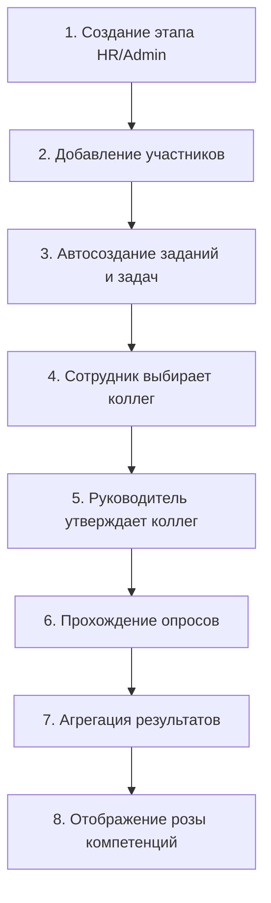

# Актуальная техническая спецификация проекта
## Система управления компетенциями и развитием персонала

**Версия:** 2.0  
**Дата:** 2025-01-31  
**Статус:** Production Ready

---

## 1. ОБЩАЯ СТРУКТУРА ПРОЕКТА

### 1.1 Назначение
Комплексная веб-система для управления человеческими ресурсами с фокусом на:
- Комплексную оценку компетенций (360° + профессиональные навыки)
- Карьерное развитие и треки роста
- Встречи 1:1 между руководителями и сотрудниками
- Периодические диагностические циклы оценки
- HR-аналитику и отчётность

### 1.2 Основные разделы и маршруты

| URL | Назначение | Роли доступа | Компонент |
|-----|-----------|--------------|-----------|
| `/` | Главная панель (дашборд) | Все | `Index` |
| `/profile` | Профиль пользователя | Все | `ProfilePage` |
| `/development` | Развитие (треки, задачи, опросы) | Все | `DevelopmentPage` |
| `/training` | Обучение и сертификации | Все | `TrainingPage` |
| `/meetings` | Встречи 1:1 | Все | `MeetingsPage` |
| `/team` | Команда и подчинённые | Manager, HR, Admin | `TeamPage` |
| `/feed` | Лента активности | Все | `FeedPage` |
| `/assessment/:assignmentId` | Объединённый опрос (360 + навыки) | Все | `UnifiedAssessmentPage` |
| `/assessment/results/:userId` | Результаты диагностики (роза компетенций) | Все | `AssessmentResultsPage` |
| `/my-assignments` | Мои назначенные оценки | Все | `MyAssignmentsPage` |
| `/manager-reports` | Отчёты по команде | Manager, HR, Admin | `ManagerReportsPage` |
| `/manager/comparison` | Сравнение сотрудников | Manager, HR, Admin | `ManagerComparisonPage` |
| `/hr-analytics` | HR-аналитика | HR_BP, Admin | `HRAnalyticsPage` |
| `/hr/diagnostic-monitoring` | Мониторинг диагностики | HR_BP, Admin | `DiagnosticMonitoringPage` |
| `/admin` | Панель администратора | Admin | `AdminDashboard` |
| `/admin/stages` | Управление этапами встреч | Admin | `StagesPage` |
| `/admin/diagnostics` | Управление диагностикой | Admin | `DiagnosticsAdminPage` |
| `/admin/:tableId` | Справочники (грейды, навыки, качества и т.д.) | Admin | `ReferenceTablePage` |
| `/users` | Управление пользователями | Admin | `UsersListPage` |
| `/users/create` | Создание пользователя | Admin | `CreateUserPage` |
| `/security` | Безопасность (роли, аудит) | Admin | `SecurityManagementPage` |
| `/login` | Авторизация | Public | `LoginPage` |

### 1.3 Роли и доступы

| Роль | Enum | Описание | Основные права |
|------|------|----------|---------------|
| **Администратор** | `admin` | Полный доступ к системе | Управление всеми данными, пользователями, настройками, справочниками |
| **HR BP** | `hr_bp` | HR бизнес-партнёр | Создание диагностик, мониторинг прогресса, управление этапами, просмотр аналитики |
| **Руководитель** | `manager` | Линейный менеджер | Оценка подчинённых, утверждение коллег для 360, просмотр результатов команды, встречи 1:1 |
| **Сотрудник** | `employee` | Базовая роль | Прохождение опросов, просмотр своих результатов, выполнение задач развития |

---

## 2. БАЗА ДАННЫХ

### 2.1 Схема таблиц и связей

```
users (основная таблица)
  ├── user_roles (роли)
  ├── user_skills (текущие навыки)
  ├── user_qualities (текущие качества)
  ├── user_assessment_results (агрегированные результаты диагностики)
  ├── tasks (задачи пользователя)
  ├── diagnostic_stage_participants (участие в диагностике)
  ├── meeting_stage_participants (участие во встречах 1:1)
  ├── survey_360_assignments (назначения 360)
  ├── skill_survey_assignments (назначения навыков)
  └── career_tracks (активный карьерный трек)

diagnostic_stages (этапы диагностики)
  ├── diagnostic_stage_participants
  ├── survey_360_assignments (через participants)
  └── skill_survey_assignments (через participants)

grades (грейды)
  ├── grade_skills (требуемые навыки)
  └── grade_qualities (требуемые качества)

skills (справочник навыков)
  ├── grade_skills
  ├── skill_survey_questions
  └── user_skills

qualities (справочник качеств)
  ├── grade_qualities
  ├── survey_360_questions
  └── user_qualities
```

### 2.2 Ключевые таблицы

#### 2.2.1 Пользователи и аутентификация

**`users`** — основная таблица пользователей (шифрованные данные)
- `id` (uuid, PK)
- `first_name` (text, encrypted) — зашифрованное имя
- `last_name` (text, encrypted) — зашифрованная фамилия
- `middle_name` (text, encrypted) — зашифрованное отчество
- `email` (text, encrypted, unique) — зашифрованный email
- `position_id` (uuid, FK → positions)
- `grade_id` (uuid, FK → grades)
- `manager_id` (uuid, FK → users) — руководитель
- `department_id` (uuid, FK → departments)
- `trade_point_id` (uuid, FK → trade_points)
- `status` (boolean) — активен/заблокирован
- `hire_date`, `birth_date`, `phone`
- `created_at`, `updated_at`

**Индексы:**
- `idx_users_email` на `email` (уникальный)
- `idx_users_manager_id` на `manager_id`
- `idx_users_grade_id` на `grade_id`

**RLS:** включён. Политики:
- Все могут читать пользователей (для выбора коллег)
- Только admin может изменять

---

**`auth_users`** — таблица для хранения паролей
- `id` (uuid, PK)
- `email` (text, unique)
- `password_hash` (text) — bcrypt хеш пароля
- `is_active` (boolean)
- `created_at`, `updated_at`

**RLS:** включён. Политики:
- Только admin может читать (для миграции и управления)

---

**`admin_sessions`** — активные сессии пользователей
- `id` (uuid, PK)
- `user_id` (uuid, FK → users)
- `email` (text)
- `created_at` (timestamptz)
- `expires_at` (timestamptz, по умолчанию now() + 24 часа)

**Логика:**
- При успешном входе создаётся запись с `expires_at = now() + 24h`
- При выходе все сессии пользователя удаляются
- Проверка сессии: `SELECT * FROM admin_sessions WHERE expires_at > now() ORDER BY created_at DESC LIMIT 1`

**RLS:** включён, все операции разрешены (политика `Allow admin session operations for testing`)

---

**`user_roles`** — роли пользователей
- `id` (uuid, PK)
- `user_id` (uuid, FK → users, unique)
- `role` (app_role enum: admin, hr_bp, manager, employee)
- `created_at`

**Constraint:** `UNIQUE(user_id)` — один пользователь = одна роль

**RLS:** включён. Политики:
- Все могут читать роли
- Только admin может изменять

---

#### 2.2.2 Диагностика компетенций

**`diagnostic_stages`** — этапы диагностики (H1/H2)
- `id` (uuid, PK)
- `period` (text) — название периода, например "H1_2025"
- `start_date`, `end_date`, `deadline_date` (date)
- `is_active` (boolean) — активен ли этап
- `status` (text) — setup | assessment | completed
- `progress_percent` (numeric) — процент завершения
- `evaluation_period` (text) — H1_YYYY или H2_YYYY (автоматически)
- `created_by` (uuid, FK → users)
- `created_at`, `updated_at`

**Триггеры:**
- `log_diagnostic_stage_changes` — записывает создание/изменение в `admin_activity_logs`
- `update_diagnostic_stage_status` — обновляет статус и прогресс при завершении опросов

**RLS:** включён. Политики:
- Admin/HR_BP могут управлять
- Участники могут просматривать свои этапы
- Руководители могут видеть этапы своих подчинённых

---

**`diagnostic_stage_participants`** — участники этапа диагностики
- `id` (uuid, PK)
- `stage_id` (uuid, FK → diagnostic_stages)
- `user_id` (uuid, FK → users)
- `created_at`

**Constraint:** `UNIQUE(stage_id, user_id)`

**Триггеры при добавлении участника:**
1. **`assign_surveys_to_diagnostic_participant`** — создаёт:
   - `survey_360_assignments` для самооценки (status = 'approved')
   - `survey_360_assignments` для оценки руководителем (status = 'approved', is_manager_participant = true)
   - `skill_survey_assignments` для самооценки навыков (status = 'approved')
   
2. **`create_diagnostic_task_for_participant`** — создаёт задачу:
   - `title` = название этапа
   - `description` = "Необходимо пройти комплексную оценку компетенций..."
   - `task_type` = 'diagnostic_stage'
   - `category` = 'Диагностика'
   - `deadline` = deadline_date этапа

**RLS:** включён. Политики:
- Admin/HR_BP могут управлять
- Участники могут видеть своё участие
- Руководители могут видеть участие подчинённых

---

**`survey_360_assignments`** — назначения оценки 360
- `id` (uuid, PK)
- `evaluated_user_id` (uuid, FK → users) — кого оценивают
- `evaluating_user_id` (uuid, FK → users) — кто оценивает
- `status` (text) — draft | pending_approval | approved | выполнено
- `diagnostic_stage_id` (uuid, FK → diagnostic_stages, nullable)
- `is_manager_participant` (boolean) — признак оценки от руководителя
- `approved_by` (uuid, FK → users, nullable)
- `approved_at`, `rejected_at`, `rejection_reason`
- `assigned_date`, `created_at`, `updated_at`

**Constraint:** `UNIQUE(evaluated_user_id, evaluating_user_id)`

**Статусы:**
- `draft` — сотрудник выбрал коллег, но не отправил на утверждение
- `pending_approval` — отправлено руководителю на утверждение
- `approved` — утверждено руководителем, можно проходить опрос
- `выполнено` — опрос пройден

**Триггеры:**
- `create_task_on_assignment_approval` — при статусе 'approved' создаёт задачу для оценивающего
- `update_assignment_on_survey_completion` — при завершении опроса обновляет статус на 'выполнено'

**RLS:** включён. Политики:
- Пользователь может создавать назначения для себя (evaluated_user_id = current_user)
- Пользователь может видеть назначения, где он оценивающий или оцениваемый
- Руководитель может видеть назначения своих подчинённых

---

**`skill_survey_assignments`** — назначения оценки навыков
- `id` (uuid, PK)
- `evaluated_user_id` (uuid, FK → users)
- `evaluating_user_id` (uuid, FK → users)
- `status` (text) — отправлен запрос | выполнено
- `assigned_date`, `created_at`, `updated_at`

**Constraint:** `UNIQUE(evaluated_user_id, evaluating_user_id)`

**Триггеры:**
- `create_task_on_skill_assignment_approval` — создаёт задачу при статусе 'approved'
- `update_skill_assignment_on_survey_completion` — обновляет статус при завершении

**RLS:** включён. Аналогично `survey_360_assignments`

---

**`survey_360_results`** — ответы на опрос 360
- `id` (uuid, PK)
- `evaluated_user_id` (uuid, FK → users)
- `evaluating_user_id` (uuid, FK → users)
- `question_id` (uuid, FK → survey_360_questions)
- `answer_option_id` (uuid, FK → survey_360_answer_options)
- `comment` (text, nullable)
- `is_anonymous_comment` (boolean)
- `evaluation_period` (text) — H1_YYYY или H2_YYYY (триггер `set_evaluation_period`)
- `created_at`, `updated_at`

**Триггеры:**
- `set_evaluation_period` — автоматически устанавливает H1/H2 по created_at
- `aggregate_survey_360_results` — агрегирует результаты в `user_assessment_results`
- `update_diagnostic_stage_status` — обновляет прогресс этапа

**RLS:** включён. Политики:
- Пользователь может вставлять свои результаты (evaluating_user_id = current_user)
- Пользователь может видеть результаты, где он оценивающий или оцениваемый
- Руководитель может видеть результаты подчинённых

---

**`skill_survey_results`** — ответы на опрос навыков
- `id` (uuid, PK)
- `user_id` (uuid, FK → users) — оцениваемый
- `evaluating_user_id` (uuid, FK → users) — оценивающий
- `question_id` (uuid, FK → skill_survey_questions)
- `answer_option_id` (uuid, FK → skill_survey_answer_options)
- `comment` (text, nullable)
- `evaluation_period` (text)
- `created_at`, `updated_at`

**Триггеры:** аналогично `survey_360_results`

**RLS:** включён. Аналогично `survey_360_results`

---

**`user_assessment_results`** — агрегированные результаты диагностики
- `id` (uuid, PK)
- `user_id` (uuid, FK → users)
- `diagnostic_stage_id` (uuid, FK → diagnostic_stages, nullable)
- `assessment_period` (text) — H1_YYYY или H2_YYYY
- `assessment_date` (timestamptz)
- `skill_id` (uuid, FK → skills, nullable)
- `quality_id` (uuid, FK → qualities, nullable)
- `self_assessment` (numeric) — самооценка (среднее)
- `peers_average` (numeric) — среднее по коллегам (исключая self и manager)
- `manager_assessment` (numeric) — оценка руководителя
- `total_responses` (integer) — количество ответов
- `created_at`, `updated_at`

**Constraint:** только один из `skill_id` или `quality_id` должен быть заполнен

**Логика агрегации:**
- Триггеры `aggregate_survey_360_results` и `aggregate_skill_survey_results` автоматически:
  1. Удаляют старые результаты для данного `user_id` + `assessment_period` + `diagnostic_stage_id`
  2. Вычисляют средние значения по типам оценивающих:
     - `self_assessment` — среднее, где `evaluating_user_id = evaluated_user_id`
     - `peers_average` — среднее, где `evaluating_user_id != evaluated_user_id AND evaluating_user_id != manager_id`
     - `manager_assessment` — среднее, где `evaluating_user_id = manager_id`
  3. Группируют по `skill_id` или `quality_id`

**RLS:** включён. Политики:
- Пользователь может видеть свои результаты
- Руководитель может видеть результаты подчинённых
- Admin/HR_BP могут видеть все результаты

---

#### 2.2.3 Встречи 1:1

**`meeting_stages`** — этапы встреч 1:1
- `id` (uuid, PK)
- `period` (text) — название периода
- `start_date`, `end_date`, `deadline_date` (date)
- `is_active` (boolean)
- `created_by` (uuid, FK → users)
- `created_at`, `updated_at`

**RLS:** включён. Политики:
- Admin/HR_BP могут управлять
- Участники могут видеть свои этапы
- Руководители могут видеть этапы команды

---

**`meeting_stage_participants`** — участники этапа встреч
- `id` (uuid, PK)
- `stage_id` (uuid, FK → meeting_stages)
- `user_id` (uuid, FK → users)
- `created_at`

**Constraint:** `UNIQUE(stage_id, user_id)`

**Триггеры:**
- `create_meeting_task_for_participant` — создаёт задачу при добавлении участника

**RLS:** включён. Аналогично `diagnostic_stage_participants`

---

**`one_on_one_meetings`** — встречи 1:1
- `id` (uuid, PK)
- `stage_id` (uuid, FK → meeting_stages)
- `employee_id` (uuid, FK → users)
- `manager_id` (uuid, FK → users)
- `meeting_date` (timestamptz, nullable)
- `goal_and_agenda` (text) — цели и повестка
- `energy_gained` (text) — что даёт энергию
- `energy_lost` (text) — что забирает энергию
- `stoppers` (text) — стопперы
- `previous_decisions_debrief` (text) — разбор предыдущих решений
- `manager_comment` (text, nullable)
- `status` (text) — draft | submitted | approved | returned
- `submitted_at`, `approved_at`, `returned_at`, `return_reason`
- `created_at`, `updated_at`

**Триггеры:**
- `update_meeting_task_status` — при статусе 'approved' завершает задачу сотрудника

**RLS:** включён. Политики:
- Сотрудник и руководитель могут управлять своими встречами
- Можно читать встречи, где user = employee_id или manager_id

---

**`meeting_decisions`** — решения, принятые на встрече
- `id` (uuid, PK)
- `meeting_id` (uuid, FK → one_on_one_meetings)
- `decision_text` (text)
- `is_completed` (boolean)
- `created_by` (uuid, FK → users)
- `created_at`, `updated_at`

**RLS:** включён. Политики:
- Участники встречи могут управлять решениями

---

#### 2.2.4 Справочники

**`grades`** — грейды (уровни должностей)
- `id`, `name`, `level`, `description`
- `position_id`, `position_category_id`, `parent_grade_id`, `certification_id`
- `key_tasks`, `min_salary`, `max_salary`

**`skills`** — навыки
- `id`, `name`, `description`, `category_id`

**`qualities`** — качества (личностные компетенции)
- `id`, `name`, `description`

**`grade_skills`** — связь грейдов и навыков
- `grade_id`, `skill_id`, `target_level`

**`grade_qualities`** — связь грейдов и качеств
- `grade_id`, `quality_id`, `target_level`

**`survey_360_questions`** — вопросы опроса 360
- `id`, `question_text`, `quality_id`, `category`, `behavioral_indicators`, `order_index`

**`survey_360_answer_options`** — варианты ответов опроса 360
- `id`, `label`, `value` (1-5), `description`

**`skill_survey_questions`** — вопросы опроса навыков
- `id`, `question_text`, `skill_id`, `order_index`

**`skill_survey_answer_options`** — варианты ответов опроса навыков
- `id`, `title`, `step` (1-5), `description`

**`positions`**, **`position_categories`**, **`departments`**, **`trade_points`**, **`certifications`**, **`manufacturers`** и др. — организационные справочники

---

#### 2.2.5 Задачи и развитие

**`tasks`** — задачи пользователей
- `id` (uuid, PK)
- `user_id` (uuid, FK → users)
- `title`, `description`
- `status` (text) — pending | in_progress | completed
- `priority` (text) — low | normal | high
- `task_type` (text) — assessment | diagnostic_stage | meeting | development
- `category` (text) — Диагностика | Встречи 1:1 | Оценка 360 | ...
- `assignment_id` (uuid, nullable) — ссылка на assignment
- `assignment_type` (text) — survey_360 | skill_survey
- `deadline` (date, nullable)
- `created_at`, `updated_at`

**RLS:** включён. Политики:
- Пользователь может управлять своими задачами

---

**`career_tracks`** — карьерные треки
- `id`, `name`, `description`, `track_type_id`, `target_position_id`, `duration_months`

**`career_track_steps`** — шаги карьерного трека
- `id`, `career_track_id`, `grade_id`, `step_order`, `description`, `duration_months`

**`development_plans`** — планы развития
- `id`, `user_id`, `title`, `description`, `start_date`, `end_date`, `status`, `created_by`

**`development_tasks`** — задачи развития (шаблоны)
- `id`, `skill_id`, `quality_id`, `competency_level_id`, `task_name`, `task_goal`, `how_to`, `measurable_result`, `task_order`

---

#### 2.2.6 Аудит и безопасность

**`admin_activity_logs`** — логи действий администраторов
- `id` (uuid, PK)
- `user_id` (uuid, FK → users)
- `user_name` (text)
- `action` (text) — CREATE | UPDATE | DELETE
- `entity_type` (text) — diagnostic_stage | user | assignment и т.д.
- `entity_name` (text)
- `details` (jsonb)
- `created_at`

**RLS:** включён. Политики:
- Все могут читать и вставлять (для логирования)
- Нельзя изменять или удалять

---

**`audit_log`** — детальный аудит изменений
- `id` (uuid, PK)
- `admin_id` (uuid, FK → users)
- `target_user_id` (uuid, FK → users, nullable)
- `action_type` (text)
- `field` (text, nullable)
- `old_value`, `new_value` (text, nullable)
- `details` (jsonb, nullable)
- `created_at`

**RLS:** включён. Аналогично `admin_activity_logs`

---

**`permissions`** — справочник разрешений
- `id`, `name`, `resource`, `action`, `description`

**`role_permissions`** — связь ролей и разрешений
- `id`, `role` (app_role enum), `permission_id`

**RLS:** включён. Политики:
- Все могут читать
- Только admin может управлять

---

### 2.3 Индексы (основные)

```sql
-- users
CREATE INDEX idx_users_email ON users(email);
CREATE INDEX idx_users_manager_id ON users(manager_id);
CREATE INDEX idx_users_grade_id ON users(grade_id);

-- diagnostic_stage_participants
CREATE INDEX idx_dsp_stage_id ON diagnostic_stage_participants(stage_id);
CREATE INDEX idx_dsp_user_id ON diagnostic_stage_participants(user_id);

-- survey_360_assignments
CREATE INDEX idx_s360a_evaluated ON survey_360_assignments(evaluated_user_id);
CREATE INDEX idx_s360a_evaluating ON survey_360_assignments(evaluating_user_id);
CREATE INDEX idx_s360a_status ON survey_360_assignments(status);

-- survey_360_results
CREATE INDEX idx_s360r_evaluated ON survey_360_results(evaluated_user_id);
CREATE INDEX idx_s360r_evaluating ON survey_360_results(evaluating_user_id);
CREATE INDEX idx_s360r_period ON survey_360_results(evaluation_period);

-- skill_survey_results
CREATE INDEX idx_ssr_user_id ON skill_survey_results(user_id);
CREATE INDEX idx_ssr_evaluating ON skill_survey_results(evaluating_user_id);
CREATE INDEX idx_ssr_period ON skill_survey_results(evaluation_period);

-- user_assessment_results
CREATE INDEX idx_uar_user_id ON user_assessment_results(user_id);
CREATE INDEX idx_uar_stage_id ON user_assessment_results(diagnostic_stage_id);
CREATE INDEX idx_uar_period ON user_assessment_results(assessment_period);

-- tasks
CREATE INDEX idx_tasks_user_id ON tasks(user_id);
CREATE INDEX idx_tasks_status ON tasks(status);
```

---

## 3. КАСТОМНАЯ АУТЕНТИФИКАЦИЯ

### 3.1 Архитектура аутентификации

Система использует **кастомную таблично-сессионную аутентификацию** вместо Supabase Auth для поддержки шифрования персональных данных.

#### Компоненты:
1. **`auth_users`** — хранение email и bcrypt-хешей паролей
2. **`admin_sessions`** — активные сессии пользователей
3. **`users`** — основная таблица с зашифрованными ФИО и email

### 3.2 Процесс авторизации

**Вход (Login):**
1. Пользователь вводит email и пароль в форме `/login`
2. Frontend отправляет запрос в edge-функцию `custom-login`:
   ```typescript
   POST https://zgbimzuhrsgvfrhlboxy.supabase.co/functions/v1/custom-login
   {
     "email": "user@example.com",
     "password": "password123"
   }
   ```
3. Edge-функция:
   - Шифрует введённый email через Yandex Cloud API
   - Ищет пользователя в `users` по зашифрованному email
   - Проверяет пароль в `auth_users` через bcrypt
   - Создаёт запись в `admin_sessions` с `expires_at = now() + 24h`
   - Расшифровывает ФИО и email для ответа
   - Получает роль из `user_roles`
4. Frontend сохраняет данные пользователя в `AuthContext`

**Код edge-функции (supabase/functions/custom-login/index.ts):**
```typescript
const encryptedEmail = await encryptData(email); // Yandex Cloud API
const { data: user } = await supabase
  .from('users')
  .select('*')
  .eq('email', encryptedEmail)
  .single();

const { data: authUser } = await supabase
  .from('auth_users')
  .select('password_hash')
  .eq('email', email)
  .single();

const isValid = await bcrypt.compare(password, authUser.password_hash);

if (isValid) {
  await supabase.from('admin_sessions').insert({
    user_id: user.id,
    email: user.email,
    expires_at: new Date(Date.now() + 24 * 60 * 60 * 1000)
  });
  
  const decrypted = await decryptData({
    first_name: user.first_name,
    last_name: user.last_name,
    middle_name: user.middle_name,
    email: user.email
  });
  
  return { user: decrypted, role };
}
```

---

**Проверка сессии (Session Check):**
1. При загрузке приложения `AuthContext` проверяет сессию:
   ```typescript
   const { data: sessions } = await supabase
     .from('admin_sessions')
     .select('user_id, email')
     .gt('expires_at', 'now()')
     .order('created_at', { ascending: false })
     .limit(1);
   ```
2. Если сессия активна — расшифровывает ФИО и email, устанавливает `user` в контекст
3. Если сессия истекла — редирект на `/login`

---

**Выход (Logout):**
1. Пользователь нажимает "Выход"
2. Frontend удаляет все сессии пользователя:
   ```typescript
   await supabase
     .from('admin_sessions')
     .delete()
     .eq('user_id', user.id);
   ```
3. Очищает `AuthContext` и редиректит на `/login`

---

### 3.3 SQL-функции для проверки авторизации

**`get_current_session_user()`** — возвращает `user_id` текущей активной сессии
```sql
CREATE OR REPLACE FUNCTION get_current_session_user()
RETURNS uuid
LANGUAGE sql
STABLE SECURITY DEFINER
AS $$
  SELECT user_id 
  FROM admin_sessions 
  WHERE expires_at > now() 
  ORDER BY created_at DESC 
  LIMIT 1;
$$;
```

**`get_user_role(_user_id uuid)`** — возвращает роль пользователя
```sql
CREATE OR REPLACE FUNCTION get_user_role(_user_id uuid)
RETURNS app_role
LANGUAGE sql
STABLE SECURITY DEFINER
AS $$
  SELECT role
  FROM user_roles
  WHERE user_id = _user_id
  LIMIT 1;
$$;
```

**`has_role(_user_id uuid, _role app_role)`** — проверяет наличие роли
```sql
CREATE OR REPLACE FUNCTION has_role(_user_id uuid, _role app_role)
RETURNS boolean
LANGUAGE sql
STABLE SECURITY DEFINER
AS $$
  SELECT EXISTS (
    SELECT 1
    FROM user_roles
    WHERE user_id = _user_id AND role = _role
  );
$$;
```

**`is_current_user_admin()`** — проверяет, является ли текущий пользователь админом
```sql
CREATE OR REPLACE FUNCTION is_current_user_admin()
RETURNS boolean
LANGUAGE sql
STABLE SECURITY DEFINER
AS $$
  SELECT EXISTS (
    SELECT 1
    FROM user_roles ur
    WHERE ur.user_id = get_current_session_user()
      AND ur.role = 'admin'
  );
$$;
```

**`is_manager_of_user(target_user_id uuid)`** — проверяет, является ли текущий пользователь руководителем целевого
```sql
CREATE OR REPLACE FUNCTION is_manager_of_user(target_user_id uuid)
RETURNS boolean
LANGUAGE sql
STABLE SECURITY DEFINER
AS $$
  SELECT EXISTS (
    SELECT 1
    FROM users
    WHERE id = target_user_id
      AND manager_id = get_current_session_user()
  );
$$;
```

---

### 3.4 Использование в интерфейсе

**AuthContext (`src/contexts/AuthContext.tsx`):**
```typescript
interface AuthUser {
  id: string;
  full_name: string; // расшифрованное ФИО
  email: string;     // расшифрованный email
  role: string;      // admin | hr_bp | manager | employee
}

const { user, login, logout, isAuthenticated } = useAuth();
```

**AuthGuard (`src/components/AuthGuard.tsx`):**
- Оборачивает все защищённые маршруты
- Проверяет `isAuthenticated`
- Редиректит на `/login` при отсутствии сессии

---

## 4. API И EDGE-ФУНКЦИИ

### 4.1 Список Edge Functions

| Функция | URL | Назначение | Входные данные | Выходные данные |
|---------|-----|-----------|----------------|-----------------|
| `custom-login` | `/functions/v1/custom-login` | Авторизация пользователя | `{ email, password }` | `{ user, role }` |
| `create-user` | `/functions/v1/create-user` | Создание пользователя с шифрованием | `{ first_name, last_name, middle_name, email, password, ... }` | `{ user_id }` |
| `delete-user` | `/functions/v1/delete-user` | Удаление пользователя | `{ user_id }` | `{ success }` |
| `generate-development-tasks` | `/functions/v1/generate-development-tasks` | Генерация задач развития AI | `{ user_id, gap_analysis }` | `{ tasks[] }` |

### 4.2 Подробное описание функций

#### 4.2.1 `custom-login`

**Назначение:** Авторизация пользователя с проверкой пароля и шифрованием данных

**Endpoint:** `POST /functions/v1/custom-login`

**Входные параметры:**
```json
{
  "email": "user@example.com",
  "password": "securePassword123"
}
```

**Логика:**
1. Шифрует введённый email через Yandex Cloud
2. Ищет пользователя в `users` по зашифрованному email
3. Проверяет пароль в `auth_users` через bcrypt.compare
4. Создаёт сессию в `admin_sessions` (24 часа)
5. Расшифровывает ФИО и email
6. Получает роль из `user_roles`

**Выходные данные:**
```json
{
  "user": {
    "id": "uuid",
    "full_name": "Иванов Иван Иванович",
    "email": "user@example.com",
    "role": "employee",
    "grade_id": "uuid",
    "position_id": "uuid",
    "manager_id": "uuid"
  }
}
```

**Ошибки:**
- `401` — Invalid credentials (неверный email или пароль)
- `404` — User not found
- `500` — Internal server error

---

#### 4.2.2 `create-user`

**Назначение:** Создание пользователя с шифрованием персональных данных

**Endpoint:** `POST /functions/v1/create-user`

**Входные параметры:**
```json
{
  "first_name": "Иван",
  "last_name": "Иванов",
  "middle_name": "Иванович",
  "email": "user@example.com",
  "password": "securePassword123",
  "position_id": "uuid",
  "grade_id": "uuid",
  "manager_id": "uuid",
  "department_id": "uuid",
  "role": "employee"
}
```

**Логика:**
1. Шифрует first_name, last_name, middle_name, email через Yandex Cloud
2. Создаёт запись в `users` с зашифрованными данными
3. Хеширует пароль через bcrypt
4. Создаёт запись в `auth_users` с email и password_hash
5. Создаёт запись в `user_roles` с указанной ролью

**Выходные данные:**
```json
{
  "user_id": "uuid",
  "email": "user@example.com"
}
```

**Ошибки:**
- `400` — Missing required fields
- `409` — User already exists
- `500` — Encryption error

---

#### 4.2.3 `delete-user`

**Назначение:** Удаление пользователя из всех таблиц

**Endpoint:** `POST /functions/v1/delete-user`

**Входные параметры:**
```json
{
  "user_id": "uuid"
}
```

**Логика:**
1. Удаляет из `auth_users`
2. Удаляет из `user_roles`
3. Удаляет из `admin_sessions`
4. Удаляет из `users` (каскадное удаление очистит связанные таблицы)

**Выходные данные:**
```json
{
  "success": true
}
```

---

#### 4.2.4 `generate-development-tasks`

**Назначение:** Генерация задач развития на основе gap analysis через AI

**Endpoint:** `POST /functions/v1/generate-development-tasks`

**Входные параметры:**
```json
{
  "user_id": "uuid",
  "gap_analysis": [
    { "skill_id": "uuid", "current": 2, "target": 4 },
    { "quality_id": "uuid", "current": 3, "target": 5 }
  ]
}
```

**Логика:**
1. Получает данные пользователя и его грейд
2. Формирует промпт для AI с описанием пробелов
3. Вызывает Lovable API (или другой AI сервис)
4. Парсит ответ и создаёт задачи в `tasks`

**Выходные данные:**
```json
{
  "tasks": [
    {
      "id": "uuid",
      "title": "Пройти курс по Python",
      "description": "...",
      "deadline": "2025-03-01"
    }
  ]
}
```

---

### 4.3 Основные Supabase-запросы (из UI)

#### Получение этапов диагностики
```typescript
const { data: stages } = await supabase
  .from('diagnostic_stages')
  .select('*')
  .order('created_at', { ascending: false });
```

#### Получение участников этапа
```typescript
const { data: participants } = await supabase
  .from('diagnostic_stage_participants')
  .select('user_id, users(*)')
  .eq('stage_id', stageId);
```

#### Получение заданий на опрос
```typescript
const { data: assignments } = await supabase
  .from('survey_360_assignments')
  .select('*, users!evaluated_user_id(*)')
  .eq('evaluating_user_id', userId)
  .eq('status', 'approved');
```

#### Получение результатов диагностики
```typescript
const { data: results } = await supabase
  .from('user_assessment_results')
  .select(`
    *,
    skills(*),
    qualities(*)
  `)
  .eq('user_id', userId)
  .eq('diagnostic_stage_id', stageId);
```

#### Получение вопросов для опроса
```typescript
const { data: questions } = await supabase
  .from('survey_360_questions')
  .select(`
    *,
    qualities(*),
    survey_360_answer_options(*)
  `)
  .order('order_index');
```

---

## 5. ПРАВИЛА ШИФРОВАНИЯ ДАННЫХ

### 5.1 Шифруемые поля

В таблице `users`:
- `first_name` (text) — имя
- `last_name` (text) — фамилия
- `middle_name` (text) — отчество
- `email` (text) — email

### 5.2 API шифрования

**URL:** `https://functions.yandexcloud.net/d4eb74i8p2s72d275h1g`

**Метод:** POST

**Формат запроса (шифрование):**
```json
{
  "action": "encrypt",
  "data": {
    "first_name": "Иван",
    "last_name": "Иванов",
    "middle_name": "Иванович",
    "email": "user@example.com"
  }
}
```

**Формат ответа:**
```json
{
  "first_name": "encrypted_base64_string",
  "last_name": "encrypted_base64_string",
  "middle_name": "encrypted_base64_string",
  "email": "encrypted_base64_string"
}
```

**Формат запроса (расшифровка):**
```json
{
  "action": "decrypt",
  "data": {
    "first_name": "encrypted_base64_string",
    "last_name": "encrypted_base64_string",
    "middle_name": "encrypted_base64_string",
    "email": "encrypted_base64_string"
  }
}
```

**Формат ответа:**
```json
{
  "first_name": "Иван",
  "last_name": "Иванов",
  "middle_name": "Иванович",
  "email": "user@example.com"
}
```

### 5.3 Использование в коде

**Утилита расшифровки (`src/lib/userDataDecryption.ts`):**
```typescript
export async function decryptUserData(userData: UserData): Promise<DecryptedUserData> {
  const response = await fetch('https://functions.yandexcloud.net/d4eb74i8p2s72d275h1g', {
    method: 'POST',
    headers: { 'Content-Type': 'application/json' },
    body: JSON.stringify({
      action: 'decrypt',
      data: {
        first_name: userData.first_name,
        last_name: userData.last_name,
        middle_name: userData.middle_name,
        email: userData.email
      }
    })
  });
  
  return response.json();
}

export function getFullName(user: Partial<DecryptedUserData> | null | undefined): string {
  if (!user) return 'Сотрудник';
  return [user.last_name, user.first_name, user.middle_name]
    .filter(Boolean)
    .join(' ') || 'Сотрудник';
}
```

**Использование в компонентах:**
```typescript
const { users } = useUsers(); // зашифрованные данные

const decryptedUsers = await Promise.all(
  users.map(user => decryptUserData(user))
);

const displayName = getFullName(decryptedUsers[0]);
```

### 5.4 Места расшифровки в UI

- **AuthContext** — расшифровка ФИО при проверке сессии
- **useUsers** hook — расшифровка списка пользователей
- **ProfilePage** — расшифровка данных профиля
- **TeamPage** — расшифровка имён команды
- **DiagnosticStageManager** — расшифровка участников
- **ColleagueSelectionDialog** — расшифровка коллег для выбора
- **ManagerRespondentApproval** — расшифровка оценивающих

---

## 6. ЛОГИКА ДИАГНОСТИКИ И ОПРОСНИКОВ

### 6.1 Полный цикл диагностики



### 6.2 Детализация этапов

#### Этап 1: Создание этапа диагностики
**Кто:** HR_BP, Admin  
**Где:** `/admin/diagnostics`

**Действия:**
1. Нажать "Создать этап"
2. Заполнить:
   - `period` — "H1_2025"
   - `start_date`, `end_date`, `deadline_date`
   - `is_active` — true
3. Нажать "Создать"

**Результат:**
- Создаётся запись в `diagnostic_stages`
- `status` = 'setup'
- `progress_percent` = 0
- `evaluation_period` = 'H1_2025' (автоматически)

---

#### Этап 2: Добавление участников
**Кто:** HR_BP, Admin  
**Где:** `/admin/diagnostics` → "Добавить участников"

**Действия:**
1. Выбрать этап
2. Выбрать сотрудников из списка
3. Нажать "Добавить (N)"

**Автоматические действия системы:**

**Триггер `create_diagnostic_task_for_participant`:**
```sql
INSERT INTO tasks (user_id, title, description, task_type, category, deadline)
VALUES (
  participant.user_id,
  stage.period,
  'Необходимо пройти комплексную оценку компетенций...',
  'diagnostic_stage',
  'Диагностика',
  stage.deadline_date
);
```

**Триггер `assign_surveys_to_diagnostic_participant`:**
```sql
-- 1. Самооценка навыков
INSERT INTO skill_survey_assignments (evaluated_user_id, evaluating_user_id, status)
VALUES (participant.user_id, participant.user_id, 'approved');

-- 2. Самооценка 360
INSERT INTO survey_360_assignments (
  evaluated_user_id, evaluating_user_id, status, diagnostic_stage_id, approved_at, approved_by
)
VALUES (
  participant.user_id, participant.user_id, 'approved', stage.id, now(), participant.user_id
);

-- 3. Оценка от руководителя (если есть)
INSERT INTO survey_360_assignments (
  evaluated_user_id, evaluating_user_id, status, diagnostic_stage_id, 
  is_manager_participant, approved_at, approved_by
)
VALUES (
  participant.user_id, participant.manager_id, 'approved', stage.id, 
  true, now(), participant.user_id
);
```

**Результат:**
- Записи в `diagnostic_stage_participants`
- 1 задача в `tasks` на пользователя
- 1-2 записи в `skill_survey_assignments` (self)
- 2-3 записи в `survey_360_assignments` (self + manager)

---

#### Этап 3: Выбор коллег для 360
**Кто:** Сотрудник-участник  
**Где:** `/development?tab=surveys` → "Пройти самооценку"

**Сценарий А: Коллеги не выбраны**
1. Отображается кнопка "Пройти самооценку"
2. При нажатии открывается диалог выбора коллег (`ColleagueSelectionDialog`)
3. Сотрудник выбирает 1-5 коллег
4. Нажимает "Отправить на утверждение"

**Результат:**
```sql
INSERT INTO survey_360_assignments (
  evaluated_user_id, evaluating_user_id, status, diagnostic_stage_id
)
VALUES (user_id, colleague_id, 'pending_approval', stage_id);
```

**Сценарий Б: Коллеги отправлены, но не утверждены**
- Отображается: "✅ Выбрано коллег: N"
- Статус: "Ожидает утверждения руководителем"
- Кнопка "Отозвать список" — меняет статус на 'draft'

**Сценарий В: Коллеги утверждены**
- Отображается: "✅ Коллеги утверждены руководителем"
- Статус: "Согласовано"
- Кнопка "Пройти самооценку" активна

---

#### Этап 4: Утверждение коллег руководителем
**Кто:** Руководитель  
**Где:** `/team` → колонка "Респонденты"

**Действия:**
1. В таблице подчинённых видит кнопку "Ожидает (N)"
2. Нажимает кнопку → открывается `ManagerRespondentApproval`
3. Просматривает список выбранных коллег
4. Выбирает всех или часть
5. Нажимает "Утвердить (N)" или "Отклонить (N)"

**При утверждении:**
```sql
UPDATE survey_360_assignments
SET status = 'approved', approved_by = manager_id, approved_at = now()
WHERE id = ANY(selected_ids);
```

**Триггер `create_task_on_assignment_approval`:**
```sql
INSERT INTO tasks (
  user_id, title, description, task_type, category, assignment_type, assignment_id
)
VALUES (
  evaluating_user_id,
  'Оценка 360',
  'Необходимо пройти оценку 360 для ' || evaluated_user_name,
  'assessment',
  'Оценка 360',
  'survey_360',
  assignment_id
);
```

**При отклонении:**
```sql
UPDATE survey_360_assignments
SET status = 'draft', rejected_at = now(), rejection_reason = reason
WHERE id = ANY(selected_ids);
```

---

#### Этап 5: Прохождение опросов
**Кто:** Сотрудник (самооценка), Коллеги, Руководитель  
**Где:** `/assessment/:assignmentId` (UnifiedAssessmentPage)

**Логика:**
1. Получение assignment:
   ```typescript
   const { data: assignment } = await supabase
     .from('survey_360_assignments')
     .select('*')
     .eq('id', assignmentId)
     .single();
   ```

2. Загрузка вопросов:
   - Все вопросы 360 (`survey_360_questions`) по `grade_qualities`
   - Все вопросы навыков (`skill_survey_questions`) по `grade_skills`

3. Прохождение:
   - По 1 вопросу на экран
   - Прогресс-бар
   - Автосохранение при переходе
   - Навигация "Назад" / "Далее" / "Завершить"

4. Сохранение ответа (360):
   ```sql
   INSERT INTO survey_360_results (
     evaluated_user_id, evaluating_user_id, question_id, answer_option_id, comment
   ) VALUES (...);
   ```

5. Сохранение ответа (навыки):
   ```sql
   INSERT INTO skill_survey_results (
     user_id, evaluating_user_id, question_id, answer_option_id, comment
   ) VALUES (...);
   ```

6. Завершение:
   ```sql
   UPDATE survey_360_assignments SET status = 'выполнено' WHERE id = assignmentId;
   UPDATE tasks SET status = 'completed' WHERE assignment_id = assignmentId;
   ```

7. Редирект:
   - Если самооценка → `/assessment/results/:userId`
   - Если оценка коллеги → `/development?tab=surveys`

---

#### Этап 6: Агрегация результатов
**Когда:** Автоматически после вставки в `survey_360_results` или `skill_survey_results`

**Триггер `aggregate_survey_360_results`:**
```sql
-- 1. Получить evaluation_period, stage_id, manager_id
-- 2. Удалить старые результаты для этого user + period + stage
DELETE FROM user_assessment_results
WHERE user_id = evaluated_user_id 
  AND assessment_period = eval_period
  AND diagnostic_stage_id = stage_id;

-- 3. Агрегировать по quality_id
INSERT INTO user_assessment_results (
  user_id, diagnostic_stage_id, assessment_period, assessment_date,
  quality_id, self_assessment, peers_average, manager_assessment, total_responses
)
SELECT 
  evaluated_user_id,
  stage_id,
  eval_period,
  NOW(),
  sq.quality_id,
  AVG(CASE WHEN sr.evaluating_user_id = evaluated_user_id THEN ao.value END),
  AVG(CASE WHEN sr.evaluating_user_id != evaluated_user_id 
            AND sr.evaluating_user_id != manager_id THEN ao.value END),
  AVG(CASE WHEN sr.evaluating_user_id = manager_id THEN ao.value END),
  COUNT(*)
FROM survey_360_results sr
JOIN survey_360_questions sq ON sr.question_id = sq.id
JOIN survey_360_answer_options ao ON sr.answer_option_id = ao.id
WHERE sr.evaluated_user_id = evaluated_user_id
  AND sq.quality_id IS NOT NULL
  AND sr.evaluation_period = eval_period
GROUP BY sq.quality_id;
```

**Триггер `aggregate_skill_survey_results`:** аналогично, но:
- Группирует по `skill_id`
- Использует `skill_survey_results.user_id` вместо `evaluated_user_id`

**Триггер `update_diagnostic_stage_status`:**
```sql
-- Вычислить прогресс
progress = (completed_360 + completed_skills) / (participants * 2) * 100;

-- Обновить этап
UPDATE diagnostic_stages
SET progress_percent = progress,
    status = CASE 
      WHEN progress = 0 THEN 'setup'
      WHEN progress >= 100 THEN 'completed'
      ELSE 'assessment'
    END
WHERE id = stage_id;
```

---

#### Этап 7: Отображение результатов
**Кто:** Сотрудник (свои), Руководитель (подчинённых), HR/Admin (все)  
**Где:** `/assessment/results/:userId` (AssessmentResultsPage)

**Логика:**
1. Получение грида сотрудника:
   ```typescript
   const { data: gradeSkills } = await supabase
     .from('grade_skills')
     .select('skill_id, skills(name)')
     .eq('grade_id', user.grade_id);
   
   const { data: gradeQualities } = await supabase
     .from('grade_qualities')
     .select('quality_id, qualities(name)')
     .eq('grade_id', user.grade_id);
   ```

2. Получение результатов:
   ```typescript
   const { data: results } = await supabase
     .from('user_assessment_results')
     .select('*')
     .eq('user_id', userId)
     .eq('diagnostic_stage_id', stageId);
   ```

3. Фильтрация:
   - Оставить только компетенции из грида (skill_id ∈ gradeSkills, quality_id ∈ gradeQualities)

4. Формирование данных для RadarChart:
   ```typescript
   const chartData = results.map(r => ({
     competency: r.skills?.name || r.qualities?.name,
     self: r.self_assessment || 0,
     peers: r.peers_average || 0,
     manager: r.manager_assessment || 0
   }));
   ```

5. Отрисовка:
   - `RadarChartResults` с `connectNulls={true}` для замкнутости
   - 3 линии: самооценка (синяя), коллеги (зелёная), руководитель (оранжевая)
   - Легенда, тултипы, адаптивный размер

6. Если данных нет:
   ```tsx
   <div>
     <p>Результаты ещё не сформированы. Нет данных.</p>
     <Button onClick={() => navigate('/development?tab=surveys')}>
       Вернуться к оценке
     </Button>
   </div>
   ```

---

### 6.3 Отличия ролей

| Роль | Создание этапа | Добавление участников | Выбор коллег | Утверждение коллег | Прохождение опроса | Просмотр результатов |
|------|---------------|---------------------|-------------|-------------------|-------------------|---------------------|
| **Admin** | ✅ | ✅ | N/A | N/A | ✅ (как участник) | ✅ Все |
| **HR_BP** | ✅ | ✅ | N/A | N/A | ✅ (как участник) | ✅ Все |
| **Manager** | ❌ | ❌ | ✅ (как участник) | ✅ Своих подчинённых | ✅ (самооценка + оценка подчинённых) | ✅ Свои + команда |
| **Employee** | ❌ | ❌ | ✅ | ❌ | ✅ (самооценка + оценка коллег) | ✅ Только свои |

---

### 6.4 Логика встреч 1:1

**Создание этапа:**
- HR/Admin создаёт `meeting_stages` с периодом и дедлайном
- Добавляет участников в `meeting_stage_participants`
- Триггер `create_meeting_task_for_participant` создаёт задачу "Встреча 1:1 - {period}"

**Заполнение формы:**
- Сотрудник открывает `/meetings`
- Заполняет форму `MeetingForm`:
  - Дата встречи
  - Что даёт энергию (energy_gained)
  - Что забирает энергию (energy_lost)
  - Стопперы (stoppers)
  - Цели и повестка (goal_and_agenda)
  - Разбор предыдущих решений (previous_decisions_debrief)
- Нажимает "Отправить" → статус = 'submitted'

**Согласование:**
- Руководитель видит встречу в `/team` или `/meetings`
- Просматривает форму в режиме чтения (`ReadOnlyFormMode`)
- Добавляет комментарий (manager_comment)
- Нажимает:
  - "Утвердить" → статус = 'approved', задача завершается
  - "Вернуть" → статус = 'returned', указывает причину

**Решения:**
- В `meeting_decisions` сохраняются решения, принятые на встрече
- Отслеживание выполнения через `is_completed`

---

## 7. БЕЗОПАСНОСТЬ И RLS

### 7.1 Таблицы с включённым RLS

**Все таблицы имеют RLS.** Ниже основные политики:

#### users
```sql
-- Все могут читать (для выбора коллег)
CREATE POLICY "Everyone can view users" ON users FOR SELECT USING (true);

-- Только admin может изменять
CREATE POLICY "Admins can manage users" ON users FOR ALL
  USING (is_current_user_admin())
  WITH CHECK (is_current_user_admin());
```

#### user_roles
```sql
-- Все могут читать роли
CREATE POLICY "Everyone can view user_roles" ON user_roles FOR SELECT USING (true);

-- Только admin может изменять
CREATE POLICY "Admins can manage user_roles" ON user_roles FOR ALL
  USING (is_current_user_admin())
  WITH CHECK (is_current_user_admin());
```

#### diagnostic_stages
```sql
-- Admin/HR_BP могут управлять
CREATE POLICY "Admins and HR can manage diagnostic stages" ON diagnostic_stages FOR ALL
  USING (has_any_role(get_current_session_user(), ARRAY['admin', 'hr_bp']))
  WITH CHECK (has_any_role(get_current_session_user(), ARRAY['admin', 'hr_bp']));

-- Участники могут видеть свои этапы
CREATE POLICY "Participants can view their diagnostic stages" ON diagnostic_stages FOR SELECT
  USING (
    EXISTS (
      SELECT 1 FROM diagnostic_stage_participants
      WHERE stage_id = diagnostic_stages.id AND user_id = get_current_session_user()
    )
  );

-- Руководители могут видеть этапы команды
CREATE POLICY "Managers can view diagnostic stages" ON diagnostic_stages FOR SELECT
  USING (
    has_any_role(get_current_session_user(), ARRAY['admin', 'hr_bp']) OR
    EXISTS (
      SELECT 1 FROM diagnostic_stage_participants dsp
      JOIN users u ON u.id = dsp.user_id
      WHERE dsp.stage_id = diagnostic_stages.id AND u.manager_id = get_current_session_user()
    )
  );
```

#### diagnostic_stage_participants
```sql
-- Admin/HR_BP могут управлять
CREATE POLICY "Admins can manage diagnostic_stage_participants" ON diagnostic_stage_participants FOR ALL
  USING (is_current_user_admin())
  WITH CHECK (is_current_user_admin());

-- Участники могут видеть своё участие
CREATE POLICY "Users can view their diagnostic participation" ON diagnostic_stage_participants FOR SELECT
  USING (user_id = get_current_session_user());

-- Руководители могут видеть участие подчинённых
CREATE POLICY "Managers can view their team diagnostic participants" ON diagnostic_stage_participants FOR SELECT
  USING (is_current_user_admin() OR is_manager_of_user(user_id));
```

#### survey_360_assignments
```sql
-- Пользователь может создавать назначения для себя
CREATE POLICY "Users can create 360 assignments" ON survey_360_assignments FOR INSERT
  WITH CHECK (evaluated_user_id = get_current_session_user() OR is_current_user_admin());

-- Пользователь может видеть назначения, где он участвует
CREATE POLICY "Users can view their 360 assignments" ON survey_360_assignments FOR SELECT
  USING (
    evaluated_user_id = get_current_session_user() OR
    evaluating_user_id = get_current_session_user() OR
    is_current_user_admin() OR
    is_manager_of_user(evaluated_user_id)
  );

-- Пользователь может обновлять назначения, где он участвует
CREATE POLICY "Users can update their 360 assignments" ON survey_360_assignments FOR UPDATE
  USING (
    EXISTS (
      SELECT 1 FROM admin_sessions
      WHERE user_id = evaluated_user_id OR user_id = evaluating_user_id
    )
  );

-- Пользователь может удалять свои назначения
CREATE POLICY "Users can delete their 360 assignments" ON survey_360_assignments FOR DELETE
  USING (evaluated_user_id = get_current_session_user() OR is_current_user_admin());
```

#### survey_360_results
```sql
-- Пользователь может вставлять свои результаты
CREATE POLICY "Users can insert their 360 results" ON survey_360_results FOR INSERT
  WITH CHECK (evaluating_user_id = get_current_session_user() OR is_current_user_admin());

-- Пользователь может видеть результаты, где он участвует
CREATE POLICY "Users can view their 360 results" ON survey_360_results FOR SELECT
  USING (
    evaluated_user_id = get_current_session_user() OR
    evaluating_user_id = get_current_session_user() OR
    is_current_user_admin() OR
    is_manager_of_user(evaluated_user_id)
  );

-- Руководитель может видеть результаты подчинённых
CREATE POLICY "Managers can view subordinate 360 results" ON survey_360_results FOR SELECT
  USING (
    evaluated_user_id = get_current_session_user() OR
    evaluating_user_id = get_current_session_user() OR
    is_current_user_admin() OR
    is_manager_of_user(evaluated_user_id)
  );
```

#### skill_survey_assignments, skill_survey_results
Аналогично `survey_360_*`

#### user_assessment_results
```sql
-- Пользователь может видеть свои результаты
-- Руководитель может видеть результаты подчинённых
-- Admin/HR_BP могут видеть все результаты
CREATE POLICY "Users can view their assessment results" ON user_assessment_results FOR SELECT
  USING (
    user_id = get_current_session_user() OR
    is_current_user_admin() OR
    is_manager_of_user(user_id)
  );
```

#### tasks
```sql
-- Пользователь может управлять своими задачами
CREATE POLICY "Users can manage their tasks" ON tasks FOR ALL
  USING (
    EXISTS (
      SELECT 1 FROM admin_sessions WHERE user_id = tasks.user_id
    )
  )
  WITH CHECK (
    EXISTS (
      SELECT 1 FROM admin_sessions WHERE user_id = tasks.user_id
    )
  );
```

#### one_on_one_meetings
```sql
-- Сотрудник и руководитель могут управлять своими встречами
CREATE POLICY "Users can manage their meetings" ON one_on_one_meetings FOR ALL
  USING (
    EXISTS (
      SELECT 1 FROM admin_sessions
      WHERE user_id = employee_id OR user_id = manager_id
    )
  )
  WITH CHECK (
    EXISTS (
      SELECT 1 FROM admin_sessions
      WHERE user_id = employee_id OR user_id = manager_id
    )
  );
```

#### admin_activity_logs, audit_log
```sql
-- Все могут читать и вставлять (для логирования)
CREATE POLICY "Allow all read access" ON admin_activity_logs FOR SELECT USING (true);
CREATE POLICY "Allow all insert access" ON admin_activity_logs FOR INSERT WITH CHECK (true);

-- Нельзя изменять или удалять
-- (нет политик для UPDATE/DELETE)
```

---

### 7.2 Использование функций в RLS

**Пример:** проверка, является ли текущий пользователь администратором
```sql
CREATE POLICY "Admins can manage users" ON users FOR ALL
  USING (is_current_user_admin())
  WITH CHECK (is_current_user_admin());
```

**Пример:** проверка, является ли текущий пользователь руководителем целевого
```sql
CREATE POLICY "Managers can view team data" ON some_table FOR SELECT
  USING (is_manager_of_user(target_user_id));
```

**Пример:** проверка наличия активной сессии
```sql
CREATE POLICY "Only authenticated users" ON some_table FOR SELECT
  USING (
    EXISTS (
      SELECT 1 FROM admin_sessions 
      WHERE user_id = get_current_session_user() AND expires_at > now()
    )
  );
```

---

### 7.3 Таблица разрешений по ролям

| Действие | Admin | HR_BP | Manager | Employee |
|---------|-------|-------|---------|----------|
| **Создание пользователей** | ✅ | ❌ | ❌ | ❌ |
| **Управление ролями** | ✅ | ❌ | ❌ | ❌ |
| **Создание диагностических этапов** | ✅ | ✅ | ❌ | ❌ |
| **Добавление участников** | ✅ | ✅ | ❌ | ❌ |
| **Просмотр всех результатов** | ✅ | ✅ | ❌ | ❌ |
| **Просмотр результатов команды** | ✅ | ✅ | ✅ | ❌ |
| **Утверждение коллег для 360** | ❌ | ❌ | ✅ (своих) | ❌ |
| **Прохождение опросов** | ✅ | ✅ | ✅ | ✅ |
| **Просмотр своих результатов** | ✅ | ✅ | ✅ | ✅ |
| **Управление справочниками** | ✅ | ❌ | ❌ | ❌ |
| **Просмотр аудит-логов** | ✅ | ❌ | ❌ | ❌ |

---

## 8. РЕКОМЕНДАЦИИ И АКТУАЛЬНОЕ СОСТОЯНИЕ

### 8.1 Статус проекта

**✅ Реализованные функции:**
- Кастомная аутентификация с шифрованием
- Создание и управление пользователями
- Система ролей и разрешений
- Диагностические этапы (H1/H2)
- Объединённый опрос 360 + навыки
- Выбор и утверждение коллег для 360
- Агрегация результатов диагностики
- Отображение розы компетенций
- Встречи 1:1 с согласованием
- HR-аналитика
- Управление справочниками (грейды, навыки, качества)
- Аудит и логирование

**⚠️ Проблемные зоны:**
- **Производительность расшифровки:** при большом количестве пользователей (>100) расшифровка может замедляться. Решение: кеширование расшифрованных данных в localStorage с TTL
- **Отсутствие пагинации:** в таблицах участников и результатов. Решение: добавить server-side pagination через Supabase `.range()`
- **Нет валидации дат:** при создании этапа можно указать `end_date < start_date`. Решение: добавить CHECK constraint в таблицу
- **Отсутствие уведомлений:** пользователи не получают уведомления о новых задачах. Решение: добавить email-уведомления через Supabase Edge Functions + Resend API

**🔄 Планируемые улучшения:**
- **Экспорт результатов в PDF/Excel:** возможность скачивать отчёты
- **Интеграция с календарём:** автоматическое добавление встреч 1:1 в Google Calendar
- **Мобильная версия:** адаптация под мобильные устройства (PWA)
- **Дашборд для HR:** агрегированная аналитика по всем этапам диагностики
- **История изменений грейдов:** отслеживание карьерного роста

---

### 8.2 Используемые библиотеки и технологии

**Frontend:**
- React 18.3
- TypeScript 5
- Vite (сборщик)
- React Router v6 (навигация)
- TanStack Query v5 (кеширование данных)
- shadcn/ui + Radix UI (компоненты)
- Tailwind CSS (стили)
- Recharts (графики)
- date-fns (работа с датами)
- zod (валидация)
- react-hook-form (формы)

**Backend:**
- Supabase (база данных PostgreSQL)
- Supabase Edge Functions (Deno runtime)
- bcrypt (хеширование паролей)
- Yandex Cloud Functions (шифрование)

**Безопасность:**
- Row Level Security (RLS) на всех таблицах
- SECURITY DEFINER функции для проверки ролей
- Шифрование персональных данных (AES-256)
- bcrypt для паролей (cost factor 10)

---

### 8.3 Рекомендации по развёртыванию

**База данных:**
1. Применить все миграции в порядке создания
2. Создать индексы для производительности
3. Настроить backup (автоматический через Supabase)

**Edge Functions:**
1. Развернуть функции: `custom-login`, `create-user`, `delete-user`, `generate-development-tasks`
2. Настроить переменные окружения:
   - `YANDEX_CLOUD_ENCRYPTION_URL`
   - `SUPABASE_URL`
   - `SUPABASE_SERVICE_ROLE_KEY`

**Frontend:**
1. Собрать production build: `npm run build`
2. Развернуть на Vercel/Netlify/Cloudflare Pages
3. Настроить переменные окружения:
   - `VITE_SUPABASE_URL`
   - `VITE_SUPABASE_ANON_KEY`

**Первоначальная настройка:**
1. Создать первого администратора через SQL:
   ```sql
   -- Создать пользователя
   INSERT INTO users (id, first_name, last_name, email, ...)
   VALUES (...);
   
   -- Создать auth_users
   INSERT INTO auth_users (id, email, password_hash, ...)
   VALUES (...);
   
   -- Назначить роль admin
   INSERT INTO user_roles (user_id, role)
   VALUES (user_id, 'admin');
   ```

2. Заполнить справочники:
   - Навыки (`skills`)
   - Качества (`qualities`)
   - Грейды (`grades`)
   - Должности (`positions`)
   - Вопросы опросов (`survey_360_questions`, `skill_survey_questions`)
   - Варианты ответов (`survey_360_answer_options`, `skill_survey_answer_options`)

3. Создать связи:
   - `grade_skills` (навыки для каждого грейда)
   - `grade_qualities` (качества для каждого грейда)

---

### 8.4 Диагностика и отладка

**Проверка сессий:**
```sql
SELECT * FROM admin_sessions WHERE expires_at > now();
```

**Проверка участников этапа:**
```sql
SELECT dsp.*, u.first_name, u.last_name
FROM diagnostic_stage_participants dsp
JOIN users u ON u.id = dsp.user_id
WHERE dsp.stage_id = '{stage_id}';
```

**Проверка назначений:**
```sql
SELECT * FROM survey_360_assignments WHERE diagnostic_stage_id = '{stage_id}';
```

**Проверка результатов:**
```sql
SELECT * FROM user_assessment_results 
WHERE user_id = '{user_id}' AND diagnostic_stage_id = '{stage_id}';
```

**Просмотр триггеров:**
```sql
SELECT * FROM pg_trigger WHERE tgname LIKE '%diagnostic%';
```

**Логи изменений:**
```sql
SELECT * FROM admin_activity_logs ORDER BY created_at DESC LIMIT 100;
```

---

## 9. КОНТАКТЫ И ПОДДЕРЖКА

**Техническая документация:** `/TECHNICAL_DOCUMENTATION.md`  
**Спецификация БД:** `/PROJECT_DATABASE_SPECIFICATION.md`  
**Роли и права:** `/ROLES_AND_PERMISSIONS.md`  
**Руководство по тестированию:** `/DIAGNOSTIC_CYCLE_TEST_GUIDE.md`  
**Отчёт по безопасности:** `/SECURITY_RLS_REPORT.md`

---

**Версия документа:** 2.0  
**Дата последнего обновления:** 2025-01-31  
**Автор:** AI Development Team  
**Статус:** Production Ready
