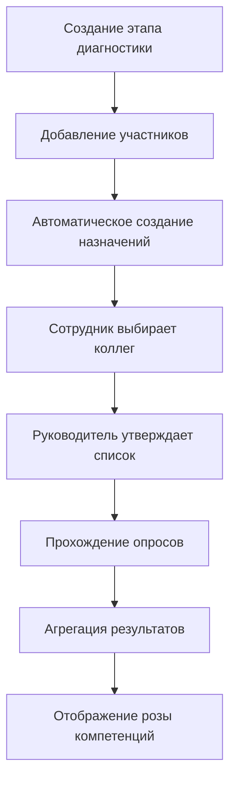

# Руководство по тестированию цикла диагностики компетенций

## Общая схема работы



## 1. Создание этапа диагностики

**Кто:** HR, Администратор  
**Где:** `/admin/diagnostics`

### Шаги:
1. Нажать кнопку "Создать этап"
2. Заполнить форму:
   - Период (например, "H1_2025")
   - Дата начала
   - Дата окончания
   - Дата напоминания (дедлайн)
   - Чекбокс "Активный этап"
3. Нажать "Создать этап"

### Проверка:
✅ Этап появился в списке  
✅ Корректно отображаются даты  
✅ Статус "Активный" отображается badge'ем

---

## 2. Добавление участников этапа

**Кто:** HR, Администратор  
**Где:** `/admin/diagnostics` → кнопка "Добавить участников"

### Шаги:
1. Выбрать нужный этап
2. Нажать "Добавить участников"
3. Выбрать сотрудников из списка (можно использовать "Выбрать всех")
4. Нажать "Добавить (N)"

### Автоматические действия системы:
После добавления участников система автоматически:

1. **Создаёт записи в `diagnostic_stage_participants`**
   ```sql
   INSERT INTO diagnostic_stage_participants (stage_id, user_id)
   ```

2. **Создаёт задачу для каждого участника**
   - Тип: `diagnostic_stage`
   - Название: `{период этапа}`
   - Описание: "Необходимо пройти комплексную оценку компетенций..."
   - Ссылка: `/development`

3. **Создаёт назначения на самооценку** (триггер `assign_surveys_to_diagnostic_participant`):
   - Self-assessment 360: `survey_360_assignments` (статус `approved`)
   - Self-assessment навыки: `skill_survey_assignments` (статус `approved`)
   - Оценка от руководителя: `survey_360_assignments` (статус `approved`, `is_manager_participant=true`)

### Проверка:
✅ Участники отображаются как "уже участник" при повторном открытии диалога  
✅ Задачи появились у участников (проверить в таблице `tasks`)  
✅ Назначения созданы (проверить таблицы `survey_360_assignments`, `skill_survey_assignments`)

---

## 3. Поведение сотрудника на /development → Опросники

**Кто:** Сотрудник-участник этапа  
**Где:** `/development?tab=surveys`

### Сценарий А: Первый вход (коллеги не выбраны)

**Отображается:**
- Блок "Комплексная оценка компетенций"
- Кнопка "Пройти самооценку"

**Действия:**
1. Нажать "Пройти самооценку"
2. Откроется диалог выбора коллег
3. Выбрать коллег (1-5 человек)
4. Нажать "Отправить на утверждение"

**Результат:**
- Создаются записи в `survey_360_assignments` со статусом `pending_approval`
- Отображается алерт "Коллеги отправлены на утверждение руководителю"
- Кнопка "Отозвать список" становится доступной

### Сценарий Б: Коллеги выбраны, но не утверждены

**Отображается:**
- ✅ Выбрано коллег: {N}
- ✅ Коллеги отправлены на утверждение руководителю
- Кнопка "Отозвать список"

**Действия:**
1. Можно отозвать список → статус меняется на `draft`
2. После отзыва можно заново выбрать коллег

### Сценарий В: Коллеги утверждены руководителем

**Отображается:**
- ✅ Выбрано коллег: {N}
- ✅ Коллеги утверждены руководителем
- Статус: Согласовано
- Кнопка "Пройти самооценку" (активна)

**Действия:**
1. Нажать "Пройти самооценку"
2. Откроется `/unified-assessment/{assignmentId}`
3. Пройти опрос (качества + навыки)
4. После завершения → переход на `/assessment-results/{assignmentId}`

### Сценарий Г: Самооценка завершена

**Отображается:**
- Статус: "Оценка завершена"
- Кнопка "Посмотреть результаты"

---

## 4. Утверждение коллег руководителем

**Кто:** Руководитель  
**Где:** `/team`

### Шаги:
1. В таблице подчинённых найти колонку "Респонденты"
2. Если статус "Ожидает (N)" — нажать на кнопку
3. Откроется модальное окно со списком выбранных коллег
4. Выбрать всех или часть
5. Нажать "Утвердить (N)" или "Отклонить (N)"

### Результат утверждения:
- Статус назначений в `survey_360_assignments` меняется на `approved`
- Создаются задачи для выбранных коллег (type = `survey_360_evaluation`)
- У подчинённого в `/development` статус меняется на "Согласовано"

### Результат отклонения:
- Статус назначений меняется на `draft`
- Сотрудник может заново выбрать коллег

### Проверка:
✅ Руководитель видит только своих подчинённых  
✅ После утверждения кнопка дизейблится  
✅ Статус обновляется без перезагрузки страницы

---

## 5. Прохождение опроса (Unified Assessment)

**Кто:** Сотрудник, Коллеги, Руководитель  
**Где:** `/unified-assessment/{assignmentId}`

### Что проверяется:
- Опрос содержит ВСЕ качества + ВСЕ навыки
- Отображается прогресс-бар
- Можно перемещаться "Назад" и "Далее"
- Ответы сохраняются автоматически при переходе
- После последнего вопроса кнопка "Завершить"

### Сохранение результатов:
- Качества → `survey_360_results`
- Навыки → `skill_survey_results`

### После завершения:
- Обновляется статус назначения на `выполнено`
- **Если самооценка:** → `/assessment-results/{assignmentId}`
- **Если оценка коллеги:** → `/development?tab=surveys`

### Проверка:
✅ Все вопросы загружаются корректно  
✅ Ответы сохраняются при навигации  
✅ Навигация не зависает  
✅ После завершения корректный редирект

---

## 6. Агрегация результатов (триггеры БД)

### Триггер `aggregate_survey_360_results`
**Срабатывает:** После вставки в `survey_360_results`

**Что делает:**
1. Определяет `evaluation_period` (H1_YYYY или H2_YYYY)
2. Получает `diagnostic_stage_id` и `manager_id`
3. Агрегирует результаты:
   - `self_assessment` — среднее по самооценке
   - `peers_average` — среднее по коллегам (исключая self и manager)
   - `manager_assessment` — среднее от руководителя
4. Сохраняет в `user_assessment_results` по `quality_id`

### Триггер `aggregate_skill_survey_results`
**Срабатывает:** После вставки в `skill_survey_results`

**Что делает:**
1. Определяет `evaluation_period`
2. Получает `diagnostic_stage_id` и `manager_id`
3. Агрегирует аналогично 360
4. Сохраняет в `user_assessment_results` по `skill_id`

### Проверка:
```sql
SELECT * FROM user_assessment_results 
WHERE user_id = '{user_id}' 
  AND diagnostic_stage_id = '{stage_id}';
```

✅ Поля `self_assessment`, `peers_average`, `manager_assessment` заполнены корректно  
✅ Данные есть и по `skill_id`, и по `quality_id`

---

## 7. Отображение результатов

**Кто:** Сотрудник (самооценка), Руководитель  
**Где:** `/assessment-results/{assignmentId}`

### Сценарий А: Нет данных

**Отображается:**
- Заголовок: "Результаты оценки"
- Текст: "Результаты ещё не сформированы. Нет данных."
- Кнопка: "Вернуться к оценке" → `/development?tab=surveys`

### Сценарий Б: Данные есть

**Отображается:**
1. Роза компетенций (RadarChart):
   - Только компетенции из грида сотрудника (`grade_skills` + `grade_qualities`)
   - Три линии: самооценка, коллеги, руководитель
   - Замкнутая диаграмма (`connectNulls=true`)
   - При частичных данных (например, только руководитель) — роза строится

2. Детализация результатов:
   - Таблица с разбивкой по каждой компетенции
   - Значения: самооценка, коллеги, руководитель

3. Текст под графиком:
   - "На диаграмме отображаются только компетенции, входящие в грид сотрудника."
   - "Оценено X из Y компетенций"

### Проверка:
✅ Роза отрисовывается корректно  
✅ Точки соединены по окружности  
✅ Частичные данные не ломают диаграмму  
✅ Отображаются только компетенции из грида  
✅ Детализация корректна

---

## Чек-лист по всему циклу

### Этап 1: Настройка
- [ ] Создан этап диагностики
- [ ] Добавлены участники (1+ сотрудников)
- [ ] Созданы задачи для участников
- [ ] Созданы назначения (self + manager)

### Этап 2: Выбор коллег
- [ ] Сотрудник видит кнопку "Пройти самооценку"
- [ ] Открывается диалог выбора коллег
- [ ] Список коллег отправляется на утверждение
- [ ] Статус "Ожидает утверждения" отображается

### Этап 3: Утверждение руководителем
- [ ] Руководитель видит "Ожидает (N)"
- [ ] Открывается диалог утверждения
- [ ] Список можно утвердить или отклонить
- [ ] После утверждения статус "Согласовано"

### Этап 4: Прохождение опросов
- [ ] Сотрудник проходит самооценку
- [ ] Коллеги получают задачи и проходят оценку
- [ ] Руководитель проходит оценку подчинённого
- [ ] Все ответы сохраняются корректно

### Этап 5: Агрегация и результаты
- [ ] Триггеры срабатывают корректно
- [ ] Данные в `user_assessment_results` агрегированы
- [ ] Роза компетенций отрисовывается
- [ ] Частичные данные не ломают диаграмму
- [ ] Детализация корректна

---

## Типичные ошибки и решения

### Ошибка: "Результаты ещё не сформированы"
**Причина:** Триггеры агрегации не сработали или нет данных в `user_assessment_results`

**Решение:**
1. Проверить таблицу `survey_360_results` и `skill_survey_results`
2. Проверить таблицу `user_assessment_results`
3. Если данных нет — проверить триггеры в БД

### Ошибка: "Роза компетенций не замкнута"
**Причина:** `connectNulls=false` или данные содержат `null` вместо `0`

**Решение:**
1. Убедиться, что `connectNulls=true` в `RadarChartResults.tsx`
2. Проверить, что в `AssessmentResultsPage.tsx` используется `|| 0` вместо `??`

### Ошибка: "Коллеги не видят задач на оценку"
**Причина:** Руководитель не утвердил список или триггер не создал задачи

**Решение:**
1. Проверить статус в `survey_360_assignments` (должен быть `approved`)
2. Проверить наличие триггера `create_task_on_assignment_approval`
3. Вручную проверить таблицу `tasks`

---

## SQL-запросы для диагностики

### Проверить участников этапа:
```sql
SELECT * FROM diagnostic_stage_participants 
WHERE stage_id = '{stage_id}';
```

### Проверить назначения:
```sql
SELECT * FROM survey_360_assignments 
WHERE diagnostic_stage_id = '{stage_id}';
```

### Проверить задачи:
```sql
SELECT * FROM tasks 
WHERE task_type = 'diagnostic_stage' 
  AND user_id = '{user_id}';
```

### Проверить результаты:
```sql
SELECT * FROM user_assessment_results 
WHERE user_id = '{user_id}' 
  AND diagnostic_stage_id = '{stage_id}';
```
