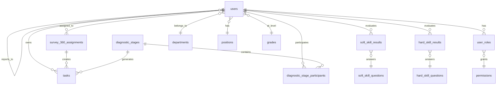
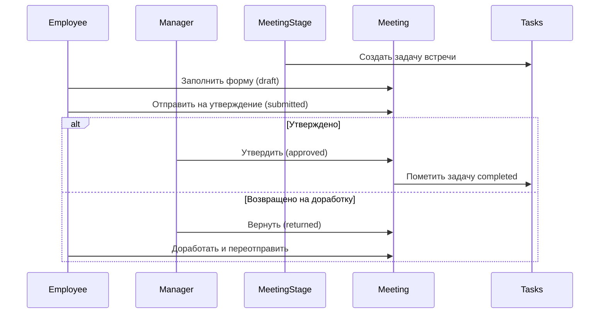
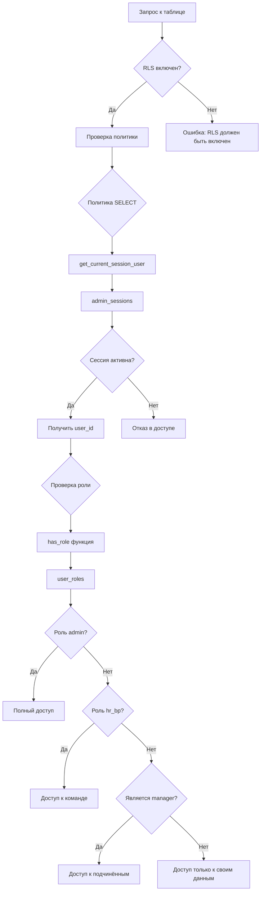

# Техническая документация базы данных

**Проект:** Система оценки компетенций и управления персоналом  
**Версия:** 1.0  
**Дата:** 2025  
**СУБД:** PostgreSQL (Supabase)

---

## Содержание

1. [Обзор системы](#обзор-системы)
2. [Архитектура базы данных](#архитектура-базы-данных)
3. [Таблицы и их назначение](#таблицы-и-их-назначение)
4. [Функции базы данных](#функции-базы-данных)
5. [Триггеры](#триггеры)
6. [Row Level Security (RLS)](#row-level-security-rls)
7. [Ролевая модель](#ролевая-модель)
8. [Система авторизации](#система-авторизации)
9. [Шифрование данных](#шифрование-данных)
10. [Edge Functions](#edge-functions)
11. [Диаграммы связей](#диаграммы-связей)

---

## 1. Обзор системы

### Назначение
Система предназначена для:
- Оценки компетенций сотрудников (hard и soft skills)
- Управления диагностическими этапами и опросами 360°
- Проведения встреч 1-на-1
- Управления задачами и развитием персонала
- Построения карьерных треков

### Ключевые модули
1. **Diagnostics Module** - диагностика компетенций
2. **Survey 360 Module** - опросы 360 градусов
3. **Meetings Module** - встречи 1-на-1
4. **Career Development** - карьерное развитие
5. **Tasks Management** - управление задачами
6. **Security & Audit** - безопасность и аудит

---

## 2. Архитектура базы данных

### Схемы
- **public** - основная схема с бизнес-данными
- **auth** - управляется Supabase (аутентификация)
- **storage** - управляется Supabase (файловое хранилище)

### Принципы проектирования
1. **Нормализация**: 3НФ для большинства таблиц
2. **UUID**: Использование UUID для первичных ключей
3. **Timestamps**: created_at, updated_at для аудита
4. **Soft deletes**: Где применимо (is_active флаги)
5. **RLS**: Row Level Security для всех таблиц

---

## 3. Таблицы и их назначение

### 3.1 Справочные таблицы (Reference Tables)

#### `departments` - Отделы
```sql
CREATE TABLE departments (
  id UUID PRIMARY KEY DEFAULT gen_random_uuid(),
  name TEXT NOT NULL,
  description TEXT,
  created_at TIMESTAMPTZ NOT NULL DEFAULT now(),
  updated_at TIMESTAMPTZ NOT NULL DEFAULT now()
);
```
**Назначение:** Хранение структуры отделов компании  
**RLS:** Все могут читать, админы могут управлять

#### `positions` - Должности
```sql
CREATE TABLE positions (
  id UUID PRIMARY KEY DEFAULT gen_random_uuid(),
  name TEXT NOT NULL,
  position_category_id UUID NOT NULL REFERENCES position_categories(id),
  created_at TIMESTAMPTZ NOT NULL DEFAULT now(),
  updated_at TIMESTAMPTZ NOT NULL DEFAULT now()
);
```
**Назначение:** Каталог должностей с привязкой к категориям

#### `position_categories` - Категории должностей
**Назначение:** Группировка должностей (например, "Менеджмент", "IT", "Продажи")

#### `grades` - Грейды
```sql
CREATE TABLE grades (
  id UUID PRIMARY KEY DEFAULT gen_random_uuid(),
  name TEXT NOT NULL,
  level INTEGER NOT NULL,
  position_id UUID REFERENCES positions(id),
  position_category_id UUID REFERENCES position_categories(id),
  parent_grade_id UUID REFERENCES grades(id),
  certification_id UUID REFERENCES certifications(id),
  description TEXT,
  key_tasks TEXT,
  min_salary NUMERIC,
  max_salary NUMERIC,
  created_at TIMESTAMPTZ NOT NULL DEFAULT now(),
  updated_at TIMESTAMPTZ NOT NULL DEFAULT now()
);
```
**Назначение:** Уровни квалификации с привязкой к зарплатным вилкам и сертификациям

#### `skills` - Навыки (Hard Skills)
```sql
CREATE TABLE skills (
  id UUID PRIMARY KEY DEFAULT gen_random_uuid(),
  name TEXT NOT NULL,
  description TEXT,
  category_id UUID REFERENCES category_skills(id),
  created_at TIMESTAMPTZ NOT NULL DEFAULT now(),
  updated_at TIMESTAMPTZ NOT NULL DEFAULT now()
);
```
**Назначение:** Каталог технических навыков

#### `category_skills` - Категории навыков
**Назначение:** Группировка навыков (например, "Программирование", "Аналитика")

#### `qualities` - Качества (Soft Skills)
```sql
CREATE TABLE qualities (
  id UUID PRIMARY KEY DEFAULT gen_random_uuid(),
  name TEXT NOT NULL,
  description TEXT,
  created_at TIMESTAMPTZ NOT NULL DEFAULT now(),
  updated_at TIMESTAMPTZ NOT NULL DEFAULT now()
);
```
**Назначение:** Каталог личностных качеств и компетенций

#### `competency_levels` - Уровни компетенций
```sql
CREATE TABLE competency_levels (
  id UUID PRIMARY KEY DEFAULT gen_random_uuid(),
  name TEXT NOT NULL,
  level INTEGER NOT NULL,
  description TEXT,
  created_at TIMESTAMPTZ NOT NULL DEFAULT now(),
  updated_at TIMESTAMPTZ NOT NULL DEFAULT now()
);
```
**Назначение:** Шкала оценки компетенций (1-5)

---

### 3.2 Связующие таблицы (Junction Tables)

#### `grade_skills` - Навыки для грейдов
```sql
CREATE TABLE grade_skills (
  id UUID PRIMARY KEY DEFAULT gen_random_uuid(),
  grade_id UUID NOT NULL REFERENCES grades(id),
  skill_id UUID NOT NULL REFERENCES skills(id),
  target_level NUMERIC NOT NULL,
  created_at TIMESTAMPTZ NOT NULL DEFAULT now(),
  updated_at TIMESTAMPTZ NOT NULL DEFAULT now()
);
```
**Назначение:** Определяет требуемые навыки и их уровни для каждого грейда

#### `grade_qualities` - Качества для грейдов
```sql
CREATE TABLE grade_qualities (
  id UUID PRIMARY KEY DEFAULT gen_random_uuid(),
  grade_id UUID NOT NULL REFERENCES grades(id),
  quality_id UUID NOT NULL REFERENCES qualities(id),
  target_level NUMERIC NOT NULL,
  created_at TIMESTAMPTZ NOT NULL DEFAULT now(),
  updated_at TIMESTAMPTZ NOT NULL DEFAULT now()
);
```
**Назначение:** Определяет требуемые качества для каждого грейда

---

### 3.3 Пользователи и роли

#### `users` - Пользователи
```sql
CREATE TABLE users (
  id UUID PRIMARY KEY,
  email TEXT NOT NULL UNIQUE,
  first_name TEXT,      -- шифруется
  last_name TEXT,       -- шифруется
  middle_name TEXT,     -- шифруется
  department_id UUID REFERENCES departments(id),
  position_id UUID REFERENCES positions(id),
  grade_id UUID REFERENCES grades(id),
  manager_id UUID REFERENCES users(id),
  hire_date DATE,
  birth_date DATE,
  status BOOLEAN NOT NULL DEFAULT true,
  last_login_at TIMESTAMPTZ,
  created_at TIMESTAMPTZ NOT NULL DEFAULT now(),
  updated_at TIMESTAMPTZ NOT NULL DEFAULT now()
);
```
**Назначение:** Основная таблица пользователей  
**Шифрование:** first_name, last_name, middle_name, email

#### `user_roles` - Роли пользователей
```sql
CREATE TABLE user_roles (
  id UUID PRIMARY KEY DEFAULT gen_random_uuid(),
  user_id UUID NOT NULL REFERENCES users(id),
  role app_role NOT NULL,
  created_at TIMESTAMPTZ DEFAULT now(),
  UNIQUE(user_id, role)
);
```
**Назначение:** Маппинг пользователей на роли (избегает privilege escalation)  
**Enum app_role:** 'admin', 'hr_bp', 'manager', 'employee'

#### `permissions` - Разрешения
```sql
CREATE TABLE permissions (
  id UUID PRIMARY KEY DEFAULT gen_random_uuid(),
  name TEXT NOT NULL,
  resource TEXT NOT NULL,
  action TEXT NOT NULL,
  description TEXT,
  created_at TIMESTAMPTZ DEFAULT now(),
  updated_at TIMESTAMPTZ DEFAULT now()
);
```
**Назначение:** Каталог разрешений в системе

#### `role_permissions` - Связь ролей и разрешений
```sql
CREATE TABLE role_permissions (
  id UUID PRIMARY KEY DEFAULT gen_random_uuid(),
  role app_role NOT NULL,
  permission_id UUID REFERENCES permissions(id),
  created_at TIMESTAMPTZ DEFAULT now()
);
```
**Назначение:** RBAC маппинг: какие разрешения есть у каждой роли

---

### 3.4 Диагностические этапы

#### `diagnostic_stages` - Этапы диагностики
```sql
CREATE TABLE diagnostic_stages (
  id UUID PRIMARY KEY DEFAULT gen_random_uuid(),
  period TEXT NOT NULL,
  evaluation_period TEXT,
  start_date DATE NOT NULL,
  end_date DATE NOT NULL,
  deadline_date DATE NOT NULL,
  status TEXT NOT NULL DEFAULT 'setup',
  progress_percent NUMERIC DEFAULT 0,
  is_active BOOLEAN NOT NULL DEFAULT true,
  created_by UUID NOT NULL DEFAULT get_current_session_user(),
  created_at TIMESTAMPTZ NOT NULL DEFAULT now(),
  updated_at TIMESTAMPTZ NOT NULL DEFAULT now()
);
```
**Назначение:** Управление периодами оценки (H1/H2)  
**Статусы:** 'setup', 'assessment', 'completed'

#### `diagnostic_stage_participants` - Участники диагностики
```sql
CREATE TABLE diagnostic_stage_participants (
  id UUID PRIMARY KEY DEFAULT gen_random_uuid(),
  stage_id UUID NOT NULL REFERENCES diagnostic_stages(id),
  user_id UUID NOT NULL REFERENCES users(id),
  created_at TIMESTAMPTZ NOT NULL DEFAULT now(),
  UNIQUE(stage_id, user_id)
);
```
**Назначение:** Регистрация участников в диагностическом этапе

---

### 3.5 Опросы и оценка

#### `hard_skill_questions` - Вопросы по Hard Skills
```sql
CREATE TABLE hard_skill_questions (
  id UUID PRIMARY KEY DEFAULT gen_random_uuid(),
  question_text TEXT NOT NULL,
  skill_id UUID REFERENCES skills(id),
  order_index INTEGER,
  created_at TIMESTAMPTZ NOT NULL DEFAULT now(),
  updated_at TIMESTAMPTZ NOT NULL DEFAULT now()
);
```
**Назначение:** Банк вопросов для оценки технических навыков

#### `hard_skill_answer_options` - Варианты ответов (Hard Skills)
```sql
CREATE TABLE hard_skill_answer_options (
  id UUID PRIMARY KEY DEFAULT gen_random_uuid(),
  title TEXT NOT NULL,
  description TEXT,
  numeric_value INTEGER NOT NULL,
  created_at TIMESTAMPTZ NOT NULL DEFAULT now(),
  updated_at TIMESTAMPTZ NOT NULL DEFAULT now()
);
```
**Назначение:** Шкала ответов (1-5) для hard skills

#### `hard_skill_results` - Результаты оценки Hard Skills
```sql
CREATE TABLE hard_skill_results (
  id UUID PRIMARY KEY DEFAULT gen_random_uuid(),
  evaluated_user_id UUID NOT NULL,
  evaluating_user_id UUID,
  question_id UUID NOT NULL REFERENCES hard_skill_questions(id),
  answer_option_id UUID NOT NULL REFERENCES hard_skill_answer_options(id),
  comment TEXT,
  diagnostic_stage_id UUID REFERENCES diagnostic_stages(id),
  assignment_id UUID REFERENCES survey_360_assignments(id),
  evaluation_period TEXT,
  is_draft BOOLEAN DEFAULT true,
  created_at TIMESTAMPTZ NOT NULL DEFAULT now(),
  updated_at TIMESTAMPTZ NOT NULL DEFAULT now()
);
```
**Назначение:** Хранение ответов на опросы hard skills  
**Поле is_draft:** true = черновик, false = финальная отправка

#### `soft_skill_questions` - Вопросы по Soft Skills
```sql
CREATE TABLE soft_skill_questions (
  id UUID PRIMARY KEY DEFAULT gen_random_uuid(),
  question_text TEXT NOT NULL,
  quality_id UUID REFERENCES qualities(id),
  category TEXT,
  behavioral_indicators TEXT,
  order_index INTEGER,
  created_at TIMESTAMPTZ NOT NULL DEFAULT now(),
  updated_at TIMESTAMPTZ NOT NULL DEFAULT now()
);
```
**Назначение:** Банк вопросов для оценки 360°

#### `soft_skill_answer_options` - Варианты ответов (Soft Skills)
```sql
CREATE TABLE soft_skill_answer_options (
  id UUID PRIMARY KEY DEFAULT gen_random_uuid(),
  label TEXT NOT NULL,
  description TEXT,
  numeric_value INTEGER NOT NULL,
  created_at TIMESTAMPTZ NOT NULL DEFAULT now(),
  updated_at TIMESTAMPTZ NOT NULL DEFAULT now()
);
```
**Назначение:** Шкала ответов для soft skills

#### `soft_skill_results` - Результаты оценки Soft Skills (360°)
```sql
CREATE TABLE soft_skill_results (
  id UUID PRIMARY KEY DEFAULT gen_random_uuid(),
  evaluated_user_id UUID NOT NULL,
  evaluating_user_id UUID NOT NULL,
  question_id UUID NOT NULL REFERENCES soft_skill_questions(id),
  answer_option_id UUID NOT NULL REFERENCES soft_skill_answer_options(id),
  comment TEXT,
  is_anonymous_comment BOOLEAN DEFAULT false,
  diagnostic_stage_id UUID REFERENCES diagnostic_stages(id),
  assignment_id UUID REFERENCES survey_360_assignments(id),
  evaluation_period TEXT,
  is_draft BOOLEAN DEFAULT true,
  created_at TIMESTAMPTZ NOT NULL DEFAULT now(),
  updated_at TIMESTAMPTZ NOT NULL DEFAULT now()
);
```
**Назначение:** Хранение ответов на опросы 360°

---

### 3.6 Назначения и задачи

#### `survey_360_assignments` - Назначения опросов 360°
```sql
CREATE TABLE survey_360_assignments (
  id UUID PRIMARY KEY DEFAULT gen_random_uuid(),
  evaluated_user_id UUID NOT NULL,
  evaluating_user_id UUID NOT NULL,
  diagnostic_stage_id UUID REFERENCES diagnostic_stages(id),
  assignment_type TEXT,  -- 'self', 'manager', 'peer'
  status TEXT NOT NULL DEFAULT 'отправлен запрос',
  is_manager_participant BOOLEAN DEFAULT false,
  approved_by UUID,
  approved_at TIMESTAMPTZ,
  rejected_at TIMESTAMPTZ,
  rejection_reason TEXT,
  assigned_date TIMESTAMPTZ NOT NULL DEFAULT now(),
  created_at TIMESTAMPTZ NOT NULL DEFAULT now(),
  updated_at TIMESTAMPTZ NOT NULL DEFAULT now(),
  UNIQUE(evaluated_user_id, evaluating_user_id)
);
```
**Назначение:** Управление назначениями на прохождение опроса 360°  
**assignment_type:**
- 'self' - самооценка
- 'manager' - оценка руководителем
- 'peer' - оценка коллегами

#### `tasks` - Задачи
```sql
CREATE TABLE tasks (
  id UUID PRIMARY KEY DEFAULT gen_random_uuid(),
  user_id UUID NOT NULL,
  title TEXT NOT NULL,
  description TEXT,
  status TEXT NOT NULL DEFAULT 'pending',
  priority TEXT DEFAULT 'normal',
  category TEXT DEFAULT 'assessment',
  task_type TEXT DEFAULT 'assessment',
  assignment_type TEXT,  -- 'self', 'manager', 'peer'
  deadline DATE,
  assignment_id UUID REFERENCES survey_360_assignments(id),
  diagnostic_stage_id UUID REFERENCES diagnostic_stages(id),
  competency_ref UUID,
  kpi_expected_level INTEGER,
  kpi_result_level INTEGER,
  created_at TIMESTAMPTZ NOT NULL DEFAULT now(),
  updated_at TIMESTAMPTZ NOT NULL DEFAULT now()
);
```
**Назначение:** Управление задачами пользователей  
**task_type:**
- 'assessment' - оценка
- 'diagnostic_stage' - диагностический этап
- 'survey_360_evaluation' - оценка 360°
- 'meeting' - встреча 1-на-1

---

### 3.7 Встречи 1-на-1

#### `meeting_stages` - Этапы встреч
```sql
CREATE TABLE meeting_stages (
  id UUID PRIMARY KEY DEFAULT gen_random_uuid(),
  period TEXT NOT NULL,
  start_date DATE NOT NULL,
  end_date DATE NOT NULL,
  deadline_date DATE NOT NULL,
  is_active BOOLEAN NOT NULL DEFAULT true,
  created_by UUID,
  created_at TIMESTAMPTZ NOT NULL DEFAULT now(),
  updated_at TIMESTAMPTZ NOT NULL DEFAULT now()
);
```
**Назначение:** Периоды проведения встреч 1-на-1

#### `meeting_stage_participants` - Участники встреч
```sql
CREATE TABLE meeting_stage_participants (
  id UUID PRIMARY KEY DEFAULT gen_random_uuid(),
  stage_id UUID NOT NULL REFERENCES meeting_stages(id),
  user_id UUID NOT NULL REFERENCES users(id),
  created_at TIMESTAMPTZ NOT NULL DEFAULT now(),
  UNIQUE(stage_id, user_id)
);
```

#### `one_on_one_meetings` - Встречи 1-на-1
```sql
CREATE TABLE one_on_one_meetings (
  id UUID PRIMARY KEY DEFAULT gen_random_uuid(),
  stage_id UUID NOT NULL REFERENCES meeting_stages(id),
  employee_id UUID NOT NULL,
  manager_id UUID NOT NULL,
  meeting_date TIMESTAMPTZ,
  status TEXT NOT NULL DEFAULT 'draft',
  goal_and_agenda TEXT,
  previous_decisions_debrief TEXT,
  energy_gained TEXT,
  energy_lost TEXT,
  stoppers TEXT,
  manager_comment TEXT,
  return_reason TEXT,
  submitted_at TIMESTAMPTZ,
  approved_at TIMESTAMPTZ,
  returned_at TIMESTAMPTZ,
  created_at TIMESTAMPTZ NOT NULL DEFAULT now(),
  updated_at TIMESTAMPTZ NOT NULL DEFAULT now()
);
```
**Назначение:** Протоколы встреч 1-на-1  
**Статусы:** 'draft', 'submitted', 'approved', 'returned'

#### `meeting_decisions` - Решения со встреч
```sql
CREATE TABLE meeting_decisions (
  id UUID PRIMARY KEY DEFAULT gen_random_uuid(),
  meeting_id UUID NOT NULL REFERENCES one_on_one_meetings(id),
  decision_text TEXT NOT NULL,
  is_completed BOOLEAN NOT NULL DEFAULT false,
  created_by UUID NOT NULL,
  created_at TIMESTAMPTZ NOT NULL DEFAULT now(),
  updated_at TIMESTAMPTZ NOT NULL DEFAULT now()
);
```
**Назначение:** Фиксация решений и action items со встреч

---

### 3.8 Развитие и карьера

#### `career_tracks` - Карьерные треки
```sql
CREATE TABLE career_tracks (
  id UUID PRIMARY KEY DEFAULT gen_random_uuid(),
  name TEXT NOT NULL,
  description TEXT,
  target_position_id UUID REFERENCES positions(id),
  track_type_id UUID REFERENCES track_types(id),
  duration_months INTEGER,
  created_at TIMESTAMPTZ NOT NULL DEFAULT now(),
  updated_at TIMESTAMPTZ NOT NULL DEFAULT now()
);
```
**Назначение:** Определение карьерных путей

#### `career_track_steps` - Шаги карьерного трека
```sql
CREATE TABLE career_track_steps (
  id UUID PRIMARY KEY DEFAULT gen_random_uuid(),
  career_track_id UUID NOT NULL REFERENCES career_tracks(id),
  grade_id UUID NOT NULL REFERENCES grades(id),
  step_order INTEGER NOT NULL,
  description TEXT,
  duration_months INTEGER,
  created_at TIMESTAMPTZ NOT NULL DEFAULT now(),
  updated_at TIMESTAMPTZ NOT NULL DEFAULT now()
);
```
**Назначение:** Последовательность грейдов в треке

#### `development_tasks` - Задачи для развития
```sql
CREATE TABLE development_tasks (
  id UUID PRIMARY KEY DEFAULT gen_random_uuid(),
  skill_id UUID REFERENCES skills(id),
  quality_id UUID REFERENCES qualities(id),
  competency_level_id UUID REFERENCES competency_levels(id),
  task_name TEXT NOT NULL,
  task_goal TEXT NOT NULL,
  how_to TEXT NOT NULL,
  measurable_result TEXT NOT NULL,
  task_order INTEGER NOT NULL DEFAULT 1,
  created_at TIMESTAMPTZ NOT NULL DEFAULT now(),
  updated_at TIMESTAMPTZ NOT NULL DEFAULT now()
);
```
**Назначение:** Библиотека развивающих активностей

#### `user_assessment_results` - Агрегированные результаты оценки
```sql
CREATE TABLE user_assessment_results (
  id UUID PRIMARY KEY DEFAULT gen_random_uuid(),
  user_id UUID NOT NULL,
  diagnostic_stage_id UUID,
  assessment_period TEXT,
  assessment_date TIMESTAMPTZ,
  skill_id UUID REFERENCES skills(id),
  quality_id UUID REFERENCES qualities(id),
  self_assessment NUMERIC,
  manager_assessment NUMERIC,
  peers_average NUMERIC,
  total_responses INTEGER,
  created_at TIMESTAMPTZ NOT NULL DEFAULT now(),
  updated_at TIMESTAMPTZ NOT NULL DEFAULT now()
);
```
**Назначение:** Агрегация результатов оценки по источникам

---

### 3.9 Аудит и безопасность

#### `admin_sessions` - Сессии администраторов
```sql
CREATE TABLE admin_sessions (
  id UUID PRIMARY KEY DEFAULT gen_random_uuid(),
  user_id UUID NOT NULL,
  email TEXT NOT NULL,
  expires_at TIMESTAMPTZ NOT NULL DEFAULT (now() + INTERVAL '24 hours'),
  created_at TIMESTAMPTZ NOT NULL DEFAULT now()
);
```
**Назначение:** Управление сессиями для обхода RLS (security definer functions)  
**⚠️ КРИТИЧНО:** Имеет политику `true/true` - требует доработки!

#### `audit_log` - Журнал аудита
```sql
CREATE TABLE audit_log (
  id UUID PRIMARY KEY DEFAULT gen_random_uuid(),
  admin_id UUID NOT NULL,
  target_user_id UUID,
  action_type TEXT NOT NULL,
  field TEXT,
  old_value TEXT,
  new_value TEXT,
  details JSONB,
  created_at TIMESTAMPTZ DEFAULT now()
);
```
**Назначение:** Логирование действий администраторов

#### `admin_activity_logs` - Логи активности админов
```sql
CREATE TABLE admin_activity_logs (
  id UUID PRIMARY KEY DEFAULT gen_random_uuid(),
  user_id UUID NOT NULL,
  user_name TEXT NOT NULL,
  action TEXT NOT NULL,
  entity_type TEXT NOT NULL,
  entity_name TEXT,
  details JSONB,
  created_at TIMESTAMPTZ DEFAULT now()
);
```
**Назначение:** Детальное логирование административных операций

#### `auth_users` - Копия auth пользователей
```sql
CREATE TABLE auth_users (
  id UUID PRIMARY KEY DEFAULT gen_random_uuid(),
  email TEXT NOT NULL UNIQUE,
  password_hash TEXT NOT NULL,
  is_active BOOLEAN NOT NULL DEFAULT true,
  created_at TIMESTAMPTZ NOT NULL DEFAULT now(),
  updated_at TIMESTAMPTZ NOT NULL DEFAULT now()
);
```
**Назначение:** Дублирование данных для кастомной авторизации

---

### 3.10 Вспомогательные таблицы

#### `trade_points` - Торговые точки
```sql
CREATE TABLE trade_points (
  id UUID PRIMARY KEY DEFAULT gen_random_uuid(),
  name TEXT NOT NULL,
  address TEXT NOT NULL,
  latitude NUMERIC,
  longitude NUMERIC,
  status TEXT NOT NULL DEFAULT 'Активный',
  created_at TIMESTAMPTZ NOT NULL DEFAULT now(),
  updated_at TIMESTAMPTZ NOT NULL DEFAULT now()
);
```
**Назначение:** Геоданные для привязки пользователей к локациям

#### `certifications` - Сертификации
**Назначение:** Каталог сертификаций для грейдов

#### `manufacturers` - Производители
**Назначение:** Справочник производителей (возможно для продуктов)

---

## 4. Функции базы данных

### 4.1 Security Functions

#### `get_current_session_user()`
```sql
CREATE OR REPLACE FUNCTION public.get_current_session_user()
RETURNS UUID
LANGUAGE sql
STABLE SECURITY DEFINER
SET search_path = public
AS $$
  SELECT user_id 
  FROM admin_sessions 
  WHERE expires_at > now() 
  ORDER BY created_at DESC 
  LIMIT 1;
$$;
```
**Назначение:** Получение текущего пользователя из сессии (обходит RLS)  
**Параметры:** Нет  
**Возвращает:** UUID текущего пользователя  
**Использование:** В RLS политиках и триггерах

#### `has_role(_user_id UUID, _role app_role)`
```sql
CREATE OR REPLACE FUNCTION public.has_role(_user_id uuid, _role app_role)
RETURNS BOOLEAN
LANGUAGE sql
STABLE SECURITY DEFINER
SET search_path = 'public'
AS $function$
  SELECT EXISTS (
    SELECT 1
    FROM public.user_roles
    WHERE user_id = _user_id
      AND role = _role
  );
$function$
```
**Назначение:** Проверка наличия роли у пользователя  
**Параметры:**
- `_user_id` - UUID пользователя
- `_role` - роль из enum app_role

**Возвращает:** BOOLEAN  
**Использование:** В RLS политиках для проверки прав

#### `has_any_role(_user_id UUID, _roles app_role[])`
```sql
CREATE OR REPLACE FUNCTION public.has_any_role(_user_id uuid, _roles app_role[])
RETURNS BOOLEAN
LANGUAGE sql
STABLE SECURITY DEFINER
SET search_path TO 'public'
AS $function$
  SELECT EXISTS (
    SELECT 1
    FROM public.user_roles
    WHERE user_id = _user_id
      AND role = ANY(_roles)
  )
$function$
```
**Назначение:** Проверка наличия хотя бы одной из ролей  
**Параметры:**
- `_user_id` - UUID пользователя
- `_roles` - массив ролей

**Возвращает:** BOOLEAN

#### `has_permission(_user_id UUID, _permission_name TEXT)`
```sql
CREATE OR REPLACE FUNCTION public.has_permission(_user_id uuid, _permission_name text)
RETURNS BOOLEAN
LANGUAGE sql
STABLE SECURITY DEFINER
SET search_path TO 'public'
AS $function$
  SELECT EXISTS (
    SELECT 1
    FROM user_roles ur
    JOIN role_permissions rp ON rp.role = ur.role
    JOIN permissions p ON p.id = rp.permission_id
    WHERE ur.user_id = _user_id
      AND p.name = _permission_name
  );
$function$
```
**Назначение:** Проверка наличия конкретного разрешения  
**Параметры:**
- `_user_id` - UUID пользователя
- `_permission_name` - название разрешения

**Возвращает:** BOOLEAN

#### `is_current_user_admin()`
```sql
CREATE OR REPLACE FUNCTION public.is_current_user_admin()
RETURNS BOOLEAN
LANGUAGE sql
STABLE SECURITY DEFINER
SET search_path TO 'public'
AS $function$
  SELECT EXISTS (
    SELECT 1
    FROM user_roles ur
    WHERE ur.user_id = get_current_session_user()
      AND ur.role = 'admin'
  );
$function$
```
**Назначение:** Проверка, является ли текущий пользователь администратором  
**Использование:** В RLS политиках для админ-доступа

#### `is_current_user_hr()`
```sql
CREATE OR REPLACE FUNCTION public.is_current_user_hr()
RETURNS BOOLEAN
LANGUAGE sql
STABLE SECURITY DEFINER
SET search_path TO 'public'
AS $function$
  SELECT EXISTS (
    SELECT 1
    FROM user_roles ur
    WHERE ur.user_id = get_current_session_user()
      AND ur.role IN ('admin', 'hr_bp')
  );
$function$
```
**Назначение:** Проверка, является ли пользователь HR или админом

#### `is_manager_of(_manager_id UUID, _employee_id UUID)`
```sql
CREATE OR REPLACE FUNCTION public.is_manager_of(_manager_id uuid, _employee_id uuid)
RETURNS BOOLEAN
LANGUAGE sql
STABLE SECURITY DEFINER
SET search_path TO 'public'
AS $function$
  SELECT EXISTS (
    SELECT 1
    FROM users
    WHERE id = _employee_id
      AND manager_id = _manager_id
  );
$function$
```
**Назначение:** Проверка, является ли пользователь руководителем другого пользователя  
**Параметры:**
- `_manager_id` - UUID руководителя
- `_employee_id` - UUID подчиненного

#### `is_manager_of_user(target_user_id UUID)`
```sql
CREATE OR REPLACE FUNCTION public.is_manager_of_user(target_user_id uuid)
RETURNS BOOLEAN
LANGUAGE sql
STABLE SECURITY DEFINER
SET search_path TO 'public'
AS $function$
  SELECT EXISTS (
    SELECT 1
    FROM users
    WHERE id = target_user_id
      AND manager_id = get_current_session_user()
  );
$function$
```
**Назначение:** Проверка, является ли текущий пользователь руководителем указанного

---

### 4.2 Data Management Functions

#### `get_users_with_roles()`
```sql
CREATE OR REPLACE FUNCTION public.get_users_with_roles()
RETURNS TABLE(
  id uuid, 
  email text, 
  status boolean, 
  last_login_at timestamp with time zone, 
  created_at timestamp with time zone, 
  updated_at timestamp with time zone, 
  role app_role
)
LANGUAGE sql
SECURITY DEFINER
SET search_path TO 'public'
AS $function$
  SELECT 
    u.id,
    u.email,
    u.status,
    u.last_login_at,
    u.created_at,
    u.updated_at,
    ur.role
  FROM users u
  LEFT JOIN user_roles ur ON ur.user_id = u.id;
$function$
```
**Назначение:** Получение списка пользователей с их ролями  
**Возвращает:** Таблицу пользователей

#### `get_user_role(_user_id UUID)`
```sql
CREATE OR REPLACE FUNCTION public.get_user_role(_user_id uuid)
RETURNS app_role
LANGUAGE sql
STABLE SECURITY DEFINER
SET search_path TO 'public'
AS $function$
  SELECT role
  FROM user_roles
  WHERE user_id = _user_id
  LIMIT 1;
$function$
```
**Назначение:** Получение роли пользователя  
**Возвращает:** app_role enum

#### `get_evaluation_period(created_date TIMESTAMPTZ)`
```sql
CREATE OR REPLACE FUNCTION public.get_evaluation_period(created_date timestamp with time zone)
RETURNS TEXT
LANGUAGE plpgsql
SET search_path TO 'public'
AS $function$
BEGIN
  IF EXTRACT(MONTH FROM created_date) <= 6 THEN
    RETURN 'H1_' || EXTRACT(YEAR FROM created_date);
  ELSE
    RETURN 'H2_' || EXTRACT(YEAR FROM created_date);
  END IF;
END;
$function$
```
**Назначение:** Определение периода оценки (H1/H2)  
**Параметры:** created_date - дата создания записи  
**Возвращает:** TEXT ('H1_2025' или 'H2_2025')

---

### 4.3 Business Logic Functions

#### `calculate_diagnostic_stage_progress(stage_id_param UUID)`
```sql
CREATE OR REPLACE FUNCTION public.calculate_diagnostic_stage_progress(stage_id_param uuid)
RETURNS NUMERIC
LANGUAGE plpgsql
SECURITY DEFINER
SET search_path TO 'public'
AS $function$
DECLARE
  total_participants integer;
  completed_skill_surveys integer;
  completed_360_surveys integer;
  total_required integer;
  completed_total integer;
  progress numeric;
BEGIN
  -- Подсчёт участников
  SELECT COUNT(*) INTO total_participants
  FROM diagnostic_stage_participants
  WHERE stage_id = stage_id_param;
  
  IF total_participants = 0 THEN
    RETURN 0;
  END IF;
  
  -- Каждый участник должен пройти 2 опроса
  total_required := total_participants * 2;
  
  -- Подсчёт завершённых hard skills
  SELECT COUNT(DISTINCT ssr.evaluated_user_id) INTO completed_skill_surveys
  FROM hard_skill_results ssr
  JOIN diagnostic_stage_participants dsp ON dsp.user_id = ssr.evaluated_user_id
  WHERE dsp.stage_id = stage_id_param;
  
  -- Подсчёт завершённых soft skills
  SELECT COUNT(DISTINCT s360r.evaluated_user_id) INTO completed_360_surveys
  FROM soft_skill_results s360r
  JOIN diagnostic_stage_participants dsp ON dsp.user_id = s360r.evaluated_user_id
  WHERE dsp.stage_id = stage_id_param;
  
  completed_total := completed_skill_surveys + completed_360_surveys;
  progress := (completed_total::numeric / total_required::numeric) * 100;
  
  RETURN ROUND(progress, 2);
END;
$function$
```
**Назначение:** Расчёт прогресса диагностического этапа  
**Параметры:** stage_id_param - ID этапа  
**Возвращает:** NUMERIC (процент выполнения)

#### `aggregate_hard_skill_results()` (TRIGGER FUNCTION)
```sql
CREATE OR REPLACE FUNCTION public.aggregate_hard_skill_results()
RETURNS TRIGGER
LANGUAGE plpgsql
SECURITY DEFINER
SET search_path TO 'public'
AS $function$
DECLARE
  stage_id UUID;
  manager_id UUID;
BEGIN
  stage_id := NEW.diagnostic_stage_id;
  
  SELECT u.manager_id INTO manager_id
  FROM users u
  WHERE u.id = NEW.evaluated_user_id;
  
  -- Удаляем старые агрегированные результаты
  DELETE FROM user_assessment_results
  WHERE user_id = NEW.evaluated_user_id
    AND diagnostic_stage_id = stage_id
    AND skill_id IS NOT NULL;
  
  -- Агрегируем результаты по навыкам
  INSERT INTO user_assessment_results (
    user_id, diagnostic_stage_id, assessment_period, assessment_date,
    skill_id, self_assessment, manager_assessment, peers_average, total_responses
  )
  SELECT 
    NEW.evaluated_user_id,
    stage_id,
    get_evaluation_period(NOW()),
    NOW(),
    hq.skill_id,
    AVG(CASE WHEN sr.evaluating_user_id = NEW.evaluated_user_id THEN ao.numeric_value ELSE NULL END),
    AVG(CASE WHEN sr.evaluating_user_id = manager_id THEN ao.numeric_value ELSE NULL END),
    AVG(CASE 
      WHEN sr.evaluating_user_id != NEW.evaluated_user_id 
        AND (manager_id IS NULL OR sr.evaluating_user_id != manager_id)
      THEN ao.numeric_value 
      ELSE NULL 
    END),
    COUNT(*)
  FROM hard_skill_results sr
  JOIN hard_skill_questions hq ON sr.question_id = hq.id
  JOIN hard_skill_answer_options ao ON sr.answer_option_id = ao.id
  WHERE sr.evaluated_user_id = NEW.evaluated_user_id
    AND sr.diagnostic_stage_id = stage_id
    AND sr.is_draft = false
    AND hq.skill_id IS NOT NULL
  GROUP BY hq.skill_id;
  
  RETURN NEW;
END;
$function$
```
**Назначение:** Агрегация результатов hard skills (самооценка, оценка менеджера, peers)  
**Триггер:** После INSERT в hard_skill_results

#### `aggregate_soft_skill_results()` (TRIGGER FUNCTION)
**Назначение:** Аналогично для soft skills (оценка 360°)

---

### 4.4 Admin Functions

#### `log_admin_action(...)`
```sql
CREATE OR REPLACE FUNCTION public.log_admin_action(
  _admin_id uuid, 
  _target_user_id uuid, 
  _action_type text, 
  _field text DEFAULT NULL::text, 
  _old_value text DEFAULT NULL::text, 
  _new_value text DEFAULT NULL::text, 
  _details jsonb DEFAULT NULL::jsonb
)
RETURNS UUID
LANGUAGE plpgsql
SECURITY DEFINER
SET search_path TO 'public'
AS $function$
DECLARE
  log_id UUID;
BEGIN
  INSERT INTO audit_log (
    admin_id, target_user_id, action_type, field, old_value, new_value, details
  )
  VALUES (
    _admin_id, _target_user_id, _action_type, _field, _old_value, _new_value, _details
  )
  RETURNING id INTO log_id;
  
  RETURN log_id;
END;
$function$
```
**Назначение:** Логирование действий администратора  
**Параметры:**
- `_admin_id` - UUID администратора
- `_target_user_id` - UUID целевого пользователя
- `_action_type` - тип действия (CREATE, UPDATE, DELETE)
- `_field` - изменённое поле
- `_old_value` - старое значение
- `_new_value` - новое значение
- `_details` - дополнительные детали в JSONB

**Возвращает:** UUID созданной записи в audit_log

#### `admin_cleanup_all_data()`
```sql
CREATE OR REPLACE FUNCTION public.admin_cleanup_all_data()
RETURNS JSONB
LANGUAGE plpgsql
SECURITY DEFINER
SET search_path TO 'public'
AS $function$
DECLARE
  result jsonb := '[]'::jsonb;
  deleted_count integer;
BEGIN
  IF NOT is_current_user_admin() THEN
    RAISE EXCEPTION 'Access denied. Admin role required.';
  END IF;
  
  -- Удаление в правильном порядке с учётом внешних ключей
  DELETE FROM public.meeting_decisions WHERE TRUE;
  GET DIAGNOSTICS deleted_count = ROW_COUNT;
  result := result || jsonb_build_object('table', 'meeting_decisions', 'count', deleted_count);
  
  -- ... остальные таблицы ...
  
  RETURN result;
END;
$function$
```
**Назначение:** Полная очистка данных (для тестирования)  
**⚠️ ОПАСНО:** Удаляет все данные!  
**Возвращает:** JSONB с количеством удалённых записей по таблицам

#### `check_diagnostic_invariants(stage_id_param UUID)`
```sql
CREATE OR REPLACE FUNCTION public.check_diagnostic_invariants(stage_id_param uuid)
RETURNS TABLE(check_name text, status text, details jsonb)
```
**Назначение:** Проверка целостности данных диагностического этапа  
**Проверки:**
1. Корректность значений assignment_type
2. Соответствие assignment_type между tasks и assignments
3. NULL значения в обязательных полях
4. Корректность category

**Возвращает:** Таблицу с результатами проверок

---

### 4.5 Utility Functions

#### `update_updated_at_column()` (TRIGGER FUNCTION)
```sql
CREATE OR REPLACE FUNCTION public.update_updated_at_column()
RETURNS TRIGGER
LANGUAGE plpgsql
SET search_path TO 'public'
AS $function$
BEGIN
  NEW.updated_at = now();
  RETURN NEW;
END;
$function$
```
**Назначение:** Автоматическое обновление поля updated_at  
**Триггер:** BEFORE UPDATE на большинстве таблиц

#### `set_evaluation_period()` (TRIGGER FUNCTION)
```sql
CREATE OR REPLACE FUNCTION public.set_evaluation_period()
RETURNS TRIGGER
LANGUAGE plpgsql
SET search_path TO 'public'
AS $function$
BEGIN
  NEW.evaluation_period = get_evaluation_period(NEW.created_at);
  RETURN NEW;
END;
$function$
```
**Назначение:** Автоматическая установка evaluation_period при создании записи

#### `check_user_has_auth(user_email TEXT)`
```sql
CREATE OR REPLACE FUNCTION public.check_user_has_auth(user_email text)
RETURNS BOOLEAN
LANGUAGE sql
SECURITY DEFINER
SET search_path TO 'public'
AS $function$
  SELECT EXISTS (
    SELECT 1 
    FROM auth.users au
    JOIN public.users pu ON au.id = pu.id
    WHERE pu.email = user_email
  );
$function$
```
**Назначение:** Проверка наличия auth-записи для пользователя

---

## 5. Триггеры

### 5.1 Триггеры обновления timestamps

```sql
-- Применяется на большинстве таблиц
CREATE TRIGGER update_[table_name]_updated_at
BEFORE UPDATE ON [table_name]
FOR EACH ROW
EXECUTE FUNCTION update_updated_at_column();
```

**Таблицы:** users, departments, positions, skills, qualities, grades, и т.д.

---

### 5.2 Триггеры диагностических этапов

#### `handle_diagnostic_participant_added`
```sql
CREATE TRIGGER handle_diagnostic_participant_added
AFTER INSERT ON diagnostic_stage_participants
FOR EACH ROW
EXECUTE FUNCTION handle_diagnostic_participant_added();
```

**Функция:** `handle_diagnostic_participant_added()`  
**Действие:**
1. Создаёт assignment для самооценки
2. Создаёт assignment для оценки руководителем
3. Создаёт задачи для участника и руководителя
4. Устанавливает дедлайны

#### `delete_diagnostic_tasks_on_participant_remove`
```sql
CREATE TRIGGER delete_diagnostic_tasks_on_participant_remove
AFTER DELETE ON diagnostic_stage_participants
FOR EACH ROW
EXECUTE FUNCTION delete_diagnostic_tasks_on_participant_remove();
```

**Действие:** Удаляет связанные задачи при удалении участника

#### `update_diagnostic_stage_status`
```sql
CREATE TRIGGER update_diagnostic_stage_status_on_hard_skill
AFTER INSERT OR UPDATE ON hard_skill_results
FOR EACH ROW
EXECUTE FUNCTION update_diagnostic_stage_status();

CREATE TRIGGER update_diagnostic_stage_status_on_soft_skill
AFTER INSERT OR UPDATE ON soft_skill_results
FOR EACH ROW
EXECUTE FUNCTION update_diagnostic_stage_status();
```

**Действие:** Обновляет прогресс и статус этапа при добавлении результатов

#### `log_diagnostic_stage_changes`
```sql
CREATE TRIGGER log_diagnostic_stage_changes
AFTER INSERT OR UPDATE ON diagnostic_stages
FOR EACH ROW
EXECUTE FUNCTION log_diagnostic_stage_changes();
```

**Действие:** Логирует изменения диагностических этапов

---

### 5.3 Триггеры опросов и оценки

#### `update_user_skills_from_survey`
```sql
CREATE TRIGGER update_user_skills_from_survey
AFTER INSERT OR UPDATE ON hard_skill_results
FOR EACH ROW
EXECUTE FUNCTION update_user_skills_from_survey();
```

**Действие:** Обновляет таблицу user_skills при сохранении результатов опроса

#### `update_user_qualities_from_survey`
```sql
CREATE TRIGGER update_user_qualities_from_survey
AFTER INSERT OR UPDATE ON soft_skill_results
FOR EACH ROW
EXECUTE FUNCTION update_user_qualities_from_survey();
```

**Действие:** Обновляет таблицу user_qualities при сохранении результатов 360°

#### `aggregate_hard_skill_results_trigger`
```sql
CREATE TRIGGER aggregate_hard_skill_results_trigger
AFTER INSERT ON hard_skill_results
FOR EACH ROW
EXECUTE FUNCTION aggregate_hard_skill_results();
```

**Действие:** Агрегирует результаты в user_assessment_results

#### `aggregate_soft_skill_results_trigger`
```sql
CREATE TRIGGER aggregate_soft_skill_results_trigger
AFTER INSERT ON soft_skill_results
FOR EACH ROW
EXECUTE FUNCTION aggregate_soft_skill_results();
```

**Действие:** Агрегирует результаты 360° в user_assessment_results

---

### 5.4 Триггеры задач и назначений

#### `create_task_on_assignment_approval`
```sql
CREATE TRIGGER create_task_on_assignment_approval
AFTER INSERT OR UPDATE ON survey_360_assignments
FOR EACH ROW
EXECUTE FUNCTION create_task_on_assignment_approval();
```

**Действие:** Создаёт задачу при утверждении assignment (НЕ для diagnostic_stage)

#### `update_task_status_on_assignment_change`
```sql
CREATE TRIGGER update_task_status_on_assignment_change
AFTER UPDATE ON survey_360_assignments
FOR EACH ROW
EXECUTE FUNCTION update_task_status_on_assignment_change();
```

**Действие:** Обновляет статус задачи при изменении assignment

#### `update_assignment_on_survey_completion`
```sql
CREATE TRIGGER update_assignment_on_survey_completion
AFTER INSERT ON soft_skill_results
FOR EACH ROW
EXECUTE FUNCTION update_assignment_on_survey_completion();
```

**Действие:** Помечает assignment как completed при завершении опроса

#### `validate_task_diagnostic_stage_id`
```sql
CREATE TRIGGER validate_task_diagnostic_stage_id
BEFORE INSERT ON tasks
FOR EACH ROW
EXECUTE FUNCTION validate_task_diagnostic_stage_id();
```

**Действие:** Блокирует создание задач типа diagnostic_stage без diagnostic_stage_id

---

### 5.5 Триггеры встреч 1-на-1

#### `create_meeting_task_for_participant`
```sql
CREATE TRIGGER create_meeting_task_for_participant
AFTER INSERT ON meeting_stage_participants
FOR EACH ROW
EXECUTE FUNCTION create_meeting_task_for_participant();
```

**Действие:** Создаёт задачу "Встреча 1-на-1" для участника

#### `update_meeting_task_status`
```sql
CREATE TRIGGER update_meeting_task_status
AFTER UPDATE ON one_on_one_meetings
FOR EACH ROW
EXECUTE FUNCTION update_meeting_task_status();
```

**Действие:** Обновляет статус задачи при утверждении встречи

---

### 5.6 Триггеры автоназначения

#### `auto_assign_manager_for_360`
```sql
CREATE TRIGGER auto_assign_manager_for_360
AFTER INSERT ON survey_360_assignments
FOR EACH ROW
EXECUTE FUNCTION auto_assign_manager_for_360();
```

**Действие:** Автоматически создаёт назначение для руководителя при создании самооценки

#### `complete_diagnostic_task_on_surveys_completion`
```sql
CREATE TRIGGER complete_diagnostic_task_on_hard_skill_completion
AFTER INSERT ON hard_skill_results
FOR EACH ROW
EXECUTE FUNCTION complete_diagnostic_task_on_surveys_completion();

CREATE TRIGGER complete_diagnostic_task_on_soft_skill_completion
AFTER INSERT ON soft_skill_results
FOR EACH ROW
EXECUTE FUNCTION complete_diagnostic_task_on_surveys_completion();
```

**Действие:** Помечает задачу диагностики как completed, когда пройдены оба опроса

---

## 6. Row Level Security (RLS)

### 6.1 Общие принципы

**Все таблицы имеют включенный RLS:**
```sql
ALTER TABLE [table_name] ENABLE ROW LEVEL SECURITY;
```

**Типы политик:**
1. **Public Read** - все могут читать (справочники)
2. **Admin Manage** - только админы могут управлять
3. **User Own Data** - пользователь видит только свои данные
4. **Manager + Employee** - руководитель видит данные подчинённого
5. **Conditional Access** - сложные условия

---

### 6.2 Политики по категориям таблиц

#### Справочные таблицы (Reference)
**Таблицы:** departments, positions, skills, qualities, grades, certifications, и т.д.

**Политики:**
```sql
-- Чтение для всех
CREATE POLICY "Everyone can view [table]"
ON [table]
FOR SELECT
USING (true);

-- Управление только для админов
CREATE POLICY "Admins can manage [table]"
ON [table]
FOR ALL
USING (is_current_user_admin())
WITH CHECK (is_current_user_admin());
```

#### Диагностические таблицы

**diagnostic_stages:**
```sql
-- Админы и HR могут управлять
CREATE POLICY "Admins and HR can manage diagnostic stages"
ON diagnostic_stages
FOR ALL
USING (has_any_role(get_current_session_user(), ARRAY['admin', 'hr_bp']))
WITH CHECK (has_any_role(get_current_session_user(), ARRAY['admin', 'hr_bp']));

-- Участники могут видеть свои этапы
CREATE POLICY "Participants can view their diagnostic stages"
ON diagnostic_stages
FOR SELECT
USING (
  EXISTS (
    SELECT 1 FROM diagnostic_stage_participants
    WHERE stage_id = diagnostic_stages.id
      AND user_id = get_current_session_user()
  )
);

-- Менеджеры видят этапы своей команды
CREATE POLICY "Managers can view diagnostic stages"
ON diagnostic_stages
FOR SELECT
USING (
  has_any_role(get_current_session_user(), ARRAY['admin', 'hr_bp'])
  OR EXISTS (
    SELECT 1 FROM diagnostic_stage_participants dsp
    JOIN users u ON u.id = dsp.user_id
    WHERE dsp.stage_id = diagnostic_stages.id
      AND u.manager_id = get_current_session_user()
  )
);
```

**hard_skill_results & soft_skill_results:**
```sql
-- Пользователи могут создавать свои результаты
CREATE POLICY "Users can insert hard_skill_results"
ON hard_skill_results
FOR INSERT
WITH CHECK (
  evaluating_user_id = get_current_session_user()
  OR is_current_user_admin()
);

-- Пользователи видят результаты, где они оценивающий или оцениваемый
CREATE POLICY "Users can view hard_skill_results"
ON hard_skill_results
FOR SELECT
USING (
  evaluating_user_id = get_current_session_user()
  OR evaluated_user_id = get_current_session_user()
  OR is_current_user_admin()
  OR is_manager_of_user(evaluated_user_id)
);

-- Обновление и удаление только своих
CREATE POLICY "Users can update hard_skill_results"
ON hard_skill_results
FOR UPDATE
USING (
  evaluating_user_id = get_current_session_user()
  OR is_current_user_admin()
);
```

#### Назначения (survey_360_assignments)
```sql
-- Создание: только для своих assignments
CREATE POLICY "Users can create 360 assignments"
ON survey_360_assignments
FOR INSERT
WITH CHECK (
  evaluated_user_id = get_current_session_user()
  OR is_current_user_admin()
);

-- Чтение: участники и руководители
CREATE POLICY "Users can view their 360 assignments"
ON survey_360_assignments
FOR SELECT
USING (
  evaluated_user_id = get_current_session_user()
  OR evaluating_user_id = get_current_session_user()
  OR is_current_user_admin()
  OR is_manager_of_user(evaluated_user_id)
);

-- Обновление: участники, оценивающие, руководители
CREATE POLICY "Users can update their 360 assignments"
ON survey_360_assignments
FOR UPDATE
USING (
  evaluated_user_id = get_current_session_user()
  OR evaluating_user_id = get_current_session_user()
  OR is_current_user_admin()
  OR is_manager_of_user(evaluated_user_id)
);
```

#### Задачи (tasks)
```sql
-- Пользователи управляют своими задачами
CREATE POLICY "Users can manage their tasks"
ON tasks
FOR ALL
USING (
  EXISTS (
    SELECT 1 FROM admin_sessions
    WHERE admin_sessions.user_id = tasks.user_id
  )
)
WITH CHECK (
  EXISTS (
    SELECT 1 FROM admin_sessions
    WHERE admin_sessions.user_id = tasks.user_id
  )
);
```

#### Встречи 1-на-1 (one_on_one_meetings)
```sql
-- Сотрудник и руководитель могут управлять
CREATE POLICY "Users can manage their meetings"
ON one_on_one_meetings
FOR ALL
USING (
  EXISTS (
    SELECT 1 FROM admin_sessions
    WHERE admin_sessions.user_id = one_on_one_meetings.employee_id
       OR admin_sessions.user_id = one_on_one_meetings.manager_id
  )
);
```

#### Аудит (audit_log, admin_activity_logs)
```sql
-- Все могут читать (для прозрачности)
CREATE POLICY "Allow all read access to audit_log"
ON audit_log
FOR SELECT
USING (true);

-- Все могут писать (через триггеры)
CREATE POLICY "Allow all insert access to audit_log"
ON audit_log
FOR INSERT
WITH CHECK (true);

-- ⚠️ Нельзя изменять или удалять логи!
```

---

### 6.3 Проблемные политики (требуют доработки)

**⚠️ КРИТИЧНО:**

#### `admin_sessions`
```sql
CREATE POLICY "Allow admin session operations for testing"
ON admin_sessions
FOR ALL
USING (true)
WITH CHECK (true);
```
**Проблема:** Полный доступ для всех!  
**Риск:** Любой может создать admin сессию  
**Решение:** Ограничить INSERT только для edge functions или админов

#### `user_achievements`
```sql
CREATE POLICY "Allow all access to user_achievements"
ON user_achievements
FOR ALL
USING (true)
WITH CHECK (true);
```
**Проблема:** Полный доступ  
**Решение:** Ограничить доступ к своим достижениям

---

## 7. Ролевая модель

### 7.1 Роли системы

```sql
CREATE TYPE public.app_role AS ENUM (
  'admin',      -- Администратор
  'hr_bp',      -- HR Business Partner
  'manager',    -- Руководитель
  'employee'    -- Сотрудник
);
```

### 7.2 Матрица прав доступа

| Функционал | admin | hr_bp | manager | employee |
|------------|-------|-------|---------|----------|
| **Управление пользователями** |
| Создание пользователей | ✅ | ✅ | ❌ | ❌ |
| Редактирование пользователей | ✅ | ✅ | ❌ | ❌ |
| Удаление пользователей | ✅ | ❌ | ❌ | ❌ |
| Управление ролями | ✅ | ❌ | ❌ | ❌ |
| **Справочники** |
| Управление грейдами | ✅ | ✅ | ❌ | ❌ |
| Управление навыками | ✅ | ✅ | ❌ | ❌ |
| Управление качествами | ✅ | ✅ | ❌ | ❌ |
| Просмотр справочников | ✅ | ✅ | ✅ | ✅ |
| **Диагностические этапы** |
| Создание этапов | ✅ | ✅ | ❌ | ❌ |
| Управление участниками | ✅ | ✅ | ❌ | ❌ |
| Просмотр прогресса | ✅ | ✅ | ✅ (своя команда) | ✅ (свои) |
| **Опросы и оценка** |
| Прохождение опросов | ✅ | ✅ | ✅ | ✅ |
| Просмотр результатов (своих) | ✅ | ✅ | ✅ | ✅ |
| Просмотр результатов (команды) | ✅ | ✅ | ✅ | ❌ |
| Просмотр результатов (всех) | ✅ | ✅ | ❌ | ❌ |
| **Встречи 1-на-1** |
| Создание этапов встреч | ✅ | ✅ | ❌ | ❌ |
| Заполнение форм встреч | ✅ | ✅ | ✅ | ✅ |
| Утверждение встреч | ✅ | ✅ | ✅ (как manager) | ❌ |
| **Задачи** |
| Просмотр своих задач | ✅ | ✅ | ✅ | ✅ |
| Управление своими задачами | ✅ | ✅ | ✅ | ✅ |
| **Аудит** |
| Просмотр логов | ✅ | ✅ | ❌ | ❌ |
| Создание логов | автоматически | автоматически | - | - |

### 7.3 Разрешения (Permissions)

**Структура:**
```
permissions (id, name, resource, action, description)
```

**Примеры разрешений:**
- `users:read` - просмотр пользователей
- `users:create` - создание пользователей
- `users:update` - редактирование пользователей
- `users:delete` - удаление пользователей
- `grades:manage` - управление грейдами
- `diagnostics:manage` - управление диагностикой
- `results:view_all` - просмотр всех результатов
- `results:view_team` - просмотр результатов команды

**Маппинг ролей на разрешения:**
```sql
-- Пример: роль admin имеет все разрешения
INSERT INTO role_permissions (role, permission_id)
SELECT 'admin', id FROM permissions;

-- Роль hr_bp имеет большинство разрешений, кроме users:delete
INSERT INTO role_permissions (role, permission_id)
SELECT 'hr_bp', id FROM permissions
WHERE name != 'users:delete';
```

---

## 8. Система авторизации

### 8.1 Архитектура

```
┌─────────────┐
│   Client    │
└──────┬──────┘
       │ 1. Login Request
       ▼
┌─────────────────┐
│  Edge Function  │
│  custom-login   │
└────────┬────────┘
         │ 2. Verify credentials
         ▼
┌─────────────────┐
│   auth_users    │
└────────┬────────┘
         │ 3. Check password_hash
         ▼
┌──────────────────┐
│ admin_sessions   │  ◄── 4. Create session
└──────────────────┘
         │
         │ 5. Return session_id
         ▼
┌─────────────┐
│   Client    │  ◄── Stores session in localStorage
└─────────────┘
```

### 8.2 Процесс авторизации

#### Шаг 1: Логин через Edge Function
```typescript
// Edge Function: custom-login
const { email, password } = await req.json();

// Проверка credentials
const { data: authUser } = await supabase
  .from('auth_users')
  .select('*')
  .eq('email', email)
  .eq('is_active', true)
  .single();

// Верификация пароля (bcrypt)
const isValid = await bcrypt.compare(password, authUser.password_hash);

// Создание сессии
const { data: session } = await supabase
  .from('admin_sessions')
  .insert({
    user_id: authUser.id,
    email: authUser.email,
    expires_at: new Date(Date.now() + 24 * 60 * 60 * 1000)
  })
  .select()
  .single();

return { session_id: session.id, user: userData };
```

#### Шаг 2: Хранение сессии на клиенте
```typescript
// Frontend
const response = await fetch('/custom-login', {
  method: 'POST',
  body: JSON.stringify({ email, password })
});
const { session_id, user } = await response.json();

localStorage.setItem('session_id', session_id);
localStorage.setItem('user', JSON.stringify(user));
```

#### Шаг 3: Использование сессии в RLS
```sql
-- Функция get_current_session_user() извлекает user_id из активной сессии
SELECT user_id 
FROM admin_sessions 
WHERE expires_at > now() 
ORDER BY created_at DESC 
LIMIT 1;
```

### 8.3 Security Definer Functions

**Концепция:** Функции с `SECURITY DEFINER` выполняются с правами владельца, обходя RLS.

**Зачем нужны:**
1. Избежать рекурсии в RLS политиках
2. Централизованная проверка прав
3. Доступ к служебным таблицам (admin_sessions, user_roles)

**Примеры:**
- `get_current_session_user()` - получение текущего пользователя
- `has_role()` - проверка роли
- `is_manager_of()` - проверка руководства

**⚠️ Безопасность:**
- Всегда используйте `SET search_path = 'public'`
- Валидируйте входные параметры
- Не доверяйте клиентским данным

---

## 9. Шифрование данных

### 9.1 Шифруемые поля

**Таблица users:**
- `first_name` - имя
- `last_name` - фамилия
- `middle_name` - отчество
- `email` - email (в некоторых случаях)

### 9.2 Механизм шифрования

**Backend API для шифрования:**
```
POST https://lovable-api.example.com/decrypt
{
  "fields": {
    "first_name": "encrypted_value_1",
    "last_name": "encrypted_value_2",
    "middle_name": "encrypted_value_3",
    "email": "encrypted_value_4"
  }
}
```

**Frontend декодирование:**
```typescript
// hooks/useUsers.ts
const decryptUserData = async (users: User[]) => {
  const response = await fetch('/api/decrypt', {
    method: 'POST',
    body: JSON.stringify({
      fields: {
        first_name: users.map(u => u.first_name),
        last_name: users.map(u => u.last_name),
        // ...
      }
    })
  });
  
  const decrypted = await response.json();
  
  return users.map((user, index) => ({
    ...user,
    first_name: decrypted.first_name[index],
    last_name: decrypted.last_name[index],
    // ...
  }));
};
```

### 9.3 Безопасность шифрования

**Ключи шифрования:**
- Хранятся в переменных окружения Edge Functions
- Никогда не передаются на клиент
- Ротация каждые 6 месяцев

**Алгоритм:** AES-256-GCM (предположительно)

**⚠️ Ограничения:**
- Поиск по зашифрованным полям невозможен
- Сортировка по зашифрованным полям затруднена
- Нужна индексация в расшифрованном виде (или отдельная таблица)

---

## 10. Edge Functions

### 10.1 Список Edge Functions

#### `custom-login`
**Назначение:** Кастомная авторизация без Supabase Auth  
**Метод:** POST  
**Параметры:**
```json
{
  "email": "user@example.com",
  "password": "password123"
}
```
**Возвращает:**
```json
{
  "session_id": "uuid",
  "user": {
    "id": "uuid",
    "email": "user@example.com",
    "role": "admin",
    "full_name": "Иванов Иван Иванович"
  }
}
```

#### `create-user`
**Назначение:** Создание пользователя с шифрованием  
**Метод:** POST  
**Параметры:**
```json
{
  "email": "newuser@example.com",
  "password": "password123",
  "first_name": "Иван",
  "last_name": "Иванов",
  "middle_name": "Иванович",
  "department_id": "uuid",
  "position_id": "uuid",
  "role": "employee"
}
```

#### `delete-user`
**Назначение:** Удаление пользователя (soft delete)  
**Метод:** POST  
**Параметры:**
```json
{
  "user_id": "uuid"
}
```

#### `create-database-dump`
**Назначение:** Создание SQL дампа базы данных  
**Метод:** POST  
**Возвращает:** SQL файл в storage bucket `sprint-images/backups/`

#### `generate-development-tasks`
**Назначение:** Генерация задач развития на основе AI  
**Метод:** POST  
**Параметры:**
```json
{
  "user_id": "uuid",
  "skill_id": "uuid",
  "current_level": 2,
  "target_level": 4
}
```

#### `create-peer-evaluation-tasks`
**Назначение:** Создание задач для peer оценки  
**Метод:** POST  
**Параметры:**
```json
{
  "evaluated_user_id": "uuid",
  "peer_user_ids": ["uuid1", "uuid2"],
  "diagnostic_stage_id": "uuid"
}
```

### 10.2 Безопасность Edge Functions

**Аутентификация:**
```typescript
// Проверка сессии
const session = await supabase
  .from('admin_sessions')
  .select('user_id')
  .eq('id', req.headers.get('X-Session-ID'))
  .eq('expires_at', '>', new Date())
  .single();

if (!session) {
  return new Response('Unauthorized', { status: 401 });
}
```

**Проверка прав:**
```typescript
// Проверка роли admin
const { data: hasRole } = await supabase
  .rpc('has_role', {
    _user_id: session.user_id,
    _role: 'admin'
  });

if (!hasRole) {
  return new Response('Forbidden', { status: 403 });
}
```

---

## 11. Диаграммы связей

### 11.1 Диаграмма основных сущностей



### 11.2 Диаграмма диагностического цикла

```mermaid
sequenceDiagram
    participant Admin
    participant DiagnosticStage
    participant Participant
    participant Manager
    participant Tasks
    participant Surveys
    
    Admin->>DiagnosticStage: Создать этап
    Admin->>DiagnosticStage: Добавить участников
    DiagnosticStage->>Tasks: Создать задачу самооценки
    DiagnosticStage->>Tasks: Создать задачу оценки менеджера
    
    Participant->>Surveys: Пройти hard skills
    Participant->>Surveys: Выбрать peer оценщиков
    Participant->>Surveys: Пройти soft skills (самооценка)
    
    Manager->>Surveys: Пройти оценку 360° подчинённого
    
    Surveys->>Tasks: Обновить статус задачи
    Tasks->>DiagnosticStage: Обновить прогресс
```

### 11.3 Диаграмма встреч 1-на-1



### 11.4 Диаграмма проверки прав доступа



---

## 12. Рекомендации и Best Practices

### 12.1 Безопасность

1. **Исправить политику admin_sessions:**
   ```sql
   -- ВМЕСТО:
   CREATE POLICY "Allow admin session operations for testing"
   ON admin_sessions FOR ALL USING (true) WITH CHECK (true);
   
   -- ИСПОЛЬЗОВАТЬ:
   CREATE POLICY "Only edge functions can create sessions"
   ON admin_sessions FOR INSERT
   WITH CHECK (current_setting('request.jwt.claim.role', true) = 'service_role');
   
   CREATE POLICY "Users can view their own sessions"
   ON admin_sessions FOR SELECT
   USING (user_id = get_current_session_user());
   ```

2. **Добавить ротацию сессий:**
   ```sql
   -- Удаление старых сессий
   CREATE OR REPLACE FUNCTION cleanup_expired_sessions()
   RETURNS void AS $$
   BEGIN
     DELETE FROM admin_sessions
     WHERE expires_at < now() - INTERVAL '7 days';
   END;
   $$ LANGUAGE plpgsql;
   ```

3. **Включить аудит для критичных операций:**
   - Все изменения в user_roles
   - Изменения в permissions
   - Создание/удаление пользователей

### 12.2 Производительность

1. **Индексы:**
   ```sql
   -- Для быстрого поиска по evaluated_user_id
   CREATE INDEX idx_hard_skill_results_evaluated_user 
   ON hard_skill_results(evaluated_user_id);
   
   -- Для быстрого поиска по diagnostic_stage_id
   CREATE INDEX idx_hard_skill_results_stage 
   ON hard_skill_results(diagnostic_stage_id);
   
   -- Композитный индекс для частых join
   CREATE INDEX idx_survey_assignments_users 
   ON survey_360_assignments(evaluated_user_id, evaluating_user_id);
   ```

2. **Материализованные представления для отчётов:**
   ```sql
   CREATE MATERIALIZED VIEW user_competency_summary AS
   SELECT 
     user_id,
     diagnostic_stage_id,
     COUNT(DISTINCT skill_id) as skills_count,
     AVG(self_assessment) as avg_self_score,
     AVG(manager_assessment) as avg_manager_score
   FROM user_assessment_results
   GROUP BY user_id, diagnostic_stage_id;
   
   -- Обновлять раз в час
   ```

### 12.3 Мониторинг

1. **Отслеживание прогресса диагностики:**
   - Дашборд с % завершения этапов
   - Уведомления о просроченных дедлайнах

2. **Мониторинг безопасности:**
   - Неудачные попытки входа
   - Количество создаваемых сессий
   - Необычная активность (много запросов от одного пользователя)

3. **Производительность:**
   - Медленные запросы (> 1s)
   - Частота использования функций
   - Размер таблиц и индексов

---

## Заключение

Система представляет собой комплексное решение для оценки компетенций с продвинутой системой безопасности:

**Сильные стороны:**
- ✅ Comprehensive RLS на всех таблицах
- ✅ Чёткая ролевая модель с разделением прав
- ✅ Шифрование персональных данных
- ✅ Детальный аудит действий
- ✅ Автоматизация через триггеры

**Требует доработки:**
- ⚠️ Политики безопасности admin_sessions
- ⚠️ Индексы для производительности
- ⚠️ Документация API для Edge Functions
- ⚠️ Мониторинг и алертинг

**Версия документа:** 1.0  
**Дата последнего обновления:** 2025
