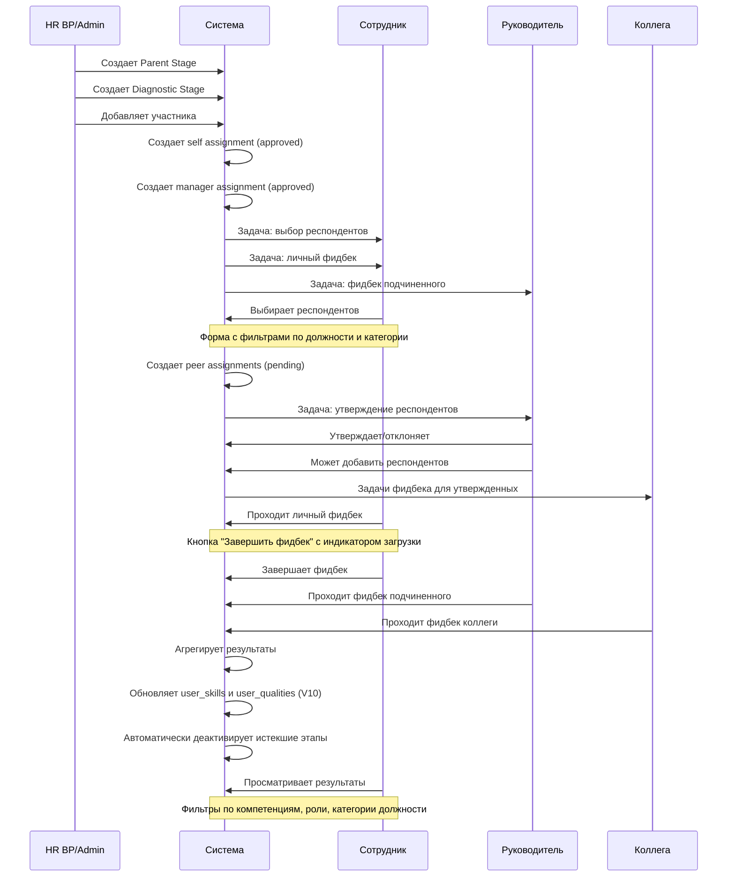
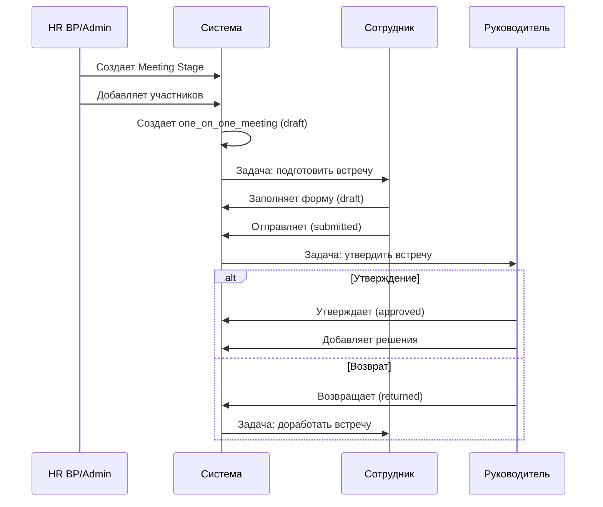
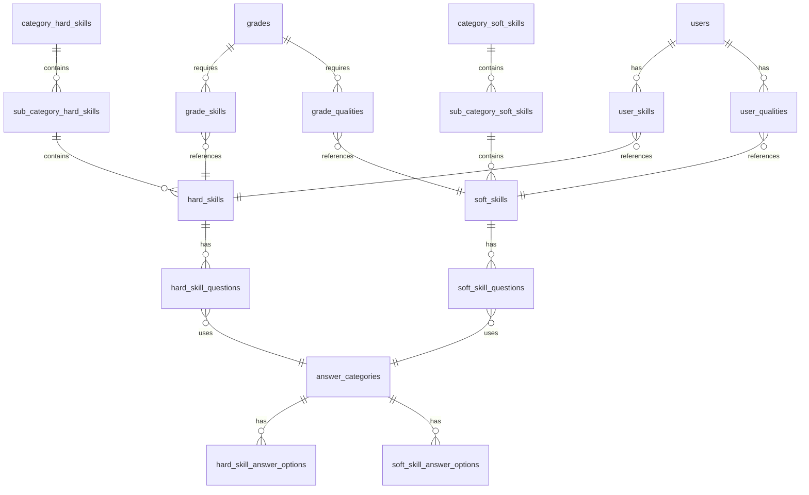
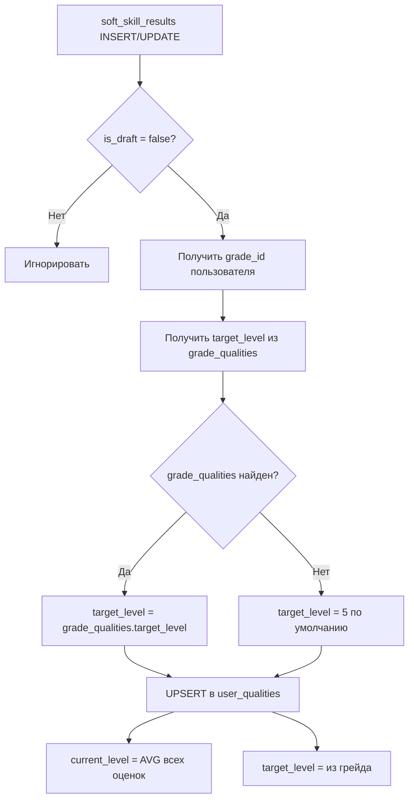

# АКТУАЛЬНАЯ ДОКУМЕНТАЦИЯ ПРОЕКТА V10

**Дата обновления:** 09.12.2025  
**Версия:** 10.0  
**Статус:** Актуальная

---

## Оглавление

1. [Общая структура проекта](#1-общая-структура-проекта)
2. [Система авторизации](#2-система-авторизации)
3. [Роли и разрешения](#3-роли-и-разрешения)
4. [Архитектура базы данных](#4-архитектура-базы-данных)
5. [Бизнес-логика диагностики](#5-бизнес-логика-диагностики)
6. [Шкалы оценки компетенций](#6-шкалы-оценки-компетенций)
7. [Расчет средних значений](#7-расчет-средних-значений)
8. [Триггеры обновления user_skills и user_qualities](#8-триггеры-обновления-user_skills-и-user_qualities)
9. [Визуализация результатов](#9-визуализация-результатов)
10. [Встречи 1:1](#10-встречи-11)
11. [Система задач](#11-система-задач)
12. [Импорт данных](#12-импорт-данных)
13. [Edge Functions](#13-edge-functions)
14. [UI/UX особенности](#14-uiux-особенности)
15. [Дизайн-система Milu](#15-дизайн-система-milu)
16. [RLS и безопасность](#16-rls-и-безопасность)
17. [Автоматизация этапов](#17-автоматизация-этапов)
18. [UML-диаграммы](#18-uml-диаграммы)

---

## 1. Общая структура проекта

### Технологический стек

**Фронтенд:**
- React 18.3.1 + TypeScript
- Vite (сборка)
- Tailwind CSS + shadcn/ui (дизайн-система)
- React Router DOM 6.30.1 (маршрутизация)
- TanStack Query 5.83.0 (управление состоянием и кэширование)
- Supabase JS Client 2.57.2 (работа с БД)

**Бэкенд:**
- Supabase (PostgreSQL + Auth + Edge Functions)
- Deno runtime для Edge Functions

**Интеграции:**
- Отсутствуют (шифрование PII удалено)

### Структура папок

```
src/
├── components/          # React компоненты
│   ├── ui/             # shadcn UI компоненты
│   ├── admin/          # Компоненты админ-панели
│   ├── analytics/      # Аналитические компоненты
│   ├── assessment/     # Компоненты оценки
│   ├── security/       # Компоненты безопасности
│   └── stages/         # Компоненты этапов
├── contexts/           # React контексты (AuthContext)
├── hooks/              # Кастомные хуки
├── integrations/       # Интеграции (Supabase)
│   └── supabase/
│       ├── client.ts   # Supabase клиент
│       └── types.ts    # Типы БД (auto-generated)
├── lib/                # Утилиты
├── pages/              # Страницы приложения
│   └── admin/          # Административные страницы
└── types/              # TypeScript типы
```

### Маршрутизация

**Публичные маршруты:**
- `/auth` - авторизация

**Защищенные маршруты:**
- `/` - главная страница (дашборд)
- `/profile` - профиль пользователя
- `/tasks` - мои задачи
- `/questionnaires` - опросники (обратная связь 360)
- `/assessment/:assignmentId` - прохождение оценки
- `/assessment/results/:stageId` - результаты диагностики
- `/meetings` - встречи 1:1
- `/career-track` - карьерный трек
- `/team` - моя команда (для руководителей)
- `/diagnostic-monitoring` - мониторинг диагностики
- `/manager-reports` - отчеты руководителя
- `/admin/*` - административные разделы
- `/security` - управление пользователями и ролями

---

## 2. Система авторизации

### Supabase Auth

**Метод авторизации:** Email + пароль

**Кастомная система сессий:**
- Таблица `admin_sessions` хранит активные сессии
- Срок действия сессии: 24 часа

### Обязательное согласие на cookies

При первом входе пользователя с `cookies_consent = false` отображается:
- Чекбокс согласия на cookies
- Ссылка на политику: http://milu.raketa.im/cookies-policy.html
- Кнопка "Войти" неактивна до согласия

**Поля в таблице users:**
```sql
cookies_consent BOOLEAN DEFAULT false,
cookies_consent_at TIMESTAMPTZ
```

### AuthContext

```typescript
interface AuthUser {
  id: string;
  full_name: string;
  email: string;
  role: 'admin' | 'hr_bp' | 'manager' | 'employee';
  permissions?: string[];
}
```

### Защита маршрутов

- `AuthGuard` - проверка авторизации
- `usePermission` - хук проверки прав
- RLS политики на уровне БД

---

## 3. Роли и разрешения

### Роли пользователей

| Роль | Код | Описание | Ключевые права |
|------|-----|----------|----------------|
| Сотрудник | `employee` | Базовая роль | Прохождение оценок, просмотр своих результатов, выбор респондентов |
| Руководитель | `manager` | Управление подчиненными | Оценка подчиненных, утверждение респондентов, добавление респондентов, просмотр результатов команды |
| HR BP | `hr_bp` | HR бизнес-партнер | Управление диагностикой, аналитика по компании, создание этапов, доступ к справочникам |
| Администратор | `admin` | Полный доступ | Управление справочниками, пользователями, ролями, всеми данными системы |

### Матрица прав доступа

#### Диагностика компетенций

| Действие | admin | hr_bp | manager | employee |
|----------|-------|-------|---------|----------|
| Создание этапа диагностики | ✅ | ✅ | ❌ | ❌ |
| Назначение участников | ✅ | ✅ | ❌ | ❌ |
| Прохождение самооценки | ✅ | ✅ | ✅ | ✅ |
| Обратная связь для подчиненных | ✅ | ✅ | ✅ | ❌ |
| Утверждение списка респондентов | ✅ | ✅ | ✅ | ❌ |
| Просмотр результатов (свои) | ✅ | ✅ | ✅ | ✅ |
| Просмотр результатов (команды) | ✅ | ✅ | ✅ | ❌ |
| Доступ к справочникам диагностики | ✅ | ✅ | ❌ | ❌ |
| Экспорт данных | ✅ | ✅ | ✅* | ❌ |

*Только для своих подчиненных

#### Видимость меню

| Пункт меню | admin | hr_bp | manager | employee |
|------------|-------|-------|---------|----------|
| Главная | ✅ | ✅ | ✅ | ✅ |
| Профиль | ✅ | ✅ | ✅ | ❌ |
| Мои задачи | ✅ | ✅ | ✅ | ✅ |
| Карьерный трек | ✅ | ✅ | ✅ | ✅* |
| Опросники | ✅ | ✅ | ✅ | ✅ |
| Встречи 1:1 | ✅ | ✅ | ✅ | ✅** |
| Моя команда | ✅ | ✅ | ✅ | ❌ |
| Мониторинг диагностики | ✅ | ✅ | ✅*** | ❌ |

*Только если `grade.level > 0`
**Только если участник `meeting_stage_participants`
***Только просмотр и экспорт по своим подчиненным, без доступа к справочникам

---

## 4. Архитектура базы данных

### Пользователи и организационная структура

#### users (без шифрования)
```sql
CREATE TABLE users (
  id UUID PRIMARY KEY,                     -- связь с auth.users
  email TEXT,                              -- plain text
  first_name TEXT,                         -- plain text
  last_name TEXT,                          -- plain text
  middle_name TEXT,                        -- plain text
  status BOOLEAN DEFAULT true,
  department_id UUID REFERENCES departments(id),
  position_id UUID REFERENCES positions(id),
  grade_id UUID REFERENCES grades(id),
  manager_id UUID REFERENCES users(id),
  hire_date DATE,
  last_login_at TIMESTAMPTZ,
  cookies_consent BOOLEAN DEFAULT false,
  cookies_consent_at TIMESTAMPTZ
);
```

**ВАЖНО:** Шифрование PII полностью удалено. Все данные хранятся в plain text.

#### Связанные таблицы
- `departments` - подразделения
- `positions` - должности
- `position_categories` - категории должностей
- `grades` - грейды
- `user_roles` - роли пользователей

### Компетенции и навыки

#### Иерархия Hard Skills
```
category_hard_skills
  └── sub_category_hard_skills
        └── hard_skills
```

#### Иерархия Soft Skills
```
category_soft_skills
  └── sub_category_soft_skills
        └── soft_skills
```

#### Требования грейдов

**grade_skills** - Hard Skills для грейда
```sql
CREATE TABLE grade_skills (
  id UUID PRIMARY KEY,
  grade_id UUID REFERENCES grades(id),
  skill_id UUID REFERENCES hard_skills(id),
  target_level NUMERIC  -- целевой уровень 0-4
);
```

**grade_qualities** - Soft Skills для грейда
```sql
CREATE TABLE grade_qualities (
  id UUID PRIMARY KEY,
  grade_id UUID REFERENCES grades(id),
  quality_id UUID REFERENCES soft_skills(id),
  target_level NUMERIC  -- целевой уровень 0-5
);
```

### Текущие уровни пользователя

#### user_skills
```sql
CREATE TABLE user_skills (
  id UUID PRIMARY KEY,
  user_id UUID REFERENCES users(id),
  skill_id UUID REFERENCES hard_skills(id),
  current_level NUMERIC,      -- текущий уровень (среднее из оценок)
  target_level NUMERIC,       -- целевой уровень из grade_skills
  last_assessed_at TIMESTAMPTZ,
  UNIQUE(user_id, skill_id)
);
```

#### user_qualities
```sql
CREATE TABLE user_qualities (
  id UUID PRIMARY KEY,
  user_id UUID REFERENCES users(id),
  quality_id UUID REFERENCES soft_skills(id),
  current_level NUMERIC,      -- текущий уровень (среднее из оценок)
  target_level NUMERIC,       -- целевой уровень из grade_qualities
  last_assessed_at TIMESTAMPTZ,
  UNIQUE(user_id, quality_id)
);
```

### Вопросы и ответы

#### answer_categories
```sql
CREATE TABLE answer_categories (
  id UUID PRIMARY KEY,
  name TEXT NOT NULL,
  description TEXT,
  question_type TEXT  -- 'hard', 'soft', 'both'
);
```

#### hard_skill_questions
```sql
CREATE TABLE hard_skill_questions (
  id UUID PRIMARY KEY,
  question_text TEXT NOT NULL,
  skill_id UUID REFERENCES hard_skills(id),
  answer_category_id UUID REFERENCES answer_categories(id),
  order_index INTEGER,
  visibility_restriction_enabled BOOLEAN DEFAULT false,
  visibility_restriction_type TEXT  -- 'self', 'manager', 'peer'
);
```

#### soft_skill_questions
```sql
CREATE TABLE soft_skill_questions (
  id UUID PRIMARY KEY,
  question_text TEXT NOT NULL,
  quality_id UUID REFERENCES soft_skills(id),
  answer_category_id UUID REFERENCES answer_categories(id),
  order_index INTEGER,
  behavioral_indicators TEXT,
  visibility_restriction_enabled BOOLEAN DEFAULT false,
  visibility_restriction_type TEXT  -- 'self', 'manager', 'peer'
);
```

**Логика visibility_restriction:**
- `visibility_restriction_enabled = false` - вопрос виден всем
- `visibility_restriction_enabled = true` + `visibility_restriction_type = 'peer'` - вопрос **скрыт** от коллег
- `visibility_restriction_enabled = true` + `visibility_restriction_type = 'self'` - вопрос **скрыт** при самооценке
- `visibility_restriction_enabled = true` + `visibility_restriction_type = 'manager'` - вопрос **скрыт** от руководителя

#### hard_skill_answer_options
```sql
CREATE TABLE hard_skill_answer_options (
  id UUID PRIMARY KEY,
  answer_category_id UUID REFERENCES answer_categories(id),
  title TEXT NOT NULL,            -- основной текст
  description TEXT,
  numeric_value INTEGER,
  level_value INTEGER,            -- 0-4 для Hard Skills
  order_index INTEGER
);
```

#### soft_skill_answer_options
```sql
CREATE TABLE soft_skill_answer_options (
  id UUID PRIMARY KEY,
  answer_category_id UUID REFERENCES answer_categories(id),
  title TEXT NOT NULL,            -- основной текст
  description TEXT,
  numeric_value INTEGER,
  level_value INTEGER,            -- 0-5 для Soft Skills
  order_index INTEGER
);
```

### Диагностика и оценка

#### parent_stages
```sql
CREATE TABLE parent_stages (
  id UUID PRIMARY KEY,
  period TEXT NOT NULL,           -- 'H1 2024', 'H2 2024'
  start_date DATE NOT NULL,
  end_date DATE NOT NULL,
  deadline_date DATE NOT NULL,
  is_active BOOLEAN DEFAULT true,
  created_by UUID REFERENCES users(id)
);
```

#### diagnostic_stages
```sql
CREATE TABLE diagnostic_stages (
  id UUID PRIMARY KEY,
  parent_id UUID REFERENCES parent_stages(id),
  status TEXT DEFAULT 'setup',    -- 'setup', 'active', 'completed'
  evaluation_period TEXT,
  is_active BOOLEAN DEFAULT true,
  progress_percent NUMERIC,
  created_by UUID REFERENCES users(id)
);
```

#### survey_360_assignments
```sql
CREATE TABLE survey_360_assignments (
  id UUID PRIMARY KEY,
  evaluated_user_id UUID REFERENCES users(id),
  evaluating_user_id UUID REFERENCES users(id),
  diagnostic_stage_id UUID REFERENCES diagnostic_stages(id),
  assignment_type TEXT,           -- 'self', 'manager', 'peer'
  status TEXT DEFAULT 'pending',  -- 'pending', 'approved', 'rejected', 'completed'
  added_by_manager BOOLEAN DEFAULT false,
  is_manager_participant BOOLEAN DEFAULT false,
  approved_by UUID REFERENCES users(id),
  approved_at TIMESTAMPTZ,
  rejected_at TIMESTAMPTZ,
  rejection_reason TEXT,
  UNIQUE(evaluated_user_id, evaluating_user_id, diagnostic_stage_id)
);
```

#### hard_skill_results / soft_skill_results
```sql
CREATE TABLE hard_skill_results (
  id UUID PRIMARY KEY,
  evaluated_user_id UUID REFERENCES users(id),
  evaluating_user_id UUID REFERENCES users(id),
  question_id UUID REFERENCES hard_skill_questions(id),
  answer_option_id UUID REFERENCES hard_skill_answer_options(id),
  assignment_id UUID REFERENCES survey_360_assignments(id),
  diagnostic_stage_id UUID REFERENCES diagnostic_stages(id),
  evaluation_period TEXT,
  is_draft BOOLEAN DEFAULT true,
  is_skip BOOLEAN DEFAULT false,
  comment TEXT,
  is_anonymous_comment BOOLEAN DEFAULT false,
  UNIQUE(evaluated_user_id, evaluating_user_id, question_id)
);
```

**Логика is_skip:**
- `is_skip = true` - вопрос пропущен ("Не могу ответить")
- При пропуске: `answer_option_id` сохраняется с `numeric_value = 0`
- Пропущенные ответы **исключаются** из расчетов средних
- В детализации отображается как "Не оценено"
- В Excel экспорте - "Не могу ответить"

**Обработка конфликтов:**
```sql
-- UPSERT вместо DELETE+INSERT
ON CONFLICT (evaluated_user_id, evaluating_user_id, question_id)
DO UPDATE SET ...
```

---

## 5. Бизнес-логика диагностики

### Терминология

| Термин | Описание |
|--------|----------|
| Фидбек | Обратная связь (вместо "оценка") |
| Респонденты | Те, кто дает фидбек (вместо "оценивающие") |
| Обратная связь 360 | Полный цикл оценки (вместо "Оценка 360°") |
| Личный фидбек | Самооценка |
| Фидбек unit-лида | Оценка от руководителя |
| Обратная связь от коллег | Peer feedback |

### Этапы диагностики

#### 1. Создание Parent Stage и Diagnostic Stage
**Кто:** HR BP или Admin

#### 2. Добавление участников
**Триггер:** `assign_surveys_to_diagnostic_participant_trigger`

При добавлении участника автоматически создаются:
- Self assignment (status = 'approved')
- Manager assignment (status = 'approved')
- Task `peer_selection` для сотрудника
- Task `survey_360_evaluation` для самооценки
- Task `survey_360_evaluation` для руководителя

#### 3. Выбор респондентов сотрудником

**Форма выбора включает:**
- Поиск по ФИО и email
- Фильтр по должности
- Фильтр по категории должности
- Отображение позиции и категории позиции каждого кандидата

**Доступные для выбора:**
- Все активные пользователи компании с ролями `employee` и `manager`
- **Исключения:** себя, своего руководителя, `hr_bp`, `admin`

#### 4. Утверждение респондентов руководителем

**Действия руководителя:**
- Утвердить респондента → создается task `survey_360_evaluation`
- Отклонить респондента (без комментария)
- Добавить дополнительного респондента (`added_by_manager = true`)

#### 5. Прохождение оценки

**Кнопка завершения:**
- Активна только когда ВСЕ вопросы отвечены или пропущены
- Последний вопрос: "Завершить фидбек" (вместо "Следующий")
- Индикатор загрузки "Сохранение..." при отправке

**Пропуск вопроса:**
- Кнопка "Не могу ответить" (скрыта в UI, но доступна в логике)
- Сохраняется с `numeric_value = 0`, `is_skip = false`
- В пагинации - зеленый стиль с символом "–"

### Анонимность комментариев

- **Личный фидбек (self):** НЕ анонимны
- **Фидбек unit-лида (manager):** НЕ анонимны
- **Обратная связь от коллег (peer):** АНОНИМНЫ

### Экспорт диагностики

**ФИО оценивающего:** Всегда отображается в экспорте, даже при анонимном комментарии. Анонимность касается только комментариев в UI, не идентификации оценивающего в отчетах.

---

## 6. Шкалы оценки компетенций

### Hard Skills: 0-4

| Уровень | Описание |
|---------|----------|
| 0 | Навык не применяется |
| 1 | Навык применяется с поддержкой |
| 2 | Навык применяется самостоятельно |
| 3 | Навык применяется уверенно |
| 4 | Навык применяется на экспертном уровне |

**Целевой уровень грейда:** до 4

### Soft Skills: 0-5

| Уровень | Описание |
|---------|----------|
| 0 | Качество не проявляется |
| 1 | Качество проявляется редко |
| 2 | Качество проявляется иногда |
| 3 | Качество проявляется часто |
| 4 | Качество проявляется почти всегда |
| 5 | Качество проявляется всегда |

**Целевой уровень грейда:** до 5

### Применение в коде

```typescript
// Динамическое определение максимума
const maxValue = filterType.includes('hard') ? 4 : 5;
```

---

## 7. Расчет средних значений

### Правильная модель

#### Среднее по навыку
```
среднее_по_навыку = сумма_всех_оценок_навыка / количество_оценок_навыка
```

#### Среднее по группе навыков
```
среднее_по_группе = сумма_ВСЕХ_оценок_группы / количество_ВСЕХ_оценок_группы
```

**ВАЖНО:** НЕ усредняем средние навыков!

### Правила расчета

1. **Только финальные оценки:** `is_draft = false`
2. **Исключаем пропуски:** `is_skip = false` или `is_skip IS NULL`
3. **Прямое усреднение:** суммируем все level_value, делим на количество
4. **Округление:** до сотых `ROUND(AVG(...), 2)`
5. **Подсчет респондентов:** уникальные `evaluating_user_id`, не количество оценок

### Пример SQL

```sql
-- Среднее по категории Hard Skills
SELECT 
  c.id as category_id,
  AVG(ao.level_value) as category_average,
  COUNT(DISTINCT hsr.evaluating_user_id) as respondent_count
FROM hard_skill_results hsr
JOIN hard_skill_answer_options ao ON ao.id = hsr.answer_option_id
JOIN hard_skill_questions q ON q.id = hsr.question_id
JOIN hard_skills s ON s.id = q.skill_id
JOIN category_hard_skills c ON c.id = s.category_id
WHERE hsr.evaluated_user_id = :user_id
  AND hsr.is_draft = false
  AND (hsr.is_skip = false OR hsr.is_skip IS NULL)
GROUP BY c.id;
```

---

## 8. Триггеры обновления user_skills и user_qualities

### update_user_skills_from_survey

**Срабатывает:** AFTER INSERT OR UPDATE на `hard_skill_results`

**Условие:** `is_draft = false`

**Логика V10:**
1. Получает `grade_id` пользователя из таблицы `users`
2. Получает `target_level` из `grade_skills` для навыка и грейда
3. Записывает/обновляет `user_skills`:
   - `current_level` = AVG всех оценок по навыку
   - `target_level` = значение из `grade_skills` (или 4 по умолчанию)

```sql
CREATE OR REPLACE FUNCTION public.update_user_skills_from_survey()
RETURNS trigger AS $$
BEGIN
  IF NEW.is_draft = false THEN
    -- current_level = AVG всех ответов
    -- target_level = grade_skills.target_level (из грейда пользователя)
    INSERT INTO user_skills (user_id, skill_id, current_level, target_level, last_assessed_at)
    SELECT ...
    ON CONFLICT (user_id, skill_id) 
    DO UPDATE SET 
      current_level = (SELECT AVG(ao.numeric_value) ...),
      target_level = COALESCE(v_target_level, user_skills.target_level);
  END IF;
  RETURN NEW;
END;
$$ LANGUAGE plpgsql;
```

### update_user_qualities_from_survey (V10 - исправлен)

**Срабатывает:** AFTER INSERT OR UPDATE на `soft_skill_results`

**Условие:** `is_draft = false`

**Логика V10 (исправлена):**

1. Получает `grade_id` пользователя из таблицы `users`
2. Получает `target_level` из `grade_qualities` для качества и грейда пользователя
3. Записывает/обновляет `user_qualities`:
   - `current_level` = AVG всех оценок по качеству
   - `target_level` = значение из `grade_qualities` (или 5 по умолчанию)

```sql
CREATE OR REPLACE FUNCTION public.update_user_qualities_from_survey()
RETURNS trigger AS $$
DECLARE
  v_grade_id UUID;
  v_target_level NUMERIC;
BEGIN
  IF NEW.is_draft = false THEN
    -- Получаем grade_id пользователя
    SELECT grade_id INTO v_grade_id
    FROM users
    WHERE id = NEW.evaluated_user_id;
    
    -- Получаем target_level из grade_qualities (НЕ numeric_value + 1!)
    SELECT gq.target_level INTO v_target_level
    FROM soft_skill_questions sq
    JOIN grade_qualities gq ON gq.quality_id = sq.quality_id AND gq.grade_id = v_grade_id
    WHERE sq.id = NEW.question_id
      AND sq.quality_id IS NOT NULL;
    
    INSERT INTO user_qualities (user_id, quality_id, current_level, target_level, last_assessed_at)
    SELECT 
      NEW.evaluated_user_id,
      sq.quality_id,
      ao.numeric_value,
      COALESCE(v_target_level, 5),  -- Из грейда или 5 по умолчанию
      NEW.created_at
    FROM soft_skill_questions sq
    JOIN soft_skill_answer_options ao ON ao.id = NEW.answer_option_id
    WHERE sq.id = NEW.question_id 
      AND sq.quality_id IS NOT NULL
    ON CONFLICT (user_id, quality_id) 
    DO UPDATE SET 
      current_level = (
        SELECT AVG(ao.numeric_value)
        FROM soft_skill_results sr
        JOIN soft_skill_answer_options ao ON ao.id = sr.answer_option_id
        JOIN soft_skill_questions sq ON sq.id = sr.question_id
        WHERE sr.evaluated_user_id = NEW.evaluated_user_id 
          AND sq.quality_id = user_qualities.quality_id
          AND sr.is_draft = false
      ),
      target_level = COALESCE(v_target_level, user_qualities.target_level),
      last_assessed_at = NEW.created_at,
      updated_at = now();
  END IF;
  
  RETURN NEW;
END;
$$ LANGUAGE plpgsql;
```

**ВАЖНО V10:** 

Исправлена ошибка предыдущих версий:
- **Было (неправильно):** `target_level = LEAST(ao.numeric_value + 1, 5)` — вычислялось как текущий уровень + 1
- **Стало (правильно):** `target_level = grade_qualities.target_level` — берется из требований грейда

---

## 9. Визуализация результатов

### Страница результатов

**URL:** `/assessment/results/:diagnosticStageId`

### Фильтры

#### Фильтр компетенций
- Hard Skills (навыки)
- Hard Skills категории
- Hard Skills подкатегории
- Soft Skills (качества)
- Soft Skills категории
- Soft Skills подкатегории

#### Фильтр по роли респондента
- Все
- Личный фидбек (self)
- Фидбек unit-лида (manager)
- Коллеги (peer)

#### Фильтр по категории должности
- Все
- [Динамически из position_categories]

### Динамические заголовки

| Уровень фильтра | Заголовок |
|-----------------|-----------|
| Hard/Soft skills | "Роза навыков", "Детализация по навыкам" |
| Hard/Soft categories | "Роза компетенций", "Детализация по компетенциям" |
| Hard/Soft subcategories | "Роза подкомпетенций", "Детализация по подкомпетенциям" |

### Компоненты визуализации

#### Роза компетенций (RadarChart)
- Динамическая шкала на основе типа (0-4 для Hard, 0-5 для Soft)
- Tick marks на каждом уровне
- Фильтрация по выбранным компетенциям

#### Горизонтальные диаграммы
- Нижняя шкала X от 0 до max
- Легенда с количеством респондентов
- **Без средней оценки коллег** (отображается только в розе)

**Формат легенды:**
```
Личный фидбек (1)
Фидбек unit-лида (1)
Все, кроме фидбека сотрудника (N+1)
Все (N+2)
```

#### Детализация результатов

При фильтре категорий/подкатегорий:
- Группировка по категориям
- Горизонтальные диаграммы для каждой категории

При фильтре навыков:
- Плоский список без группировки

**Метки в таблице:**
- Коллеги отображаются только по категории должности (без префикса "Коллеги")
- Пример: "Заказчик (внешний)" вместо "Коллеги (Заказчик (внешний))"

### Обработка пустых данных

При отсутствии данных для выбранного фильтра:
- Страница остается на `/assessment/results/`
- Отображается "Нет данных для отображения" во всех блоках
- НЕ происходит редирект на страницу ошибки

---

## 10. Встречи 1:1

### Структура

```
parent_stages
  └── meeting_stages
        └── meeting_stage_participants
              └── one_on_one_meetings
                    └── meeting_decisions
```

### Статусы встречи

- `draft` - черновик
- `submitted` - отправлено на утверждение
- `approved` - утверждено
- `returned` - возвращено на доработку

### Процесс

1. HR BP создает Meeting Stage
2. Добавляет участников
3. Триггер создает one_on_one_meeting и задачу для сотрудника
4. Сотрудник заполняет форму
5. Отправляет на утверждение
6. Руководитель утверждает или возвращает
7. При утверждении - фиксация решений

### Поля формы встречи

- Дата встречи
- Цель и повестка
- Разбор предыдущих решений
- Что прибавило энергии
- Что отняло энергию
- Что мешает (stoppers)
- Комментарий руководителя

---

## 11. Система задач

### Типы задач

| Тип | Описание | Исполнитель |
|-----|----------|-------------|
| `peer_selection` | Выбор респондентов | Сотрудник |
| `peer_approval` | Утверждение респондентов | Руководитель |
| `survey_360_evaluation` | Прохождение фидбека | Оценивающий |
| `meeting` | Подготовка встречи 1:1 | Сотрудник |
| `meeting_approval` | Утверждение встречи | Руководитель |
| `development` | Задача развития | Сотрудник |

### Статусы задач

- `pending` - ожидает выполнения
- `in_progress` - в процессе
- `completed` - завершена

### Контекстные кнопки действий

| Тип задачи | Текст кнопки |
|------------|--------------|
| self assessment (новая) | "Начать опрос 'Обратная связь 360' по себе" |
| self assessment (draft) | "Продолжить личный фидбек" |
| peer evaluation (новая) | "Дать фидбек коллеге" |
| peer evaluation (draft) | "Продолжить фидбек коллеги" |
| manager evaluation (новая) | "Пройти фидбек подчиненного" |
| manager evaluation (draft) | "Продолжить фидбек подчиненного" |
| peer_selection | "Выбрать респондентов" |
| peer_approval | "Утвердить респондентов" |

### Различие в описании задач

| Тип | Описание |
|-----|----------|
| Manager evaluation | "Обратная связь для сотрудника: [ФИО]", "Необходимо заполнить форму обратной связи для **вашего** сотрудника [ФИО]" |
| Peer evaluation | "Обратная связь для коллеги: [ФИО]", "Необходимо заполнить форму обратной связи для [ФИО]" |

### Размер кнопок

Компактный размер, соответствующий кнопке "Выбрать респондентов":
- Иконка + текст
- Не full-width

### Видимость кнопок

Кнопки остаются видимыми до полного завершения действия:
- "Пройти личный фидбек" - до отправки всей формы
- "Выбрать респондентов" - до отправки списка
- "Утвердить респондентов" - до полного утверждения списка

---

## 12. Импорт данных

### Импорт вопросов и ответов

**Страница:** `/admin/diagnostics` → вкладка "Импорт"

**Структура Excel (2 листа):**
- Лист `question` - вопросы
- Лист `answer` - варианты ответов

**Колонки листа вопросов:**
- Категория
- Подкатегория
- Навык/Качество
- Текст вопроса
- Поведенческие индикаторы (для Soft Skills)
- Порядок

**Колонки листа ответов:**
- Категория ответов
- Текст варианта
- Описание
- Числовое значение
- Уровень (level_value)
- Порядок

**Валидация уровней:**
- Hard Skills: 0-4
- Soft Skills: 0-5

**Нормализация данных:**
- Автоматический trim пробелов в названиях колонок и значениях

**Атомарность:** транзакция с полным откатом при ошибке

### Импорт грейдов

**Колонки:**
- Грейд
- Тип (Hard/Soft)
- Категория
- Подкатегория
- Навык
- Описание навыка
- Требуемый уровень
- Обязательность

### Импорт пользователей (без шифрования)

**Страница:** `/security` → кнопка "Импорт"

**Колонки:**
- Фамилия
- Имя
- Отчество
- email
- Должность
- Password
- Грейд
- Роль

**Обработка:**
- Валидация существования роли/должности/грейда
- **Без шифрования PII** - данные сохраняются в plain text
- Хеширование пароля
- Отчет об успехах/ошибках

### Очистка данных диагностики

**Порядок удаления (для соблюдения FK):**
1. hard_skill_results, soft_skill_results
2. hard_skill_questions, soft_skill_questions
3. hard_skill_answer_options, soft_skill_answer_options
4. answer_categories
5. hard_skills, soft_skills
6. sub_category_hard_skills, sub_category_soft_skills
7. category_hard_skills, category_soft_skills

---

## 13. Edge Functions

### Список функций

| Функция | Назначение |
|---------|------------|
| `create-user` | Создание пользователя (без шифрования) |
| `update-user` | Обновление пользователя |
| `delete-user` | Деактивация пользователя |
| `create-admin` | Создание администратора |
| `create-peer-approval-task` | Создание задачи утверждения респондентов |
| `create-peer-evaluation-tasks` | Создание задач фидбека |
| `create-peer-selection-task-on-participant-add` | Создание задачи выбора респондентов |
| `generate-development-tasks` | Генерация задач развития на основе GAP |
| `import-diagnostics-data` | Атомарный импорт диагностических данных |
| `import-grades-data` | Импорт данных грейдов |
| `create-database-dump` | Создание дампа БД |

### Особенности

**JWT верификация:**
- `verify_jwt = true` в supabase/config.toml
- Автоматическая проверка Authorization header

**RLS для service_role:**
```sql
CREATE POLICY "service_role_full_access" 
ON table_name
FOR ALL TO service_role
USING (true) WITH CHECK (true);
```

**Обработка ошибок RPC:**
```typescript
// Правильно
const { data, error } = await supabaseAdmin.rpc("function_name", {...});
if (error) { /* handle error */ }

// НЕПРАВИЛЬНО - .catch() не работает в Deno
await supabaseAdmin.rpc("...").catch(...);
```

---

## 14. UI/UX особенности

### Плоская структура сайдбара

Меню без группирующих заголовков (убраны "Основное", "Мое развитие", "Управление"):
- Главная
- Профиль (кроме employee)
- Мои задачи
- Карьерный трек (условно)
- Опросники
- Встречи 1:1 (условно)
- Моя команда (не для employee)
- Мониторинг диагностики (не для employee)

### Сайдбар

- Текст белого цвета на navy фоне
- Логотип: текст "MILU" (развернутый) или "M" (свернутый), без иконки
- Toggle кнопка внутри header сайдбара

### Breadcrumbs

Убрана секция "Мое развитие" из путей:
- `/questionnaires` → "Опросники"
- `/career-track` → "Карьерный трек"

### Единая кнопка в форме оценки

Одна кнопка CTA, меняющая текст:
- "Следующий" для всех вопросов кроме последнего
- "Завершить фидбек" для последнего вопроса
- Индикатор "Сохранение..." при отправке

Активна только при выбранном ответе или пропуске текущего вопроса.

### Навигация в форме оценки

Флаг состояния предотвращает множественные клики на "Следующий"/"Предыдущий".

### Пагинация вопросов

| Состояние | Стиль |
|-----------|-------|
| Не отвечен | Серая граница |
| Отвечен | Зеленая граница, светло-зеленый фон |
| Пропущен | Зеленая граница, светло-зеленый фон, символ "–" |

### Отображение deadline в форме оценки

Упрощенный формат: только "до [deadline_date]" без полного диапазона дат и названия этапа.

### Quick Actions на главной

- "Команда" - иконка Users
- "Обратная связь 360" - иконка ClipboardList

### Вложенная структура вкладок в справочниках диагностики

```
/admin/diagnostics
├── Hard Skills
│   ├── Категории
│   ├── Подкатегории
│   └── Навыки
├── Soft Skills
│   ├── Категории
│   ├── Подкатегории
│   └── Качества
├── Вопросы и ответы
└── Импорт
```

---

## 15. Дизайн-система Milu

### Цветовая палитра

**Brand Colors:**
- Primary: Navy blue gradient
- Accent: Teal

**Semantic Colors:**
- Background, Foreground
- Muted, Muted Foreground
- Card, Card Foreground
- Primary, Primary Foreground
- Secondary, Secondary Foreground
- Accent, Accent Foreground
- Destructive

**Status Colors:**
- Success (green)
- Warning (amber)
- Error (red)
- Info (blue)

### Компоненты

**Кнопки:**
- Новый вариант `teal` для акцентных действий
- Консистентные размеры и отступы

**Badges:**
- Варианты: default, success, warning, teal, navy, outline

**Cards:**
- Единый стиль с shadows
- Консистентные border-radius

**Сайдбар:**
- Navy gradient background
- Белый текст
- Toggle кнопка в header

### Токены CSS

```css
--background: hsl(...);
--foreground: hsl(...);
--primary: hsl(...);
--primary-foreground: hsl(...);
--secondary: hsl(...);
--accent: hsl(...);
--muted: hsl(...);
--card: hsl(...);
--border: hsl(...);
--ring: hsl(...);
```

### Страница авторизации

- Без логотипа/иконки в форме
- Cookie consent banner
- Стилизация в соответствии с дизайн-системой Milu

---

## 16. RLS и безопасность

### Ключевые политики

#### users
```sql
-- Просмотр для выбора респондентов
CREATE POLICY "users_can_view_for_peer_selection" ON users
FOR SELECT USING (
  status = true 
  AND EXISTS (SELECT 1 FROM user_roles ur WHERE ur.user_id = users.id AND ur.role IN ('employee', 'manager'))
  AND EXISTS (SELECT 1 FROM diagnostic_stage_participants dsp WHERE dsp.user_id = auth.uid())
);
```

#### survey_360_assignments
```sql
-- INSERT для руководителей (добавление респондентов)
CREATE POLICY "managers_can_add_respondents" ON survey_360_assignments
FOR INSERT WITH CHECK (
  EXISTS (
    SELECT 1 FROM users u 
    WHERE u.id = evaluated_user_id 
    AND u.manager_id = auth.uid()
  )
);
```

### Предотвращение циклических зависимостей

Использование SECURITY DEFINER функций:
```sql
CREATE FUNCTION is_evaluated_peer(_evaluator_id uuid, _evaluated_id uuid)
RETURNS BOOLEAN
SECURITY DEFINER
AS $$
  SELECT EXISTS (
    SELECT 1 FROM survey_360_assignments
    WHERE evaluating_user_id = _evaluator_id
    AND evaluated_user_id = _evaluated_id
  );
$$ LANGUAGE sql STABLE;
```

### PII

**Шифрование удалено.** Все данные хранятся в plain text:
- email
- first_name
- last_name
- middle_name

---

## 17. Автоматизация этапов

### Автоматическая деактивация этапов

**Функция:** `check_and_deactivate_expired_stages()`

**Логика:**
1. При загрузке данных вызывается RPC функция
2. Сравнивается `deadline_date` с серверным временем
3. Если `deadline_date < NOW()`, устанавливается `is_active = false`

**Применяется к:**
- `parent_stages`
- `diagnostic_stages`

### Отображение статуса подэтапов

| Статус | Badge |
|--------|-------|
| `is_active = true` | "Активен" (зеленый) |
| `is_active = false` | "Завершен" (серый) |

---

## 18. UML-диаграммы

### Флоу диагностики



### Флоу встреч 1:1



### Схема данных компетенций



### Флоу обновления user_qualities (V10)



---

## Изменения V10

### Ключевые обновления:

1. **Исправлен триггер update_user_qualities_from_survey:**
   - **Было (неправильно):** `target_level = LEAST(numeric_value + 1, 5)` — вычислялось как текущий уровень + 1
   - **Стало (правильно):** `target_level = grade_qualities.target_level` — берется из требований грейда пользователя
   - Обновлены все существующие записи в `user_qualities` с корректными значениями `target_level`

2. **Документирование таблиц user_skills и user_qualities:**
   - Добавлены описания структур таблиц
   - Документирована логика триггеров обновления
   - Добавлена UML-диаграмма флоу обновления

3. **Добавлен раздел "Триггеры обновления user_skills и user_qualities":**
   - Полное описание логики триггеров
   - SQL-код с комментариями
   - Объяснение исправления ошибки V9

4. **Обновлена схема данных компетенций:**
   - Добавлены связи user_skills и user_qualities с users и skills/qualities

### Миграции V10:

```sql
-- 1. Исправление триггера update_user_qualities_from_survey
-- target_level теперь берется из grade_qualities, а не вычисляется как numeric_value + 1

-- 2. Обновление существующих записей user_qualities
UPDATE user_qualities
SET target_level = grade_qualities.target_level
FROM users, grade_qualities
WHERE user_qualities.user_id = users.id
  AND grade_qualities.grade_id = users.grade_id
  AND grade_qualities.quality_id = user_qualities.quality_id;
```
