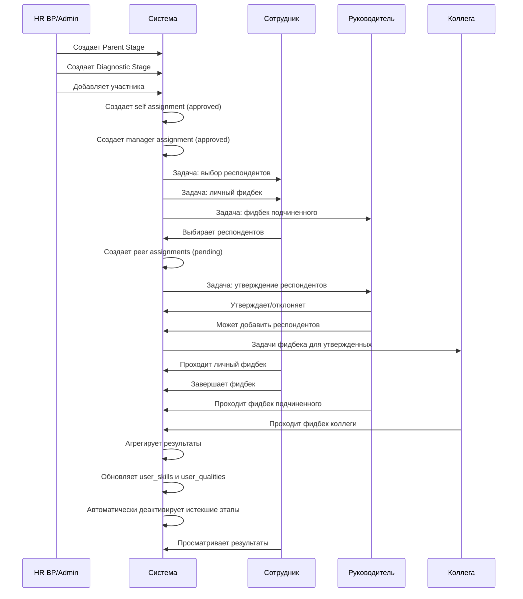
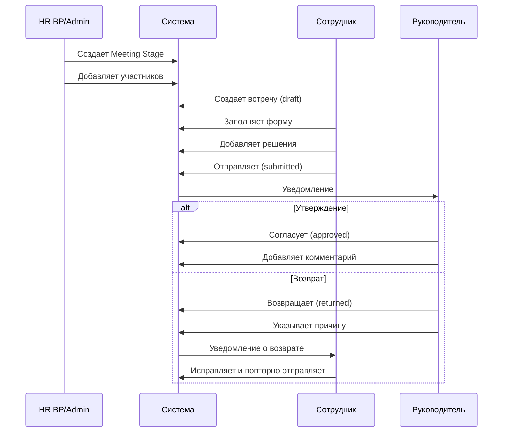
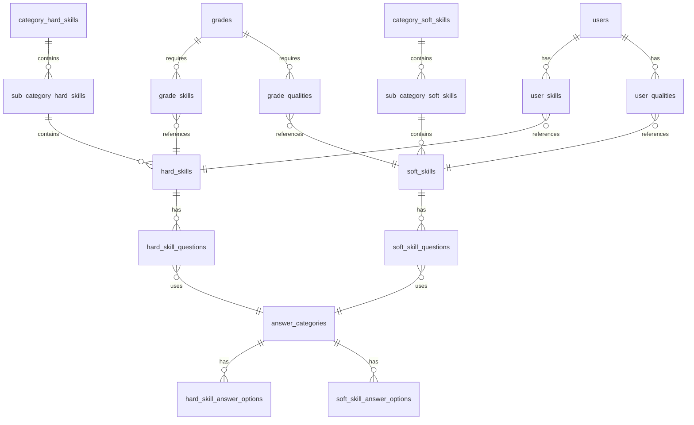

# АКТУАЛЬНАЯ ДОКУМЕНТАЦИЯ ПРОЕКТА V11

**Дата обновления:** 14.01.2025  
**Версия:** 11.0  
**Статус:** Актуальная

---

## Оглавление

1. [Общая структура проекта](#1-общая-структура-проекта)
2. [Система авторизации](#2-система-авторизации)
3. [Роли и разрешения](#3-роли-и-разрешения)
4. [Архитектура базы данных](#4-архитектура-базы-данных)
5. [Бизнес-логика диагностики](#5-бизнес-логика-диагностики)
6. [Полный флоу диагностики компетенций](#6-полный-флоу-диагностики-компетенций)
7. [Полный флоу встреч 1:1](#7-полный-флоу-встреч-11)
8. [Шкалы оценки компетенций](#8-шкалы-оценки-компетенций)
9. [Расчет средних значений](#9-расчет-средних-значений)
10. [Триггеры обновления user_skills и user_qualities](#10-триггеры-обновления-user_skills-и-user_qualities)
11. [Визуализация результатов](#11-визуализация-результатов)
12. [Система задач](#12-система-задач)
13. [Импорт данных](#13-импорт-данных)
14. [Edge Functions](#14-edge-functions)
15. [UI/UX особенности](#15-uiux-особенности)
16. [Дизайн-система Milu](#16-дизайн-система-milu)
17. [RLS и безопасность](#17-rls-и-безопасность)
18. [Автоматизация этапов](#18-автоматизация-этапов)
19. [UML-диаграммы](#19-uml-диаграммы)

---

## 1. Общая структура проекта

### Технологический стек

**Фронтенд:**
- React 18.3.1 + TypeScript
- Vite (сборка)
- Tailwind CSS + shadcn/ui (дизайн-система)
- React Router DOM 6.30.1 (маршрутизация)
- TanStack Query 5.83.0 (управление состоянием и кэширование)
- Supabase JS Client 2.57.2 (работа с БД)

**Бэкенд:**
- Supabase (PostgreSQL + Auth + Edge Functions)
- Deno runtime для Edge Functions

**Интеграции:**
- Отсутствуют (шифрование PII удалено)

### Структура папок

```
src/
├── components/          # React компоненты
│   ├── ui/             # shadcn UI компоненты
│   ├── admin/          # Компоненты админ-панели
│   ├── analytics/      # Аналитические компоненты
│   ├── assessment/     # Компоненты оценки
│   ├── security/       # Компоненты безопасности
│   └── stages/         # Компоненты этапов
├── contexts/           # React контексты (AuthContext)
├── hooks/              # Кастомные хуки
├── integrations/       # Интеграции (Supabase)
│   └── supabase/
│       ├── client.ts   # Supabase клиент
│       └── types.ts    # Типы БД (auto-generated)
├── lib/                # Утилиты
├── pages/              # Страницы приложения
│   └── admin/          # Административные страницы
└── types/              # TypeScript типы
```

### Маршрутизация

**Публичные маршруты:**
- `/auth` - авторизация

**Защищенные маршруты:**
- `/` - главная страница (дашборд)
- `/profile` - профиль пользователя
- `/tasks` - мои задачи
- `/questionnaires` - опросники (обратная связь 360)
- `/assessment/:assignmentId` - прохождение оценки
- `/assessment/results/:stageId` - результаты диагностики
- `/meetings` - встречи 1:1
- `/career-track` - карьерный трек
- `/team` - моя команда (для руководителей)
- `/diagnostic-monitoring` - мониторинг диагностики
- `/manager-reports` - отчеты руководителя
- `/admin/*` - административные разделы
- `/security` - управление пользователями и ролями

---

## 2. Система авторизации

### Supabase Auth

**Метод авторизации:** Email + пароль

**Кастомная система сессий:**
- Таблица `admin_sessions` хранит активные сессии
- Срок действия сессии: 24 часа

### Обязательное согласие на cookies

При первом входе пользователя с `cookies_consent = false` отображается:
- Чекбокс согласия на cookies
- Ссылка на политику: http://milu.raketa.im/cookies-policy.html
- Кнопка "Войти" неактивна до согласия

**Поля в таблице users:**
```sql
cookies_consent BOOLEAN DEFAULT false,
cookies_consent_at TIMESTAMPTZ
```

### AuthContext

```typescript
interface AuthUser {
  id: string;
  full_name: string;
  email: string;
  role: 'admin' | 'hr_bp' | 'manager' | 'employee';
  permissions?: string[];
}
```

### Защита маршрутов

- `AuthGuard` - проверка авторизации
- `usePermission` - хук проверки прав
- RLS политики на уровне БД

---

## 3. Роли и разрешения

### Роли пользователей

| Роль | Код | Описание | Ключевые права |
|------|-----|----------|----------------|
| Сотрудник | `employee` | Базовая роль | Прохождение оценок, просмотр своих результатов, выбор респондентов |
| Руководитель | `manager` | Управление подчиненными | Оценка подчиненных, утверждение респондентов, добавление респондентов, просмотр результатов команды |
| HR BP | `hr_bp` | HR бизнес-партнер | Управление диагностикой, аналитика по компании, создание этапов, доступ к справочникам |
| Администратор | `admin` | Полный доступ | Управление справочниками, пользователями, ролями, всеми данными системы |

### Матрица прав доступа

#### Диагностика компетенций

| Действие | admin | hr_bp | manager | employee |
|----------|-------|-------|---------|----------|
| Создание этапа диагностики | ✅ | ✅ | ❌ | ❌ |
| Назначение участников | ✅ | ✅ | ❌ | ❌ |
| Прохождение самооценки | ✅ | ✅ | ✅ | ✅ |
| Обратная связь для подчиненных | ✅ | ✅ | ✅ | ❌ |
| Утверждение списка респондентов | ✅ | ✅ | ✅ | ❌ |
| Просмотр результатов (свои) | ✅ | ✅ | ✅ | ✅ |
| Просмотр результатов (команды) | ✅ | ✅ | ✅ | ❌ |
| Доступ к справочникам диагностики | ✅ | ✅ | ❌ | ❌ |
| Экспорт данных | ✅ | ✅ | ✅* | ❌ |

*Только для своих подчиненных

#### Видимость меню

| Пункт меню | admin | hr_bp | manager | employee |
|------------|-------|-------|---------|----------|
| Главная | ✅ | ✅ | ✅ | ✅ |
| Профиль | ✅ | ✅ | ✅ | ❌ |
| Мои задачи | ✅ | ✅ | ✅ | ✅ |
| Карьерный трек | ✅ | ✅ | ✅ | ✅* |
| Опросники | ✅ | ✅ | ✅ | ✅ |
| Встречи 1:1 | ✅ | ✅ | ✅ | ✅** |
| Моя команда | ✅ | ✅ | ✅ | ❌ |
| Мониторинг диагностики | ✅ | ✅ | ✅*** | ❌ |

*Только если `grade.level > 0`
**Только если участник `meeting_stage_participants`
***Только просмотр и экспорт по своим подчиненным, без доступа к справочникам

---

## 4. Архитектура базы данных

### Пользователи и организационная структура

#### users (без шифрования)
```sql
CREATE TABLE users (
  id UUID PRIMARY KEY,                     -- связь с auth.users
  email TEXT,                              -- plain text
  first_name TEXT,                         -- plain text
  last_name TEXT,                          -- plain text
  middle_name TEXT,                        -- plain text
  status BOOLEAN DEFAULT true,
  department_id UUID REFERENCES departments(id),
  position_id UUID REFERENCES positions(id),
  grade_id UUID REFERENCES grades(id),
  manager_id UUID REFERENCES users(id),
  hire_date DATE,
  last_login_at TIMESTAMPTZ,
  cookies_consent BOOLEAN DEFAULT false,
  cookies_consent_at TIMESTAMPTZ
);
```

**ВАЖНО:** Шифрование PII полностью удалено. Все данные хранятся в plain text.

#### Связанные таблицы
- `departments` - подразделения
- `positions` - должности
- `position_categories` - категории должностей
- `grades` - грейды
- `user_roles` - роли пользователей

### Компетенции и навыки

#### Иерархия Hard Skills
```
category_hard_skills
  └── sub_category_hard_skills
        └── hard_skills
```

#### Иерархия Soft Skills
```
category_soft_skills
  └── sub_category_soft_skills
        └── soft_skills
```

#### Требования грейдов

**grade_skills** - Hard Skills для грейда
```sql
CREATE TABLE grade_skills (
  id UUID PRIMARY KEY,
  grade_id UUID REFERENCES grades(id),
  skill_id UUID REFERENCES hard_skills(id),
  target_level NUMERIC  -- целевой уровень 0-4
);
```

**grade_qualities** - Soft Skills для грейда
```sql
CREATE TABLE grade_qualities (
  id UUID PRIMARY KEY,
  grade_id UUID REFERENCES grades(id),
  quality_id UUID REFERENCES soft_skills(id),
  target_level NUMERIC  -- целевой уровень 0-5
);
```

### Текущие уровни пользователя

#### user_skills
```sql
CREATE TABLE user_skills (
  id UUID PRIMARY KEY,
  user_id UUID REFERENCES users(id),
  skill_id UUID REFERENCES hard_skills(id),
  current_level NUMERIC,      -- текущий уровень (среднее из оценок)
  target_level NUMERIC,       -- целевой уровень из grade_skills
  last_assessed_at TIMESTAMPTZ,
  UNIQUE(user_id, skill_id)
);
```

#### user_qualities
```sql
CREATE TABLE user_qualities (
  id UUID PRIMARY KEY,
  user_id UUID REFERENCES users(id),
  quality_id UUID REFERENCES soft_skills(id),
  current_level NUMERIC,      -- текущий уровень (среднее из оценок)
  target_level NUMERIC,       -- целевой уровень из grade_qualities
  last_assessed_at TIMESTAMPTZ,
  UNIQUE(user_id, quality_id)
);
```

### Вопросы и ответы

#### answer_categories
```sql
CREATE TABLE answer_categories (
  id UUID PRIMARY KEY,
  name TEXT NOT NULL,
  description TEXT,
  question_type TEXT  -- 'hard', 'soft', 'both'
);
```

#### hard_skill_questions
```sql
CREATE TABLE hard_skill_questions (
  id UUID PRIMARY KEY,
  question_text TEXT NOT NULL,
  skill_id UUID REFERENCES hard_skills(id),
  answer_category_id UUID REFERENCES answer_categories(id),
  order_index INTEGER,
  visibility_restriction_enabled BOOLEAN DEFAULT false,
  visibility_restriction_type TEXT  -- 'self', 'manager', 'peer'
);
```

#### soft_skill_questions
```sql
CREATE TABLE soft_skill_questions (
  id UUID PRIMARY KEY,
  question_text TEXT NOT NULL,
  quality_id UUID REFERENCES soft_skills(id),
  answer_category_id UUID REFERENCES answer_categories(id),
  order_index INTEGER,
  behavioral_indicators TEXT,
  visibility_restriction_enabled BOOLEAN DEFAULT false,
  visibility_restriction_type TEXT  -- 'self', 'manager', 'peer'
);
```

**Логика visibility_restriction:**
- `visibility_restriction_enabled = false` - вопрос виден всем
- `visibility_restriction_enabled = true` + `visibility_restriction_type = 'peer'` - вопрос **скрыт** от коллег
- `visibility_restriction_enabled = true` + `visibility_restriction_type = 'self'` - вопрос **скрыт** при самооценке
- `visibility_restriction_enabled = true` + `visibility_restriction_type = 'manager'` - вопрос **скрыт** от руководителя

#### hard_skill_answer_options
```sql
CREATE TABLE hard_skill_answer_options (
  id UUID PRIMARY KEY,
  answer_category_id UUID REFERENCES answer_categories(id),
  title TEXT NOT NULL,            -- основной текст
  description TEXT,
  numeric_value INTEGER,
  level_value INTEGER,            -- 0-4 для Hard Skills
  order_index INTEGER
);
```

#### soft_skill_answer_options
```sql
CREATE TABLE soft_skill_answer_options (
  id UUID PRIMARY KEY,
  answer_category_id UUID REFERENCES answer_categories(id),
  title TEXT NOT NULL,            -- основной текст
  description TEXT,
  numeric_value INTEGER,
  level_value INTEGER,            -- 0-5 для Soft Skills
  order_index INTEGER
);
```

### Диагностика и оценка

#### parent_stages
```sql
CREATE TABLE parent_stages (
  id UUID PRIMARY KEY,
  period TEXT NOT NULL,           -- 'H1 2024', 'H2 2024'
  start_date DATE NOT NULL,
  end_date DATE NOT NULL,
  deadline_date DATE NOT NULL,
  is_active BOOLEAN DEFAULT true,
  created_by UUID REFERENCES users(id)
);
```

#### diagnostic_stages
```sql
CREATE TABLE diagnostic_stages (
  id UUID PRIMARY KEY,
  parent_id UUID REFERENCES parent_stages(id),
  status TEXT DEFAULT 'setup',    -- 'setup', 'active', 'completed'
  evaluation_period TEXT,
  is_active BOOLEAN DEFAULT true,
  progress_percent NUMERIC,
  created_by UUID REFERENCES users(id)
);
```

#### diagnostic_stage_participants
```sql
CREATE TABLE diagnostic_stage_participants (
  id UUID PRIMARY KEY,
  stage_id UUID REFERENCES diagnostic_stages(id),
  user_id UUID REFERENCES users(id),
  created_at TIMESTAMPTZ DEFAULT now(),
  UNIQUE(stage_id, user_id)
);
```

#### survey_360_assignments
```sql
CREATE TABLE survey_360_assignments (
  id UUID PRIMARY KEY,
  evaluated_user_id UUID REFERENCES users(id),
  evaluating_user_id UUID REFERENCES users(id),
  diagnostic_stage_id UUID REFERENCES diagnostic_stages(id),
  assignment_type TEXT,           -- 'self', 'manager', 'peer'
  status TEXT DEFAULT 'pending',  -- 'pending', 'approved', 'rejected', 'completed'
  added_by_manager BOOLEAN DEFAULT false,
  is_manager_participant BOOLEAN DEFAULT false,
  approved_by UUID REFERENCES users(id),
  approved_at TIMESTAMPTZ,
  rejected_at TIMESTAMPTZ,
  rejection_reason TEXT,
  UNIQUE(evaluated_user_id, evaluating_user_id, diagnostic_stage_id)
);
```

#### hard_skill_results / soft_skill_results
```sql
CREATE TABLE hard_skill_results (
  id UUID PRIMARY KEY,
  evaluated_user_id UUID REFERENCES users(id),
  evaluating_user_id UUID REFERENCES users(id),
  question_id UUID REFERENCES hard_skill_questions(id),
  answer_option_id UUID REFERENCES hard_skill_answer_options(id),
  assignment_id UUID REFERENCES survey_360_assignments(id),
  diagnostic_stage_id UUID REFERENCES diagnostic_stages(id),
  evaluation_period TEXT,
  is_draft BOOLEAN DEFAULT true,
  is_skip BOOLEAN DEFAULT false,
  comment TEXT,
  is_anonymous_comment BOOLEAN DEFAULT false,
  UNIQUE(evaluated_user_id, evaluating_user_id, question_id)
);
```

**Логика is_skip:**
- `is_skip = true` - вопрос пропущен ("Не могу ответить")
- При пропуске: `answer_option_id` сохраняется с `numeric_value = 0`
- Пропущенные ответы **исключаются** из расчетов средних
- В детализации отображается как "Не оценено"
- В Excel экспорте - "Не могу ответить"

### Встречи 1:1

#### meeting_stages
```sql
CREATE TABLE meeting_stages (
  id UUID PRIMARY KEY,
  parent_id UUID REFERENCES parent_stages(id),
  created_by UUID REFERENCES users(id),
  created_at TIMESTAMPTZ DEFAULT now(),
  updated_at TIMESTAMPTZ DEFAULT now()
);
```

#### meeting_stage_participants
```sql
CREATE TABLE meeting_stage_participants (
  id UUID PRIMARY KEY,
  stage_id UUID REFERENCES meeting_stages(id),
  user_id UUID REFERENCES users(id),
  created_at TIMESTAMPTZ DEFAULT now(),
  UNIQUE(stage_id, user_id)
);
```

#### one_on_one_meetings
```sql
CREATE TABLE one_on_one_meetings (
  id UUID PRIMARY KEY,
  stage_id UUID REFERENCES meeting_stages(id),
  employee_id UUID REFERENCES users(id),
  manager_id UUID REFERENCES users(id),
  status TEXT DEFAULT 'draft',      -- 'draft', 'submitted', 'approved', 'returned'
  meeting_date DATE,
  goal_and_agenda TEXT,
  energy_gained TEXT,
  energy_lost TEXT,
  stoppers TEXT,
  previous_decisions_debrief TEXT,
  manager_comment TEXT,
  return_reason TEXT,
  submitted_at TIMESTAMPTZ,
  approved_at TIMESTAMPTZ,
  returned_at TIMESTAMPTZ,
  created_at TIMESTAMPTZ DEFAULT now(),
  updated_at TIMESTAMPTZ DEFAULT now()
);
```

#### meeting_decisions
```sql
CREATE TABLE meeting_decisions (
  id UUID PRIMARY KEY,
  meeting_id UUID REFERENCES one_on_one_meetings(id),
  decision_text TEXT NOT NULL,
  is_completed BOOLEAN DEFAULT false,
  created_by UUID REFERENCES users(id),
  created_at TIMESTAMPTZ DEFAULT now(),
  updated_at TIMESTAMPTZ DEFAULT now()
);
```

---

## 5. Бизнес-логика диагностики

### Терминология

| Термин | Описание |
|--------|----------|
| Фидбек | Обратная связь (вместо "оценка") |
| Респонденты | Те, кто дает фидбек (вместо "оценивающие") |
| Обратная связь 360 | Полный цикл оценки (вместо "Оценка 360°") |
| Личный фидбек | Самооценка |
| Фидбек unit-лида | Оценка от руководителя |
| Обратная связь от коллег | Peer feedback |

### Иерархия этапов

```
parent_stages (Родительский этап)
    ├── diagnostic_stages (Подэтап диагностики)
    │       └── diagnostic_stage_participants (Участники)
    │               └── survey_360_assignments (Назначения)
    │                       └── soft_skill_results / hard_skill_results (Результаты)
    │
    └── meeting_stages (Подэтап встреч 1:1)
            └── meeting_stage_participants (Участники)
                    └── one_on_one_meetings (Встречи)
                            └── meeting_decisions (Решения)
```

### Анонимность комментариев

- **Личный фидбек (self):** НЕ анонимны
- **Фидбек unit-лида (manager):** НЕ анонимны
- **Обратная связь от коллег (peer):** АНОНИМНЫ

### Экспорт диагностики

**ФИО оценивающего:** Всегда отображается в экспорте, даже при анонимном комментарии. Анонимность касается только комментариев в UI, не идентификации оценивающего в отчетах.

---

## 6. Полный флоу диагностики компетенций

### Визуальная схема флоу

```
┌─────────────────────────────────────────────────────────────────────────────────────┐
│                          ПОЛНЫЙ ФЛОУ ДИАГНОСТИКИ КОМПЕТЕНЦИЙ                         │
├─────────────────────────────────────────────────────────────────────────────────────┤
│                                                                                      │
│  ╔════════════════════════════════════════════════════════════════════════════════╗ │
│  ║  ЭТАП 1: СОЗДАНИЕ И НАСТРОЙКА (HR/Admin)                                       ║ │
│  ╚════════════════════════════════════════════════════════════════════════════════╝ │
│                                                                                      │
│  1.1. Создание родительского этапа                                                  │
│       ├── Страница: /admin/stages                                                   │
│       ├── Компонент: CreateStageDialog                                              │
│       ├── Хук: useParentStages.createStage()                                        │
│       └── Таблица: INSERT INTO parent_stages (period, start_date, end_date,        │
│                    deadline_date, is_active, created_by)                            │
│                                                                                      │
│  1.2. Создание подэтапа диагностики                                                 │
│       ├── Компонент: AddSubStageDialog                                              │
│       ├── Хук: useDiagnosticStages.createStage()                                    │
│       └── Таблица: INSERT INTO diagnostic_stages (parent_id, status, created_by)   │
│                                                                                      │
│                                        ↓                                             │
│                                                                                      │
│  ╔════════════════════════════════════════════════════════════════════════════════╗ │
│  ║  ЭТАП 2: ДОБАВЛЕНИЕ УЧАСТНИКОВ (HR/Admin)                                      ║ │
│  ╚════════════════════════════════════════════════════════════════════════════════╝ │
│                                                                                      │
│  2.1. Выбор участников                                                              │
│       ├── Компонент: AddParticipantsDialog                                          │
│       ├── Хук: useDiagnosticStages.addParticipants()                               │
│       └── Таблица: INSERT INTO diagnostic_stage_participants (stage_id, user_id)   │
│                                                                                      │
│  2.2. Автоматические действия (триггеры)                                            │
│       │                                                                              │
│       ├── Триггер: assign_surveys_to_diagnostic_participant_trigger                 │
│       │   ├── Создает SELF assignment (status = 'approved')                        │
│       │   │   └── INSERT INTO survey_360_assignments                                │
│       │   │       (evaluated_user_id, evaluating_user_id, assignment_type='self')  │
│       │   │                                                                         │
│       │   ├── Создает MANAGER assignment (status = 'approved')                     │
│       │   │   └── INSERT INTO survey_360_assignments                                │
│       │   │       (evaluated_user_id, evaluating_user_id=manager_id,               │
│       │   │        assignment_type='manager', is_manager_participant=true)         │
│       │   │                                                                         │
│       │   ├── Создает задачу личного фидбека                                       │
│       │   │   └── INSERT INTO tasks (user_id, task_type='survey_360_evaluation',   │
│       │   │       category='assessment', assignment_type='self')                    │
│       │   │                                                                         │
│       │   └── Создает задачу для руководителя                                      │
│       │       └── INSERT INTO tasks (user_id=manager_id,                           │
│       │           task_type='survey_360_evaluation', assignment_type='manager')     │
│       │                                                                             │
│       └── Edge Function: create-peer-selection-task-on-participant-add              │
│           └── Создает задачу выбора респондентов                                   │
│               └── INSERT INTO tasks (user_id, task_type='peer_selection',          │
│                   priority='urgent', category='assessment')                         │
│                                                                                      │
│                                        ↓                                             │
│                                                                                      │
│  ╔════════════════════════════════════════════════════════════════════════════════╗ │
│  ║  ЭТАП 3: ВЫБОР РЕСПОНДЕНТОВ (Сотрудник)                                        ║ │
│  ╚════════════════════════════════════════════════════════════════════════════════╝ │
│                                                                                      │
│  3.1. Открытие формы выбора                                                         │
│       ├── Страница: /tasks (кнопка "Выбрать респондентов")                         │
│       ├── Компонент: ColleagueSelectionDialog                                       │
│       └── Хук: useUsers (фильтрация доступных пользователей)                       │
│                                                                                      │
│  3.2. Фильтры и критерии                                                            │
│       ├── Доступные: все активные пользователи с ролями employee/manager           │
│       ├── Исключены: сам пользователь, его руководитель, hr_bp, admin              │
│       ├── Фильтры: по ФИО, email, должности, категории должности                   │
│       └── Отображается: должность и категория каждого кандидата                    │
│                                                                                      │
│  3.3. Сохранение выбора                                                             │
│       ├── Хук: useSurvey360Assignments.createAssignments()                         │
│       ├── Таблица: INSERT INTO survey_360_assignments                              │
│       │   (evaluated_user_id, evaluating_user_id, assignment_type='peer',          │
│       │    status='pending', added_by_manager=false)                               │
│       └── Обновление: UPDATE tasks SET status='completed'                          │
│           WHERE task_type='peer_selection'                                          │
│                                                                                      │
│  3.4. Вызов Edge Function                                                           │
│       └── create-peer-approval-task                                                 │
│           └── INSERT INTO tasks (user_id=manager_id, task_type='peer_approval',    │
│               category='assessment')                                                │
│                                                                                      │
│                                        ↓                                             │
│                                                                                      │
│  ╔════════════════════════════════════════════════════════════════════════════════╗ │
│  ║  ЭТАП 4: СОГЛАСОВАНИЕ РЕСПОНДЕНТОВ (Руководитель)                              ║ │
│  ╚════════════════════════════════════════════════════════════════════════════════╝ │
│                                                                                      │
│  4.1. Открытие формы согласования                                                   │
│       ├── Страница: /tasks (кнопка "Утвердить респондентов")                       │
│       ├── Компонент: ManagerRespondentApproval                                      │
│       └── Хук: useSurvey360Assignments                                              │
│                                                                                      │
│  4.2. Действия руководителя                                                         │
│       │                                                                              │
│       ├── Утвердить респондента:                                                    │
│       │   ├── UPDATE survey_360_assignments SET status='approved',                 │
│       │   │   approved_by=manager_id, approved_at=now()                            │
│       │   └── Edge Function: create-peer-evaluation-tasks                           │
│       │       └── INSERT INTO tasks (user_id=evaluating_user_id,                   │
│       │           task_type='survey_360_evaluation', assignment_type='peer')        │
│       │                                                                              │
│       ├── Отклонить респондента:                                                    │
│       │   └── UPDATE survey_360_assignments SET status='rejected',                 │
│       │       rejected_at=now()                                                     │
│       │                                                                              │
│       └── Добавить дополнительного респондента:                                    │
│           ├── INSERT INTO survey_360_assignments                                   │
│           │   (assignment_type='peer', added_by_manager=true, status='approved')   │
│           └── INSERT INTO tasks (task_type='survey_360_evaluation')                │
│                                                                                      │
│  4.3. Завершение согласования                                                       │
│       └── UPDATE tasks SET status='completed' WHERE task_type='peer_approval'      │
│                                                                                      │
│                                        ↓                                             │
│                                                                                      │
│  ╔════════════════════════════════════════════════════════════════════════════════╗ │
│  ║  ЭТАП 5: ПРОХОЖДЕНИЕ ОЦЕНКИ (Все участники)                                    ║ │
│  ╚════════════════════════════════════════════════════════════════════════════════╝ │
│                                                                                      │
│  5.1. Открытие формы оценки                                                         │
│       ├── Страница: /assessment/:assignmentId                                       │
│       ├── Компонент: UnifiedAssessmentPage                                          │
│       ├── Хуки: useSurvey360, useSkillSurvey                                        │
│       └── Загрузка: soft_skill_questions, hard_skill_questions                      │
│                    (с учетом visibility_restriction)                                │
│                                                                                      │
│  5.2. Процесс заполнения                                                            │
│       ├── Навигация: QuestionNavigationPanel (кружки-индикаторы)                   │
│       ├── Автосохранение: UPSERT INTO soft_skill_results/hard_skill_results        │
│       │   (is_draft = true)                                                         │
│       ├── Пропуск вопроса: is_skip = true, numeric_value = 0                       │
│       └── Комментарии: comment, is_anonymous_comment (для peer)                    │
│                                                                                      │
│  5.3. Визуальные индикаторы                                                         │
│       ├── Не отвечен: серая граница                                                 │
│       ├── Отвечен: зеленая граница, светло-зеленый фон                             │
│       └── Пропущен: зеленая граница, символ "–"                                    │
│                                                                                      │
│                                        ↓                                             │
│                                                                                      │
│  ╔════════════════════════════════════════════════════════════════════════════════╗ │
│  ║  ЭТАП 6: ЗАВЕРШЕНИЕ ОЦЕНКИ                                                      ║ │
│  ╚════════════════════════════════════════════════════════════════════════════════╝ │
│                                                                                      │
│  6.1. Нажатие кнопки "Завершить фидбек"                                            │
│       ├── Кнопка активна только когда ВСЕ вопросы отвечены или пропущены           │
│       ├── Индикатор загрузки "Сохранение..." при отправке                          │
│       └── Переход: /assessment/completed                                            │
│                                                                                      │
│  6.2. Страница завершения                                                           │
│       ├── Компонент: AssessmentCompletedPage                                        │
│       └── Действия:                                                                  │
│           ├── UPDATE soft_skill_results SET is_draft = false                       │
│           │   WHERE assignment_id = :assignmentId                                   │
│           ├── UPDATE hard_skill_results SET is_draft = false                       │
│           │   WHERE assignment_id = :assignmentId                                   │
│           ├── UPDATE survey_360_assignments SET status = 'completed'               │
│           │   WHERE id = :assignmentId                                              │
│           └── UPDATE tasks SET status = 'completed'                                │
│               WHERE assignment_id = :assignmentId                                   │
│                                                                                      │
│  6.3. Триггеры обновления (автоматические)                                          │
│       ├── update_user_skills_from_survey (для hard_skill_results)                  │
│       │   └── UPSERT INTO user_skills (current_level = AVG, target_level)          │
│       └── update_user_qualities_from_survey (для soft_skill_results)               │
│           └── UPSERT INTO user_qualities (current_level = AVG, target_level)       │
│                                                                                      │
│                                        ↓                                             │
│                                                                                      │
│  ╔════════════════════════════════════════════════════════════════════════════════╗ │
│  ║  ЭТАП 7: ОТОБРАЖЕНИЕ РЕЗУЛЬТАТОВ                                               ║ │
│  ╚════════════════════════════════════════════════════════════════════════════════╝ │
│                                                                                      │
│  7.1. Страница результатов                                                          │
│       ├── URL: /assessment/results/:diagnosticStageId                              │
│       ├── Компоненты: RadarChartResults, ProfileAggregatedResults,                 │
│       │   HorizontalBarChart, SubSkillsDetailedReport                              │
│       └── Хуки: useCorrectAssessmentResults, useDetailedAssessmentResults          │
│                                                                                      │
│  7.2. Фильтры                                                                        │
│       ├── По компетенциям: Hard/Soft Skills, категории, подкатегории               │
│       ├── По типу респондента: self, manager, peer, все                            │
│       └── По категории должности: динамически из position_categories               │
│                                                                                      │
│  7.3. Визуализация                                                                  │
│       ├── Роза компетенций (RadarChart): шкала 0-4 (Hard) или 0-5 (Soft)           │
│       ├── Горизонтальные диаграммы: по каждой компетенции                          │
│       └── Детализация: группировка по категориям/подкатегориям                     │
│                                                                                      │
│                                        ↓                                             │
│                                                                                      │
│  ╔════════════════════════════════════════════════════════════════════════════════╗ │
│  ║  ЭТАП 8: АВТОМАТИЧЕСКОЕ ЗАВЕРШЕНИЕ                                              ║ │
│  ╚════════════════════════════════════════════════════════════════════════════════╝ │
│                                                                                      │
│  8.1. Проверка дедлайна                                                             │
│       ├── Функция: check_and_deactivate_expired_stages()                           │
│       ├── Вызов: при каждом запросе списка этапов                                  │
│       └── Условие: deadline_date < CURRENT_DATE AND is_active = true              │
│                                                                                      │
│  8.2. Деактивация                                                                   │
│       ├── UPDATE parent_stages SET is_active = false                               │
│       └── UPDATE diagnostic_stages SET is_active = false                           │
│                                                                                      │
│  8.3. Визуальное отображение                                                        │
│       ├── Активный: бейдж "Активен" (зеленый)                                      │
│       └── Завершенный: бейдж "Завершен" (серый)                                    │
│                                                                                      │
└─────────────────────────────────────────────────────────────────────────────────────┘
```

### Логика расчета завершенности в мониторинге диагностики

**Страница:** `/diagnostic-monitoring`  
**Компонент:** `DiagnosticMonitoringPage`

Прогресс и статус "Завершено" рассчитываются **только** на основе:
- Личный фидбек (self)
- Фидбек unit-лида (manager)

**Исключается:**
- Фидбек коллег (peer)

**Колонка в таблице:** "Фидбек коллег" - показывает прогресс отдельно.

**Формат прогресса:** X/Y (выполнено/всего)

### Сводная таблица компонентов и таблиц

| Этап | Компоненты | Таблицы | Хуки |
|------|-----------|---------|------|
| Создание этапа | CreateStageDialog, AddSubStageDialog | parent_stages, diagnostic_stages | useParentStages, useDiagnosticStages |
| Добавление участников | AddParticipantsDialog | diagnostic_stage_participants, survey_360_assignments, tasks | useDiagnosticStages |
| Выбор респондентов | ColleagueSelectionDialog | survey_360_assignments, tasks | useSurvey360Assignments, useUsers |
| Согласование | ManagerRespondentApproval, RespondentApprovalDialog | survey_360_assignments, tasks | useSurvey360Assignments |
| Прохождение оценки | UnifiedAssessmentPage, QuestionNavigationPanel | soft_skill_results, hard_skill_results | useSurvey360, useSkillSurvey, useAutoSave |
| Завершение | AssessmentCompletedPage | survey_360_assignments, tasks, user_skills, user_qualities | - |
| Результаты | RadarChartResults, ProfileAggregatedResults | soft_skill_results, hard_skill_results | useCorrectAssessmentResults |

---

## 7. Полный флоу встреч 1:1

### Визуальная схема флоу

```
┌─────────────────────────────────────────────────────────────────────────────────────┐
│                              ПОЛНЫЙ ФЛОУ ВСТРЕЧ 1:1                                  │
├─────────────────────────────────────────────────────────────────────────────────────┤
│                                                                                      │
│  ╔════════════════════════════════════════════════════════════════════════════════╗ │
│  ║  ЭТАП 1: СОЗДАНИЕ ЭТАПА ВСТРЕЧ (HR/Admin)                                      ║ │
│  ╚════════════════════════════════════════════════════════════════════════════════╝ │
│                                                                                      │
│  1.1. Создание подэтапа встреч                                                      │
│       ├── Страница: /admin/stages                                                   │
│       ├── Компонент: AddSubStageDialog (тип: "meetings")                           │
│       ├── Хук: useMeetingStages.createStage()                                       │
│       └── Таблица: INSERT INTO meeting_stages (parent_id, created_by)              │
│                                                                                      │
│                                        ↓                                             │
│                                                                                      │
│  ╔════════════════════════════════════════════════════════════════════════════════╗ │
│  ║  ЭТАП 2: ДОБАВЛЕНИЕ УЧАСТНИКОВ (HR/Admin)                                      ║ │
│  ╚════════════════════════════════════════════════════════════════════════════════╝ │
│                                                                                      │
│  2.1. Выбор участников                                                              │
│       ├── Компонент: AddParticipantsDialog (тип: "meetings")                       │
│       ├── Хук: useMeetingStages.addParticipants()                                  │
│       └── Таблица: INSERT INTO meeting_stage_participants (stage_id, user_id)      │
│                                                                                      │
│  2.2. Условия участия                                                               │
│       ├── У участника должен быть назначен руководитель (manager_id)               │
│       └── Участник получает доступ к пункту меню "Встречи 1:1"                     │
│                                                                                      │
│                                        ↓                                             │
│                                                                                      │
│  ╔════════════════════════════════════════════════════════════════════════════════╗ │
│  ║  ЭТАП 3: СОЗДАНИЕ ВСТРЕЧИ (Сотрудник)                                          ║ │
│  ╚════════════════════════════════════════════════════════════════════════════════╝ │
│                                                                                      │
│  3.1. Доступ к странице встреч                                                      │
│       ├── URL: /meetings                                                            │
│       ├── Компонент: MeetingsPage                                                   │
│       └── Хук: useOneOnOneMeetings                                                  │
│                                                                                      │
│  3.2. Проверки перед созданием                                                      │
│       ├── Существует активный этап встреч (meeting_stages.is_active = true)        │
│       ├── Пользователь является участником (meeting_stage_participants)            │
│       └── У пользователя назначен руководитель (users.manager_id IS NOT NULL)      │
│                                                                                      │
│  3.3. Создание встречи                                                              │
│       ├── Кнопка: "Создать встречу"                                                 │
│       ├── Хук: useOneOnOneMeetings.createMeeting()                                 │
│       └── Таблица: INSERT INTO one_on_one_meetings                                 │
│           (stage_id, employee_id, manager_id, status='draft')                       │
│                                                                                      │
│                                        ↓                                             │
│                                                                                      │
│  ╔════════════════════════════════════════════════════════════════════════════════╗ │
│  ║  ЭТАП 4: ЗАПОЛНЕНИЕ ФОРМЫ (Сотрудник)                                          ║ │
│  ╚════════════════════════════════════════════════════════════════════════════════╝ │
│                                                                                      │
│  4.1. Форма встречи                                                                 │
│       ├── Компонент: MeetingForm                                                    │
│       └── Хуки: useOneOnOneMeetings, useMeetingDecisions                           │
│                                                                                      │
│  4.2. Поля формы                                                                    │
│       │                                                                              │
│       ├── meeting_date                                                              │
│       │   └── Дата проведения встречи (обязательное)                               │
│       │                                                                              │
│       ├── goal_and_agenda                                                           │
│       │   └── Цель и повестка встречи (текстовое поле)                             │
│       │                                                                              │
│       ├── previous_decisions_debrief                                                │
│       │   └── Разбор выполнения решений предыдущей встречи                         │
│       │   └── Загружается из useMeetingDecisions.previousDecisions                 │
│       │                                                                              │
│       ├── energy_gained                                                             │
│       │   └── Что прибавило энергии за период                                      │
│       │                                                                              │
│       ├── energy_lost                                                               │
│       │   └── Что отняло энергию за период                                         │
│       │                                                                              │
│       └── stoppers                                                                  │
│           └── Стопперы: что мешает работе                                          │
│                                                                                      │
│  4.3. Управление решениями                                                          │
│       ├── Компонент: часть MeetingForm                                              │
│       ├── Хук: useMeetingDecisions                                                  │
│       ├── Добавление: addDecision()                                                 │
│       │   └── INSERT INTO meeting_decisions (meeting_id, decision_text, created_by)│
│       ├── Редактирование: updateDecision()                                          │
│       │   └── UPDATE meeting_decisions SET decision_text = :text                   │
│       └── Удаление: deleteDecision()                                                │
│           └── DELETE FROM meeting_decisions WHERE id = :id                         │
│                                                                                      │
│  4.4. Автосохранение                                                                │
│       └── UPDATE one_on_one_meetings SET ... WHERE id = :meetingId                 │
│                                                                                      │
│                                        ↓                                             │
│                                                                                      │
│  ╔════════════════════════════════════════════════════════════════════════════════╗ │
│  ║  ЭТАП 5: ОТПРАВКА НА СОГЛАСОВАНИЕ (Сотрудник)                                  ║ │
│  ╚════════════════════════════════════════════════════════════════════════════════╝ │
│                                                                                      │
│  5.1. Кнопка отправки                                                               │
│       ├── Текст: "Отправить на согласование"                                       │
│       ├── Активна при: meeting_date заполнена                                      │
│       └── Хук: useOneOnOneMeetings.submitMeeting()                                 │
│                                                                                      │
│  5.2. Изменение статуса                                                             │
│       └── UPDATE one_on_one_meetings SET                                           │
│           status = 'submitted',                                                     │
│           submitted_at = now()                                                      │
│           WHERE id = :meetingId                                                     │
│                                                                                      │
│  5.3. Уведомление руководителя                                                      │
│       └── Встреча появляется во вкладке "Встречи подчинённых"                      │
│                                                                                      │
│                                        ↓                                             │
│                                                                                      │
│  ╔════════════════════════════════════════════════════════════════════════════════╗ │
│  ║  ЭТАП 6: РАССМОТРЕНИЕ (Руководитель)                                           ║ │
│  ╚════════════════════════════════════════════════════════════════════════════════╝ │
│                                                                                      │
│  6.1. Просмотр встречи                                                              │
│       ├── Страница: /meetings → вкладка "Встречи подчинённых"                      │
│       ├── Компонент: MeetingForm (isManager = true)                                │
│       └── Режим: только чтение полей сотрудника                                    │
│                                                                                      │
│  6.2. Добавление комментария руководителя                                           │
│       └── Поле: manager_comment                                                     │
│                                                                                      │
│  6.3. Принятие решения                                                              │
│       │                                                                              │
│       ├── ВАРИАНТ A: Согласовать                                                    │
│       │   ├── Кнопка: "Согласовать"                                                │
│       │   ├── Хук: useOneOnOneMeetings.approveMeeting()                            │
│       │   └── UPDATE one_on_one_meetings SET                                       │
│       │       status = 'approved',                                                  │
│       │       approved_at = now()                                                   │
│       │       WHERE id = :meetingId                                                 │
│       │                                                                              │
│       └── ВАРИАНТ B: Вернуть на доработку                                          │
│           ├── Кнопка: "Вернуть"                                                    │
│           ├── Модальное окно: ввод причины возврата                                │
│           ├── Хук: useOneOnOneMeetings.returnMeeting()                             │
│           └── UPDATE one_on_one_meetings SET                                       │
│               status = 'returned',                                                  │
│               return_reason = :reason,                                              │
│               returned_at = now()                                                   │
│               WHERE id = :meetingId                                                 │
│                                                                                      │
│                                        ↓                                             │
│                                                                                      │
│  ╔════════════════════════════════════════════════════════════════════════════════╗ │
│  ║  ЭТАП 7A: ПРИ СОГЛАСОВАНИИ                                                      ║ │
│  ╚════════════════════════════════════════════════════════════════════════════════╝ │
│                                                                                      │
│  7A.1. Финализация встречи                                                          │
│        ├── Статус: 'approved' (финальный)                                          │
│        ├── Встреча отображается в истории                                          │
│        └── Решения сохраняются для следующей встречи                               │
│                                                                                      │
│  7A.2. Следующая встреча                                                            │
│        └── При создании новой встречи в поле previous_decisions_debrief            │
│            автоматически загружаются решения из последней approved встречи         │
│                                                                                      │
│                                        ↓                                             │
│                                                                                      │
│  ╔════════════════════════════════════════════════════════════════════════════════╗ │
│  ║  ЭТАП 7B: ПРИ ВОЗВРАТЕ                                                          ║ │
│  ╚════════════════════════════════════════════════════════════════════════════════╝ │
│                                                                                      │
│  7B.1. Уведомление сотрудника                                                       │
│        ├── Статус: 'returned'                                                       │
│        └── Отображается причина возврата (return_reason)                           │
│                                                                                      │
│  7B.2. Доработка                                                                    │
│        ├── Сотрудник может редактировать все поля                                  │
│        └── После исправлений: повторная отправка на согласование                   │
│            └── UPDATE one_on_one_meetings SET status = 'submitted'                 │
│                                                                                      │
│  7B.3. Цикл согласования                                                            │
│        └── Повторение этапов 5-6 до получения статуса 'approved'                   │
│                                                                                      │
│                                        ↓                                             │
│                                                                                      │
│  ╔════════════════════════════════════════════════════════════════════════════════╗ │
│  ║  ЭТАП 8: АВТОМАТИЧЕСКОЕ ЗАВЕРШЕНИЕ ЭТАПА                                        ║ │
│  ╚════════════════════════════════════════════════════════════════════════════════╝ │
│                                                                                      │
│  8.1. Проверка дедлайна                                                             │
│       ├── Функция: check_and_deactivate_expired_stages()                           │
│       └── Условие: parent_stages.deadline_date < CURRENT_DATE                      │
│                                                                                      │
│  8.2. Деактивация                                                                   │
│       ├── UPDATE parent_stages SET is_active = false                               │
│       └── meeting_stages наследует is_active от parent через parent_id             │
│                                                                                      │
│  8.3. После деактивации                                                             │
│       ├── Новые встречи создать нельзя                                             │
│       ├── Существующие встречи в draft/submitted остаются без изменений            │
│       └── История встреч доступна для просмотра                                    │
│                                                                                      │
└─────────────────────────────────────────────────────────────────────────────────────┘
```

### Статусы встречи

| Статус | Описание | Кто может изменить | Доступные действия |
|--------|----------|-------------------|-------------------|
| `draft` | Черновик | Сотрудник | Редактирование, отправка |
| `submitted` | На согласовании | Руководитель | Согласование, возврат |
| `approved` | Согласовано | - | Только просмотр |
| `returned` | Возвращено | Сотрудник | Редактирование, повторная отправка |

### Диаграмма состояний

```
                    ┌──────────────┐
                    │   СОЗДАНИЕ   │
                    └──────┬───────┘
                           │
                           ▼
                    ┌──────────────┐
                    │    draft     │◄────────────────────┐
                    └──────┬───────┘                     │
                           │ (отправка сотрудником)      │
                           ▼                             │
                    ┌──────────────┐                     │
                    │  submitted   │                     │
                    └──────┬───────┘                     │
                           │                             │
          ┌────────────────┴────────────────┐            │
          ▼                                 ▼            │
   ┌──────────────┐                  ┌──────────────┐    │
   │   approved   │                  │   returned   │────┘
   └──────────────┘                  └──────────────┘
   (финальный статус)                (с причиной возврата)
```

### Сводная таблица компонентов и таблиц

| Этап | Компоненты | Таблицы | Хуки |
|------|-----------|---------|------|
| Создание этапа | AddSubStageDialog | meeting_stages | useMeetingStages |
| Добавление участников | AddParticipantsDialog | meeting_stage_participants | useMeetingStages |
| Создание встречи | MeetingsPage | one_on_one_meetings | useOneOnOneMeetings |
| Заполнение формы | MeetingForm | one_on_one_meetings, meeting_decisions | useOneOnOneMeetings, useMeetingDecisions |
| Отправка | MeetingForm | one_on_one_meetings | useOneOnOneMeetings.submitMeeting |
| Согласование | MeetingForm (isManager) | one_on_one_meetings | useOneOnOneMeetings.approveMeeting |
| Возврат | MeetingForm (isManager) | one_on_one_meetings | useOneOnOneMeetings.returnMeeting |

---

## 8. Шкалы оценки компетенций

### Hard Skills: 0-4

| Уровень | Описание |
|---------|----------|
| 0 | Навык не применяется |
| 1 | Навык применяется с поддержкой |
| 2 | Навык применяется самостоятельно |
| 3 | Навык применяется уверенно |
| 4 | Навык применяется на экспертном уровне |

**Целевой уровень грейда:** до 4

### Soft Skills: 0-5

| Уровень | Описание |
|---------|----------|
| 0 | Качество не проявляется |
| 1 | Качество проявляется редко |
| 2 | Качество проявляется иногда |
| 3 | Качество проявляется часто |
| 4 | Качество проявляется почти всегда |
| 5 | Качество проявляется всегда |

**Целевой уровень грейда:** до 5

### Применение в коде

```typescript
// Динамическое определение максимума
const maxValue = filterType.includes('hard') ? 4 : 5;
```

---

## 9. Расчет средних значений

### Правильная модель

#### Среднее по навыку
```
среднее_по_навыку = сумма_всех_оценок_навыка / количество_оценок_навыка
```

#### Среднее по группе навыков
```
среднее_по_группе = сумма_ВСЕХ_оценок_группы / количество_ВСЕХ_оценок_группы
```

**ВАЖНО:** НЕ усредняем средние навыков!

### Правила расчета

1. **Только финальные оценки:** `is_draft = false`
2. **Исключаем пропуски:** `is_skip = false` или `is_skip IS NULL`
3. **Прямое усреднение:** суммируем все level_value, делим на количество
4. **Округление:** до сотых `ROUND(AVG(...), 2)`
5. **Подсчет респондентов:** уникальные `evaluating_user_id`, не количество оценок

### Пример SQL

```sql
-- Среднее по категории Hard Skills
SELECT 
  c.id as category_id,
  AVG(ao.level_value) as category_average,
  COUNT(DISTINCT hsr.evaluating_user_id) as respondent_count
FROM hard_skill_results hsr
JOIN hard_skill_answer_options ao ON ao.id = hsr.answer_option_id
JOIN hard_skill_questions q ON q.id = hsr.question_id
JOIN hard_skills s ON s.id = q.skill_id
JOIN category_hard_skills c ON c.id = s.category_id
WHERE hsr.evaluated_user_id = :user_id
  AND hsr.is_draft = false
  AND (hsr.is_skip = false OR hsr.is_skip IS NULL)
GROUP BY c.id;
```

---

## 10. Триггеры обновления user_skills и user_qualities

### update_user_skills_from_survey

**Срабатывает:** AFTER INSERT OR UPDATE на `hard_skill_results`

**Условие:** `is_draft = false`

**Логика:**
1. Получает `grade_id` пользователя из таблицы `users`
2. Получает `target_level` из `grade_skills` для навыка и грейда
3. Записывает/обновляет `user_skills`:
   - `current_level` = AVG всех оценок по навыку
   - `target_level` = значение из `grade_skills` (или 4 по умолчанию)

### update_user_qualities_from_survey

**Срабатывает:** AFTER INSERT OR UPDATE на `soft_skill_results`

**Условие:** `is_draft = false`

**Логика:**
1. Получает `grade_id` пользователя из таблицы `users`
2. Получает `target_level` из `grade_qualities` для качества и грейда пользователя
3. Записывает/обновляет `user_qualities`:
   - `current_level` = AVG всех оценок по качеству
   - `target_level` = значение из `grade_qualities` (или 5 по умолчанию)

```sql
CREATE OR REPLACE FUNCTION public.update_user_qualities_from_survey()
RETURNS trigger AS $$
DECLARE
  v_grade_id UUID;
  v_target_level NUMERIC;
BEGIN
  IF NEW.is_draft = false THEN
    -- Получаем grade_id пользователя
    SELECT grade_id INTO v_grade_id
    FROM users
    WHERE id = NEW.evaluated_user_id;
    
    -- Получаем target_level из grade_qualities
    SELECT gq.target_level INTO v_target_level
    FROM soft_skill_questions sq
    JOIN grade_qualities gq ON gq.quality_id = sq.quality_id AND gq.grade_id = v_grade_id
    WHERE sq.id = NEW.question_id
      AND sq.quality_id IS NOT NULL;
    
    INSERT INTO user_qualities (user_id, quality_id, current_level, target_level, last_assessed_at)
    SELECT 
      NEW.evaluated_user_id,
      sq.quality_id,
      ao.numeric_value,
      COALESCE(v_target_level, 5),
      NEW.created_at
    FROM soft_skill_questions sq
    JOIN soft_skill_answer_options ao ON ao.id = NEW.answer_option_id
    WHERE sq.id = NEW.question_id 
      AND sq.quality_id IS NOT NULL
    ON CONFLICT (user_id, quality_id) 
    DO UPDATE SET 
      current_level = (
        SELECT AVG(ao.numeric_value)
        FROM soft_skill_results sr
        JOIN soft_skill_answer_options ao ON ao.id = sr.answer_option_id
        JOIN soft_skill_questions sq ON sq.id = sr.question_id
        WHERE sr.evaluated_user_id = NEW.evaluated_user_id 
          AND sq.quality_id = user_qualities.quality_id
          AND sr.is_draft = false
      ),
      target_level = COALESCE(v_target_level, user_qualities.target_level),
      last_assessed_at = NEW.created_at,
      updated_at = now();
  END IF;
  
  RETURN NEW;
END;
$$ LANGUAGE plpgsql;
```

---

## 11. Визуализация результатов

### Страница результатов

**URL:** `/assessment/results/:diagnosticStageId`

### Фильтры

#### Фильтр компетенций
- Hard Skills (навыки)
- Hard Skills категории
- Hard Skills подкатегории
- Soft Skills (качества)
- Soft Skills категории
- Soft Skills подкатегории

#### Фильтр по роли респондента
- Все
- Личный фидбек (self)
- Фидбек unit-лида (manager)
- Коллеги (peer)

#### Фильтр по категории должности
- Все
- [Динамически из position_categories]

### Динамические заголовки

| Уровень фильтра | Заголовок |
|-----------------|-----------|
| Hard/Soft skills | "Роза навыков", "Детализация по навыкам" |
| Hard/Soft categories | "Роза компетенций", "Детализация по компетенциям" |
| Hard/Soft subcategories | "Роза подкомпетенций", "Детализация по подкомпетенциям" |

### Компоненты визуализации

#### Роза компетенций (RadarChart)
- Динамическая шкала на основе типа (0-4 для Hard, 0-5 для Soft)
- Tick marks на каждом уровне
- Фильтрация по выбранным компетенциям
- Выделение категории при наведении (только для уровня навыков)

#### Горизонтальные диаграммы
- Нижняя шкала X от 0 до max
- Легенда с количеством респондентов

**Формат легенды:**
```
Личный фидбек (1)
Фидбек unit-лида (1)
Все, кроме фидбека сотрудника (N+1)
Все (N+2)
```

### Обработка пустых данных

При отсутствии данных для выбранного фильтра:
- Страница остается на `/assessment/results/`
- Отображается "Нет данных для отображения" во всех блоках
- НЕ происходит редирект на страницу ошибки

---

## 12. Система задач

### Типы задач

| Тип | Описание | Исполнитель |
|-----|----------|-------------|
| `peer_selection` | Выбор респондентов | Сотрудник |
| `peer_approval` | Утверждение респондентов | Руководитель |
| `survey_360_evaluation` | Прохождение фидбека | Оценивающий |
| `meeting` | Подготовка встречи 1:1 | Сотрудник |
| `meeting_approval` | Утверждение встречи | Руководитель |
| `development` | Задача развития | Сотрудник |

### Статусы задач

- `pending` - ожидает выполнения
- `in_progress` - в процессе
- `completed` - завершена

### Контекстные кнопки действий

| Тип задачи | Текст кнопки |
|------------|--------------|
| self assessment (новая) | "Начать опрос 'Обратная связь 360' по себе" |
| self assessment (draft) | "Продолжить личный фидбек" |
| peer evaluation (новая) | "Дать фидбек коллеге" |
| peer evaluation (draft) | "Продолжить фидбек коллеги" |
| manager evaluation (новая) | "Пройти фидбек подчиненного" |
| manager evaluation (draft) | "Продолжить фидбек подчиненного" |
| peer_selection | "Выбрать респондентов" |
| peer_approval | "Утвердить респондентов" |

---

## 13. Импорт данных

### Импорт вопросов и ответов

**Страница:** `/admin/diagnostics` → вкладка "Импорт"

**Структура Excel (2 листа):**
- Лист `question` - вопросы
- Лист `answer` - варианты ответов

**Колонки листа вопросов:**
- Категория
- Подкатегория
- Навык/Качество
- Текст вопроса
- Поведенческие индикаторы (для Soft Skills)
- Порядок

**Колонки листа ответов:**
- Категория ответов
- Текст варианта
- Описание
- Числовое значение
- Уровень (level_value)
- Порядок

**Валидация уровней:**
- Hard Skills: 0-4
- Soft Skills: 0-5

**Атомарность:** транзакция с полным откатом при ошибке

---

## 14. Edge Functions

### Список функций

| Функция | Описание |
|---------|----------|
| `create-user` | Создание пользователя |
| `update-user` | Обновление пользователя |
| `delete-user` | Удаление пользователя |
| `create-admin` | Создание администратора |
| `create-peer-selection-task-on-participant-add` | Создание задачи выбора респондентов |
| `create-peer-approval-task` | Создание задачи согласования |
| `create-peer-evaluation-tasks` | Создание задач оценки |
| `import-diagnostics-data` | Импорт данных диагностики |
| `import-grades-data` | Импорт данных грейдов |
| `generate-development-tasks` | Генерация задач развития |
| `create-database-dump` | Создание дампа БД |

### create-peer-selection-task-on-participant-add

**Триггер:** Добавление участника в diagnostic_stage_participants

**Действие:**
```typescript
INSERT INTO tasks {
  user_id: participantUserId,
  diagnostic_stage_id: stageId,
  title: 'Выбрать респондентов',
  task_type: 'peer_selection',
  priority: 'urgent',
  category: 'assessment',
  status: 'pending'
}
```

### create-peer-approval-task

**Триггер:** Сотрудник отправил список респондентов

**Действие:**
```typescript
INSERT INTO tasks {
  user_id: managerId,
  diagnostic_stage_id: stageId,
  title: 'Утвердить респондентов для [ФИО сотрудника]',
  task_type: 'peer_approval',
  category: 'assessment',
  status: 'pending'
}
```

### create-peer-evaluation-tasks

**Триггер:** Руководитель утвердил респондентов

**Действие для каждого утвержденного:**
```typescript
INSERT INTO tasks {
  user_id: evaluatingUserId,
  assignment_id: assignmentId,
  diagnostic_stage_id: stageId,
  title: 'Обратная связь для коллеги: [ФИО]',
  task_type: 'survey_360_evaluation',
  category: 'assessment',
  status: 'pending'
}
```

---

## 15. UI/UX особенности

### Меню навигации

- Главная
- Профиль (не для employee)
- Мои задачи
- Карьерный трек (условно)
- Опросники
- Встречи 1:1 (условно)
- Моя команда (не для employee)
- Мониторинг диагностики (не для employee)

### Сайдбар

- Текст белого цвета на navy фоне
- Логотип: текст "MILU" (развернутый) или "M" (свернутый)
- Toggle кнопка внутри header сайдбара

### Единая кнопка в форме оценки

Одна кнопка CTA, меняющая текст:
- "Следующий" для всех вопросов кроме последнего
- "Завершить фидбек" для последнего вопроса
- Индикатор "Сохранение..." при отправке

### Пагинация вопросов

| Состояние | Стиль |
|-----------|-------|
| Не отвечен | Серая граница |
| Отвечен | Зеленая граница, светло-зеленый фон |
| Пропущен | Зеленая граница, светло-зеленый фон, символ "–" |

---

## 16. Дизайн-система Milu

### Цветовая палитра

**Brand Colors:**
- Primary: Navy blue gradient
- Accent: Teal

**Semantic Colors:**
- Background, Foreground
- Muted, Muted Foreground
- Card, Card Foreground
- Primary, Primary Foreground
- Secondary, Secondary Foreground
- Accent, Accent Foreground
- Destructive

**Status Colors:**
- Success (green)
- Warning (amber)
- Error (red)
- Info (blue)

### Компоненты

**Кнопки:**
- Новый вариант `teal` для акцентных действий
- Консистентные размеры и отступы

**Badges:**
- Варианты: default, success, warning, teal, navy, outline

---

## 17. RLS и безопасность

### Ключевые политики

#### users
```sql
-- Просмотр для выбора респондентов
CREATE POLICY "users_can_view_for_peer_selection" ON users
FOR SELECT USING (
  status = true 
  AND EXISTS (SELECT 1 FROM user_roles ur WHERE ur.user_id = users.id AND ur.role IN ('employee', 'manager'))
  AND EXISTS (SELECT 1 FROM diagnostic_stage_participants dsp WHERE dsp.user_id = auth.uid())
);
```

#### survey_360_assignments
```sql
-- INSERT для руководителей (добавление респондентов)
CREATE POLICY "managers_can_add_respondents" ON survey_360_assignments
FOR INSERT WITH CHECK (
  EXISTS (
    SELECT 1 FROM users u 
    WHERE u.id = evaluated_user_id 
    AND u.manager_id = auth.uid()
  )
);
```

### PII

**Шифрование удалено.** Все данные хранятся в plain text:
- email
- first_name
- last_name
- middle_name

---

## 18. Автоматизация этапов

### Автоматическая деактивация этапов

**Функция:** `check_and_deactivate_expired_stages()`

**Логика:**
1. При загрузке данных вызывается RPC функция
2. Сравнивается `deadline_date` с серверным временем
3. Если `deadline_date < NOW()`, устанавливается `is_active = false`

**Применяется к:**
- `parent_stages`
- `diagnostic_stages`

### Отображение статуса подэтапов

| Статус | Badge |
|--------|-------|
| `is_active = true` | "Активен" (зеленый) |
| `is_active = false` | "Завершен" (серый) |

---

## 19. UML-диаграммы

### Флоу диагностики



### Флоу встреч 1:1



### Схема данных компетенций



---

## Изменения V11

### Ключевые обновления:

1. **Добавлен раздел "Полный флоу диагностики компетенций" (раздел 6):**
   - Визуальная ASCII-схема полного флоу
   - Детальное описание каждого этапа с указанием компонентов, таблиц, хуков
   - Логика расчета завершенности в мониторинге
   - Сводная таблица компонентов

2. **Добавлен раздел "Полный флоу встреч 1:1" (раздел 7):**
   - Визуальная ASCII-схема полного флоу
   - Детальное описание всех статусов и переходов
   - Диаграмма состояний встречи
   - Описание полей формы и их назначения
   - Логика работы с решениями (meeting_decisions)

3. **Обновлена структура базы данных:**
   - Добавлены таблицы meeting_stages, meeting_stage_participants
   - Добавлена таблица meeting_decisions
   - Уточнены поля one_on_one_meetings

4. **Обновлены UML-диаграммы:**
   - Добавлена диаграмма флоу встреч 1:1
   - Обновлена диаграмма флоу диагностики

5. **Актуализирована информация:**
   - Дата обновления: 14.01.2025
   - Версия: 11.0

---

*Документация актуальна на 14.01.2025. При внесении изменений в систему обновляйте соответствующие разделы.*
