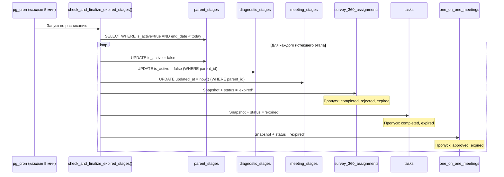
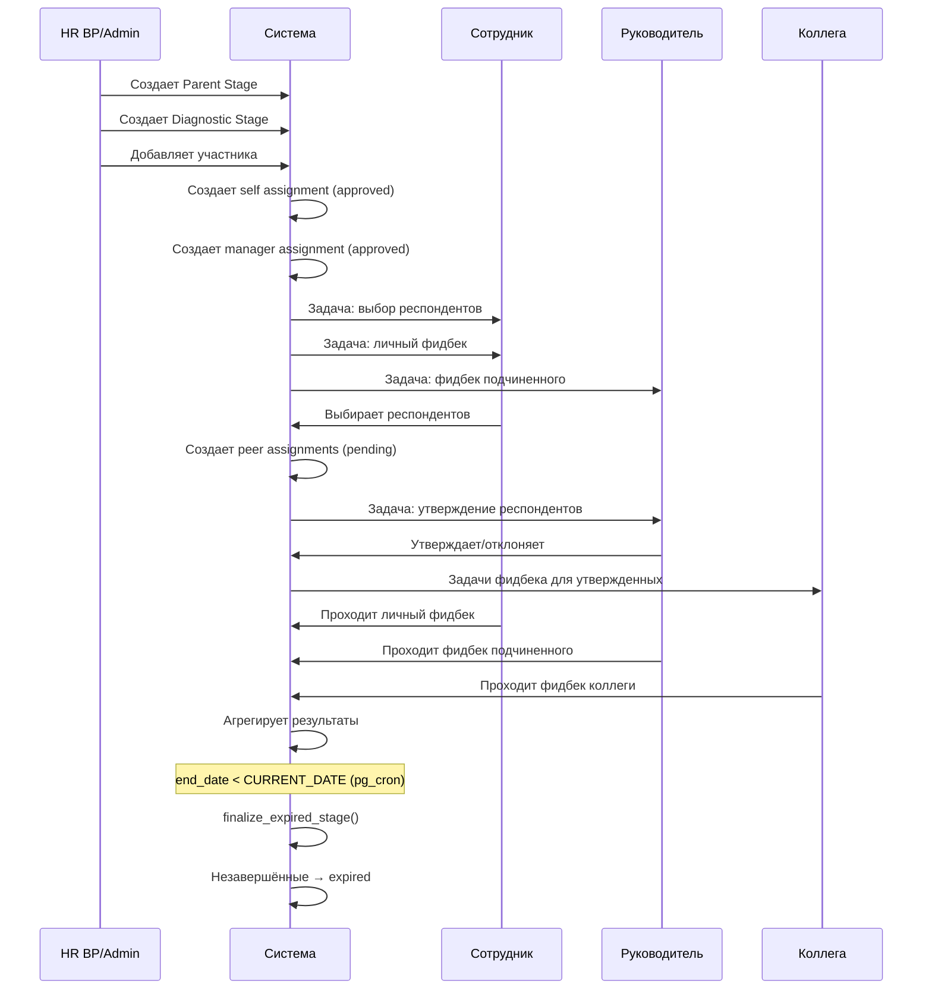

# АКТУАЛЬНАЯ ДОКУМЕНТАЦИЯ ПРОЕКТА V13

**Дата обновления:** 29.01.2026  
**Версия:** 13.0  
**Статус:** Актуальная

---

## Оглавление

1. [Общая структура проекта](#1-общая-структура-проекта)
2. [Система авторизации](#2-система-авторизации)
3. [Роли и разрешения](#3-роли-и-разрешения)
4. [Архитектура базы данных](#4-архитектура-базы-данных)
5. [Бизнес-логика диагностики](#5-бизнес-логика-диагностики)
6. [Полный флоу диагностики компетенций](#6-полный-флоу-диагностики-компетенций)
7. [Полный флоу встреч 1:1](#7-полный-флоу-встреч-11)
8. [Шкалы оценки компетенций](#8-шкалы-оценки-компетенций)
9. [Расчет средних значений](#9-расчет-средних-значений)
10. [Триггеры обновления user_skills и user_qualities](#10-триггеры-обновления-user_skills-и-user_qualities)
11. [Визуализация результатов](#11-визуализация-результатов)
12. [Система задач](#12-система-задач)
13. [Импорт данных](#13-импорт-данных)
14. [Edge Functions](#14-edge-functions)
15. [UI/UX особенности](#15-uiux-особенности)
16. [Дизайн-система Milu](#16-дизайн-система-milu)
17. [RLS и безопасность](#17-rls-и-безопасность)
18. [Жизненный цикл этапов](#18-жизненный-цикл-этапов)
19. [**АВТОМАТИЧЕСКОЕ ЗАКРЫТИЕ ЭТАПОВ (V13)**](#19-автоматическое-закрытие-этапов-v13)
20. [UML-диаграммы](#20-uml-диаграммы)

---

## 1. Общая структура проекта

### Технологический стек

**Фронтенд:**
- React 18.3.1 + TypeScript
- Vite (сборка)
- Tailwind CSS + shadcn/ui (дизайн-система)
- React Router DOM 6.30.1 (маршрутизация)
- TanStack Query 5.83.0 (управление состоянием и кэширование)
- Supabase JS Client 2.57.2 (работа с БД)

**Бэкенд:**
- Supabase (PostgreSQL + Auth + Edge Functions)
- Deno runtime для Edge Functions
- **pg_cron** для серверного планирования задач (V13)

**Интеграции:**
- Отсутствуют (шифрование PII удалено)

### Структура папок

```
src/
├── components/          # React компоненты
│   ├── ui/             # shadcn UI компоненты
│   ├── admin/          # Компоненты админ-панели
│   ├── analytics/      # Аналитические компоненты
│   ├── assessment/     # Компоненты оценки
│   ├── security/       # Компоненты безопасности
│   └── stages/         # Компоненты этапов
├── contexts/           # React контексты (AuthContext)
├── hooks/              # Кастомные хуки
├── integrations/       # Интеграции (Supabase)
│   └── supabase/
│       ├── client.ts   # Supabase клиент
│       └── types.ts    # Типы БД (auto-generated)
├── lib/                # Утилиты
├── pages/              # Страницы приложения
│   └── admin/          # Административные страницы
└── types/              # TypeScript типы
```

---

## 2-17. [Содержимое разделов 2-17 идентично V12]

*См. документацию V12 для полного описания разделов 2-17.*

---

## 18. Жизненный цикл этапов

### 18.1 Структура родительского этапа

| Поле | Тип | Описание |
|------|-----|----------|
| id | UUID | Уникальный идентификатор |
| period | TEXT | Название периода (например, "Q1 2026", "H1 2025") |
| start_date | DATE | Дата начала этапа |
| **end_date** | DATE | **Дата окончания (ЖЁСТКИЙ ДЕДЛАЙН)** |
| reminder_date | DATE | Дата напоминания участникам |
| is_active | BOOLEAN | Флаг активности этапа |
| created_by | UUID | Создатель этапа |

### 18.2 Состояния этапа

```
┌─────────────────────────────────────────────────────────────────┐
│                      ЖИЗНЕННЫЙ ЦИКЛ ЭТАПА                       │
├─────────────────────────────────────────────────────────────────┤
│                                                                 │
│   ┌──────────────┐                      ┌──────────────┐        │
│   │  ПРЕДСТОЯЩИЙ │      start_date      │   АКТИВНЫЙ   │        │
│   │  (upcoming)  │ ─────────────────────▶│   (active)   │        │
│   │  is_active   │     достигнута        │  is_active   │        │
│   │    = true    │                       │    = true    │        │
│   │              │                       │              │        │
│   │ start_date > │                       │ start_date   │        │
│   │ CURRENT_DATE │                       │ <= today <=  │        │
│   └──────────────┘                       │   end_date   │        │
│                                          └──────┬───────┘        │
│                                                 │                │
│                                           end_date < today       │
│                                           (pg_cron V13)          │
│                                                 │                │
│                                                 ▼                │
│                                          ┌──────────────┐        │
│                                          │  ЗАВЕРШЁН    │        │
│                                          │ (completed)  │        │
│                                          │  is_active   │        │
│                                          │   = false    │        │
│                                          └──────────────┘        │
│                                                                  │
└─────────────────────────────────────────────────────────────────┘
```

### 18.3 Правила определения статуса

| Условие | Статус | is_active | Отображение |
|---------|--------|-----------|-------------|
| `start_date > CURRENT_DATE` | Предстоящий (upcoming) | true | Бейдж "Предстоящий" (синий) |
| `start_date <= CURRENT_DATE <= end_date` | Активный (active) | true | Бейдж "Активен" (зеленый) |
| `end_date < CURRENT_DATE` | Завершён (completed) | **false** | Бейдж "Завершён" (серый) |

---

## 19. АВТОМАТИЧЕСКОЕ ЗАКРЫТИЕ ЭТАПОВ (V13)

### 19.1 Архитектура серверного планировщика

**Изменение в V13:** Автозакрытие этапов перенесено с клиентского вызова (UI-driven) на серверный планировщик **pg_cron**.

```
┌─────────────────────────────────────────────────────────────────┐
│                    АРХИТЕКТУРА V13 (pg_cron)                    │
├─────────────────────────────────────────────────────────────────┤
│                                                                 │
│   ┌─────────────────────────────────────────────────────────┐   │
│   │                     pg_cron                              │   │
│   │  ┌─────────────────────────────────────────────────┐    │   │
│   │  │  Job: finalize-expired-stages                    │    │   │
│   │  │  Schedule: */5 * * * * (каждые 5 минут)         │    │   │
│   │  │  Command: SELECT check_and_finalize_expired_stages() │   │
│   │  └─────────────────────────────────────────────────┘    │   │
│   └─────────────────────────────────────────────────────────┘   │
│                              │                                   │
│                              ▼                                   │
│   ┌─────────────────────────────────────────────────────────┐   │
│   │         check_and_finalize_expired_stages()             │   │
│   │                                                         │   │
│   │  FOR EACH parent_stage                                  │   │
│   │    WHERE is_active = true                               │   │
│   │      AND end_date < CURRENT_DATE                        │   │
│   │  DO:                                                    │   │
│   │    CALL finalize_expired_stage(stage_id)                │   │
│   │  END                                                    │   │
│   └─────────────────────────────────────────────────────────┘   │
│                              │                                   │
│                              ▼                                   │
│   ┌─────────────────────────────────────────────────────────┐   │
│   │            finalize_expired_stage(p_stage_id)           │   │
│   │                                                         │   │
│   │  ТРАНЗАКЦИОННО:                                         │   │
│   │  1. parent_stages → is_active = false                   │   │
│   │  2. diagnostic_stages → is_active = false               │   │
│   │  3. meeting_stages → updated_at = now()                 │   │
│   │  4. survey_360_assignments → expired + snapshot         │   │
│   │  5. tasks → expired + snapshot                          │   │
│   │  6. one_on_one_meetings → expired + snapshot            │   │
│   └─────────────────────────────────────────────────────────┘   │
│                                                                 │
└─────────────────────────────────────────────────────────────────┘
```

### 19.2 Преимущества серверного планировщика

| Аспект | UI-driven (V12) | pg_cron (V13) |
|--------|-----------------|---------------|
| Зависимость от UI | Требует открытия страницы | Работает независимо |
| Надёжность | Зависит от активности пользователей | Гарантированное выполнение |
| Нагрузка на клиент | RPC-вызов при каждой загрузке | Отсутствует |
| Частота проверки | При открытии страницы этапов | Каждые 5 минут |
| Точность закрытия | ± несколько дней | ± 5 минут |

### 19.3 Конфигурация pg_cron

**Включение расширения:**
```sql
CREATE EXTENSION IF NOT EXISTS pg_cron WITH SCHEMA extensions;
```

**Создание задания:**
```sql
SELECT cron.schedule(
  'finalize-expired-stages',
  '*/5 * * * *',
  $$SELECT public.check_and_finalize_expired_stages()$$
);
```

**Мониторинг заданий:**
```sql
-- Список активных заданий
SELECT * FROM cron.job;

-- История выполнения
SELECT * FROM cron.job_run_details 
ORDER BY start_time DESC 
LIMIT 20;
```

### 19.4 Иерархия закрытия этапов

```
┌─────────────────────────────────────────────────────────────────┐
│                     ИЕРАРХИЯ ЗАКРЫТИЯ                           │
├─────────────────────────────────────────────────────────────────┤
│                                                                 │
│  parent_stages (p_stage_id)                                     │
│  └─ is_active = false                                           │
│     └─ updated_at = now()                                       │
│                                                                 │
│     ├── diagnostic_stages (WHERE parent_id = p_stage_id)        │
│     │   └─ is_active = false                                    │
│     │      └─ updated_at = now()                                │
│     │                                                           │
│     │   ├── survey_360_assignments                              │
│     │   │   (WHERE diagnostic_stage_id IN diagnostic_stages)    │
│     │   │   └─ status_at_stage_end = status (snapshot)          │
│     │   │   └─ stage_end_snapshot_at = now()                    │
│     │   │   └─ status = 'expired' (если NOT IN completed,       │
│     │   │                          expired, rejected)           │
│     │   │                                                       │
│     │   └── tasks                                               │
│     │       (WHERE diagnostic_stage_id IN diagnostic_stages)    │
│     │       └─ status_at_stage_end = status (snapshot)          │
│     │       └─ stage_end_snapshot_at = now()                    │
│     │       └─ status = 'expired' (если NOT IN completed,       │
│     │                              expired)                     │
│     │                                                           │
│     └── meeting_stages (WHERE parent_id = p_stage_id)           │
│         └─ updated_at = now()                                   │
│         │  (БЕЗ is_active — поля нет в таблице)                 │
│         │                                                       │
│         └── one_on_one_meetings                                 │
│             (WHERE stage_id IN meeting_stages)                  │
│             └─ status_at_stage_end = status (snapshot)          │
│             └─ stage_end_snapshot_at = now()                    │
│             └─ status = 'expired' (если NOT IN approved,        │
│                                    expired)                     │
│                                                                 │
└─────────────────────────────────────────────────────────────────┘
```

### 19.5 Функция finalize_expired_stage

```sql
CREATE OR REPLACE FUNCTION public.finalize_expired_stage(p_stage_id uuid)
 RETURNS void
 LANGUAGE plpgsql
 SECURITY DEFINER
 SET search_path TO 'public'
AS $function$
BEGIN
  -- 1. Деактивируем родительский этап
  UPDATE parent_stages
  SET is_active = false, updated_at = now()
  WHERE id = p_stage_id;

  -- 2. Каскадно деактивируем связанные diagnostic_stages
  UPDATE diagnostic_stages
  SET is_active = false, updated_at = now()
  WHERE parent_id = p_stage_id;

  -- 3. Обновляем meeting_stages (без is_active, только timestamp)
  UPDATE meeting_stages
  SET updated_at = now()
  WHERE parent_id = p_stage_id;

  -- 4. Снапшотим и переводим незавершённые assignments в expired
  --    ВАЖНО: completed и rejected НЕ трогаем (финальные статусы)
  UPDATE survey_360_assignments
  SET 
    status_at_stage_end = status,
    stage_end_snapshot_at = now(),
    status = 'expired',
    updated_at = now()
  WHERE diagnostic_stage_id IN (
    SELECT id FROM diagnostic_stages WHERE parent_id = p_stage_id
  )
  AND status NOT IN ('completed', 'expired', 'rejected');

  -- 5. Снапшотим и переводим незавершённые tasks в expired
  UPDATE tasks
  SET 
    status_at_stage_end = status,
    stage_end_snapshot_at = now(),
    status = 'expired',
    updated_at = now()
  WHERE diagnostic_stage_id IN (
    SELECT id FROM diagnostic_stages WHERE parent_id = p_stage_id
  )
  AND status NOT IN ('completed', 'expired');

  -- 6. Снапшотим и переводим незавершённые meetings в expired
  UPDATE one_on_one_meetings
  SET 
    status_at_stage_end = status,
    stage_end_snapshot_at = now(),
    status = 'expired',
    updated_at = now()
  WHERE stage_id IN (
    SELECT id FROM meeting_stages WHERE parent_id = p_stage_id
  )
  AND status NOT IN ('approved', 'expired');
  
  -- soft_skill_results и hard_skill_results НЕ изменяются
  -- (is_draft остаётся как есть, данные сохраняются)
END;
$function$;
```

### 19.6 Логика перехода статусов

#### survey_360_assignments

| Исходный статус | Действие при закрытии | Результат |
|-----------------|----------------------|-----------|
| pending | Создаётся snapshot → status = 'expired' | **expired** |
| approved | Создаётся snapshot → status = 'expired' | **expired** |
| in_progress | Создаётся snapshot → status = 'expired' | **expired** |
| **completed** | БЕЗ ИЗМЕНЕНИЙ | completed |
| **rejected** | БЕЗ ИЗМЕНЕНИЙ | rejected |
| expired | БЕЗ ИЗМЕНЕНИЙ | expired |

#### tasks

| Исходный статус | Действие при закрытии | Результат |
|-----------------|----------------------|-----------|
| pending | Создаётся snapshot → status = 'expired' | **expired** |
| in_progress | Создаётся snapshot → status = 'expired' | **expired** |
| **completed** | БЕЗ ИЗМЕНЕНИЙ | completed |
| expired | БЕЗ ИЗМЕНЕНИЙ | expired |

#### one_on_one_meetings

| Исходный статус | Действие при закрытии | Результат |
|-----------------|----------------------|-----------|
| draft | Создаётся snapshot → status = 'expired' | **expired** |
| submitted | Создаётся snapshot → status = 'expired' | **expired** |
| returned | Создаётся snapshot → status = 'expired' | **expired** |
| **approved** | БЕЗ ИЗМЕНЕНИЙ | approved |
| expired | БЕЗ ИЗМЕНЕНИЙ | expired |

### 19.7 Снапшот статуса

При закрытии этапа создаётся снапшот текущего статуса для возможности анализа и восстановления:

| Поле | Тип | Описание |
|------|-----|----------|
| status_at_stage_end | TEXT | Статус записи на момент закрытия этапа |
| stage_end_snapshot_at | TIMESTAMPTZ | Время создания снапшота |

**Пример данных после закрытия:**
```
survey_360_assignments:
┌──────────────────────────────────────┬───────────┬────────────────────┬────────────────────────┐
│ id                                   │ status    │ status_at_stage_end│ stage_end_snapshot_at  │
├──────────────────────────────────────┼───────────┼────────────────────┼────────────────────────┤
│ a1b2c3d4-...                         │ expired   │ pending            │ 2026-01-29 00:05:00    │
│ e5f6g7h8-...                         │ expired   │ approved           │ 2026-01-29 00:05:00    │
│ i9j0k1l2-...                         │ completed │ NULL               │ NULL                   │
└──────────────────────────────────────┴───────────┴────────────────────┴────────────────────────┘
```

### 19.8 Функция check_and_finalize_expired_stages

```sql
CREATE OR REPLACE FUNCTION public.check_and_finalize_expired_stages()
 RETURNS void
 LANGUAGE plpgsql
 SECURITY DEFINER
 SET search_path TO 'public'
AS $function$
DECLARE
  stage_record RECORD;
BEGIN
  -- Находим все активные этапы с истёкшим end_date
  FOR stage_record IN
    SELECT id
    FROM parent_stages
    WHERE is_active = true
      AND end_date < CURRENT_DATE
  LOOP
    -- Закрываем каждый этап
    PERFORM finalize_expired_stage(stage_record.id);
  END LOOP;
END;
$function$;
```

### 19.9 Особенности meeting_stages

**ВАЖНО:** Таблица `meeting_stages` **НЕ имеет поля is_active**.

```sql
-- Структура meeting_stages:
CREATE TABLE meeting_stages (
  id UUID PRIMARY KEY,
  parent_id UUID REFERENCES parent_stages(id),
  created_by UUID REFERENCES users(id),
  created_at TIMESTAMPTZ DEFAULT now(),
  updated_at TIMESTAMPTZ DEFAULT now()
  -- is_active — ОТСУТСТВУЕТ!
);
```

**Логика определения активности meeting_stage:**

```typescript
// Активность определяется через родительский этап
const isActiveStage = (meetingStage: MeetingStage): boolean => {
  const parentStage = parentStages.find(p => p.id === meetingStage.parent_id);
  return parentStage?.is_active ?? false;
};
```

При закрытии этапа `meeting_stages` обновляется только `updated_at`, а активность определяется через `parent_stages.is_active`.

### 19.10 Удаление RPC-вызова из UI

**V12 (устаревший подход):**
```typescript
// useParentStages.ts — БЫЛО
queryFn: async () => {
  await supabase.rpc('check_and_finalize_expired_stages'); // ← UI-driven
  const { data } = await supabase.from('parent_stages').select('*');
  return data;
};
```

**V13 (текущий подход):**
```typescript
// useParentStages.ts — СТАЛО
queryFn: async () => {
  // Автозавершение этапов выполняется серверным планировщиком (pg_cron)
  // каждые 5 минут, независимо от UI
  const { data } = await supabase.from('parent_stages').select('*');
  return data;
};
```

### 19.11 Переоткрытие этапа (reopen_expired_stage)

Администратор может переоткрыть завершённый этап, если требуется продлить сроки:

```sql
CREATE OR REPLACE FUNCTION public.reopen_expired_stage(p_stage_id uuid)
 RETURNS void
 LANGUAGE plpgsql
 SECURITY DEFINER
 SET search_path TO 'public'
AS $function$
BEGIN
  -- 1. Активируем родительский этап
  UPDATE parent_stages
  SET is_active = true, updated_at = now()
  WHERE id = p_stage_id;

  -- 2. Активируем diagnostic_stages
  UPDATE diagnostic_stages
  SET is_active = true, updated_at = now()
  WHERE parent_id = p_stage_id;

  -- 3. Восстанавливаем статусы survey_360_assignments
  UPDATE survey_360_assignments
  SET 
    status = status_at_stage_end,
    updated_at = now()
  WHERE diagnostic_stage_id IN (
    SELECT id FROM diagnostic_stages WHERE parent_id = p_stage_id
  )
  AND status = 'expired'
  AND status_at_stage_end IS NOT NULL;

  -- 4. Восстанавливаем статусы tasks
  UPDATE tasks
  SET 
    status = status_at_stage_end,
    updated_at = now()
  WHERE diagnostic_stage_id IN (
    SELECT id FROM diagnostic_stages WHERE parent_id = p_stage_id
  )
  AND status = 'expired'
  AND status_at_stage_end IS NOT NULL;

  -- 5. Восстанавливаем статусы one_on_one_meetings
  UPDATE one_on_one_meetings
  SET 
    status = status_at_stage_end,
    updated_at = now()
  WHERE stage_id IN (
    SELECT id FROM meeting_stages WHERE parent_id = p_stage_id
  )
  AND status = 'expired'
  AND status_at_stage_end IS NOT NULL;
END;
$function$;
```

### 19.12 Диаграмма последовательности закрытия этапа

```
┌─────────────────────────────────────────────────────────────────────────────┐
│                    ПОСЛЕДОВАТЕЛЬНОСТЬ ЗАКРЫТИЯ ЭТАПА                        │
├─────────────────────────────────────────────────────────────────────────────┤
│                                                                             │
│  Время: каждые 5 минут                                                      │
│                                                                             │
│  ┌────────────┐     ┌─────────────────────────────┐     ┌───────────────┐   │
│  │  pg_cron   │────▶│ check_and_finalize_expired_ │────▶│ parent_stages │   │
│  │            │     │ stages()                    │     │ WHERE         │   │
│  │ */5 * * *  │     │                             │     │ is_active=true│   │
│  └────────────┘     └─────────────────────────────┘     │ end_date<today│   │
│                                                         └───────┬───────┘   │
│                                                                 │           │
│                     FOR EACH expired stage                      │           │
│                                                                 ▼           │
│                     ┌─────────────────────────────────────────────────┐     │
│                     │         finalize_expired_stage(p_stage_id)      │     │
│                     ├─────────────────────────────────────────────────┤     │
│                     │                                                 │     │
│                     │  ┌──────────────────────────────────────────┐   │     │
│                     │  │ 1. UPDATE parent_stages                  │   │     │
│                     │  │    SET is_active = false                 │   │     │
│                     │  └──────────────────────────────────────────┘   │     │
│                     │                       │                         │     │
│                     │                       ▼                         │     │
│                     │  ┌──────────────────────────────────────────┐   │     │
│                     │  │ 2. UPDATE diagnostic_stages              │   │     │
│                     │  │    SET is_active = false                 │   │     │
│                     │  │    WHERE parent_id = p_stage_id          │   │     │
│                     │  └──────────────────────────────────────────┘   │     │
│                     │                       │                         │     │
│                     │                       ▼                         │     │
│                     │  ┌──────────────────────────────────────────┐   │     │
│                     │  │ 3. UPDATE meeting_stages                 │   │     │
│                     │  │    SET updated_at = now()                │   │     │
│                     │  │    WHERE parent_id = p_stage_id          │   │     │
│                     │  └──────────────────────────────────────────┘   │     │
│                     │                       │                         │     │
│                     │                       ▼                         │     │
│                     │  ┌──────────────────────────────────────────┐   │     │
│                     │  │ 4. UPDATE survey_360_assignments         │   │     │
│                     │  │    SET status_at_stage_end = status,     │   │     │
│                     │  │        stage_end_snapshot_at = now(),    │   │     │
│                     │  │        status = 'expired'                │   │     │
│                     │  │    WHERE status NOT IN                   │   │     │
│                     │  │      ('completed', 'expired', 'rejected')│   │     │
│                     │  └──────────────────────────────────────────┘   │     │
│                     │                       │                         │     │
│                     │                       ▼                         │     │
│                     │  ┌──────────────────────────────────────────┐   │     │
│                     │  │ 5. UPDATE tasks                          │   │     │
│                     │  │    SET status_at_stage_end = status,     │   │     │
│                     │  │        stage_end_snapshot_at = now(),    │   │     │
│                     │  │        status = 'expired'                │   │     │
│                     │  │    WHERE status NOT IN                   │   │     │
│                     │  │      ('completed', 'expired')            │   │     │
│                     │  └──────────────────────────────────────────┘   │     │
│                     │                       │                         │     │
│                     │                       ▼                         │     │
│                     │  ┌──────────────────────────────────────────┐   │     │
│                     │  │ 6. UPDATE one_on_one_meetings            │   │     │
│                     │  │    SET status_at_stage_end = status,     │   │     │
│                     │  │        stage_end_snapshot_at = now(),    │   │     │
│                     │  │        status = 'expired'                │   │     │
│                     │  │    WHERE status NOT IN                   │   │     │
│                     │  │      ('approved', 'expired')             │   │     │
│                     │  └──────────────────────────────────────────┘   │     │
│                     │                                                 │     │
│                     └─────────────────────────────────────────────────┘     │
│                                                                             │
└─────────────────────────────────────────────────────────────────────────────┘
```

### 19.13 Сводная таблица SQL-функций

| Функция | Описание | Триггер |
|---------|----------|---------|
| `check_and_finalize_expired_stages()` | Проверяет все активные этапы и закрывает истёкшие | pg_cron: каждые 5 минут |
| `finalize_expired_stage(p_stage_id)` | Закрывает конкретный этап с каскадным обновлением | Вызывается из check_and_finalize_expired_stages |
| `reopen_expired_stage(p_stage_id)` | Восстанавливает закрытый этап | Ручной вызов администратором |

### 19.14 Данные, которые НЕ изменяются при закрытии

| Таблица | Что происходит |
|---------|----------------|
| soft_skill_results | **БЕЗ ИЗМЕНЕНИЙ** — is_draft остаётся как есть |
| hard_skill_results | **БЕЗ ИЗМЕНЕНИЙ** — is_draft остаётся как есть |
| meeting_decisions | **БЕЗ ИЗМЕНЕНИЙ** — решения сохраняются |
| diagnostic_stage_participants | **БЕЗ ИЗМЕНЕНИЙ** — участники сохраняются |
| meeting_stage_participants | **БЕЗ ИЗМЕНЕНИЙ** — участники сохраняются |

**Важно:** Результаты оценок (soft_skill_results, hard_skill_results) никогда не теряются и не переводятся в expired. Статус `is_draft` сохраняется для возможности анализа незавершённых оценок.

---

## 20. UML-диаграммы

### Флоу закрытия этапа (V13)



### Флоу диагностики



---

## История изменений

| Версия | Дата | Изменения |
|--------|------|-----------|
| V13 | 29.01.2026 | Перенос автозакрытия этапов на pg_cron. Удаление RPC-вызова из UI. Подробная документация функции finalize_expired_stage. |
| V12 | 16.01.2026 | Добавлен статус expired. Снапшоты при закрытии этапа. |
| V11 | 10.01.2026 | Переименование deadline_date → reminder_date, end_date как жёсткий дедлайн. |
