# Актуальная документация проекта V6

**Дата создания:** 2025-11-24  
**Версия:** 6.0  
**Статус:** Актуальная документация с исправленными замечаниями

---

## Содержание

1. [Общее описание проекта](#1-общее-описание-проекта)
2. [Архитектура и технологии](#2-архитектура-и-технологии)
3. [Авторизация и аутентификация](#3-авторизация-и-аутентификация)
4. [Роли и права доступа](#4-роли-и-права-доступа)
5. [База данных](#5-база-данных)
6. [Триггеры и функции](#6-триггеры-и-функции)
7. [Бизнес-логика ключевых модулей](#7-бизнес-логика-ключевых-модулей)
8. [Структура страниц и маршрутизация](#8-структура-страниц-и-маршрутизация)
9. [Key Invariants (технические ограничения)](#9-key-invariants-технические-ограничения)
10. [Ограничения "что нельзя"](#10-ограничения-что-нельзя)
11. [ERD схема базы данных](#11-erd-схема-базы-данных)
12. [Неиспользуемые таблицы](#12-неиспользуемые-таблицы)

---

## 1. Общее описание проекта

### 1.1 Назначение системы
Система управления компетенциями и развитием сотрудников, включающая:
- **Диагностику компетенций** (360° оценка + самооценка)
- **Встречи 1:1** между сотрудником и руководителем
- **Карьерное развитие** и индивидуальные планы развития (ИПР)
- **Управление задачами** развития, диагностики и встреч

### 1.2 Ключевые модули
1. **Диагностика компетенций**
   - Unified Assessment (единая страница оценки)
   - Hard Skills и Soft Skills (Качества)
   - Категории и подкатегории навыков/качеств
   - Пакеты вариантов ответов (answer_categories)

2. **Встречи 1:1**
   - Создание встреч сотрудником
   - Согласование и обсуждение руководителем
   - Принятие решений

3. **Карьерное развитие**
   - Карьерные треки с шагами
   - GAP-анализ (разрыв между текущим и требуемым уровнем)
   - Автоматическая генерация задач развития

4. **Задачи**
   - Задачи развития (development)
   - Задачи диагностики (diagnostic, self, manager, peer)
   - Задачи встреч (meeting)

---

## 2. Архитектура и технологии

### 2.1 Frontend
- **Framework:** React 18.3.1 + TypeScript
- **Build tool:** Vite
- **Styling:** Tailwind CSS (с семантическими токенами)
- **UI Components:** Shadcn/ui (Radix UI)
- **State Management:** React Query (TanStack Query) для серверного состояния
- **Routing:** React Router v6
- **Forms:** React Hook Form + Zod
- **Charts:** Recharts
- **Notifications:** Sonner (toast)

### 2.2 Backend
- **Platform:** Supabase
- **Database:** PostgreSQL 15
- **Auth:** Supabase Auth (email/password)
- **Edge Functions:** Deno-based serverless функции
- **RPC:** PostgreSQL stored procedures
- **External API:** Yandex Cloud Functions для шифрования/расшифровки ФИО

### 2.3 Структура проекта

#### Frontend структура
```
src/
├── components/         # React компоненты
│   ├── admin/         # Админ-компоненты (управление справочниками)
│   ├── assessment/    # Компоненты оценки
│   ├── molecules/     # Атомарные компоненты
│   ├── security/      # Управление безопасностью
│   └── stages/        # Управление этапами
├── contexts/          # React контексты (AuthContext)
├── hooks/             # Custom hooks
├── integrations/      # Supabase клиент и типы
├── lib/              # Утилиты и хелперы
├── pages/            # Страницы приложения
└── types/            # TypeScript типы
```

#### Основные пакеты
- `@tanstack/react-query` - серверное состояние
- `@supabase/supabase-js` - Supabase SDK
- `react-hook-form` + `zod` - формы и валидация
- `recharts` - графики и диаграммы
- `lucide-react` - иконки
- `sonner` - уведомления

---

## 3. Авторизация и аутентификация

### 3.1 Supabase Auth
- **Метод:** Email/Password
- **JWT токены:** автоматически управляются Supabase SDK
- **Session:** хранится в localStorage через Supabase

### 3.2 AuthContext
Файл: `src/contexts/AuthContext.tsx`

Предоставляет:
- `user` - текущий пользователь (Supabase User)
- `userId` - ID пользователя
- `loading` - состояние загрузки
- `signIn()`, `signOut()` - методы входа/выхода

### 3.3 Определение роли пользователя
Роли НЕ хранятся в таблице `users` или `auth.users`!

**Критически важно:** Роли хранятся в отдельной таблице `user_roles` (см. раздел 4).

Проверка роли происходит через хук `usePermission`:
```typescript
const { hasPermission, isLoading } = usePermission('diagnostics.view_all');
```

### 3.4 Защита маршрутов
Используется компонент `AuthGuard` для защиты страниц:
- Проверяет наличие авторизованного пользователя
- Перенаправляет на `/auth` если не авторизован

---

## 4. Роли и права доступа

### 4.1 Таблица ролей

**Таблица: `user_roles`**

| Поле | Тип | Описание |
|------|-----|----------|
| id | uuid | PK |
| user_id | uuid | FK → auth.users(id) |
| role | app_role | ENUM ('user', 'manager', 'hr_bp', 'admin') |

**CRITICAL:** Роли хранятся ТОЛЬКО в `user_roles`, не в других таблицах!

**Enum `app_role`:**
- `user` - обычный сотрудник
- `manager` - руководитель
- `hr_bp` - HR Business Partner
- `admin` - системный администратор

### 4.2 Система разрешений (Permissions)

**Таблица: `permissions`**
- 76 разрешений (permissions)
- Структура: `module.action` (например, `diagnostics.view_all`)

**Таблица: `role_permissions`**
- Связывает роли с разрешениями
- Каждая роль имеет набор разрешений

**Security Definer Function:**
```sql
create or replace function public.has_role(_user_id uuid, _role app_role)
returns boolean
language sql
stable
security definer
set search_path = public
as $$
  select exists (
    select 1
    from public.user_roles
    where user_id = _user_id
      and role = _role
  )
$$;
```

### 4.3 Матрица прав доступа

#### Модуль: Диагностика

| Разрешение | User | Manager | HR_BP | Admin |
|-----------|------|---------|-------|-------|
| diagnostics.view_own | ✓ | ✓ | ✓ | ✓ |
| diagnostics.view_all | - | ✓ | ✓ | ✓ |
| diagnostics.create | - | - | ✓ | ✓ |
| diagnostics.edit | - | - | ✓ | ✓ |
| diagnostics.delete | - | - | - | ✓ |
| diagnostics.approve_respondents | - | ✓ | ✓ | ✓ |

#### Модуль: Встречи 1:1

| Разрешение | User | Manager | HR_BP | Admin |
|-----------|------|---------|-------|-------|
| meetings.view_own | ✓ | ✓ | ✓ | ✓ |
| meetings.create | ✓ | ✓ | ✓ | ✓ |
| meetings.approve | - | ✓ | - | ✓ |
| meetings.view_subordinates | - | ✓ | ✓ | ✓ |

#### Модуль: Задачи

| Разрешение | User | Manager | HR_BP | Admin |
|-----------|------|---------|-------|-------|
| tasks.view_own | ✓ | ✓ | ✓ | ✓ |
| tasks.create | ✓ | ✓ | ✓ | ✓ |
| tasks.edit_own | ✓ | ✓ | ✓ | ✓ |
| tasks.view_team | - | ✓ | ✓ | ✓ |

#### Модуль: Управление пользователями

| Разрешение | User | Manager | HR_BP | Admin |
|-----------|------|---------|-------|-------|
| users.create | - | - | ✓ | ✓ |
| users.edit | - | - | ✓ | ✓ |
| users.delete | - | - | - | ✓ |
| security.manage | - | - | - | ✓ |

### 4.4 RLS Policies

**Пример RLS для `hard_skill_results`:**
```sql
-- Пользователь видит свои результаты
CREATE POLICY "Users can view own results"
  ON hard_skill_results FOR SELECT
  USING (evaluated_user_id = auth.uid());

-- Руководитель видит результаты подчиненных
CREATE POLICY "Managers can view subordinate results"
  ON hard_skill_results FOR SELECT
  USING (
    evaluated_user_id IN (
      SELECT id FROM users WHERE manager_id = auth.uid()
    )
  );

-- HR и Admin видят все
CREATE POLICY "HR and Admin see all"
  ON hard_skill_results FOR SELECT
  USING (
    has_role(auth.uid(), 'hr_bp') OR has_role(auth.uid(), 'admin')
  );
```

**Аналогичные политики применяются для:**
- `soft_skill_results`
- `tasks`
- `one_on_one_meetings`
- `survey_360_assignments`
- и др.

---

## 5. База данных

### 5.1 Общая структура

**Всего таблиц:** 56  
**Используемых таблиц:** 50  
**Неиспользуемых таблиц:** 6 (см. раздел 12)

### 5.2 Таблицы по модулям

#### 5.2.1 Модуль: Пользователи и структура

**Таблица: `users`**
- **Поля:** id, employee_number, first_name_encrypted, last_name_encrypted, middle_name_encrypted, email, status, grade_id, position_id, department_id, manager_id, hr_bp_id
- **Назначение:** Основная таблица пользователей (ФИО зашифрованы через Yandex Cloud Functions)
- **Связи:**
  - `grade_id` → `grades(id)`
  - `position_id` → `positions(id)`
  - `department_id` → `departments(id)`
  - `manager_id` → `users(id)` (self-reference)
  - `hr_bp_id` → `users(id)` (self-reference)

**Таблица: `user_roles`**
- **Поля:** id, user_id, role
- **Назначение:** Хранение ролей пользователей
- **CRITICAL:** Единственный источник правды о ролях!

**Таблица: `grades`**
- **Поля:** id, name, description, order_index
- **Назначение:** Грейды (уровни) сотрудников
- **Связи:** используется в `users.grade_id`

**Таблица: `positions`**
- **Поля:** id, name, description, grade_id
- **Назначение:** Должности
- **Связи:** `grade_id` → `grades(id)`

**Таблица: `departments`**
- **Поля:** id, name, description, parent_department_id
- **Назначение:** Департаменты (иерархия)
- **Связи:** `parent_department_id` → `departments(id)` (self-reference)

#### 5.2.2 Модуль: Компетенции (Hard Skills)

**Таблица: `category_hard_skills`**
- **Поля:** id, name, description
- **Назначение:** Категории Hard навыков (например, "Технические навыки")
- **Использование:** Группировка навыков, используется в фильтрации результатов
- **Связи:** Используется в `sub_category_hard_skills.category_hard_skill_id`

**Таблица: `sub_category_hard_skills`**
- **Поля:** id, category_hard_skill_id, name, description
- **Назначение:** Подкатегории Hard навыков (например, "Frontend разработка")
- **Использование:** Детализация категорий, используется в фильтрации результатов на RadarChart
- **Связи:** 
  - `category_hard_skill_id` → `category_hard_skills(id)`
  - Используется в `hard_skills.sub_category_id`
- **Логика:**
  - При фильтрации результатов по подкатегориям отображаются только навыки этой подкатегории
  - Компонент: `CompetencyFilter` (тип: `hard_subcategories`)

**Таблица: `hard_skills`**
- **Поля:** id, category_id, sub_category_id, name, description
- **Назначение:** Справочник Hard навыков
- **Связи:**
  - `category_id` → `category_hard_skills(id)`
  - `sub_category_id` → `sub_category_hard_skills(id)`

**Таблица: `grade_skills`**
- **Поля:** id, grade_id, skill_id, required_level
- **Назначение:** Требуемый уровень навыка для грейда
- **Связи:**
  - `grade_id` → `grades(id)`
  - `skill_id` → `hard_skills(id)`
- **Логика:** Используется для GAP-анализа

**Таблица: `hard_skill_questions`**
- **Поля:** id, skill_id, question_text, order_index, answer_category_id
- **Назначение:** Вопросы для оценки Hard навыков
- **Связи:**
  - `skill_id` → `hard_skills(id)`
  - `answer_category_id` → `answer_categories(id)` (НОВОЕ!)

**Таблица: `hard_skill_answer_options`**
- **Поля:** id, answer_category_id, level_value (0-4), label, description, order_index, title (legacy), numeric_value (legacy)
- **Назначение:** Варианты ответов для Hard навыков (привязаны к категории ответов)
- **Связи:** `answer_category_id` → `answer_categories(id)`
- **Логика:**
  - `level_value` - уникален внутри категории (0-4)
  - `order_index` - порядок отображения
  - `label` - текст варианта ("Не владею", "Базовый уровень" и т.д.)

**Таблица: `hard_skill_results`**
- **Поля:** id, evaluated_user_id, evaluator_user_id, skill_id, assignment_id, skill_question_id, grade (0-4), comment, is_anonymous_comment, is_draft, assignment_type
- **Назначение:** Результаты оценки Hard навыков
- **Связи:**
  - `evaluated_user_id` → `users(id)` (кого оценивают)
  - `evaluator_user_id` → `users(id)` (кто оценивает)
  - `skill_id` → `hard_skills(id)`
  - `assignment_id` → `survey_360_assignments(id)` или `skill_survey_assignments(id)`
  - `skill_question_id` → `hard_skill_questions(id)`
- **Логика комментариев:**
  - `assignment_type` = 'self' → `is_anonymous_comment` = false (всегда)
  - `assignment_type` = 'manager' → `is_anonymous_comment` = false (всегда)
  - `assignment_type` = 'peer' → `is_anonymous_comment` = true (всегда)
  - UI НЕ показывает чекбокс анонимности (устанавливается автоматически)

#### 5.2.3 Модуль: Компетенции (Soft Skills / Качества)

**Таблица: `category_soft_skills`**
- **Поля:** id, name, description
- **Назначение:** Категории Soft навыков (Качеств)
- **Использование:** Группировка качеств, используется в фильтрации результатов
- **Связи:** Используется в `sub_category_soft_skills.category_soft_skill_id`

**Таблица: `sub_category_soft_skills`**
- **Поля:** id, category_soft_skill_id, name, description
- **Назначение:** Подкатегории Soft навыков (например, "Коммуникация", "Лидерство")
- **Использование:** Детализация категорий, используется в фильтрации результатов на RadarChart
- **Связи:**
  - `category_soft_skill_id` → `category_soft_skills(id)`
  - Используется в `soft_skills.sub_category_id`
- **Логика:**
  - При фильтрации результатов по подкатегориям отображаются только качества этой подкатегории
  - Компонент: `CompetencyFilter` (тип: `soft_subcategories`)

**Таблица: `soft_skills`**
- **Поля:** id, category_id, sub_category_id, name, description
- **Назначение:** Справочник Soft навыков (Качеств)
- **Связи:**
  - `category_id` → `category_soft_skills(id)`
  - `sub_category_id` → `sub_category_soft_skills(id)`

**Таблица: `grade_qualities`**
- **Поля:** id, grade_id, quality_id, required_level
- **Назначение:** Требуемый уровень качества для грейда
- **Связи:**
  - `grade_id` → `grades(id)`
  - `quality_id` → `soft_skills(id)`

**Таблица: `soft_skill_questions`**
- **Поля:** id, quality_id, question_text, order_index, answer_category_id
- **Назначение:** Вопросы для оценки Soft навыков (Качеств)
- **Связи:**
  - `quality_id` → `soft_skills(id)`
  - `answer_category_id` → `answer_categories(id)` (НОВОЕ!)

**Таблица: `soft_skill_answer_options`**
- **Поля:** id, answer_category_id, level_value (0-4), label, description, order_index, numeric_value (legacy)
- **Назначение:** Варианты ответов для Soft навыков (привязаны к категории ответов)
- **Связи:** `answer_category_id` → `answer_categories(id)`
- **Логика:** Аналогична `hard_skill_answer_options`

**Таблица: `soft_skill_results`**
- **Поля:** id, evaluated_user_id, evaluator_user_id, quality_id, assignment_id, quality_question_id, grade (0-4), comment, is_anonymous_comment, is_draft, assignment_type
- **Назначение:** Результаты оценки Soft навыков (Качеств)
- **Связи:** Аналогично `hard_skill_results`
- **Логика комментариев:** Аналогично `hard_skill_results`

#### 5.2.4 Модуль: Пакеты вариантов ответов (НОВОЕ!)

**Таблица: `answer_categories`**
- **Поля:** id, name, description
- **Назначение:** Категории (пакеты) вариантов ответов для вопросов
- **Использование:**
  - Один пакет ответов может быть переиспользован для нескольких вопросов
  - Например, пакет "Оценка владения навыком (0-4)" содержит варианты:
    - 0 - Не владею
    - 1 - Базовый уровень
    - 2 - Средний уровень
    - 3 - Продвинутый уровень
    - 4 - Экспертный уровень
- **Связи:**
  - Используется в `hard_skill_questions.answer_category_id`
  - Используется в `soft_skill_questions.answer_category_id`
  - Используется в `hard_skill_answer_options.answer_category_id`
  - Используется в `soft_skill_answer_options.answer_category_id`

**Логика пакетов ответов:**
1. Создается категория ответов (например, "Стандартная шкала 0-4")
2. В неё добавляются варианты ответов через `hard_skill_answer_options` и `soft_skill_answer_options`
3. При создании вопроса выбирается категория ответов
4. На странице оценки подгружаются варианты ответов из выбранной категории

**Управление:**
- Страница: `/admin` → вкладка "Справочники" → "Категории ответов"
- Компонент: `AnswerCategoriesManagement` + `AnswerOptionsManagement`

#### 5.2.5 Модуль: Этапы (Parent Stage / Diagnostic / Meeting)

**ВАЖНО:** Трехуровневая структура этапов:

```
Parent Stage (Родительский этап)
  ├── Diagnostic Stage (Подэтап диагностики)
  └── Meeting Stage (Подэтап встреч 1:1)
```

**Таблица: `parent_stages`**
- **Поля:** id, period, start_date, end_date, deadline_date, is_active, created_by
- **Назначение:** Родительские этапы (например, "Q1 2024")
- **Логика:**
  - Только один parent_stage может быть активным (`is_active = true`)
  - Содержит временные рамки для всех дочерних этапов
- **Управление:** `/admin/stages`

**Таблица: `diagnostic_stages`**
- **Поля:** id, parent_id, evaluation_period, is_active, status, progress_percent, created_by
- **Назначение:** Этапы диагностики (подэтапы parent_stage)
- **Связи:** `parent_id` → `parent_stages(id)`
- **Логика:**
  - Наследует временные рамки от parent_stage
  - Может быть активным независимо от parent_stage
  - При добавлении участников автоматически создаются assignments и tasks (через триггеры)

**Таблица: `diagnostic_stage_participants`**
- **Поля:** id, stage_id, user_id
- **Назначение:** Участники этапа диагностики
- **Связи:**
  - `stage_id` → `diagnostic_stages(id)`
  - `user_id` → `users(id)`
- **Логика:**
  - При вставке участника триггер `create_diagnostic_assignments` создает:
    - 1 self assignment
    - 0-1 manager assignment
    - N peer assignments (по запросу)
  - Также создаются соответствующие задачи в `tasks`

**Таблица: `meeting_stages`**
- **Поля:** id, parent_id, created_by
- **Назначение:** Этапы встреч 1:1 (подэтапы parent_stage)
- **Связи:** `parent_id` → `parent_stages(id)`
- **Логика:** Аналогично `diagnostic_stages`

**Таблица: `meeting_stage_participants`**
- **Поля:** id, stage_id, user_id
- **Назначение:** Участники этапа встреч 1:1
- **Связи:** Аналогично `diagnostic_stage_participants`

#### 5.2.6 Модуль: Назначения (Assignments)

**Таблица: `survey_360_assignments`**
- **Поля:** id, diagnostic_stage_id, evaluated_user_id, evaluator_user_id, assignment_type ('self', 'manager', 'peer'), status, is_draft
- **Назначение:** Назначения для диагностики 360
- **Связи:**
  - `diagnostic_stage_id` → `diagnostic_stages(id)`
  - `evaluated_user_id` → `users(id)` (кого оценивают)
  - `evaluator_user_id` → `users(id)` (кто оценивает)
- **Статусы:**
  - `pending` - ожидает выполнения
  - `approved` - одобрено (для peer assignments)
  - `in_progress` - в процессе (есть черновики)
  - `completed` - завершено
  - `rejected` - отклонено (для peer assignments)

**Таблица: `skill_survey_assignments`**
- **Поля:** id, stage_id, assigned_to_user_id, status
- **Назначение:** Назначения для опроса навыков (Legacy, возможно не используется)
- **Статус:** Требует проверки использования

#### 5.2.7 Модуль: Задачи

**Таблица: `tasks`**
- **Поля:**
  - id, user_id, title, description
  - task_type ('development', 'diagnostic', 'meeting', 'peer_evaluation', 'manager')
  - status ('pending', 'in_progress', 'completed')
  - priority ('normal', 'urgent')
  - deadline, assignment_id, assignment_type
  - kpi_expected_level, kpi_result_level
- **Назначение:** Все задачи пользователей
- **Связи:**
  - `user_id` → `users(id)` (кому назначена задача)
  - `assignment_id` → может быть ID из `survey_360_assignments` или других таблиц

**Типы задач:**
1. **development** - задачи развития (ИПР)
   - Создаются вручную пользователем или автоматически через GAP-анализ
   - Содержат детали в `development_plan_tasks`
   
2. **diagnostic** - задачи диагностики (общий тип)
   - Автоматически создаются при добавлении участника в diagnostic_stage
   - Подтипы определяются через `assignment_type`:
     - `self` - самооценка
     - `manager` - оценка руководителем
     - `peer` - оценка коллегами

3. **meeting** - задачи встреч 1:1
   - Автоматически создаются при создании встречи
   - Привязаны к `one_on_one_meetings`

**Статусы задач:**
- `pending` - новая, не начата
- `in_progress` - в процессе выполнения
- `completed` - выполнена

**Таблица: `development_plan_tasks`**
- **Поля:** id, user_id, task_id, title, goal, how_to, measurable_result, priority, hard_skill_id, soft_skill_id, career_track_id, career_track_step_id
- **Назначение:** Детали задач развития (ИПР)
- **Связи:**
  - `user_id` → `users(id)`
  - `task_id` → `tasks(id)`
  - `hard_skill_id` → `hard_skills(id)` (опционально)
  - `soft_skill_id` → `soft_skills(id)` (опционально)
  - `career_track_id` → `career_tracks(id)` (опционально)
  - `career_track_step_id` → `career_track_steps(id)` (опционально)
- **Использование:** Активно используется для создания детализированных задач развития

#### 5.2.8 Модуль: Встречи 1:1

**Таблица: `one_on_one_meetings`**
- **Поля:** id, stage_id, employee_id, manager_id, scheduled_date, goal, status ('draft', 'submitted', 'in_review', 'approved', 'rejected'), notes
- **Назначение:** Встречи 1:1 между сотрудником и руководителем
- **Связи:**
  - `stage_id` → `meeting_stages(id)`
  - `employee_id` → `users(id)` (сотрудник)
  - `manager_id` → `users(id)` (руководитель)
- **Статусы:**
  - `draft` - черновик
  - `submitted` - отправлена на рассмотрение
  - `in_review` - рассматривается руководителем
  - `approved` - согласована
  - `rejected` - отклонена

**Таблица: `meeting_decisions`**
- **Поля:** id, meeting_id, decision_type, decision_text, responsible_person, deadline, status
- **Назначение:** Принятые решения в рамках встречи 1:1
- **Связи:** `meeting_id` → `one_on_one_meetings(id)`

#### 5.2.9 Модуль: Карьерные треки

**Таблица: `career_tracks`**
- **Поля:** id, name, description, target_position_id, required_grade_id, is_active
- **Назначение:** Карьерные треки (пути развития)
- **Связи:**
  - `target_position_id` → `positions(id)`
  - `required_grade_id` → `grades(id)`

**Таблица: `career_track_steps`**
- **Поля:** id, track_id, step_number, title, description, estimated_duration_months
- **Назначение:** Шаги карьерного трека
- **Связи:** `track_id` → `career_tracks(id)`

**Таблица: `career_track_step_skills`**
- **Поля:** id, step_id, skill_id, required_level
- **Назначение:** Требуемые навыки для шага трека
- **Связи:**
  - `step_id` → `career_track_steps(id)`
  - `skill_id` → `hard_skills(id)`

**Таблица: `career_track_step_qualities`**
- **Поля:** id, step_id, quality_id, required_level
- **Назначение:** Требуемые качества для шага трека
- **Связи:**
  - `step_id` → `career_track_steps(id)`
  - `quality_id` → `soft_skills(id)`

**Таблица: `user_career_tracks`**
- **Поля:** id, user_id, track_id, current_step_id, status, progress_percent, started_at, completed_at
- **Назначение:** Активные карьерные треки пользователей
- **Связи:**
  - `user_id` → `users(id)`
  - `track_id` → `career_tracks(id)`
  - `current_step_id` → `career_track_steps(id)`

#### 5.2.10 Модуль: Безопасность и аудит

**Таблица: `permissions`**
- **Поля:** id, name, description, module
- **Назначение:** Справочник разрешений (76 разрешений)
- **Примеры:** 'diagnostics.view_all', 'users.create', 'security.manage'

**Таблица: `role_permissions`**
- **Поля:** id, role, permission_id
- **Назначение:** Связь ролей с разрешениями
- **Связи:** `permission_id` → `permissions(id)`

**Таблица: `audit_logs`**
- **Поля:** id, user_id, action, entity_type, entity_id, changes, created_at
- **Назначение:** Журнал аудита действий пользователей
- **Связи:** `user_id` → `users(id)`

---

## 6. Триггеры и функции

### 6.1 Триггеры создания assignments

**Триггер: `create_diagnostic_assignments`**
- **Событие:** AFTER INSERT на `diagnostic_stage_participants`
- **Действие:**
  1. Создает self assignment для участника
  2. Создает manager assignment (если есть руководитель)
  3. Создает соответствующие задачи в `tasks`
- **Функция:** `create_assignments_for_participant()`

**Пример:**
```sql
-- При добавлении участника:
INSERT INTO diagnostic_stage_participants (stage_id, user_id) VALUES (...);

-- Автоматически создаются:
-- 1. survey_360_assignments (assignment_type = 'self')
-- 2. survey_360_assignments (assignment_type = 'manager') если есть manager_id
-- 3. tasks (task_type = 'diagnostic', assignment_type = 'self')
-- 4. tasks (task_type = 'diagnostic', assignment_type = 'manager')
```

### 6.2 Триггеры обновления статусов

**Триггер: `update_diagnostic_stage_status`**
- **Событие:** AFTER UPDATE на `survey_360_assignments`
- **Действие:** Обновляет `status` и `progress_percent` в `diagnostic_stages`

**Триггер: `update_assignment_status_on_submit`**
- **Событие:** AFTER UPDATE на `hard_skill_results` и `soft_skill_results`
- **Условие:** Когда `is_draft` меняется с `true` на `false`
- **Действие:** Обновляет статус assignment на 'completed'

### 6.3 RPC функции

**Функция: `get_user_competency_profile`**
- **Параметры:** user_id uuid
- **Возвращает:** JSONB с профилем компетенций пользователя
- **Использование:** Загрузка данных для RadarChart

**Функция: `generate_development_tasks`**
- **Параметры:** user_id uuid, diagnostic_stage_id uuid
- **Действие:** GAP-анализ и создание задач развития
- **Логика:**
  1. Сравнивает текущий уровень с требуемым (из `grade_skills`/`grade_qualities`)
  2. Для навыков/качеств с разрывом > 1 создает задачи
  3. Возвращает количество созданных задач

**Функция: `get_aggregated_results`**
- **Параметры:** user_id uuid, diagnostic_stage_id uuid
- **Возвращает:** Агрегированные результаты оценки (средние по ролям)

**Функция: `has_role`**
- **Параметры:** user_id uuid, role app_role
- **Возвращает:** boolean
- **SECURITY DEFINER:** Используется в RLS политиках

### 6.4 Edge Functions (Supabase Functions)

**Функция: `create-user`**
- **Назначение:** Создание пользователя с шифрованием ФИО
- **Вызов:** POST `/functions/v1/create-user`
- **Логика:**
  1. Принимает данные пользователя
  2. Вызывает Yandex Cloud Function для шифрования ФИО
  3. Создает запись в `users`
  4. Создает запись в `auth.users`
  5. Назначает роль по умолчанию ('user')

**Функция: `delete-user`**
- **Назначение:** Удаление пользователя
- **Логика:** Cascade удаление из `auth.users` и `users`

**Функция: `generate-development-tasks`**
- **Назначение:** Вызов RPC для генерации задач развития
- **Вызов:** POST `/functions/v1/generate-development-tasks`

**Функция: `create-peer-evaluation-tasks`**
- **Назначение:** Создание peer evaluation assignments
- **Вызов:** POST `/functions/v1/create-peer-evaluation-tasks`

---

## 7. Бизнес-логика ключевых модулей

### 7.1 Unified Assessment (Диагностика)

**Страница:** `/unified-assessment/:assignmentId`  
**Компонент:** `UnifiedAssessmentPage`

#### Процесс оценки:

1. **Загрузка assignment:**
   - Определяется `assignment_type` ('self', 'manager', 'peer')
   - Определяется `evaluatedUserId`
   - Загружаются вопросы из `hard_skill_questions` + `soft_skill_questions`
   - Фильтрация вопросов по навыкам/качествам грейда пользователя

2. **Загрузка вариантов ответов:**
   - Для каждого вопроса загружаются варианты из соответствующей `answer_category_id`
   - Варианты сортируются по `order_index`
   - Отображаются как RadioGroup

3. **Автосохранение (Draft):**
   - При изменении ответа/комментария запускается автосохранение (debounce 1 сек)
   - Создаются/обновляются записи в `hard_skill_results` и `soft_skill_results` с `is_draft = true`
   - `assignment_type` устанавливается автоматически из assignment

4. **Логика комментариев:**
   - **SELF:** `is_anonymous_comment = false` (всегда), чекбокс НЕ отображается
   - **MANAGER:** `is_anonymous_comment = false` (всегда), чекбокс НЕ отображается
   - **PEER:** `is_anonymous_comment = true` (всегда), показывается текст "Комментарий всегда анонимный"
   - Компонент: `CommentField`

5. **Отправка оценки:**
   - При нажатии "Отправить" все результаты обновляются: `is_draft = false`
   - Триггер обновляет статус assignment на 'completed'
   - Задача в `tasks` обновляется на статус 'completed'
   - Пользователь перенаправляется на `/assessment-completed`

#### Фильтрация результатов

**Компонент:** `CompetencyFilter`

**Доступные типы фильтрации:**
- `all` - Все компетенции
- `hard_skills` - Только Hard Skills (отдельные навыки)
- `soft_skills` - Только Soft Skills (отдельные качества)
- `hard_categories` - Категории Hard Skills
- `soft_categories` - Категории Soft Skills
- `hard_subcategories` - Подкатегории Hard Skills (НОВОЕ!)
- `soft_subcategories` - Подкатегории Soft Skills (НОВОЕ!)

**Использование в результатах:**
1. Пользователь выбирает тип фильтра
2. Данные RadarChart обновляются:
   - Для `hard_subcategories`: отображаются только навыки с `sub_category_id` = выбранная подкатегория
   - Для `soft_subcategories`: отображаются только качества с `sub_category_id` = выбранная подкатегория
3. Комментарии фильтруются соответственно

**Страницы с фильтрацией:**
- `/profile` (ProfilePage)
- `/skill-survey-results` (SkillSurveyResultsPage)
- `/survey-360-results` (Survey360ResultsPage)

### 7.2 Встречи 1:1

**Страница:** `/meetings`  
**Компонент:** `MeetingsPage`

#### Процесс встречи:

1. **Создание встречи сотрудником:**
   - Проверка наличия активного `meeting_stage`
   - Проверка участия в этапе
   - Проверка наличия руководителя
   - Создание записи в `one_on_one_meetings` со статусом 'draft'
   - Автоматическое создание задачи в `tasks` (task_type = 'meeting')

2. **Отправка на рассмотрение:**
   - Статус меняется на 'submitted'
   - Руководитель получает уведомление (задача переходит в 'pending')

3. **Рассмотрение руководителем:**
   - Статус 'in_review'
   - Руководитель может добавить заметки
   - Может одобрить (status = 'approved') или отклонить (status = 'rejected')

4. **Проведение встречи:**
   - После одобрения встреча проводится
   - Добавляются решения в `meeting_decisions`
   - Задача обновляется на 'completed'

#### Типы встреч:
- **Моя встреча** (employee_id = currentUser.id)
- **Встреча подчиненного** (manager_id = currentUser.id)

### 7.3 Карьерное развитие

**Страница:** `/development`  
**Компонент:** `DevelopmentPage`

#### Вкладки раздела:

1. **Карьерный трек** (`/development?tab=career-track`)
   - Компонент: `CareerTrackDetails`
   - Отображение текущего трека пользователя
   - Шаги трека с прогрессом
   - Требуемые навыки/качества для каждого шага

2. **Задачи** (`/development?tab=tasks`)
   - Компонент: `TasksManager`
   - 3 вкладки:
     - **Задачи развития** (development)
     - **Задачи диагностики** (diagnostic: self, manager, peer)
     - **Задачи встречи 1:1** (meeting)
   - Кнопка "Создать задачу развития"
   - Форма создания с полями:
     - Название, Цель, Как выполнить, Измеримый результат
     - Приоритет, Срок
     - Привязка к навыку/качеству (опционально)
     - Привязка к карьерному треку/шагу (опционально)

3. **Опросники** (`/development?tab=surveys`)
   - Компонент: `SurveyAccessWidget`
   - Список доступных опросников

4. **Рекомендации** (`/development?tab=recommendations`)
   - Компонент: `CareerTracksWidget`
   - Рекомендуемые карьерные треки

#### GAP-анализ и автогенерация задач:

**Триггер:** Кнопка "Сгенерировать задачи развития" на странице `/profile`

**Логика:**
1. Вызывается Edge Function `generate-development-tasks`
2. Функция вызывает RPC `generate_development_tasks(user_id, diagnostic_stage_id)`
3. RPC сравнивает:
   - Текущий уровень навыков (`hard_skill_results` агрегированный)
   - Требуемый уровень (`grade_skills.required_level` для текущего грейда)
4. Для каждого навыка/качества с GAP > 1:
   - Создается задача в `tasks` (task_type = 'development')
   - Создается детальная запись в `development_plan_tasks`
   - Устанавливается `hard_skill_id` или `soft_skill_id`
5. Возвращается количество созданных задач

### 7.4 Задачи

**Страница:** `/tasks` (устаревший маршрут, используется `/development?tab=tasks`)  
**Компонент:** `TasksManager`

#### Типы задач:

**1. Development Tasks (Задачи развития)**
- Создаются вручную или через GAP-анализ
- Содержат детали в `development_plan_tasks`:
  - `goal` - цель
  - `how_to` - как выполнить
  - `measurable_result` - измеримый результат
- Могут быть привязаны к навыку/качеству и карьерному треку

**2. Diagnostic Tasks (Задачи диагностики)**
- Автоматически создаются при добавлении участника в diagnostic_stage
- Подтипы:
  - **Self** - самооценка
  - **Manager** - оценка руководителем
  - **Peer** - оценка коллегами
- При клике перенаправляют на `/unified-assessment/:assignmentId`

**3. Meeting Tasks (Задачи встреч 1:1)**
- Автоматически создаются при создании встречи
- При клике перенаправляют на `/meetings`

#### Фильтрация задач:

**Вкладки:**
- **Задачи развития** - показывает только `task_type = 'development'`
- **Задачи диагностики** - показывает задачи с `assignment_type` IN ('self', 'manager', 'peer')
- **Задачи встречи 1:1** - показывает только `task_type = 'meeting'`

#### Управление задачами:

**Создание:**
- Кнопка "Создать задачу развития" (отображается только на вкладке "Задачи развития")
- Форма с полями (см. раздел 7.3)

**Редактирование:**
- Кнопка "Редактировать" (только для development tasks)
- Обновление полей в `tasks` и `development_plan_tasks`

**Удаление:**
- Кнопка "Удалить" (только для development tasks)
- Cascade удаление из `development_plan_tasks`

**Завершение:**
- Кнопка "Отметить выполненной"
- Обновление `status = 'completed'`
- Для development tasks с KPI - запрос уровня результата

---

## 8. Структура страниц и маршрутизация

### 8.1 Публичные страницы

| Маршрут | Компонент | Описание |
|---------|-----------|----------|
| `/auth` | AuthPage | Страница входа (email/password) |
| `/404` | NotFound | Страница 404 |

### 8.2 Защищенные страницы (требуют авторизации)

#### Основные разделы

| Маршрут | Компонент | Назначение | Данные |
|---------|-----------|------------|--------|
| `/` | Index | Главная страница (Dashboard) | Статистика, последние активности |
| `/profile` | ProfilePage | Профиль пользователя | Результаты диагностики, RadarChart, GAP-анализ |
| `/development` | DevelopmentPage | Моё развитие | Карьерный трек, задачи, опросники, рекомендации |
| `/team` | TeamPage | Моя команда | Список подчиненных (для manager) |
| `/tasks` | TasksPage | Мои задачи (LEGACY) | Перенаправляет на `/development?tab=tasks` |

#### Диагностика

| Маршрут | Компонент | Назначение | Данные |
|---------|-----------|------------|--------|
| `/unified-assessment/:assignmentId` | UnifiedAssessmentPage | Единая страница оценки | Вопросы, варианты ответов, автосохранение |
| `/assessment-completed` | AssessmentCompletedPage | Страница после завершения оценки | Сообщение об успешной отправке |
| `/survey-360-results` | Survey360ResultsPage | Результаты 360° оценки | Агрегированные результаты по ролям |
| `/skill-survey-results` | SkillSurveyResultsPage | Результаты оценки навыков | Результаты hard skills |

#### Встречи 1:1

| Маршрут | Компонент | Назначение | Данные |
|---------|-----------|------------|--------|
| `/meetings` | MeetingsPage | Встречи 1:1 | Список встреч (мои + подчиненных), создание, управление |

#### Отчеты (для Manager, HR_BP, Admin)

| Маршрут | Компонент | Назначение | Разрешение |
|---------|-----------|------------|-----------|
| `/reports` | ReportsPage | Общие отчеты | diagnostics.view_all |
| `/manager-reports` | ManagerReportsPage | Отчеты руководителя | diagnostics.view_all |
| `/manager-comparison` | ManagerComparisonPage | Сравнение оценок | diagnostics.view_all |
| `/hr-analytics` | HRAnalyticsPage | HR аналитика | hr.analytics |
| `/diagnostic-monitoring` | DiagnosticMonitoringPage | Мониторинг диагностики | diagnostics.view_all |

#### Административные страницы

| Маршрут | Компонент | Назначение | Разрешение |
|---------|-----------|------------|-----------|
| `/admin` | AdminPage | Админ-панель (главная) | admin.access |
| `/admin/dashboard` | DashboardPage | Админ дашборд | admin.access |
| `/admin/reference-tables` | ReferenceTablePage | Справочники | admin.manage_reference_data |
| `/admin/stages` | StagesPage | Управление этапами | diagnostics.manage_stages |
| `/admin/diagnostics` | DiagnosticsAdminPage | Управление диагностикой | diagnostics.manage_stages |
| `/create-user` | CreateUserPage | Создание пользователя | users.create |
| `/users-list` | UsersListPage | Список пользователей | users.view |
| `/security-management` | SecurityManagementPage | Управление безопасностью | security.manage |

#### Нереализованные страницы (есть в коде, но не функциональны)

| Маршрут | Компонент | Статус | Действие |
|---------|-----------|--------|----------|
| `/feed` | FeedPage | STUB | Показывает "Раздел в разработке" |
| `/users-migration` | UsersMigrationPage | LEGACY | Миграция пользователей (использовалась единожды) |

### 8.3 Навигация

**Главное меню (Sidebar):**
- Дашборд (`/`)
- Моя команда (`/team`) - только для manager
- Моё развитие (`/development`)
- Встречи 1:1 (`/meetings`)
- Отчеты (выпадающее меню) - для manager, HR_BP, Admin
- Админ-панель (`/admin`) - только для admin

**Подменю "Моё развитие":**
- Карьерный трек
- Задачи
- Опросники
- Рекомендации

**Подменю "Отчеты":**
- Общие отчеты
- Отчеты руководителя
- Сравнение оценок
- HR аналитика
- Мониторинг диагностики

**Подменю "Админ-панель":**
- Дашборд
- Справочники
- Управление этапами
- Управление диагностикой
- Создание пользователя
- Список пользователей
- Управление безопасностью

---

## 9. Key Invariants (технические ограничения)

### 9.1 Диагностические этапы

**INV-01:** Только один `diagnostic_stage` может быть активным (`is_active = true`) в один момент времени

**INV-02:** Каждый участник диагностики (`diagnostic_stage_participants`) получает:
- **Ровно 1** self assignment (`assignment_type = 'self'`)
- **0 или 1** manager assignment (`assignment_type = 'manager'`) - только если у пользователя есть `manager_id`
- **N** peer assignments (`assignment_type = 'peer'`) - создаются по запросу руководителя

**INV-03:** После отправки self assessment (`is_draft = false`):
- Статус assignment обновляется на 'completed'
- Статус задачи обновляется на 'completed'
- Изменение результатов запрещено (см. INV-10)

**INV-04:** Удаление assignments запрещено после создания результатов (`hard_skill_results` или `soft_skill_results`)

### 9.2 Встречи 1:1

**INV-05:** Только один `meeting_stage` может быть активным в один момент времени

**INV-06:** Встреча может быть создана только если:
- Существует активный `meeting_stage`
- Пользователь является участником этого этапа
- У пользователя есть руководитель (`manager_id IS NOT NULL`)

**INV-07:** Встреча не может быть удалена после статуса 'submitted' (только draft meetings)

**INV-08:** Только руководитель (`manager_id`) может изменить статус встречи с 'submitted' на 'approved' или 'rejected'

### 9.3 Задачи

**INV-09:** При создании diagnostic task автоматически создается соответствующий assignment в `survey_360_assignments`

**INV-10:** Задачи диагностики (diagnostic tasks) не могут быть удалены вручную - они удаляются только при удалении assignment (cascade)

### 9.4 Результаты оценки

**INV-11:** После отправки оценки (`is_draft = false`) результаты нельзя редактировать
- UI не позволяет повторно открыть assessment
- RLS политики запрещают UPDATE на `hard_skill_results` и `soft_skill_results` с `is_draft = false`

**INV-12:** Комментарии имеют автоматическую анонимность:
- SELF → `is_anonymous_comment = false` (всегда)
- MANAGER → `is_anonymous_comment = false` (всегда)
- PEER → `is_anonymous_comment = true` (всегда)
- Пользователь НЕ может изменить эту логику через UI

### 9.5 Грейды и компетенции

**INV-13:** Нельзя изменить грейд пользователя (`users.grade_id`) во время активной диагностики, в которой он участвует

**INV-14:** Нельзя удалить навык/качество, если:
- Есть вопросы, связанные с ним
- Есть результаты оценки
- Он используется в `grade_skills` или `grade_qualities`

**INV-15:** Нельзя удалить `diagnostic_stage`, если:
- Есть участники (`diagnostic_stage_participants`)
- Есть созданные assignments
- Есть результаты оценки

### 9.6 Карьерные треки

**INV-16:** Пользователь может иметь только один активный карьерный трек (`user_career_tracks.status = 'active'`)

**INV-17:** Прогресс по треку (`progress_percent`) рассчитывается автоматически на основе выполнения шагов и достижения требуемых уровней навыков/качеств

### 9.7 Роли и права

**INV-18:** Роли хранятся ТОЛЬКО в таблице `user_roles`, НЕ в `users` или `auth.users`

**INV-19:** Проверка роли ВСЕГДА должна использовать security definer function `has_role(user_id, role)`, а не прямой SELECT из `user_roles` (предотвращение рекурсии RLS)

**INV-20:** Нельзя удалить последнего admin из системы

---

## 10. Ограничения "что нельзя"

### 10.1 Редактирование данных

❌ **НЕЛЬЗЯ** редактировать результаты оценки после отправки (`is_draft = false`)
- **Почему:** Гарантия целостности исторических данных
- **Решение:** Пересдача оценки в новом этапе диагностики

❌ **НЕЛЬЗЯ** изменить грейд пользователя во время активной диагностики
- **Почему:** Изменение грейда меняет набор требуемых компетенций
- **Решение:** Дождаться завершения диагностики, затем изменить грейд

❌ **НЕЛЬЗЯ** изменить анонимность комментария через UI
- **Почему:** Анонимность определяется автоматически на основе роли оценщика
- **Решение:** Система автоматически устанавливает `is_anonymous_comment` на основе `assignment_type`

❌ **НЕЛЬЗЯ** редактировать вопросы после начала диагностики
- **Почему:** Изменение вопросов нарушает сопоставимость результатов
- **Решение:** Создать новый этап диагностики с новыми вопросами

### 10.2 Удаление данных

❌ **НЕЛЬЗЯ** удалить diagnostic_stage с участниками
- **Почему:** Cascade удалит assignments и результаты
- **Решение:** Сначала деактивировать этап (`is_active = false`), затем удалить участников вручную (если необходимо)

❌ **НЕЛЬЗЯ** удалить пользователя с активными assignments
- **Почему:** Нарушение целостности данных
- **Решение:** Деактивировать пользователя (`status = false`) вместо удаления

❌ **НЕЛЬЗЯ** удалить навык/качество, используемое в вопросах или результатах
- **Почему:** Каскадное удаление разрушит исторические данные
- **Решение:** Деактивировать навык/качество вместо удаления (добавить поле `is_active`)

❌ **НЕЛЬЗЯ** удалить категорию ответов, используемую в вопросах
- **Почему:** Вопросы станут недействительными
- **Решение:** Сначала переназначить вопросы на другую категорию

❌ **НЕЛЬЗЯ** удалить последнего admin
- **Почему:** Потеря доступа к администрированию системы
- **Решение:** Система должна запрещать удаление последнего admin

### 10.3 Изменение статусов

❌ **НЕЛЬЗЯ** вернуть статус assignment с 'completed' обратно на 'pending'
- **Почему:** Нарушение логики процесса оценки
- **Решение:** Создать новый assignment (пересдача)

❌ **НЕЛЬЗЯ** изменить статус встречи 1:1 с 'approved' обратно на 'draft'
- **Почему:** Нарушение workflow согласования
- **Решение:** Создать новую встречу

❌ **НЕЛЬЗЯ** деактивировать diagnostic_stage до завершения всех assignments
- **Почему:** Пользователи не смогут завершить оценку
- **Решение:** Дождаться завершения всех assignments или принудительно завершить их

### 10.4 Создание данных

❌ **НЕЛЬЗЯ** создать peer assignment без одобрения руководителя
- **Почему:** Контроль над составом оценщиков
- **Решение:** Руководитель должен одобрить респондента через RespondentApprovalDialog

❌ **НЕЛЬЗЯ** создать встречу 1:1 без активного meeting_stage
- **Почему:** Встречи должны быть привязаны к временным рамкам
- **Решение:** HR/Admin создает meeting_stage, затем пользователи создают встречи

❌ **НЕЛЬЗЯ** создать несколько self assignments для одного пользователя в одном diagnostic_stage
- **Почему:** Логическое ограничение - только одна самооценка
- **Решение:** Система автоматически создает ровно 1 self assignment при добавлении участника

❌ **НЕЛЬЗЯ** назначить задачу development без указания цели (`goal`)
- **Почему:** Бизнес-требование - каждая задача должна иметь цель
- **Решение:** Форма требует обязательное заполнение поля "Цель"

### 10.5 Безопасность

❌ **НЕЛЬЗЯ** хранить роли в таблице `users` или `auth.users`
- **Почему:** Риск privilege escalation
- **Решение:** Использовать только `user_roles` для хранения ролей

❌ **НЕЛЬЗЯ** использовать прямой SELECT из `user_roles` в RLS политиках
- **Почему:** Риск infinite recursion
- **Решение:** Использовать security definer function `has_role(user_id, role)`

❌ **НЕЛЬЗЯ** проверять admin статус через localStorage или hardcoded credentials
- **Почему:** Легко манипулируется атакующими
- **Решение:** Всегда использовать server-side validation через RLS и permissions

---

## 11. ERD схема базы данных

```mermaid
erDiagram
    %% === CORE USERS ===
    auth_users ||--o{ users : "has profile"
    users ||--o{ user_roles : "has roles"
    users }o--|| grades : "has grade"
    users }o--|| positions : "has position"
    users }o--|| departments : "belongs to"
    users }o--o| users : "manager_id"
    users }o--o| users : "hr_bp_id"

    %% === HARD SKILLS STRUCTURE ===
    category_hard_skills ||--o{ sub_category_hard_skills : "contains"
    sub_category_hard_skills ||--o{ hard_skills : "contains"
    category_hard_skills ||--o{ hard_skills : "categorizes"
    
    %% === SOFT SKILLS STRUCTURE ===
    category_soft_skills ||--o{ sub_category_soft_skills : "contains"
    sub_category_soft_skills ||--o{ soft_skills : "contains"
    category_soft_skills ||--o{ soft_skills : "categorizes"

    %% === ANSWER CATEGORIES (NEW!) ===
    answer_categories ||--o{ hard_skill_answer_options : "contains options"
    answer_categories ||--o{ soft_skill_answer_options : "contains options"
    answer_categories ||--o{ hard_skill_questions : "used by questions"
    answer_categories ||--o{ soft_skill_questions : "used by questions"

    %% === GRADE REQUIREMENTS ===
    grades ||--o{ grade_skills : "requires"
    hard_skills ||--o{ grade_skills : "required for"
    grades ||--o{ grade_qualities : "requires"
    soft_skills ||--o{ grade_qualities : "required for"

    %% === QUESTIONS ===
    hard_skills ||--o{ hard_skill_questions : "has questions"
    soft_skills ||--o{ soft_skill_questions : "has questions"

    %% === PARENT STAGES ===
    parent_stages ||--o{ diagnostic_stages : "contains"
    parent_stages ||--o{ meeting_stages : "contains"

    %% === DIAGNOSTIC STAGES ===
    diagnostic_stages ||--o{ diagnostic_stage_participants : "has participants"
    users ||--o{ diagnostic_stage_participants : "participates"
    diagnostic_stages ||--o{ survey_360_assignments : "has assignments"

    %% === ASSIGNMENTS ===
    survey_360_assignments ||--o{ hard_skill_results : "collects results"
    survey_360_assignments ||--o{ soft_skill_results : "collects results"
    users ||--o{ survey_360_assignments : "evaluated_user"
    users ||--o{ survey_360_assignments : "evaluator_user"

    %% === RESULTS ===
    hard_skills ||--o{ hard_skill_results : "evaluated"
    soft_skills ||--o{ soft_skill_results : "evaluated"
    hard_skill_questions ||--o{ hard_skill_results : "answered"
    soft_skill_questions ||--o{ soft_skill_results : "answered"

    %% === TASKS ===
    users ||--o{ tasks : "assigned to"
    tasks ||--o{ development_plan_tasks : "has details"
    development_plan_tasks }o--o| hard_skills : "targets skill"
    development_plan_tasks }o--o| soft_skills : "targets quality"
    development_plan_tasks }o--o| career_tracks : "part of track"
    development_plan_tasks }o--o| career_track_steps : "part of step"

    %% === MEETINGS ===
    meeting_stages ||--o{ meeting_stage_participants : "has participants"
    users ||--o{ meeting_stage_participants : "participates"
    meeting_stages ||--o{ one_on_one_meetings : "has meetings"
    users ||--o{ one_on_one_meetings : "employee"
    users ||--o{ one_on_one_meetings : "manager"
    one_on_one_meetings ||--o{ meeting_decisions : "has decisions"

    %% === CAREER TRACKS ===
    career_tracks ||--o{ career_track_steps : "has steps"
    career_tracks }o--|| positions : "target_position"
    career_tracks }o--|| grades : "required_grade"
    career_track_steps ||--o{ career_track_step_skills : "requires skills"
    career_track_steps ||--o{ career_track_step_qualities : "requires qualities"
    hard_skills ||--o{ career_track_step_skills : "required"
    soft_skills ||--o{ career_track_step_qualities : "required"
    users ||--o{ user_career_tracks : "enrolled in"
    career_tracks ||--o{ user_career_tracks : "has enrollments"
    career_track_steps ||--o{ user_career_tracks : "current_step"

    %% === PERMISSIONS ===
    permissions ||--o{ role_permissions : "granted to roles"
    users ||--o{ audit_logs : "performed actions"

    %% === ENTITIES ===
    auth_users {
        uuid id PK
        string email
        timestamp created_at
    }

    users {
        uuid id PK
        string employee_number UK
        bytea first_name_encrypted
        bytea last_name_encrypted
        bytea middle_name_encrypted
        string email
        boolean status
        uuid grade_id FK
        uuid position_id FK
        uuid department_id FK
        uuid manager_id FK
        uuid hr_bp_id FK
    }

    user_roles {
        uuid id PK
        uuid user_id FK
        app_role role
    }

    grades {
        uuid id PK
        string name
        text description
        int order_index
    }

    positions {
        uuid id PK
        string name
        uuid grade_id FK
    }

    departments {
        uuid id PK
        string name
        uuid parent_department_id FK
    }

    category_hard_skills {
        uuid id PK
        string name
        text description
    }

    sub_category_hard_skills {
        uuid id PK
        uuid category_hard_skill_id FK
        string name
        text description
    }

    hard_skills {
        uuid id PK
        uuid category_id FK
        uuid sub_category_id FK
        string name
        text description
    }

    category_soft_skills {
        uuid id PK
        string name
        text description
    }

    sub_category_soft_skills {
        uuid id PK
        uuid category_soft_skill_id FK
        string name
        text description
    }

    soft_skills {
        uuid id PK
        uuid category_id FK
        uuid sub_category_id FK
        string name
        text description
    }

    answer_categories {
        uuid id PK
        string name
        text description
    }

    hard_skill_answer_options {
        uuid id PK
        uuid answer_category_id FK
        int level_value "0-4"
        string label
        text description
        int order_index
    }

    soft_skill_answer_options {
        uuid id PK
        uuid answer_category_id FK
        int level_value "0-4"
        string label
        text description
        int order_index
    }

    grade_skills {
        uuid id PK
        uuid grade_id FK
        uuid skill_id FK
        int required_level
    }

    grade_qualities {
        uuid id PK
        uuid grade_id FK
        uuid quality_id FK
        int required_level
    }

    hard_skill_questions {
        uuid id PK
        uuid skill_id FK
        uuid answer_category_id FK
        text question_text
        int order_index
    }

    soft_skill_questions {
        uuid id PK
        uuid quality_id FK
        uuid answer_category_id FK
        text question_text
        int order_index
    }

    parent_stages {
        uuid id PK
        string period
        date start_date
        date end_date
        date deadline_date
        boolean is_active
        uuid created_by FK
    }

    diagnostic_stages {
        uuid id PK
        uuid parent_id FK
        string evaluation_period
        boolean is_active
        string status
        int progress_percent
        uuid created_by FK
    }

    meeting_stages {
        uuid id PK
        uuid parent_id FK
        uuid created_by FK
    }

    diagnostic_stage_participants {
        uuid id PK
        uuid stage_id FK
        uuid user_id FK
    }

    meeting_stage_participants {
        uuid id PK
        uuid stage_id FK
        uuid user_id FK
    }

    survey_360_assignments {
        uuid id PK
        uuid diagnostic_stage_id FK
        uuid evaluated_user_id FK
        uuid evaluator_user_id FK
        string assignment_type "self|manager|peer"
        string status
        boolean is_draft
    }

    hard_skill_results {
        uuid id PK
        uuid evaluated_user_id FK
        uuid evaluator_user_id FK
        uuid skill_id FK
        uuid assignment_id FK
        uuid skill_question_id FK
        int grade "0-4"
        text comment
        boolean is_anonymous_comment
        boolean is_draft
        string assignment_type
    }

    soft_skill_results {
        uuid id PK
        uuid evaluated_user_id FK
        uuid evaluator_user_id FK
        uuid quality_id FK
        uuid assignment_id FK
        uuid quality_question_id FK
        int grade "0-4"
        text comment
        boolean is_anonymous_comment
        boolean is_draft
        string assignment_type
    }

    tasks {
        uuid id PK
        uuid user_id FK
        string title
        text description
        string task_type "development|diagnostic|meeting"
        string status "pending|in_progress|completed"
        string priority "normal|urgent"
        date deadline
        uuid assignment_id FK
        string assignment_type
        int kpi_expected_level
        int kpi_result_level
    }

    development_plan_tasks {
        uuid id PK
        uuid user_id FK
        uuid task_id FK
        string title
        text goal
        text how_to
        text measurable_result
        string priority
        uuid hard_skill_id FK
        uuid soft_skill_id FK
        uuid career_track_id FK
        uuid career_track_step_id FK
    }

    one_on_one_meetings {
        uuid id PK
        uuid stage_id FK
        uuid employee_id FK
        uuid manager_id FK
        date scheduled_date
        text goal
        string status "draft|submitted|in_review|approved|rejected"
        text notes
    }

    meeting_decisions {
        uuid id PK
        uuid meeting_id FK
        string decision_type
        text decision_text
        string responsible_person
        date deadline
        string status
    }

    career_tracks {
        uuid id PK
        string name
        text description
        uuid target_position_id FK
        uuid required_grade_id FK
        boolean is_active
    }

    career_track_steps {
        uuid id PK
        uuid track_id FK
        int step_number
        string title
        text description
        int estimated_duration_months
    }

    career_track_step_skills {
        uuid id PK
        uuid step_id FK
        uuid skill_id FK
        int required_level
    }

    career_track_step_qualities {
        uuid id PK
        uuid step_id FK
        uuid quality_id FK
        int required_level
    }

    user_career_tracks {
        uuid id PK
        uuid user_id FK
        uuid track_id FK
        uuid current_step_id FK
        string status
        int progress_percent
        timestamp started_at
        timestamp completed_at
    }

    permissions {
        uuid id PK
        string name UK
        text description
        string module
    }

    role_permissions {
        uuid id PK
        app_role role
        uuid permission_id FK
    }

    audit_logs {
        uuid id PK
        uuid user_id FK
        string action
        string entity_type
        uuid entity_id
        jsonb changes
        timestamp created_at
    }
```



**Легенда:**
- `PK` - Primary Key
- `FK` - Foreign Key
- `UK` - Unique Key
- `||--o{` - One to Many
- `}o--||` - Many to One
- `}o--o|` - Many to Zero or One

---

## 12. Неиспользуемые таблицы

### 12.1 Таблицы для удаления

**⚠️ ВАЖНО:** Перед удалением таблиц необходимо провести финальную проверку кода!

#### Таблица: `user_profiles` (НЕ ИСПОЛЬЗУЕТСЯ)

**Статус:** ❌ Не найдена в коде проекта

**Поиск в коде:**
- Отсутствует в hooks
- Отсутствует в компонентах
- Отсутствует в страницах

**Рекомендация:** УДАЛИТЬ (если финальная проверка подтвердит отсутствие использования)

**Миграция:**
```sql
-- ОСТОРОЖНО! Проверить перед выполнением!
DROP TABLE IF EXISTS user_profiles CASCADE;
```

---

#### Таблица: `user_trade_points` (НЕ ИСПОЛЬЗУЕТСЯ)

**Статус:** ❌ Не найдена в коде проекта

**Поиск в коде:**
- Отсутствует в hooks
- Отсутствует в компонентах
- Отсутствует в страницах

**Рекомендация:** УДАЛИТЬ

**Миграция:**
```sql
DROP TABLE IF EXISTS user_trade_points CASCADE;
```

---

#### Таблица: `manufacturers` (НЕ ИСПОЛЬЗУЕТСЯ)

**Статус:** ❌ Не найдена в коде проекта

**Описание:** Скорее всего, таблица из другого проекта, случайно оказалась в БД

**Рекомендация:** УДАЛИТЬ

**Миграция:**
```sql
DROP TABLE IF EXISTS manufacturers CASCADE;
```

---

#### Таблицы: `permission_groups`, `permission_group_permissions` (НЕ ИСПОЛЬЗУЮТСЯ)

**Статус:** ❌ Не найдены в коде проекта

**Описание:** Возможно, планировалась группировка permissions, но не реализована

**Текущая система:** Используются только `permissions` и `role_permissions`

**Рекомендация:** УДАЛИТЬ

**Миграция:**
```sql
DROP TABLE IF EXISTS permission_group_permissions CASCADE;
DROP TABLE IF EXISTS permission_groups CASCADE;
```

---

### 12.2 Таблица с неопределенным статусом

#### Таблица: `skill_survey_assignments`

**Статус:** ⚠️ Требует проверки

**Описание:** Возможно legacy, т.к. используется unified assessment

**Найдено в коде:**
- Упоминается в некоторых типах (`src/types/index.ts`)
- Возможно используется в `useSkillSurvey` или `useSkillSurveyResults`

**Рекомендация:** Требуется детальная проверка использования перед принятием решения

**Действие:**
1. Проверить hooks `useSkillSurvey`, `useSkillSurveyResults`
2. Проверить компоненты `SkillSurveyPage`, `SkillSurveyQuestionsPage`
3. Если не используется - УДАЛИТЬ
4. Если используется - ОСТАВИТЬ и документировать использование

---

### 12.3 Финальный чек-лист для удаления

Перед удалением ЛЮБОЙ таблицы выполнить:

✅ **Шаг 1:** Поиск в коде
```bash
# Поиск в TypeScript/TSX файлах
grep -r "table_name" src/

# Поиск в SQL миграциях
grep -r "table_name" supabase/migrations/
```

✅ **Шаг 2:** Проверка зависимостей в БД
```sql
SELECT 
  tc.table_name, 
  kcu.column_name, 
  ccu.table_name AS foreign_table_name,
  ccu.column_name AS foreign_column_name 
FROM information_schema.table_constraints AS tc 
JOIN information_schema.key_column_usage AS kcu
  ON tc.constraint_name = kcu.constraint_name
JOIN information_schema.constraint_column_usage AS ccu
  ON ccu.constraint_name = tc.constraint_name
WHERE tc.constraint_type = 'FOREIGN KEY' 
  AND (tc.table_name = 'table_name' OR ccu.table_name = 'table_name');
```

✅ **Шаг 3:** Проверка триггеров
```sql
SELECT trigger_name, event_manipulation, event_object_table 
FROM information_schema.triggers 
WHERE event_object_table = 'table_name';
```

✅ **Шаг 4:** Backup перед удалением
```bash
# Экспорт таблицы
pg_dump -h [host] -U [user] -t table_name [database] > table_name_backup.sql
```

✅ **Шаг 5:** Удаление с CASCADE
```sql
DROP TABLE IF EXISTS table_name CASCADE;
```

---

## Заключение

Эта документация (V6) является актуальной на момент 2025-11-24 и отражает реальное состояние проекта с учетом всех 12 замечаний:

1. ✅ Определены неиспользуемые таблицы для удаления
2. ✅ Описаны подкатегории навыков/качеств с логикой использования
3. ✅ Полностью описан модуль answer_categories с полями и логикой
4. ✅ Описана логика фильтров в результатах диагностики
5. ✅ Описана логика UI по анонимности комментариев
6. ✅ Обновлен флоу задач с 3 вкладками
7. ✅ Описаны новые маршруты "Моё развитие"
8. ✅ Четкая структура Parent Stage / Diagnostic / Meeting
9. ✅ Отмечены нереализованные страницы (FeedPage, UsersMigrationPage)
10. ✅ Добавлены Key Invariants (20 правил)
11. ✅ Добавлены ограничения "что нельзя"
12. ✅ Создана ERD схема БД в Mermaid

**Для изменений в коде или БД следует:**
1. Обновить данную документацию
2. Создать issue/CR с описанием изменений
3. Обновить версию документации (V7, V8, и т.д.)

---

**Конец документации V6**
