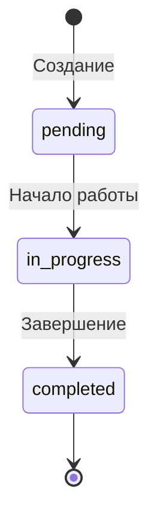
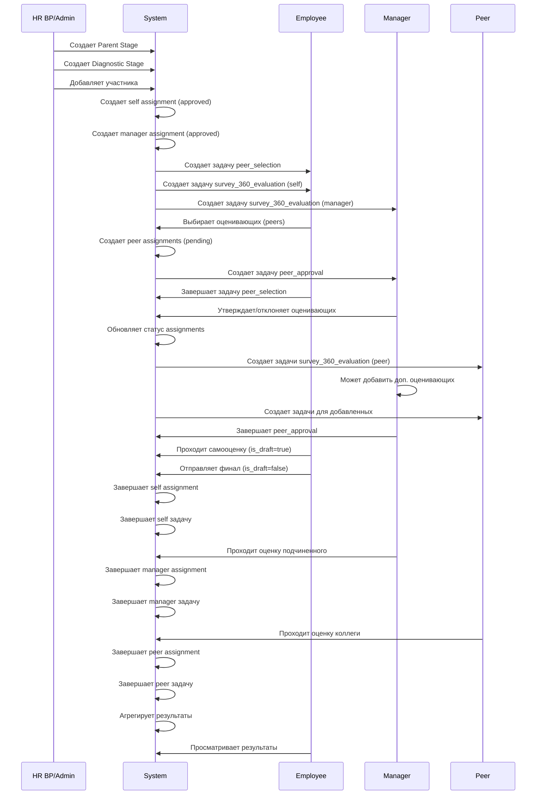
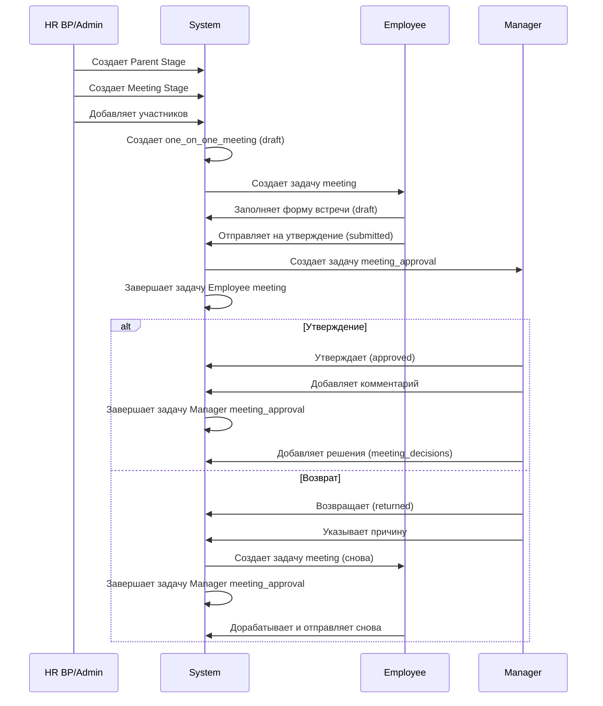
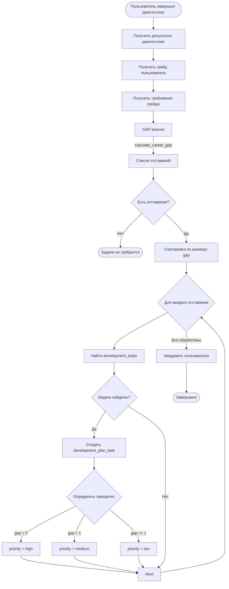
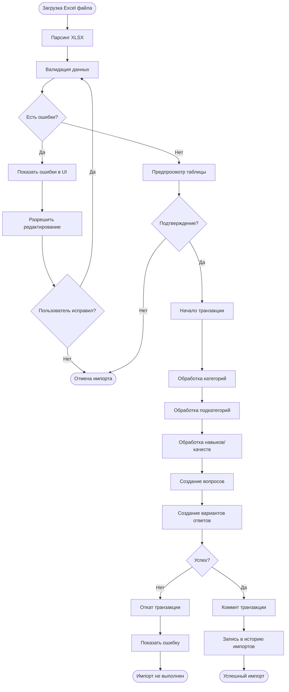

# АКТУАЛЬНАЯ ДОКУМЕНТАЦИЯ ПРОЕКТА V7

## Оглавление
1. [Общая структура проекта](#общая-структура-проекта)
2. [Архитектура базы данных](#архитектура-базы-данных)
3. [Бизнес-логика диагностики](#бизнес-логика-диагностики)
4. [Расчет средних значений](#расчет-средних-значений)
5. [Визуализация результатов](#визуализация-результатов)
6. [Шкалы оценки Hard/Soft Skills](#шкалы-оценки-hardsoft-skills)
7. [Импорт вопросов и ответов](#импорт-вопросов-и-ответов)
8. [Логика 1:1 встреч](#логика-11-встреч)
9. [Система задач](#система-задач)
10. [UML-диаграммы](#uml-диаграммы)

---

## Общая структура проекта

### Архитектура

**Фронтенд:**
- React 18 + TypeScript
- Vite (сборка)
- Tailwind CSS (дизайн-система)
- React Router (маршрутизация)
- React Query (управление состоянием и кэширование)
- Supabase JS Client (работа с БД)

**Бэкенд:**
- Supabase (PostgreSQL + Auth + Storage)
- Edge Functions (Deno runtime)
- Yandex Cloud Functions (шифрование PII)

**Интеграции:**
- Yandex Cloud для шифрования персональных данных (email, ФИО)

### Роли пользователей

| Роль | Код | Описание | Ключевые права |
|------|-----|----------|----------------|
| Сотрудник | `employee` | Базовая роль | Прохождение оценок, просмотр своих результатов, выбор оценивающих |
| Руководитель | `manager` | Управление подчиненными | Оценка подчиненных, утверждение оценивающих, добавление респондентов, просмотр результатов команды |
| HR BP | `hr_bp` | HR бизнес-партнер | Управление диагностикой, аналитика по компании, создание этапов |
| Администратор | `admin` | Полный доступ | Управление справочниками, пользователями, ролями, всеми данными системы |

### Система авторизации и доступа

**Таблицы ролей:**
```sql
-- Перечисление ролей
CREATE TYPE app_role AS ENUM ('employee', 'manager', 'hr_bp', 'admin');

-- Таблица ролей пользователей
CREATE TABLE user_roles (
  id UUID PRIMARY KEY DEFAULT gen_random_uuid(),
  user_id UUID REFERENCES auth.users(id) ON DELETE CASCADE,
  role app_role NOT NULL,
  UNIQUE(user_id, role)
);
```

**Таблица разрешений:**
```sql
-- Разрешения (permissions)
CREATE TABLE permissions (
  id UUID PRIMARY KEY,
  name TEXT NOT NULL,           -- например: "users.view"
  resource TEXT NOT NULL,        -- например: "users"
  action TEXT NOT NULL,          -- например: "view"
  description TEXT
);

-- Связь роли и разрешений
CREATE TABLE role_permissions (
  id UUID PRIMARY KEY,
  role app_role NOT NULL,
  permission_id UUID REFERENCES permissions(id)
);

-- Эффективные разрешения пользователя (кэш)
CREATE TABLE user_effective_permissions (
  id UUID PRIMARY KEY,
  user_id UUID NOT NULL,
  permission_name TEXT NOT NULL,
  UNIQUE(user_id, permission_name)
);
```

**Ключевые функции проверки доступа:**
- `has_permission(user_id, permission_name)` - проверка разрешения
- `has_role(user_id, role)` - проверка роли
- `is_users_manager(manager_id, user_id)` - проверка, является ли руководителем
- `refresh_user_effective_permissions(user_id)` - обновление кэша разрешений

**Guards (защита маршрутов):**
- `AuthGuard` - проверка авторизации
- Permission-based guards в RLS политиках
- Frontend role checks в компонентах

**Основные маршруты:**
- `/` - главная страница (дашборд)
- `/auth` - авторизация
- `/profile` - профиль пользователя
- `/tasks` - задачи
- `/assessment/*` - прохождение оценок
- `/assessment/results/:id` - результаты диагностики
- `/admin/*` - административные разделы (справочники)
- `/security` - управление пользователями и ролями
- `/hr/*` - HR аналитика и мониторинг
- `/meetings` - 1:1 встречи
- `/development/*` - планы развития

---

## Архитектура базы данных

### Пользователи и организационная структура

#### users
Основная таблица пользователей системы.

| Поле | Тип | Описание |
|------|-----|----------|
| id | UUID | PK, связь с auth.users |
| email | TEXT | Зашифрованный email (через Yandex Cloud) |
| first_name | TEXT | Зашифрованное имя |
| last_name | TEXT | Зашифрованная фамилия |
| middle_name | TEXT | Зашифрованное отчество |
| status | BOOLEAN | Активен/неактивен |
| department_id | UUID | Ссылка на departments |
| position_id | UUID | Ссылка на positions |
| grade_id | UUID | Ссылка на grades |
| manager_id | UUID | Ссылка на users (руководитель) |
| hire_date | DATE | Дата найма |
| last_login_at | TIMESTAMPTZ | Последний вход |

**Связи:**
- `department_id` → `departments.id`
- `position_id` → `positions.id`
- `grade_id` → `grades.id`
- `manager_id` → `users.id` (самосвязь)

**Бизнес-логика:**
- PII поля (email, ФИО) шифруются при создании через Edge Function
- Расшифровка происходит на фронтенде через Yandex Cloud Function
- Руководитель имеет доступ к данным подчиненных

#### companies
Компании в системе.

| Поле | Тип | Описание |
|------|-----|----------|
| id | UUID | PK |
| name | TEXT | Название |
| description | TEXT | Описание |

#### departments
Подразделения компаний.

| Поле | Тип | Описание |
|------|-----|----------|
| id | UUID | PK |
| name | TEXT | Название |
| company_id | UUID | FK → companies.id |
| description | TEXT | Описание |

#### positions
Должности.

| Поле | Тип | Описание |
|------|-----|----------|
| id | UUID | PK |
| name | TEXT | Название |
| position_category_id | UUID | FK → position_categories.id |

#### grades
Грейды (уровни должностей).

| Поле | Тип | Описание |
|------|-----|----------|
| id | UUID | PK |
| name | TEXT | Название |
| level | INTEGER | Уровень (порядок) |
| position_id | UUID | FK → positions.id |
| position_category_id | UUID | FK → position_categories.id |
| parent_grade_id | UUID | FK → grades.id (следующий грейд) |
| description | TEXT | Описание |
| key_tasks | TEXT | Ключевые задачи |
| min_salary | NUMERIC | Минимальная зарплата |
| max_salary | NUMERIC | Максимальная зарплата |
| certification_id | UUID | FK → certifications.id |

**Бизнес-логика:**
- Грейд определяет требуемые навыки через `grade_skills` и `grade_qualities`
- Используется для GAP-анализа и карьерных треков

---

### Компетенции и навыки

#### Категории Hard Skills

**category_hard_skills**
| Поле | Тип | Описание |
|------|-----|----------|
| id | UUID | PK |
| name | TEXT | Название категории |
| description | TEXT | Описание |

**sub_category_hard_skills**
| Поле | Тип | Описание |
|------|-----|----------|
| id | UUID | PK |
| name | TEXT | Название подкатегории |
| category_hard_skill_id | UUID | FK → category_hard_skills.id |
| description | TEXT | Описание |

**hard_skills**
| Поле | Тип | Описание |
|------|-----|----------|
| id | UUID | PK |
| name | TEXT | Название навыка |
| category_id | UUID | FK → category_hard_skills.id |
| sub_category_id | UUID | FK → sub_category_hard_skills.id |
| description | TEXT | Описание |

**Связь:**
`hard_skills` → `sub_category_hard_skills` → `category_hard_skills`

**Триггер валидации:**
```sql
CREATE TRIGGER validate_hard_skill_subcategory
BEFORE INSERT OR UPDATE ON hard_skills
FOR EACH ROW EXECUTE FUNCTION validate_hard_skill_subcategory();
```
Проверяет, что подкатегория принадлежит указанной категории.

#### Категории Soft Skills

**category_soft_skills**
| Поле | Тип | Описание |
|------|-----|----------|
| id | UUID | PK |
| name | TEXT | Название категории |
| description | TEXT | Описание |

**sub_category_soft_skills**
| Поле | Тип | Описание |
|------|-----|----------|
| id | UUID | PK |
| name | TEXT | Название подкатегории |
| category_soft_skill_id | UUID | FK → category_soft_skills.id |
| description | TEXT | Описание |

**soft_skills** (качества)
| Поле | Тип | Описание |
|------|-----|----------|
| id | UUID | PK |
| name | TEXT | Название качества |
| category_id | UUID | FK → category_soft_skills.id |
| sub_category_id | UUID | FK → sub_category_soft_skills.id |
| description | TEXT | Описание |

**Связь:**
`soft_skills` → `sub_category_soft_skills` → `category_soft_skills`

**Триггер валидации:**
```sql
CREATE TRIGGER validate_soft_skill_subcategory
BEFORE INSERT OR UPDATE ON soft_skills
FOR EACH ROW EXECUTE FUNCTION validate_soft_skill_subcategory();
```

#### Требования грейдов к компетенциям

**grade_skills** - требуемые Hard Skills для грейда
| Поле | Тип | Описание |
|------|-----|----------|
| id | UUID | PK |
| grade_id | UUID | FK → grades.id |
| skill_id | UUID | FK → hard_skills.id |
| target_level | NUMERIC | Требуемый уровень (0-3) |

**grade_qualities** - требуемые Soft Skills для грейда
| Поле | Тип | Описание |
|------|-----|----------|
| id | UUID | PK |
| grade_id | UUID | FK → grades.id |
| quality_id | UUID | FK → soft_skills.id |
| target_level | NUMERIC | Требуемый уровень (0-4) |

---

### Вопросы и ответы

#### answer_categories
Категории вариантов ответов (шкалы оценки).

| Поле | Тип | Описание |
|------|-----|----------|
| id | UUID | PK |
| name | TEXT | Название категории |
| description | TEXT | Описание |
| question_type | TEXT | 'hard', 'soft', 'both' |

**Значения question_type:**
- `'hard'` - только для Hard Skills вопросов
- `'soft'` - только для Soft Skills вопросов
- `'both'` - универсальная категория

**Бизнес-логика:**
- При выборе категории для вопроса фильтруются только подходящие по типу
- Используется для разделения шкал Hard (0-3) и Soft (0-4)

#### hard_skill_answer_options
Варианты ответов для Hard Skills.

| Поле | Тип | Описание |
|------|-----|----------|
| id | UUID | PK |
| answer_category_id | UUID | FK → answer_categories.id |
| title | TEXT | Текст варианта |
| description | TEXT | Описание |
| label | TEXT | Короткая метка |
| numeric_value | INTEGER | Числовое значение |
| level_value | INTEGER | Уровень (0-3) |
| order_index | INTEGER | Порядок отображения |

**ВАЖНО:** level_value для Hard Skills - от 0 до 3 (обновлено в V7).

#### soft_skill_answer_options
Варианты ответов для Soft Skills.

| Поле | Тип | Описание |
|------|-----|----------|
| id | UUID | PK |
| answer_category_id | UUID | FK → answer_categories.id |
| label | TEXT | Текст варианта |
| description | TEXT | Описание |
| numeric_value | INTEGER | Числовое значение |
| level_value | INTEGER | Уровень (0-4) |
| order_index | INTEGER | Порядок отображения |

**ВАЖНО:** level_value для Soft Skills - от 0 до 4.

#### hard_skill_questions
Вопросы для оценки Hard Skills.

| Поле | Тип | Описание |
|------|-----|----------|
| id | UUID | PK |
| question_text | TEXT | Текст вопроса |
| skill_id | UUID | FK → hard_skills.id |
| answer_category_id | UUID | FK → answer_categories.id |
| order_index | INTEGER | Порядок вопроса |

**Связь с категорией:**
- Категория вопроса НЕ хранится в таблице (удалена в рефакторинге V7)
- Категория определяется через `skill_id` → `hard_skills.category_id`

#### soft_skill_questions
Вопросы для оценки Soft Skills.

| Поле | Тип | Описание |
|------|-----|----------|
| id | UUID | PK |
| question_text | TEXT | Текст вопроса |
| quality_id | UUID | FK → soft_skills.id |
| answer_category_id | UUID | FK → answer_categories.id |
| order_index | INTEGER | Порядок вопроса |
| behavioral_indicators | TEXT | Поведенческие индикаторы |

**Связь с категорией:**
- Категория определяется через `quality_id` → `soft_skills.category_id`

---

### Диагностика и оценка

#### parent_stages
Родительские этапы (периоды диагностики).

| Поле | Тип | Описание |
|------|-----|----------|
| id | UUID | PK |
| period | TEXT | Название периода (H1 2024, H2 2024) |
| start_date | DATE | Дата начала |
| end_date | DATE | Дата окончания |
| deadline_date | DATE | Крайний срок выполнения |
| is_active | BOOLEAN | Активен ли этап |
| created_by | UUID | FK → users.id |

**Бизнес-логика:**
- Один активный период на момент времени
- Содержит дочерние diagnostic_stages и meeting_stages

#### diagnostic_stages
Этапы диагностики (оценки 360).

| Поле | Тип | Описание |
|------|-----|----------|
| id | UUID | PK |
| parent_id | UUID | FK → parent_stages.id |
| status | TEXT | 'setup', 'active', 'completed' |
| evaluation_period | TEXT | Период оценки (H1_2024) |
| is_active | BOOLEAN | Активен ли этап |
| progress_percent | NUMERIC | Процент выполнения |
| created_by | UUID | FK → users.id |

**Статусы:**
- `setup` - настройка этапа
- `active` - идет оценка
- `completed` - завершен

**Триггер установки статуса:**
```sql
CREATE TRIGGER set_diagnostic_stage_status_trigger
BEFORE INSERT OR UPDATE ON diagnostic_stages
FOR EACH ROW EXECUTE FUNCTION set_diagnostic_stage_status();
```
Автоматически определяет статус на основе дат parent_stage.

#### diagnostic_stage_participants
Участники диагностического этапа.

| Поле | Тип | Описание |
|------|-----|----------|
| id | UUID | PK |
| stage_id | UUID | FK → diagnostic_stages.id |
| user_id | UUID | FK → users.id |

**Триггеры:**
1. `assign_surveys_to_diagnostic_participant_trigger` - создает самооценку и оценку руководителя
2. `create_diagnostic_task_for_participant_trigger` - создает задачу peer_selection
3. `delete_diagnostic_tasks_on_participant_remove_trigger` - удаляет задачи при удалении участника

**Бизнес-логика:**
- При добавлении участника автоматически создаются:
  - Самооценка (self assignment)
  - Оценка руководителя (manager assignment)
  - Задача выбора оценивающих (peer_selection task)

#### survey_360_assignments
Назначения оценок 360 (кто кого оценивает).

| Поле | Тип | Описание |
|------|-----|----------|
| id | UUID | PK |
| evaluated_user_id | UUID | FK → users.id (оцениваемый) |
| evaluating_user_id | UUID | FK → users.id (оценивающий) |
| diagnostic_stage_id | UUID | FK → diagnostic_stages.id |
| assignment_type | TEXT | 'self', 'manager', 'peer' |
| status | TEXT | 'pending', 'approved', 'rejected', 'completed' |
| added_by_manager | BOOLEAN | Добавил ли руководитель |
| is_manager_participant | BOOLEAN | Является ли оценивающий руководителем |
| approved_by | UUID | FK → users.id |
| approved_at | TIMESTAMPTZ | Дата утверждения |
| rejected_at | TIMESTAMPTZ | Дата отклонения |
| rejection_reason | TEXT | Причина отклонения |

**Типы назначений:**
- `self` - самооценка
- `manager` - оценка руководителем
- `peer` - оценка коллегой

**Статусы:**
- `pending` - ожидает утверждения
- `approved` - утверждено
- `rejected` - отклонено
- `completed` - оценка завершена

**Триггер создания задач:**
```sql
CREATE TRIGGER create_task_on_assignment_approval_trigger
AFTER INSERT OR UPDATE ON survey_360_assignments
FOR EACH ROW EXECUTE FUNCTION create_task_on_assignment_approval();
```
Создает задачу типа `survey_360_evaluation` при утверждении назначения.

**Уникальность:**
- UNIQUE(evaluated_user_id, evaluating_user_id) - один пользователь не может оценивать другого дважды

#### hard_skill_results
Результаты оценки Hard Skills.

| Поле | Тип | Описание |
|------|-----|----------|
| id | UUID | PK |
| evaluated_user_id | UUID | FK → users.id (оцениваемый) |
| evaluating_user_id | UUID | FK → users.id (оценивающий) |
| question_id | UUID | FK → hard_skill_questions.id |
| answer_option_id | UUID | FK → hard_skill_answer_options.id |
| assignment_id | UUID | FK → survey_360_assignments.id |
| diagnostic_stage_id | UUID | FK → diagnostic_stages.id |
| evaluation_period | TEXT | Период (H1_2024) |
| is_draft | BOOLEAN | Черновик или финальный |
| comment | TEXT | Комментарий |
| is_anonymous_comment | BOOLEAN | Анонимен ли комментарий |

**Триггеры:**
1. `set_evaluation_period_trigger` - автоматически устанавливает evaluation_period
2. `update_assignment_on_hard_skill_completion_trigger` - обновляет статус assignment при завершении
3. `update_user_skills_from_hard_survey_trigger` - обновляет user_skills

**Логика is_draft:**
- `true` - черновик, автосохранение, не учитывается в результатах
- `false` - финальный ответ, учитывается в расчетах

**Логика is_anonymous_comment:**
- Самооценка (self): НЕ анонимна
- Оценка руководителя (manager): НЕ анонимна
- Оценка коллег (peer): АНОНИМНА

#### soft_skill_results
Результаты оценки Soft Skills.

| Поле | Тип | Описание |
|------|-----|----------|
| id | UUID | PK |
| evaluated_user_id | UUID | FK → users.id (оцениваемый) |
| evaluating_user_id | UUID | FK → users.id (оценивающий) |
| question_id | UUID | FK → soft_skill_questions.id |
| answer_option_id | UUID | FK → soft_skill_answer_options.id |
| assignment_id | UUID | FK → survey_360_assignments.id |
| diagnostic_stage_id | UUID | FK → diagnostic_stages.id |
| evaluation_period | TEXT | Период (H1_2024) |
| is_draft | BOOLEAN | Черновик или финальный |
| comment | TEXT | Комментарий |
| is_anonymous_comment | BOOLEAN | Анонимен ли комментарий |

**Триггеры:** аналогичны hard_skill_results.

#### user_assessment_results
Агрегированные результаты оценки (кэш).

| Поле | Тип | Описание |
|------|-----|----------|
| id | UUID | PK |
| user_id | UUID | FK → users.id |
| skill_id | UUID | FK → hard_skills.id |
| quality_id | UUID | FK → soft_skills.id |
| diagnostic_stage_id | UUID | FK → diagnostic_stages.id |
| assessment_period | TEXT | Период оценки |
| self_assessment | NUMERIC | Самооценка |
| manager_assessment | NUMERIC | Оценка руководителя |
| peers_average | NUMERIC | Среднее коллег |
| total_responses | INTEGER | Количество ответов |

**Бизнес-логика:**
- Агрегированные данные для быстрого доступа
- Обновляется триггерами при сохранении результатов

---

### Задачи

#### tasks
Задачи пользователей.

| Поле | Тип | Описание |
|------|-----|----------|
| id | UUID | PK |
| user_id | UUID | FK → users.id (исполнитель) |
| title | TEXT | Заголовок |
| description | TEXT | Описание |
| status | TEXT | 'pending', 'in_progress', 'completed' |
| task_type | TEXT | Тип задачи |
| category | TEXT | Категория |
| assignment_type | TEXT | 'self', 'manager', 'peer' |
| assignment_id | UUID | FK → survey_360_assignments.id |
| diagnostic_stage_id | UUID | FK → diagnostic_stages.id |
| competency_ref | TEXT | Ссылка на компетенцию |
| deadline | TIMESTAMPTZ | Крайний срок |
| priority | TEXT | Приоритет |
| kpi_expected_level | NUMERIC | Ожидаемый уровень KPI |
| kpi_result_level | NUMERIC | Достигнутый уровень KPI |

**Типы задач (task_type):**
- `peer_selection` - выбор оценивающих сотрудником
- `peer_approval` - утверждение оценивающих руководителем
- `survey_360_evaluation` - прохождение оценки 360
- `self_assessment` - самооценка (deprecated, используется survey_360_evaluation)
- `diagnostic_stage` - общая задача диагностики
- `meeting` - 1:1 встреча
- `development` - задача развития

**Статусы:**
- `pending` - ожидает выполнения
- `in_progress` - в процессе
- `completed` - завершена

**Триггер валидации:**
```sql
CREATE TRIGGER validate_task_diagnostic_stage_id_trigger
BEFORE INSERT ON tasks
FOR EACH ROW EXECUTE FUNCTION validate_task_diagnostic_stage_id();
```
Проверяет обязательность diagnostic_stage_id для определенных типов задач.

**Триггер обновления статуса:**
```sql
CREATE TRIGGER update_task_status_on_assignment_change_trigger
AFTER UPDATE ON survey_360_assignments
FOR EACH ROW EXECUTE FUNCTION update_task_status_on_assignment_change();
```
Обновляет статус задачи при изменении статуса assignment.

---

### Встречи 1:1

#### meeting_stages
Этапы встреч 1:1.

| Поле | Тип | Описание |
|------|-----|----------|
| id | UUID | PK |
| parent_id | UUID | FK → parent_stages.id |
| created_by | UUID | FK → users.id |

#### meeting_stage_participants
Участники этапа встреч.

| Поле | Тип | Описание |
|------|-----|----------|
| id | UUID | PK |
| stage_id | UUID | FK → meeting_stages.id |
| user_id | UUID | FK → users.id |

#### one_on_one_meetings
Встречи 1:1 между сотрудником и руководителем.

| Поле | Тип | Описание |
|------|-----|----------|
| id | UUID | PK |
| stage_id | UUID | FK → meeting_stages.id |
| employee_id | UUID | FK → users.id |
| manager_id | UUID | FK → users.id |
| status | TEXT | 'draft', 'submitted', 'approved', 'returned' |
| meeting_date | TIMESTAMPTZ | Дата встречи |
| goal_and_agenda | TEXT | Цель и повестка |
| previous_decisions_debrief | TEXT | Разбор предыдущих решений |
| energy_gained | TEXT | Что прибавило энергии |
| energy_lost | TEXT | Что отняло энергию |
| stoppers | TEXT | Что мешает |
| manager_comment | TEXT | Комментарий руководителя |
| submitted_at | TIMESTAMPTZ | Дата отправки |
| approved_at | TIMESTAMPTZ | Дата утверждения |
| returned_at | TIMESTAMPTZ | Дата возврата |
| return_reason | TEXT | Причина возврата |

**Статусы:**
- `draft` - черновик
- `submitted` - отправлено на утверждение
- `approved` - утверждено
- `returned` - возвращено на доработку

#### meeting_decisions
Решения, принятые на встречах.

| Поле | Тип | Описание |
|------|-----|----------|
| id | UUID | PK |
| meeting_id | UUID | FK → one_on_one_meetings.id |
| decision_text | TEXT | Текст решения |
| is_completed | BOOLEAN | Выполнено ли |
| created_by | UUID | FK → users.id |

---

### Развитие

#### user_career_progress
Прогресс пользователя по карьерному треку.

| Поле | Тип | Описание |
|------|-----|----------|
| id | UUID | PK |
| user_id | UUID | FK → users.id |
| career_track_id | UUID | FK → career_tracks.id |
| current_step_id | UUID | FK → career_track_steps.id |
| status | TEXT | 'active', 'completed', 'paused' |
| selected_at | TIMESTAMPTZ | Дата выбора трека |

#### development_plan_tasks
Задачи плана развития.

| Поле | Тип | Описание |
|------|-----|----------|
| id | UUID | PK |
| user_id | UUID | FK → users.id |
| title | TEXT | Название задачи |
| goal | TEXT | Цель |
| how_to | TEXT | Как выполнить |
| measurable_result | TEXT | Измеримый результат |
| priority | TEXT | Приоритет |
| hard_skill_id | UUID | FK → hard_skills.id |
| soft_skill_id | UUID | FK → soft_skills.id |
| career_track_id | UUID | FK → career_tracks.id |
| career_track_step_id | UUID | FK → career_track_steps.id |
| task_id | UUID | FK → tasks.id |

**Бизнес-логика:**
- Автоматическая генерация на основе GAP-анализа
- Привязка к конкретному навыку или качеству
- Связь с карьерным треком

---

## Бизнес-логика диагностики

### Обзор процесса диагностики 360

Диагностика 360 - это процесс всесторонней оценки сотрудника, включающий:
1. Самооценку
2. Оценку руководителя
3. Оценку коллег (peers)

### Этапы диагностики

#### 1. Создание Parent Stage (Родительский этап)

**Создает:** HR BP или Admin

**Поля:**
- Период (H1 2024, H2 2024)
- Дата начала
- Дата окончания
- Крайний срок (deadline)

**Действия:**
```sql
INSERT INTO parent_stages (period, start_date, end_date, deadline_date)
VALUES ('H1 2024', '2024-01-01', '2024-06-30', '2024-07-15');
```

#### 2. Создание Diagnostic Stage

**Создает:** HR BP или Admin

**Действия:**
1. Создание записи в `diagnostic_stages`:
```sql
INSERT INTO diagnostic_stages (parent_id, created_by)
VALUES (parent_stage_id, current_user_id);
```

2. Автоматическая установка статуса через триггер на основе дат parent_stage

#### 3. Добавление участников

**Создает:** HR BP, Admin или Manager (для своих подчиненных)

**Процесс добавления участника:**

1. Вставка в `diagnostic_stage_participants`:
```sql
INSERT INTO diagnostic_stage_participants (stage_id, user_id)
VALUES (stage_id, participant_user_id);
```

2. **Триггер `assign_surveys_to_diagnostic_participant_trigger`** автоматически создает:

   a) **Самооценку:**
   ```sql
   INSERT INTO survey_360_assignments (
     evaluated_user_id,
     evaluating_user_id,
     diagnostic_stage_id,
     assignment_type,
     status,
     approved_at,
     approved_by
   ) VALUES (
     participant_id,
     participant_id,      -- сам себя
     stage_id,
     'self',
     'approved',
     now(),
     manager_id           -- утверждает руководитель
   );
   ```

   b) **Оценку руководителя:**
   ```sql
   INSERT INTO survey_360_assignments (
     evaluated_user_id,
     evaluating_user_id,
     diagnostic_stage_id,
     assignment_type,
     status,
     is_manager_participant,
     approved_at,
     approved_by
   ) VALUES (
     participant_id,
     manager_id,
     stage_id,
     'manager',
     'approved',
     true,
     now(),
     manager_id
   );
   ```

3. **Триггер `create_diagnostic_task_for_participant_trigger`** создает задачу выбора оценивающих:
   ```sql
   INSERT INTO tasks (
     user_id,
     diagnostic_stage_id,
     title,
     description,
     status,
     task_type,
     category
   ) VALUES (
     participant_id,
     stage_id,
     'Сформировать и отправить список оценивающих',
     'Выберите коллег для оценки 360',
     'pending',
     'peer_selection',
     'assessment'
   );
   ```

#### 4. Выбор оценивающих сотрудником (Peer Selection)

**Кто:** Участник диагностики (employee)

**Процесс:**

1. Сотрудник открывает задачу `peer_selection`
2. Видит список всех сотрудников компании с ролями `employee` и `manager`
3. **Исключения:**
   - Роли `hr_bp` и `admin` не показываются
   - Себя не может выбрать
   - Руководителя не может выбрать (уже назначен автоматически)

4. Выбирает коллег и нажимает "Отправить список"

5. **Создаются assignments:**
   ```sql
   INSERT INTO survey_360_assignments (
     evaluated_user_id,
     evaluating_user_id,
     diagnostic_stage_id,
     assignment_type,
     status,
     added_by_manager
   ) VALUES (
     participant_id,
     selected_peer_id,
     stage_id,
     'peer',
     'pending',        -- ждет утверждения руководителя
     false
   );
   ```

6. **Создается задача для руководителя:**
   ```sql
   INSERT INTO tasks (
     user_id,
     diagnostic_stage_id,
     title,
     description,
     status,
     task_type,
     category
   ) VALUES (
     manager_id,
     stage_id,
     'Утвердить оценивающих для [ФИО сотрудника]',
     'Проверьте и утвердите список оценивающих',
     'pending',
     'peer_approval',
     'assessment'
   );
   ```

7. **Задача peer_selection переходит в completed:**
   ```sql
   UPDATE tasks
   SET status = 'completed'
   WHERE task_type = 'peer_selection'
     AND user_id = participant_id
     AND diagnostic_stage_id = stage_id;
   ```

#### 5. Утверждение оценивающих руководителем (Peer Approval)

**Кто:** Руководитель участника

**Процесс:**

1. Руководитель открывает задачу `peer_approval`
2. Видит список выбранных сотрудником оценивающих

3. **Варианты действий:**

   a) **Утвердить оценивающего:**
   ```sql
   UPDATE survey_360_assignments
   SET status = 'approved',
       approved_by = manager_id,
       approved_at = now()
   WHERE id = assignment_id;
   ```
   
   **Триггер создает задачу для оценивающего:**
   ```sql
   INSERT INTO tasks (
     user_id,
     assignment_id,
     diagnostic_stage_id,
     title,
     description,
     status,
     task_type,
     category,
     assignment_type
   ) VALUES (
     peer_id,
     assignment_id,
     stage_id,
     'Оценка 360: [ФИО оцениваемого]',
     'Необходимо пройти оценку 360',
     'pending',
     'survey_360_evaluation',
     'assessment',
     'peer'
   );
   ```

   b) **Отклонить оценивающего:**
   ```sql
   UPDATE survey_360_assignments
   SET status = 'rejected',
       rejected_at = now(),
       rejection_reason = NULL  -- причина не требуется
   WHERE id = assignment_id;
   ```

   c) **Добавить дополнительного оценивающего:**
   ```sql
   INSERT INTO survey_360_assignments (
     evaluated_user_id,
     evaluating_user_id,
     diagnostic_stage_id,
     assignment_type,
     status,
     added_by_manager,
     approved_by,
     approved_at
   ) VALUES (
     participant_id,
     additional_peer_id,
     stage_id,
     'peer',
     'approved',
     true,              -- добавлено руководителем
     manager_id,
     now()
   );
   ```
   
   **Триггер автоматически создает задачу для добавленного оценивающего.**

4. **Завершение утверждения:**
   Когда руководитель обработал всех (утвердил/отклонил) и нажал "Завершить":
   ```sql
   UPDATE tasks
   SET status = 'completed'
   WHERE task_type = 'peer_approval'
     AND user_id = manager_id
     AND diagnostic_stage_id = stage_id
     AND title LIKE '%[ФИО сотрудника]%';
   ```

#### 6. Прохождение оценок

**Кто:** Все, у кого есть задачи `survey_360_evaluation`

**Типы оценок:**
1. **Самооценка** (assignment_type = 'self')
2. **Оценка руководителем** (assignment_type = 'manager')
3. **Оценка коллегой** (assignment_type = 'peer')

**Процесс прохождения:**

1. Пользователь открывает оценку через задачу
2. Отвечает на вопросы Hard Skills и Soft Skills
3. **Автосохранение (draft):**
   ```sql
   INSERT INTO hard_skill_results (
     evaluated_user_id,
     evaluating_user_id,
     question_id,
     answer_option_id,
     assignment_id,
     diagnostic_stage_id,
     is_draft,
     is_anonymous_comment
   ) VALUES (
     evaluated_id,
     evaluator_id,
     question_id,
     option_id,
     assignment_id,
     stage_id,
     true,              -- черновик
     CASE 
       WHEN assignment_type = 'peer' THEN true
       ELSE false
     END
   );
   ```

4. **Финальная отправка:**
   ```sql
   UPDATE hard_skill_results
   SET is_draft = false
   WHERE assignment_id = assignment_id
     AND evaluating_user_id = current_user_id;
   
   UPDATE soft_skill_results
   SET is_draft = false
   WHERE assignment_id = assignment_id
     AND evaluating_user_id = current_user_id;
   ```

5. **Триггер обновляет assignment:**
   ```sql
   UPDATE survey_360_assignments
   SET status = 'completed',
       updated_at = now()
   WHERE id = assignment_id;
   ```

6. **Триггер обновляет задачу:**
   ```sql
   UPDATE tasks
   SET status = 'completed',
       updated_at = now()
   WHERE assignment_id = assignment_id;
   ```

### Логика анонимности комментариев

**Правила:**
- **Самооценка (self):** комментарии НЕ анонимны (`is_anonymous_comment = false`)
- **Оценка руководителя (manager):** комментарии НЕ анонимны (`is_anonymous_comment = false`)
- **Оценка коллег (peer):** комментарии АНОНИМНЫ (`is_anonymous_comment = true`)

**Отображение:**
- Неанонимные: показывается "От: [ФИО оценивающего]"
- Анонимные: показывается "От: Анонимно"

### Логика автосохранения

**Механизм:**
- При выборе ответа на вопрос данные сохраняются с `is_draft = true`
- При переходе между вопросами draft обновляется
- При финальной отправке все ответы помечаются `is_draft = false`

**Продолжение оценки:**
- При открытии незавершенной оценки загружаются draft ответы
- Пользователь видит свои предыдущие ответы
- Может изменить их до финальной отправки

### Триггеры диагностики

#### assign_surveys_to_diagnostic_participant()
```sql
CREATE FUNCTION assign_surveys_to_diagnostic_participant()
RETURNS TRIGGER AS $$
DECLARE
  manager_user_id UUID;
BEGIN
  -- Получаем руководителя
  SELECT manager_id INTO manager_user_id
  FROM users WHERE id = NEW.user_id;
  
  -- Создаем самооценку
  INSERT INTO survey_360_assignments (
    evaluated_user_id, evaluating_user_id,
    diagnostic_stage_id, assignment_type,
    status, approved_at, approved_by
  ) VALUES (
    NEW.user_id, NEW.user_id,
    NEW.stage_id, 'self',
    'approved', now(), manager_user_id
  ) ON CONFLICT (evaluated_user_id, evaluating_user_id) DO NOTHING;
  
  -- Создаем оценку руководителя
  IF manager_user_id IS NOT NULL THEN
    INSERT INTO survey_360_assignments (
      evaluated_user_id, evaluating_user_id,
      diagnostic_stage_id, assignment_type,
      status, is_manager_participant,
      approved_at, approved_by
    ) VALUES (
      NEW.user_id, manager_user_id,
      NEW.stage_id, 'manager',
      'approved', true,
      now(), manager_user_id
    ) ON CONFLICT (evaluated_user_id, evaluating_user_id) DO NOTHING;
  END IF;
  
  RETURN NEW;
END;
$$ LANGUAGE plpgsql;
```

#### create_diagnostic_task_for_participant()
```sql
CREATE FUNCTION create_diagnostic_task_for_participant()
RETURNS TRIGGER AS $$
BEGIN
  -- Создаем задачу выбора оценивающих
  INSERT INTO tasks (
    user_id, diagnostic_stage_id,
    title, description,
    status, task_type, category
  ) VALUES (
    NEW.user_id, NEW.stage_id,
    'Сформировать и отправить список оценивающих',
    'Выберите коллег для оценки 360',
    'pending', 'peer_selection', 'assessment'
  );
  
  RETURN NEW;
END;
$$ LANGUAGE plpgsql;
```

#### create_task_on_assignment_approval()
```sql
CREATE FUNCTION create_task_on_assignment_approval()
RETURNS TRIGGER AS $$
DECLARE
  evaluated_user_name TEXT;
  task_title TEXT;
  task_description TEXT;
BEGIN
  -- Только для диагностических assignments
  IF NEW.diagnostic_stage_id IS NULL THEN
    RETURN NEW;
  END IF;
  
  -- Только при утверждении
  IF NEW.status = 'approved' AND (OLD IS NULL OR OLD.status != 'approved') THEN
    -- Получаем ФИО оцениваемого
    SELECT CONCAT(last_name, ' ', first_name, ' ', COALESCE(middle_name, ''))
    INTO evaluated_user_name
    FROM users WHERE id = NEW.evaluated_user_id;
    
    -- Формируем заголовок задачи
    IF NEW.evaluating_user_id = NEW.evaluated_user_id THEN
      task_title := 'Самооценка 360';
      task_description := 'Необходимо пройти самооценку 360';
    ELSE
      task_title := 'Оценка 360: ' || evaluated_user_name;
      task_description := 'Необходимо пройти оценку 360 для ' || evaluated_user_name;
    END IF;
    
    -- Создаем задачу
    INSERT INTO tasks (
      user_id, assignment_id, title, description,
      status, task_type, category, assignment_type
    ) VALUES (
      NEW.evaluating_user_id, NEW.id, task_title, task_description,
      'pending', 'survey_360_evaluation', 'assessment', NEW.assignment_type
    );
  END IF;
  
  RETURN NEW;
END;
$$ LANGUAGE plpgsql;
```

#### update_assignment_on_survey_completion()
```sql
CREATE FUNCTION update_assignment_on_survey_completion()
RETURNS TRIGGER AS $$
BEGIN
  -- При завершении оценки (is_draft = false)
  IF NEW.is_draft = false AND NEW.assignment_id IS NOT NULL THEN
    UPDATE survey_360_assignments
    SET status = 'completed', updated_at = now()
    WHERE id = NEW.assignment_id AND status != 'completed';
  END IF;
  
  RETURN NEW;
END;
$$ LANGUAGE plpgsql;
```

#### update_task_status_on_assignment_change()
```sql
CREATE FUNCTION update_task_status_on_assignment_change()
RETURNS TRIGGER AS $$
BEGIN
  -- При завершении assignment завершаем задачу
  IF NEW.status = 'completed' AND (OLD IS NULL OR OLD.status != 'completed') THEN
    UPDATE tasks
    SET status = 'completed', updated_at = now()
    WHERE assignment_id = NEW.id AND status != 'completed';
  END IF;
  
  RETURN NEW;
END;
$$ LANGUAGE plpgsql;
```

---

## Расчет средних значений

### Проблема предыдущей версии

**Неправильно (V1-V6):**
1. Рассчитывали среднее по каждому навыку
2. Усредняли средние навыков между собой

**Пример ошибки:**
- Навык A: 3 оценки (2, 2, 2) → среднее = 2
- Навык B: 1 оценка (4) → среднее = 4
- Среднее по группе (неправильно): (2 + 4) / 2 = 3

**Правильно:**
- Все оценки: 2, 2, 2, 4
- Среднее по группе: (2 + 2 + 2 + 4) / 4 = 2.5

### Правильная модель V7

#### Среднее по навыку
```
среднее_по_навыку = сумма_всех_оценок_навыка / количество_оценок_навыка
```

**Пример:**
```sql
SELECT 
  skill_id,
  AVG(ao.level_value) as skill_average
FROM hard_skill_results hsr
JOIN hard_skill_answer_options ao ON ao.id = hsr.answer_option_id
WHERE hsr.evaluated_user_id = user_id
  AND hsr.is_draft = false
GROUP BY skill_id;
```

#### Среднее по группе навыков
```
среднее_по_группе = сумма_ВСЕХ_оценок_группы / количество_ВСЕХ_оценок_группы
```

**НЕ делаем:** усреднение средних навыков!

**Пример для категории:**
```sql
SELECT 
  c.id as category_id,
  AVG(ao.level_value) as category_average
FROM hard_skill_results hsr
JOIN hard_skill_answer_options ao ON ao.id = hsr.answer_option_id
JOIN hard_skill_questions q ON q.id = hsr.question_id
JOIN hard_skills s ON s.id = q.skill_id
JOIN category_hard_skills c ON c.id = s.category_id
WHERE hsr.evaluated_user_id = user_id
  AND hsr.is_draft = false
  AND c.id = category_id
-- Не делаем GROUP BY skill_id! Сразу среднее по всем оценкам категории
GROUP BY c.id;
```

### Правила расчета

1. **Только реальные оценки:**
   - Фильтруем `is_draft = false`
   - Не учитываем черновики

2. **Прямое усреднение:**
   - Суммируем все `level_value` в группе
   - Делим на количество оценок

3. **Вес пропорционален количеству:**
   - Навык с 10 оценками весит в 10 раз больше навыка с 1 оценкой
   - Автоматически учитывается при прямом усреднении

4. **Округление:**
   - До сотых: `ROUND(AVG(...), 2)`

5. **Единый метод везде:**
   - Роза компетенций
   - Столбчатые диаграммы
   - Агрегаты (самооценка, руководитель, коллеги)
   - Детализация результатов

### Реализация в коде

**useCorrectAssessmentResults.ts** - хук для расчета результатов:

```typescript
// Пример расчета для Hard Skills категории
const categoryAverage = useMemo(() => {
  const allRatingsInCategory = hardSkillResults
    .filter(r => !r.is_draft)
    .filter(r => r.skill?.category_id === selectedCategoryId)
    .flatMap(r => r.level_value);
  
  if (allRatingsInCategory.length === 0) return 0;
  
  const sum = allRatingsInCategory.reduce((acc, val) => acc + val, 0);
  const avg = sum / allRatingsInCategory.length;
  
  return Math.round(avg * 100) / 100; // округление до сотых
}, [hardSkillResults, selectedCategoryId]);
```

**Ключевые моменты:**
- `flatMap` - получаем все оценки, не группируя по навыкам
- Прямое суммирование и деление
- Округление до сотых

---

## Визуализация результатов

### Страница результатов

**URL:** `/assessment/results/:diagnosticStageId`

**Компонент:** `AssessmentResultsPage.tsx`

### Единый глобальный фильтр

**Компонент:** `CompetencyFilter.tsx`

**Типы фильтров:**
```typescript
type CompetencyFilterType = 
  | 'hard_skills'
  | 'soft_skills'
  | 'hard_categories'
  | 'soft_categories'
  | 'hard_subcategories'
  | 'soft_subcategories';
```

**Удалено в V7:** опция "Все компетенции"

**Логика работы:**
1. Пользователь выбирает тип фильтра в селекте
2. Фильтр передается во все компоненты визуализации
3. Все графики и таблицы обновляются синхронно

### Компоненты визуализации

#### 1. Роза компетенций (RadarChartResults.tsx)

**Особенности V7:**

1. **Динамическая шкала:**
   ```typescript
   const maxValue = useMemo(() => {
     const values = data.flatMap(d => [
       d.self_assessment,
       d.manager_assessment,
       d.peers_average
     ]).filter(v => v !== null && v !== undefined);
     
     return Math.max(...values);
   }, [data]);
   ```
   - Если максимальное значение = 3, шкала 0-3
   - Если максимальное значение = 4, шкала 0-4

2. **Tick marks на лучах:**
   ```typescript
   <PolarRadiusAxis 
     angle={90} 
     domain={[0, maxValue]}
     tick={{ fill: 'hsl(var(--foreground))' }}
   />
   ```
   - Отметки на каждом уровне шкалы
   - Улучшают читаемость

3. **Фильтрация данных:**
   - Показываются только компетенции, соответствующие выбранному фильтру
   - Hard Skills: используется max = 3
   - Soft Skills: используется max = 4

#### 2. Горизонтальные столбчатые диаграммы (HorizontalBarChart.tsx)

**Особенности V7:**

1. **Нижняя шкала X:**
   ```typescript
   <XAxis 
     type="number"
     domain={[0, maxValue]}
     orientation="bottom"
   />
   ```
   - Показывает шкалу от 0 до max
   - max зависит от типа компетенций (3 или 4)

2. **Количество респондентов в легенде:**
   ```typescript
   const legendData = [
     { value: 'Самооценка', count: 1 },
     { value: 'Руководитель', count: 1 },
     { value: 'Коллеги', count: peerCount },
     { value: 'Все, кроме меня', count: 1 + peerCount },
     { value: 'Все', count: 2 + peerCount }
   ];
   ```
   - В легенде отображается количество респондентов
   - Обновляется динамически на основе данных

3. **Динамический max:**
   ```typescript
   const maxValue = filterType.includes('hard') ? 3 : 4;
   ```

#### 3. Агрегаты (блоки средних значений)

**Удалено в V7:**
- Блок "Все" (общая оценка по всем компетенциям)

**Остались:**
- Самооценка (среднее по выбранному фильтру)
- Оценка руководителя (среднее)
- Оценка коллег (среднее)

**Расчет:**
```typescript
const selfAverage = useMemo(() => {
  const ratings = results
    .filter(r => r.assignment_type === 'self')
    .filter(r => !r.is_draft)
    .filter(r => matchesFilter(r, selectedFilter))
    .map(r => r.level_value);
  
  if (ratings.length === 0) return 0;
  return Math.round((ratings.reduce((a, b) => a + b, 0) / ratings.length) * 100) / 100;
}, [results, selectedFilter]);
```

#### 4. Комментарии (CommentsGroupedReport.tsx)

**Логика отображения:**

1. **Группировка по компетенциям:**
   - Hard Skills группируются по категориям и навыкам
   - Soft Skills группируются по категориям и качествам

2. **Анонимность:**
   ```typescript
   const authorName = comment.is_anonymous_comment 
     ? 'Анонимно' 
     : decryptedName(comment.evaluating_user_id);
   ```

3. **Фильтрация:**
   - Показываются только комментарии для компетенций, соответствующих фильтру
   - Пустые комментарии не показываются

**Структура:**
```
Категория A
  Навык 1
    - "Комментарий 1" (От: ФИО или Анонимно)
    - "Комментарий 2" (От: ФИО или Анонимно)
  Навык 2
    - "Комментарий 3" (От: Анонимно)
```

### Удаленные элементы V7

1. **Текстовые блоки описания:**
   - Убраны избыточные текстовые пояснения
   - Остались только заголовки разделов

2. **Агрегат "Все":**
   - Убран блок общей оценки по всем компетенциям
   - Нет смысла при наличии глобального фильтра

3. **Опция фильтра "Все компетенции":**
   - Убрана, так как нет четкого use case
   - Пользователь выбирает конкретный тип

---

## Шкалы оценки Hard/Soft Skills

### Hard Skills: 0-3 (обновлено в V7)

**Старая шкала (до V7):** 0-4
**Новая шкала (V7):** 0-3

**Уровни:**
- **0** - Навык не применяется
- **1** - Навык применяется с поддержкой
- **2** - Навык применяется самостоятельно
- **3** - Навык применяется уверенно и на экспертном уровне

**Изменения в БД:**
```sql
-- Удален вариант ответа с level_value = 4
DELETE FROM hard_skill_answer_options
WHERE level_value = 4 
  AND answer_category_id = '00000000-0000-0000-0000-000000000001';

-- Удалены результаты, использующие этот вариант
DELETE FROM hard_skill_results
WHERE answer_option_id = 'a4a0bd3e-1d8c-4d91-b344-81b6b501aea2';
```

**Обновления в коде:**

1. **useCorrectAssessmentResults.ts:**
   ```typescript
   // Для Hard Skills
   setMaxValue(3);  // было 5
   ```

2. **RadarChartResults.tsx:**
   ```typescript
   const maxValue = filterType.includes('hard') ? 3 : 4;
   ```

3. **HorizontalBarChart.tsx:**
   ```typescript
   const maxValue = filterType.includes('hard') ? 3 : 4;
   ```

**Важно:** динамическое определение max на основе типа компетенций, даже если в базе остались старые данные с level_value = 4.

### Soft Skills: 0-4 (без изменений)

**Уровни:**
- **0** - Качество не проявляется
- **1** - Качество проявляется редко
- **2** - Качество проявляется иногда
- **3** - Качество проявляется часто
- **4** - Качество проявляется всегда

**Без изменений в V7.**

---

## Импорт вопросов и ответов

### Общее описание

Модуль импорта позволяет массово загружать вопросы и варианты ответов из Excel файлов.

**Страницы:**
- `/admin/import-soft-skill-questions` - импорт Soft Skills вопросов
- `/admin/import-soft-skill-answers` - импорт Soft Skills ответов

**Компоненты:**
- `ImportSoftSkillQuestionsPage.tsx`
- `ImportSoftSkillAnswersPage.tsx`

### Структура Excel файлов

#### Вопросы (Questions)

**Столбцы:**
1. `category` - название категории
2. `subcategory` - название подкатегории (опционально)
3. `quality` - название качества/навыка
4. `question_text` - текст вопроса
5. `behavioral_indicators` - поведенческие индикаторы (опционально)
6. `answer_category` - название категории ответов
7. `order_index` - порядок вопроса

**Пример:**
```
category          | subcategory | quality      | question_text                | answer_category | order_index
------------------|-------------|--------------|------------------------------|-----------------|------------
Коммуникация      | Вербальная  | Ясность речи | Насколько ясно выражает...   | Частота 0-4     | 1
```

#### Ответы (AnswerOptions)

**Столбцы:**
1. `answer_category` - название категории ответов
2. `label` - текст варианта
3. `description` - описание (опционально)
4. `numeric_value` - числовое значение
5. `level_value` - уровень (0-4)
6. `order_index` - порядок

**Пример:**
```
answer_category | label              | numeric_value | level_value | order_index
----------------|--------------------|--------------:|------------:|------------:
Частота 0-4     | Никогда            |             0 |           0 |           1
Частота 0-4     | Редко              |             1 |           1 |           2
Частота 0-4     | Иногда             |             2 |           2 |           3
Частота 0-4     | Часто              |             3 |           3 |           4
Частота 0-4     | Всегда             |             4 |           4 |           5
```

### Процесс импорта

#### 1. Загрузка файла

```typescript
const handleFileUpload = (event: React.ChangeEvent<HTMLInputElement>) => {
  const file = event.target.files?.[0];
  if (!file) return;
  
  const reader = new FileReader();
  reader.onload = (e) => {
    const data = new Uint8Array(e.target?.result as ArrayBuffer);
    const workbook = XLSX.read(data, { type: 'array' });
    
    const worksheet = workbook.Sheets[workbook.SheetNames[0]];
    const jsonData = XLSX.utils.sheet_to_json(worksheet);
    
    processData(jsonData);
  };
  reader.readAsArrayBuffer(file);
};
```

#### 2. Валидация и предпросмотр

**Проверки:**
- Наличие обязательных столбцов
- Формат данных (числа, текст)
- Корректность значений (level_value в диапазоне)
- Уникальность (нет дубликатов)

**Ошибки:**
```typescript
interface ImportError {
  row: number;
  field: string;
  message: string;
}
```

**Предпросмотр:**
- Таблица с данными из Excel
- Подсветка ошибок
- Возможность редактирования перед импортом

#### 3. Обработка категорий и подкатегорий

```typescript
const processCategories = async (rows: any[]) => {
  const categories = new Set(rows.map(r => r.category));
  
  for (const categoryName of categories) {
    // Проверяем существование
    let { data: existingCategory } = await supabase
      .from('category_soft_skills')
      .select('id')
      .eq('name', categoryName)
      .single();
    
    if (!existingCategory) {
      // Создаем новую
      const { data: newCategory } = await supabase
        .from('category_soft_skills')
        .insert({ name: categoryName })
        .select()
        .single();
      
      existingCategory = newCategory;
    }
    
    // Обрабатываем подкатегории для этой категории
    const subcategories = new Set(
      rows
        .filter(r => r.category === categoryName && r.subcategory)
        .map(r => r.subcategory)
    );
    
    for (const subcategoryName of subcategories) {
      // Аналогично для подкатегорий
    }
  }
};
```

#### 4. Обработка навыков/качеств

```typescript
const processQualities = async (rows: any[]) => {
  for (const row of rows) {
    const { category, subcategory, quality } = row;
    
    // Находим ID категории
    const { data: categoryData } = await supabase
      .from('category_soft_skills')
      .select('id')
      .eq('name', category)
      .single();
    
    // Находим ID подкатегории (если есть)
    let subcategoryId = null;
    if (subcategory) {
      const { data: subcategoryData } = await supabase
        .from('sub_category_soft_skills')
        .select('id')
        .eq('name', subcategory)
        .eq('category_soft_skill_id', categoryData.id)
        .single();
      
      subcategoryId = subcategoryData?.id;
    }
    
    // Создаем или находим качество
    const { data: qualityData } = await supabase
      .from('soft_skills')
      .upsert({
        name: quality,
        category_id: categoryData.id,
        sub_category_id: subcategoryId
      })
      .select()
      .single();
  }
};
```

#### 5. Импорт вопросов

```typescript
const importQuestions = async (rows: any[]) => {
  for (const row of rows) {
    const { quality, question_text, answer_category, order_index, behavioral_indicators } = row;
    
    // Находим ID качества
    const { data: qualityData } = await supabase
      .from('soft_skills')
      .select('id')
      .eq('name', quality)
      .single();
    
    // Находим ID категории ответов
    const { data: answerCategoryData } = await supabase
      .from('answer_categories')
      .select('id')
      .eq('name', answer_category)
      .single();
    
    // Создаем вопрос
    await supabase
      .from('soft_skill_questions')
      .insert({
        quality_id: qualityData.id,
        question_text,
        answer_category_id: answerCategoryData.id,
        order_index,
        behavioral_indicators
      });
  }
};
```

#### 6. Импорт вариантов ответов

```typescript
const importAnswerOptions = async (rows: any[]) => {
  for (const row of rows) {
    const { answer_category, label, description, numeric_value, level_value, order_index } = row;
    
    // Находим или создаем категорию ответов
    let { data: categoryData } = await supabase
      .from('answer_categories')
      .select('id')
      .eq('name', answer_category)
      .single();
    
    if (!categoryData) {
      const { data: newCategory } = await supabase
        .from('answer_categories')
        .insert({ name: answer_category, question_type: 'soft' })
        .select()
        .single();
      
      categoryData = newCategory;
    }
    
    // Создаем вариант ответа
    await supabase
      .from('soft_skill_answer_options')
      .insert({
        answer_category_id: categoryData.id,
        label,
        description,
        numeric_value,
        level_value,
        order_index
      });
  }
};
```

#### 7. Транзакционный коммит

**Важно:** все операции выполняются в транзакции:
- При ошибке откатываем все изменения
- Используем Edge Function для атомарности

```typescript
const commitImport = async () => {
  const { data, error } = await supabase.functions.invoke('import-questions', {
    body: {
      categories: categoriesData,
      subcategories: subcategoriesData,
      qualities: qualitiesData,
      questions: questionsData,
      answerOptions: answerOptionsData
    }
  });
  
  if (error) {
    toast.error('Ошибка импорта: ' + error.message);
    return;
  }
  
  toast.success('Импорт завершен успешно!');
};
```

### История импортов

**Таблица:** (не реализована, но рекомендуется)

```sql
CREATE TABLE import_history (
  id UUID PRIMARY KEY DEFAULT gen_random_uuid(),
  imported_by UUID REFERENCES users(id),
  import_type TEXT, -- 'questions', 'answer_options'
  file_name TEXT,
  rows_processed INTEGER,
  rows_success INTEGER,
  rows_failed INTEGER,
  errors JSONB,
  created_at TIMESTAMPTZ DEFAULT now()
);
```

---

## Логика 1:1 встреч

### Обзор

1:1 встречи - это регулярные встречи между сотрудником и руководителем для обсуждения:
- Целей и повестки
- Разбора предыдущих решений
- Энергии (что прибавило/отняло)
- Препятствий (stoppers)

### Структура

#### Parent Stage → Meeting Stage

**Связь:**
```sql
meeting_stages.parent_id → parent_stages.id
```

**Одновременно существуют:**
- Diagnostic Stages (оценка 360)
- Meeting Stages (1:1 встречи)

Оба привязаны к одному Parent Stage (периоду).

### Процесс встреч

#### 1. Создание Meeting Stage

**Создает:** HR BP или Admin

```sql
INSERT INTO meeting_stages (parent_id, created_by)
VALUES (parent_stage_id, current_user_id);
```

#### 2. Добавление участников

**Создает:** HR BP, Admin

```sql
INSERT INTO meeting_stage_participants (stage_id, user_id)
VALUES (meeting_stage_id, employee_id);
```

**Триггер создает встречу:**
```sql
CREATE FUNCTION create_meeting_on_participant_add()
RETURNS TRIGGER AS $$
DECLARE
  manager_user_id UUID;
BEGIN
  SELECT manager_id INTO manager_user_id
  FROM users WHERE id = NEW.user_id;
  
  INSERT INTO one_on_one_meetings (
    stage_id, employee_id, manager_id, status
  ) VALUES (
    NEW.stage_id, NEW.user_id, manager_user_id, 'draft'
  );
  
  -- Создаем задачу для сотрудника
  INSERT INTO tasks (
    user_id, title, description,
    status, task_type, category
  ) VALUES (
    NEW.user_id,
    'Встреча 1:1 с руководителем',
    'Подготовьте повестку и заполните форму встречи',
    'pending', 'meeting', 'meetings'
  );
  
  RETURN NEW;
END;
$$ LANGUAGE plpgsql;
```

#### 3. Заполнение формы встречи (сотрудник)

**Поля:**
- Дата встречи
- Цель и повестка
- Разбор предыдущих решений
- Что прибавило энергии
- Что отняло энергию
- Что мешает (stoppers)

**Сохранение в draft:**
```sql
UPDATE one_on_one_meetings
SET 
  meeting_date = :date,
  goal_and_agenda = :goal,
  previous_decisions_debrief = :debrief,
  energy_gained = :gained,
  energy_lost = :lost,
  stoppers = :stoppers,
  status = 'draft'
WHERE id = meeting_id;
```

#### 4. Отправка на утверждение

**Действие:** сотрудник нажимает "Отправить"

```sql
UPDATE one_on_one_meetings
SET 
  status = 'submitted',
  submitted_at = now()
WHERE id = meeting_id;

-- Создаем задачу для руководителя
INSERT INTO tasks (
  user_id, title, description,
  status, task_type
) VALUES (
  manager_id,
  'Утвердить встречу 1:1 с [ФИО сотрудника]',
  'Проверьте и утвердите результаты встречи',
  'pending', 'meeting_approval'
);

-- Завершаем задачу сотрудника
UPDATE tasks
SET status = 'completed'
WHERE user_id = employee_id
  AND task_type = 'meeting'
  AND title LIKE '%Встреча 1:1%';
```

#### 5. Утверждение/возврат руководителем

**Вариант A: Утверждение**
```sql
UPDATE one_on_one_meetings
SET 
  status = 'approved',
  approved_at = now(),
  manager_comment = :comment
WHERE id = meeting_id;

-- Завершаем задачу руководителя
UPDATE tasks
SET status = 'completed'
WHERE user_id = manager_id
  AND task_type = 'meeting_approval'
  AND title LIKE '%[ФИО сотрудника]%';
```

**Вариант B: Возврат на доработку**
```sql
UPDATE one_on_one_meetings
SET 
  status = 'returned',
  returned_at = now(),
  return_reason = :reason
WHERE id = meeting_id;

-- Создаем задачу сотруднику снова
INSERT INTO tasks (
  user_id, title, description,
  status, task_type
) VALUES (
  employee_id,
  'Доработать встречу 1:1',
  'Встреча возвращена на доработку: ' || :reason,
  'pending', 'meeting'
);

-- Завершаем задачу руководителя
UPDATE tasks
SET status = 'completed'
WHERE user_id = manager_id
  AND task_type = 'meeting_approval';
```

#### 6. Фиксация решений

**Компонент:** `MeetingDecisions`

**Создание решения:**
```sql
INSERT INTO meeting_decisions (
  meeting_id, decision_text, created_by
) VALUES (
  meeting_id, :text, current_user_id
);
```

**Отметка выполнения:**
```sql
UPDATE meeting_decisions
SET is_completed = true
WHERE id = decision_id;
```

### Отображение

**Страница:** `/meetings`

**Компоненты:**
- `MeetingsPage.tsx` - список встреч
- `MeetingForm.tsx` - форма встречи
- `MeetingDecisions.tsx` - решения

**Фильтры:**
- По статусу (draft, submitted, approved, returned)
- По периоду (parent_stage)
- По сотруднику (для руководителей)

---

## Система задач

### Типы задач

#### 1. Задачи диагностики

**peer_selection** - выбор оценивающих
- **Кто:** участник диагностики
- **Когда:** создается при добавлении в diagnostic_stage_participants
- **Завершение:** после отправки списка оценивающих
- **Связи:** diagnostic_stage_id

**peer_approval** - утверждение оценивающих
- **Кто:** руководитель участника
- **Когда:** создается после отправки списка сотрудником
- **Завершение:** после обработки всех оценивающих (утверждение/отклонение)
- **Связи:** diagnostic_stage_id

**survey_360_evaluation** - прохождение оценки
- **Кто:** оценивающий (self, manager, peer)
- **Когда:** создается при утверждении assignment
- **Завершение:** после отправки финальных ответов (is_draft = false)
- **Связи:** assignment_id, diagnostic_stage_id, assignment_type

**diagnostic_stage** - общая задача диагностики (deprecated)
- **Заменена на:** peer_selection + survey_360_evaluation

#### 2. Задачи встреч

**meeting** - подготовка и проведение встречи 1:1
- **Кто:** сотрудник
- **Когда:** создается при добавлении в meeting_stage_participants
- **Завершение:** после отправки формы встречи
- **Связи:** stage_id (meeting_stage)

**meeting_approval** - утверждение встречи
- **Кто:** руководитель
- **Когда:** создается после отправки формы сотрудником
- **Завершение:** после утверждения или возврата
- **Связи:** stage_id (meeting_stage)

#### 3. Задачи развития

**development** - задачи плана развития
- **Кто:** сотрудник
- **Когда:** создается вручную или автоматически через GAP-анализ
- **Завершение:** вручную пользователем
- **Связи:** hard_skill_id или soft_skill_id, career_track_id

### Статусы задач

```typescript
type TaskStatus = 'pending' | 'in_progress' | 'completed';
```

**pending** - ожидает выполнения
- Задача создана
- Пользователь еще не начал

**in_progress** - в процессе
- Пользователь начал выполнение
- Для оценок: есть draft ответы

**completed** - завершена
- Задача выполнена
- Для оценок: все ответы финальные (is_draft = false)

### Жизненный цикл задачи



**Переходы:**
1. Создание → pending (автоматически триггером)
2. pending → in_progress (пользователь открывает задачу)
3. in_progress → completed (пользователь завершает или триггер)

### Автогенерация задач развития

**Источник:** GAP-анализ результатов диагностики

**Логика:**
1. Получаем результаты диагностики пользователя
2. Сравниваем с требованиями его грейда (grade_skills, grade_qualities)
3. Находим навыки/качества с отставанием (current_level < target_level)
4. Для каждого отставания ищем подходящие development_tasks
5. Создаем development_plan_tasks

**Функция:**
```sql
CREATE FUNCTION get_recommended_development_tasks(
  p_user_id UUID,
  p_grade_id UUID,
  p_limit INTEGER DEFAULT 10
)
RETURNS TABLE(
  task_id UUID,
  task_name TEXT,
  task_goal TEXT,
  how_to TEXT,
  measurable_result TEXT,
  competency_type TEXT,
  competency_id UUID,
  competency_name TEXT,
  current_level NUMERIC,
  target_level NUMERIC,
  gap NUMERIC
)
AS $$
BEGIN
  RETURN QUERY
  WITH gaps AS (
    SELECT * FROM calculate_career_gap(p_user_id, p_grade_id)
    WHERE gap > 0
    ORDER BY gap DESC
  )
  SELECT 
    dt.id,
    dt.task_name,
    dt.task_goal,
    dt.how_to,
    dt.measurable_result,
    g.competency_type,
    g.competency_id,
    g.competency_name,
    g.current_level,
    g.target_level,
    g.gap
  FROM gaps g
  LEFT JOIN LATERAL (
    SELECT *
    FROM development_tasks dt
    WHERE (
      (g.competency_type = 'skill' AND dt.skill_id = g.competency_id) OR
      (g.competency_type = 'quality' AND dt.quality_id = g.competency_id)
    )
    ORDER BY dt.task_order
    LIMIT 2
  ) dt ON true
  WHERE dt.id IS NOT NULL
  ORDER BY g.gap DESC, dt.task_order
  LIMIT p_limit;
END;
$$ LANGUAGE plpgsql;
```

**Создание задач:**
```typescript
const generateDevelopmentTasks = async (userId: string, gradeId: string) => {
  const { data: recommendations } = await supabase
    .rpc('get_recommended_development_tasks', {
      p_user_id: userId,
      p_grade_id: gradeId,
      p_limit: 10
    });
  
  for (const rec of recommendations) {
    await supabase.from('development_plan_tasks').insert({
      user_id: userId,
      title: rec.task_name,
      goal: rec.task_goal,
      how_to: rec.how_to,
      measurable_result: rec.measurable_result,
      priority: rec.gap > 2 ? 'high' : rec.gap > 1 ? 'medium' : 'low',
      hard_skill_id: rec.competency_type === 'skill' ? rec.competency_id : null,
      soft_skill_id: rec.competency_type === 'quality' ? rec.competency_id : null
    });
  }
};
```

### Отображение задач

**Компонент:** `TasksManager.tsx`

**Места:**
- Главная страница (быстрые действия)
- Страница `/tasks`
- Виджет в профиле

**Группировка:**
- По статусу
- По типу
- По дедлайну

**Действия:**
- Открыть (переход к выполнению)
- Отметить выполненной
- Просмотр деталей

**Кнопки действий:**
- "Пройти самооценку" (self assessment)
- "Пройти оценку коллеги" (peer evaluation)
- "Продолжить самооценку" (draft продолжение)
- "Продолжить оценку коллеги" (draft продолжение)
- "Сформировать список оценивающих" (peer selection)
- "Утвердить оценивающих" (peer approval)
- "Подготовить встречу 1:1" (meeting)
- "Утвердить встречу" (meeting approval)

**Контекстные заголовки:**
- НЕ "Продолжить", а "Продолжить самооценку"
- НЕ "Продолжить", а "Продолжить оценку коллеги"
- НЕ "Продолжить", а "Продолжить оценку подчиненного"

---

## UML-диаграммы

### 1. Флоу диагностики V7



### 2. Флоу 1:1 встреч



### 3. Флоу автогенерации задач развития



### 4. Схема работы импорта



---

## Заключение

Документация V7 отражает текущее состояние системы с учетом всех изменений:

### Ключевые изменения V7:

1. **Hard Skills шкала 0-3** (вместо 0-4)
2. **Правильный расчет средних** (без усреднения средних)
3. **Единый глобальный фильтр** на странице результатов
4. **Удаление категорий из таблиц вопросов** (рефакторинг связей)
5. **Обновленная логика выбора оценивающих** (по всей компании, исключая hr_bp/admin)
6. **Исправленные триггеры** диагностики (ENABLE ALWAYS)
7. **Контекстные заголовки задач** (не "Продолжить", а "Продолжить самооценку")
8. **Динамические шкалы графиков** (max на основе данных)
9. **Количество респондентов в легенде** графиков
10. **Модуль импорта** вопросов и ответов

### Актуальность:

- Все таблицы БД описаны с текущими полями
- Все триггеры и функции актуальны
- Бизнес-процессы отражают реальную работу системы
- UML-диаграммы соответствуют коду

### Поддержка:

При внесении изменений в систему необходимо обновлять данную документацию для поддержания актуальности.

**Версия документации:** V7
**Дата:** 2025-01-26
